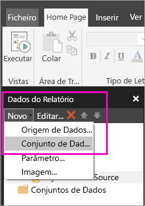
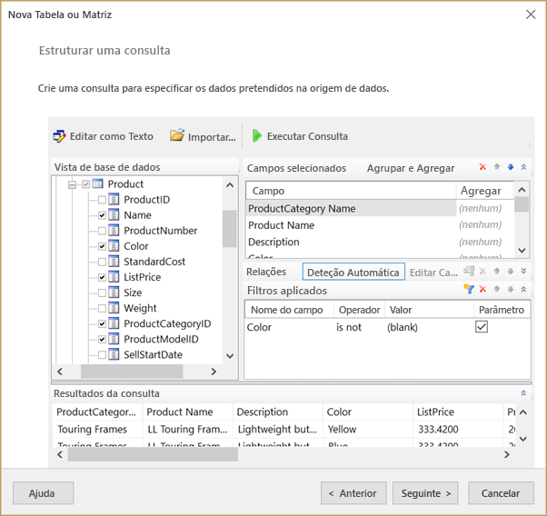
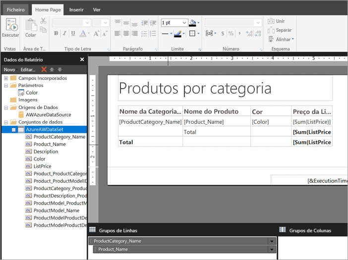

# Criar um conjunto de dados incorporado para um relatório paginado no serviço Power BI (Pré-visualização)

Neste artigo, vai aprender a criar um conjunto de dados incorporado, com base numa origem de dados incorporada, para um relatório paginado no serviço Power BI. Os conjuntos de dados incorporados estão contidos num único relatório paginado, para utilização nesse relatório. Atualmente, os relatórios paginados publicados no serviço Power BI precisam de conjuntos de dados incorporados e origens de dados incorporadas. Vai criar a origem de dados incorporada e o conjunto de dados incorporados no Report Builder, enquanto está a criar o relatório. 

Para poder criar o conjunto de dados, terá de criar uma origem de dados. Veja [Origens de dados incorporadas para relatórios paginados](paginated-reports-embedded-data-source.md) no serviço Power BI para aprender como fazê-lo.
  
## Criar um conjunto de dados incorporado
  
1. No painel Dados do Relatório no Report Builder, selecione **Novo** > **Conjunto de dados**.

1. No separador **Consulta** da caixa de diálogo **Propriedades do Conjunto de Dados**, dê um nome ao conjunto de dados. A origem de dados incorporada já está na caixa **Origem de dados** ou pode selecionar **Nova** para criar uma origem de dados incorporada diferente.
 
     

3. Em **Tipo de consulta**, selecione o tipo de comando ou de consulta a utilizar para o conjunto de dados. 
    - **Texto** executa uma consulta para obter dados da base de dados. É a predefinição e é utilizada para a maioria das consultas. Escreva uma consulta ou importe uma consulta já existente ao selecionar **Importar**. Para criar a consulta graficamente, selecione **Estruturador de Consulta**. Se utilizar o estruturador de consulta para criar uma consulta, o texto da consulta será apresentado nesta caixa. Selecione o botão **Expressão** (**fx**) para utilizar uma expressão para gerar a consulta dinamicamente. 
    - **Tabela** seleciona todos os campos dentro de uma tabela. Introduza o nome da tabela que pretende utilizar como conjunto de dados.
    - **Procedimento Armazenado** executa um procedimento armazenado por nome.

4. No Estruturador de Consulta, pode ver e interagir com as tabelas e os campos no conjunto de dados, importar uma consulta ou editar como texto. Também pode adicionar filtros e parâmetros aqui. 

    

5. No Estruturador de Consulta, selecione **Executar Consulta** para a testar e, em seguida, selecione **OK**.

1. Novamente na caixa de diálogo Propriedades do Conjunto de Dados, na caixa  **Tempo limite (em segundos)**, escreva o número de segundos até que a consulta exceda o tempo limite. A predefinição é 30 segundos. O valor para **Tempo limite** deve estar vazio ou ser maior que zero. Se estiver vazio, a consulta não excederá o tempo limite.

7.  Pode definir outras propriedades do conjunto de dados nos outros separadores:
    - Crie campos calculados no separador **Campos**.
    - Defina as opções avançadas no separador **Opções**.
    - Adicione ou atualize **Filtros** e **Parâmetros** nos respetivos separadores.

8. Selecione **OK**
 
   O relatório é aberto na Vista de Estrutura do Relatório. A origem de dados, o conjunto de dados e a coleção de campos do conjunto de dados aparecem no painel Dados do Relatório. Pode continuar a criar o relatório paginado.  

     
 
## Próximos passos 

- [O que são relatórios paginados no Power BI Premium? (Pré-visualização)](paginated-reports-report-builder-power-bi.md)  
- [Tutorial: Criar um relatório paginado e carregá-lo para o serviço Power BI](paginated-reports-quickstart-aw.md)
- [Publicar um relatório paginado no serviço Power BI](paginated-reports-save-to-power-bi-service.md)

