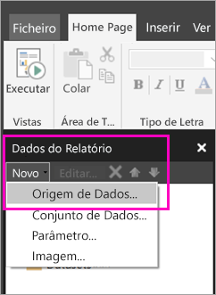

# Criar uma origem de dados incorporada para relatórios paginados no serviço Power BI (Pré-visualização)

Neste artigo, vai aprender a criar e a modificar uma origem de dados incorporada para um relatório paginado no serviço Power BI. Vai definir uma origem de dados incorporada num único relatório e utilizá-la apenas nesse relatório. Atualmente, os relatórios paginados publicados no serviço Power BI precisam de conjuntos de dados incorporados e origens de dados incorporadas e podem ligar-se a estas origens de dados:

- Base de Dados SQL do Azure e Azure SQL Data Warehouse
- SQL Server
- SQL Server Analysis Services 

Os relatórios paginados ligam-se às origens de dados no local através de um gateway. Vai configurar o gateway depois de publicar o relatório no serviço Power BI. Saiba mais sobre os [gateways do Power BI](service-gateway-getting-started.md). 

## Criar uma origem de dados incorporada
  
1. Abra o Report Builder.

1. Na barra de ferramentas do painel Dados do Relatório, selecione **Novo** > **Origem de Dados**. A caixa de diálogo **Propriedades da Origem de Dados** é apresentada.

    
  
2.  Na caixa de texto **Nome**, escreva um nome para a origem de dados ou aceite o nome predefinido.  
  
3.  Selecione **Utilizar uma ligação incorporada no meu relatório**.  
  
1.  Na lista **Selecionar o tipo de ligação**, selecione um tipo de origem de dados. 

1.  Especifique uma cadeia de ligação com um dos seguintes métodos:  
  
    -   Escreva a cadeia de ligação diretamente na caixa de texto **Cadeia de ligação**. 
  
    -   Selecione o botão de expressão (**fx)** para criar uma expressão que é avaliada como uma cadeia de ligação. Na caixa de diálogo **Expressão**, escreva a expressão no painel Expressão. Selecione **OK**. 
  
    -   Selecione **Criar** para abrir a caixa de diálogo **Propriedades da Ligação** da origem de dados que selecionou no passo 2.  
  
        Preencha os campos na caixa de diálogo **Propriedades da Ligação** conforme adequado para o tipo da origem de dados. As propriedades da ligação incluem o tipo da origem de dados, o nome da origem de dados e as credenciais a utilizar. Depois de especificar os valores nesta caixa de diálogo, selecione **Testar Ligação** para verificar se a origem de dados está disponível e se as credenciais que especificou estão corretas.  
  
4.  Selecione **Credenciais**.  
  
     Especifique as credenciais a utilizar para esta origem de dados. O proprietário da origem de dados escolhe o tipo de credenciais que são suportadas. Para obter mais informações, veja [Specify Credential and Connection Information for Report Data Sources](https://docs.microsoft.com/sql/reporting-services/report-data/specify-credential-and-connection-information-for-report-data-sources) (Especificar as Credenciais e as Informações de Ligação das Origens de Dados de Relatório).
  
5.  Selecione **OK**.  
  
     A origem de dados é apresentada no painel Dados do Relatório.  

## Próximos passos

- [Criar uma origem de dados incorporada para um relatório paginado no serviço Power BI](paginated-reports-create-embedded-dataset.md)
- [O que são relatórios paginados no Power BI Premium? (Pré-visualização)](paginated-reports-report-builder-power-bi.md)