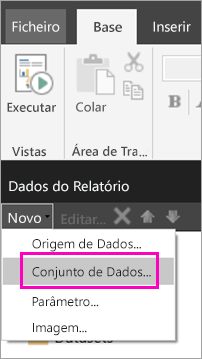
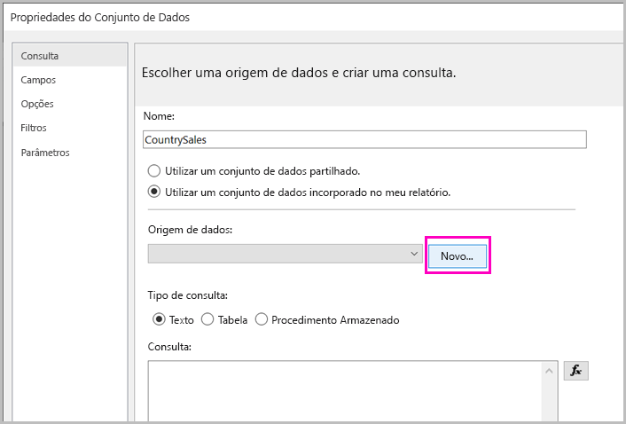
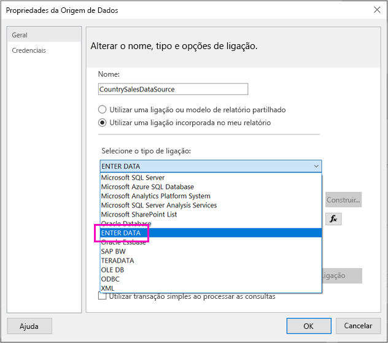
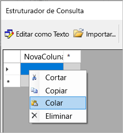
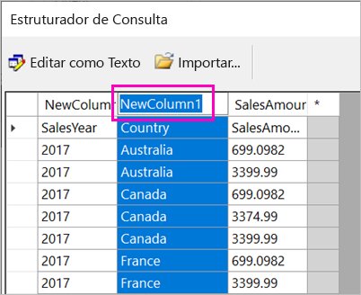
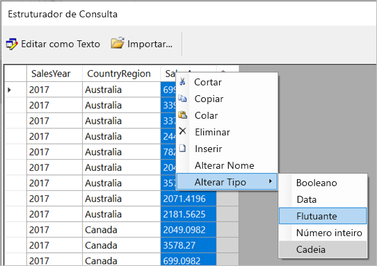
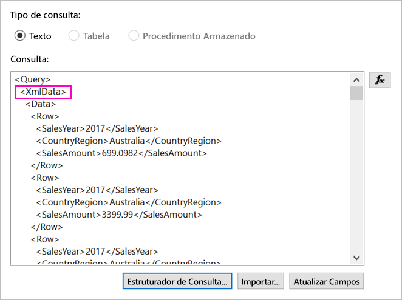
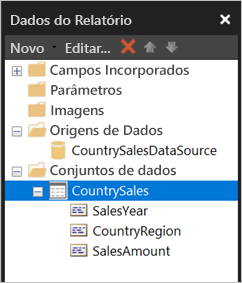

# <a name="enter-data-directly-in-a-paginated-report-in-report-builder-preview---power-bi"></a>Introduzir dados diretamente num relatório paginado no Report Builder (Pré-visualização) – Power BI

Neste artigo, irá conhecer uma funcionalidade da nova versão do SQL Server 2016 Report Builder que lhe permite introduzir dados diretamente num relatório de RDL, como um conjunto de dados incorporado.  Esta funcionalidade é semelhante ao Power BI Desktop. Pode introduzir diretamente os dados num conjunto de dados do seu relatório ou colá-los a partir de outro programa, como o Microsoft Excel. Após introduzir os dados e criar um conjunto de dados, poderá utilizá-lo tal como utilizaria qualquer outro conjunto incorporado que tivesse criado. Além disto, pode adicionar mais de uma tabela e utilizar uma como um filtro para outra. Esta funcionalidade é particularmente útil para conjuntos de dados estáticos e pequenos que poderá ter de utilizar no seu relatório, como parâmetros de relatórios.
 
## <a name="prerequisites"></a>Pré-requisitos

- Para introduzir dados diretamente num relatório paginado, instale a nova versão do [Report Builder a partir do Centro de Transferências da Microsoft](https://www.microsoft.com/download/details.aspx?id=53613). 
- Para guardar o seu relatório paginado no serviço Power BI, precisa de uma [conta do Power BI Pro](service-self-service-signup-for-power-bi.md) e de acesso de escrita a uma área de trabalho numa [capacidade do Power BI Premium](service-premium-what-is.md).
- Para guardar o seu relatório paginado num servidor de relatórios, precisa de permissões para [editar o ficheiro RsReportServer.config](#upload-the-paginated-report-to-a-report-server).

## <a name="get-started"></a>Introdução

Após a transferência e instalação do Report Builder, deverá seguir o mesmo fluxo de trabalho utilizado para adicionar um conjunto de dados e uma origem de dados incorporados ao seu relatório. No procedimento seguinte, em **Origens de Dados**, é apresentada uma nova opção: **Introduzir Dados**.  Só tem de configurar esta origem de dados uma vez por relatório. Após a configuração, pode criar múltiplas tabelas a partir dos dados introduzidos como conjuntos de dados separados que utilizam a mesma origem de dados.

1. No painel **Dados do Relatório**, selecione **Novo** > **Conjunto de Dados**.

    

1. Na caixa de diálogo **Propriedades do Conjunto de Dados**, selecione **Utilizar um conjunto de dados incorporado no meu relatório**.

1. Junto a **Origem de dados**, selecione **Novo**.

    

1. Na caixa de diálogo **Propriedades da Origem de Dados**, selecione **Utilizar uma ligação incorporada no meu relatório**.
2. Na caixa **Selecionar o tipo de ligação**, selecione **INTRODUZIR DADOS** > **OK**.

    

1. Regresse à caixa de diálogo **Propriedades do Conjunto de Dados** e selecione **Estruturador de Consulta**.
2. No painel **Estruturador de Consulta**, clique com o botão direito do rato e cole os seus dados na tabela.

    

1. Para definir os nomes das colunas, faça duplo clique em cada **NovaColuna** e escreva o nome da coluna.

    

1. Se a primeira linha tiver cabeçalhos de coluna dos dados originais, clique nela com o botão direito do rato e elimine-a.
    
9. Por predefinição, o tipo de dados de cada coluna é Cadeia. Para alterar o tipo de dados, clique com o botão direito do rato no cabeçalho da coluna > **Alterar o Tipo** e defina outro tipo de dados, como Data ou Flutuante.

    

1. Quando tiver terminado a criação da tabela, selecione **OK**.  

    A consulta gerada é a mesma que seria apresentada com uma origem de dados XML. Vamos utilizar XML como o fornecedor de dados.  Redefinimos a sua finalidade para também permitir este cenário.

    

12. Na caixa de diálogo **Propriedades do Conjunto de Dados**, selecione **OK**.

13. A sua origem de dados e o seu conjunto de dados são apresentados no painel **Dados do Relatório**.

    

Pode utilizar o seu conjunto de dados como a base para visualizações de dados no seu relatório. Também pode adicionar outro conjunto de dados e utilizar a mesma origem de dados para o mesmo.

## <a name="upload-the-paginated-report-to-the-power-bi-service"></a>Carregar o relatório paginado para o serviço Power BI

Agora que os relatórios paginado são suportados no serviço Power BI em pré-visualização, poderá carregar os seus relatórios paginados numa capacidade Premium. Veja [Carregar um relatório paginado](paginated-reports-save-to-power-bi-service.md#upload-a-paginated-report) para obter detalhes.

## <a name="upload-the-paginated-report-to-a-report-server"></a>Carregar o relatório paginado para um servidor de relatórios

Também pode carregar o seu relatório paginado para um servidor de relatórios do Power BI Report Server ou SQL Server Reporting Services 2016 ou 2017. Antes de o fazer, tem de adicionar o seguinte item ao seu ficheiro RsReportServer.config como uma extensão de dados adicional. Crie uma cópia de segurança do seu ficheiro RsReportServer.config antes de fazer a alteração, para a eventualidade de vir a ter problemas.

```xml
<Extension Name="ENTERDATA" Type="Microsoft.ReportingServices.DataExtensions.XmlDPConnection,Microsoft.ReportingServices.DataExtensions">
    <Configuration>
        <ConfigName>ENTERDATA</ConfigName>
    </Configuration>
</Extension>
```

Após a edição do ficheiro, a lista de fornecedores de dados no ficheiro de configuração deve ter o seguinte aspeto:


Agora está tudo pronto e já pode publicar relatórios que utilizem esta nova funcionalidade no seu servidor de relatórios.

## <a name="next-steps"></a>Próximos passos

- [O que são relatórios paginados no Power BI Premium? (Pré-visualização)](paginated-reports-report-builder-power-bi.md)
- [O que é o Power BI Report Server?](report-server/get-started.md)
