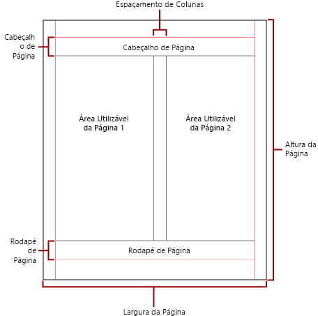

# Paginação nos relatórios paginados do Power BI

 A *paginação* diz respeito ao número de páginas num relatório e à disposição dos itens de relatório nessas páginas. A paginação nos relatórios paginados do Power BI varia consoante a extensão de composição utilizada para ver e apresentar o relatório. Quando executa um relatório no servidor de relatórios, o relatório utiliza o compositor de HTML. HTML segue um conjunto específico de regras de paginação. Se exportar o mesmo relatório para PDF, por exemplo, está a utilizar o compositor de PDF, que utiliza um conjunto diferente de regras. Como tal, o relatório é paginado de forma diferente. Tem de compreender as regras utilizadas para controlar a paginação nos relatórios paginados do Power BI. Em seguida, pode criar com êxito um relatório de leitura fácil que otimiza para o compositor que tenciona utilizar para entregar o seu relatório.  
  
 Este tópico aborda o impacto que o tamanho da página física e o esquema do relatório têm na forma como os compositores de quebras de página manuais compõem o relatório. Pode definir propriedades para modificar o tamanho e as margens da página física e dividir o relatório em colunas. Utilize o painel **Report Properties** (Propriedades do Relatório), o painel **Properties** (Propriedades) ou a caixa de diálogo **Page Setup** (Configuração da Página). Aceda ao painel **Report Properties** (Propriedades do Relatório) ao clicar na área azul fora do corpo do relatório. Aceda à caixa de diálogo **Page Setup** (Configuração da Página), clique em **Run** (Executar) no separador Home e, em seguida, clique em **Page Setup** (Configuração da Página) no separador Run (Executar).  
  
> [!NOTE]  
>  Se tiver concebido um relatório para uma página inteira, mas se a composição do relatório se estender por várias páginas, verifique se a largura do corpo do relatório, incluindo as margens, não é maior do que a largura do tamanho da página física. Para impedir a adição de páginas vazias ao relatório, pode reduzir o tamanho do contentor ao arrastar o canto do contentor para a esquerda.  

## Corpo do relatório  
 O corpo do relatório é um contentor retangular apresentado como um espaço em branco na superfície de desenho. Pode aumentar ou diminuir para que os itens de relatório fiquem contidos no mesmo. O corpo do relatório não reflete o tamanho da página física e, na verdade, o corpo do relatório pode aumentar além dos limites do tamanho da página física para abranger múltiplas páginas do relatório. Alguns compositores, como o Microsoft Excel, Word, HTML e MHTML, compõem relatórios que aumentam ou diminuem consoante os conteúdos da página. Os relatórios compostos nestes formatos são otimizados para serem apresentados num ecrã, por exemplo, num browser. Estes compositores adicionam quebras de página verticais quando é necessário.  
  
 Pode formatar o corpo do relatório com uma cor de limite, estilo de limite e largura de limite. Também pode adicionar uma cor de fundo e uma imagem de fundo.  
  
## Página física  
 O tamanho da página física é o tamanho do papel. O tamanho do papel que especifica para o relatório controla a forma como o relatório é composto. Os relatórios compostos em formatos de quebras de página manuais introduzem quebras de página na horizontal e vertical, com base no tamanho físico da página. Estas quebras de página fornecem uma experiência de leitura otimizada quando são impressas ou visualizadas num formato de ficheiro com quebra de página manual. Os relatórios compostos em formatos de quebras de página flexíveis introduzem quebras de página na horizontal, com base no tamanho físico. Mais uma vez, as quebras de página fornecem uma experiência de leitura otimizada quando visualizadas num browser.  
  
 Por predefinição, o tamanho da página é de 8,5 x 11 polegadas, mas pode alterar este tamanho no painel **Report Properties** (Propriedades do Relatório) ou na caixa de diálogo **Page Setup** (Configuração da Página), ou alterar as propriedades PageHeight (Altura da página) e PageWidth (Largura da página) no painel **Properties** (Propriedades). O tamanho da página não aumenta nem diminui para abranger os conteúdos do corpo do relatório. Se quiser que o relatório seja apresentado numa única página, todos os conteúdos dentro do corpo do relatório têm de ficar ajustados na página física. Se não ficarem ajustadas e utilizar o formato de quebras de página manuais, o relatório precisará de páginas adicionais. Se o corpo do relatório aumentar além da margem direita da página física, é inserida uma quebra de página na horizontal. Se o corpo do relatório aumentar além da margem inferior da página física, é inserida uma quebra de página na vertical.  
  
 Se quiser substituir o tamanho da página física definido no relatório, pode especificar o tamanho da página física através das definições de Informações do Dispositivo do compositor específico que está a utilizar para exportar o relatório. Para obter a lista completa, veja [Device Information Settings for Rendering Extensions](https://docs.microsoft.com/sql/reporting-services/device-information-settings-for-rendering-extensions-reporting-services?view=sql-server-2017) (Definições de Informações do Dispositivo para a Composição de Extensões) na documentação do SQL Server Reporting Services.  
  
### Margens

 As margens são desenhadas desde a extremidade das dimensões da página física até à definição da margem especificada. Se um item de relatório se estender para dentro da área da margem, será recortado para que a área de sobreposição não seja composta. Se especificar tamanhos de margem que façam com que a largura horizontal ou vertical da página seja igual a zero, as definições da margem revertem para a predefinição de zero. As margens são especificadas no painel **Report Properties** (Propriedades do relatório) ou na caixa de diálogo **Page Setup** (Configuração da página), ou alterando as propriedades TopMargin (Margem superior), BottomMargin (Margem inferior), LeftMargin (Margem esquerda) e RightMargin (Margem direita) no painel **Properties** (Propriedades). Se quiser substituir o tamanho da margem definido no relatório, pode especificar o tamanho da margem através das definições de Informações do Dispositivo do compositor específico que está a utilizar para exportar o relatório.  
  
 A área da página física que permanece depois de alocar espaço às margens, ao espaçamento entre colunas e ao cabeçalho e rodapé da página é chamada de *área de página utilizável*. As margens só são aplicadas quando compuser e imprimir relatórios em formatos de compositor de quebras de página manuais. A imagem abaixo indica a margem e a área de página utilizável de uma página física.  
  
 
  
### Colunas em estilo de newsletter  

 O relatório pode ser dividido em colunas como as colunas num jornal. As colunas são tratadas como páginas *lógicas* compostas na mesma página *física*. São apresentadas da esquerda para a direita e de cima para baixo, e são separadas por um espaço em branco entre cada uma das colunas. Se o relatório for dividido em mais do que uma coluna, cada página física é dividida verticalmente em colunas e cada coluna é considerada uma página lógica. Por exemplo, imagine que tem duas colunas numa página física. Os conteúdos do seu relatório preenchem a primeira coluna e depois a segunda. Se o relatório não ficar ajustado totalmente dentro da primeira coluna, o relatório preenche depois a primeira e a segunda colunas da página seguinte. As colunas continuam a ser preenchidas da esquerda para a direita e de cima para baixo até todos os itens de relatório estarem compostos. Se especificar tamanhos de coluna que fazem com que a largura horizontal ou vertical seja igual a zero, o espaçamento entre colunas reverte para a predefinição de zero.  
  
 As colunas são especificadas no painel **Report Properties** (Propriedades do Relatório) ou na caixa de diálogo **Page Setup** (Configuração da Página), ou alterando as propriedades TopMargin (Margem Superior), BottomMargin (Margem Inferior), LeftMargin (Margem Esquerda) e RightMargin (Margem Direita) no painel **Properties** (Propriedades). Se quiser utilizar um tamanho de margem que não esteja definido, pode especificar o tamanho da margem através das definições de Informações do Dispositivo do compositor específico que está a utilizar para exportar o relatório. As colunas só são aplicadas quando compuser e imprimir relatórios em formato PDF ou de Imagem. A imagem abaixo indica a área de página utilizável de uma página com colunas.  
  

  
## Quebras de página e nomes de página

 Se o relatório tiver nomes de página, provavelmente é mais fácil ler o relatório e auditar e exportar os respetivos dados. O SQL Server Reporting Services fornece propriedades para relatórios, tabelas, matrizes, listas, regiões de dados, grupos e retângulos no relatório para controlar a paginação, repor os números de página e fornecer novos nomes de página do relatório nas quebras de página. Estas funcionalidades podem melhorar os relatórios independentemente do formato em que são compostos, mas são especialmente úteis quando se exportam relatórios para livros do Excel.

> [!NOTE]
> Tabelas, matrizes, listas e regiões de dados são, na verdade, o mesmo tipo de região de dados nos bastidores: uma *tablix*. Por isso, pode vir a deparar-se com esse nome. 

 A propriedade InitialPageName indica o nome da página inicial do relatório. Se o seu relatório não incluir nomes de página para as quebras de páginas, é utilizado o nome da página inicial para todas as novas páginas criadas pelas quebras de página. Não tem de utilizar um nome de página inicial.  
  
 Um relatório composto pode fornecer um novo nome de página derivado de uma quebra de página. Para fornecer o nome da página, tem de definir a propriedade PageName de uma tabela, matriz, lista, grupo ou retângulo. Não tem de especificar nomes de página nas quebras. Se não especificar, é utilizado o valor de InitialPageName. Se InitialPageName também estiver em branco, a nova página não tem nome.  
  
 As tabelas, matrizes, listas, regiões de dados, grupos e retângulos suportam quebras de página.  
  
 A quebra de página inclui as seguintes propriedades:  
  
- **BreakLocation** (Localização da Quebra) indica o local da quebra para o elemento do relatório preparado para a quebra de página: no início, no fim ou no início e no fim. Em grupos, BreakLocation pode ser localizado entre grupos.  
  
- **Disabled** (Desativado) indica se uma quebra de página é aplicada ao elemento do relatório. Se esta propriedade for avaliada como Verdadeira, a quebra de página é ignorada. Esta propriedade é utilizada para desativar dinamicamente quebras de página com base em expressões quando o relatório é executado.  
  
- **ResetPageNumber** (Repor Número da Página) indica se o número de página deve ser reposto para 1 quando ocorrer uma quebra de página. Se esta propriedade for avaliada como Verdadeira, o número de página é reposto.  
  
 Pode definir a propriedade BreakLocation (Localização da Quebra) nas caixas de diálogo **Tablix Properties** (Propriedades de Tablix), **Rectangle Properties** (Propriedades do Retângulo) ou **Group Properties** (Propriedades do grupo), mas tem de definir as propriedades Disabled (Desativado), ResetPageNumber (Repor Número da Página) e PageName (Nome da Página) no painel Report Builder Properties (Propriedades do Report Builder). Se as propriedades no painel Properties (Propriedades) estiverem organizadas por categoria, irá encontrá-las na categoria **PageBreak** (Quebra de Página). Para grupos, a categoria **PageBreak** (Quebra de Página) está dentro da categoria **Group** (Grupo).  
  
 Pode utilizar constantes e expressões simples ou complexas para definir o valor das propriedades Disabled (Desativado) e ResetPageNumber (Repor Número da Página). No entanto, não pode utilizar a expressão com a propriedade BreakLocation (Localização da Quebra). Para obter mais informações sobre como escrever e utilizar expressões, veja [Expressões no Report Builder do Power BI](report-builder-expressions.md).  
  
 No seu relatório, pode escrever expressões que fazem referência aos nomes de página ou números de página atuais com a coleção **Globals**. Para obter mais informações, veja [Built-in Globals and Users References](https://docs.microsoft.com/sql/reporting-services/report-design/built-in-collections-built-in-globals-and-users-references-report-builder?view=sql-server-2017) (Globals Incorporados e Referências de Utilizadores) na documentação do Report Builder e do SQL Server Reporting Services.
  
### Atribuição de nomes aos separadores das folhas de cálculo do Excel

 Estas propriedades são úteis quando exporta relatórios para livros do Excel. Utilize a propriedade InitialPage (Página Inicial) para especificar um nome predefinido para o nome do separador da folha de cálculo quando exportar o relatório e utilize quebras de página e a propriedade PageName (Nome da Página) para fornecer nomes diferentes para cada folha de cálculo. Cada nova página de relatório, definida por uma quebra de página, é exportada para uma folha de cálculo diferente que tem o nome do valor da propriedade PageName (Nome da página). Se PageName estiver em branco, mas o relatório tiver um nome de página inicial, todas as folhas de cálculo no livro do Excel utilizam o mesmo nome, ou seja, o nome da página inicial.  
  
 Para obter mais informações sobre como estas propriedades funcionam quando os relatórios são exportados para o Excel, veja [Exporting to Microsoft Excel](https://docs.microsoft.com/sql/reporting-services/report-builder/exporting-to-microsoft-excel-report-builder-and-ssrs?view=sql-server-2017) (Exportar para o Microsoft Excel) na documentação do Report Builder e do SQL Server Reporting Services.  
  
## Próximos passos

[Ver um relatório paginado no serviço Power BI](consumer/paginated-reports-view-power-bi-service.md)

Mais perguntas? [Pergunte à Comunidade do Power BI](https://community.powerbi.com/)
