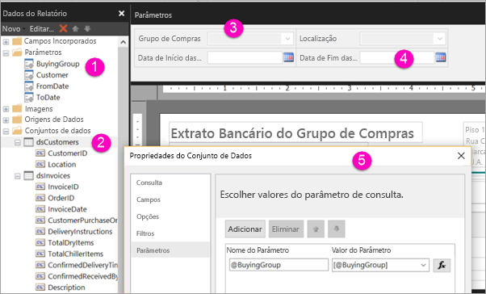

# Criar parâmetros para relatórios paginados no serviço Power BI (Pré-visualização)

Neste artigo, vai aprender a criar parâmetros para relatórios paginados no serviço Power BI.  Um parâmetro de relatório proporciona uma forma de escolher os dados do relatório e de variar a apresentação do relatório. Pode indicar um valor padrão e uma lista de valores disponíveis e os leitores do seu relatório podem alterar a seleção.  

A ilustração seguinte mostra a vista Estrutura no Report Builder para um relatório com os parâmetros @BuyingGroup, @Customer, @FromDate e @ToDate. 
  

  
1.  Os parâmetros do relatório no painel Dados do Relatório.  
  
2.  A tabela com um dos parâmetros no conjunto de dados.  
  
3.  O painel Parâmetros. Pode personalizar o layout dos parâmetros no painel de parâmetros. 
  
4.  Os parâmetros @FromDate e @ToDate têm o tipo de dados **DateTime**. Ao visualizar o relatório, pode escrever uma data na caixa de texto ou escolher uma data no controlo de calendário. 

5.  Um dos parâmetros na caixa de diálogo **Propriedades do conjunto de dados**.  

  
## Criar ou editar um parâmetro de relatório  
  
1.  Abra o relatório paginado no Report Builder.

1. No painel **Dados do Relatório**, clique com o botão direito do rato no nó **Parâmetros** > **Adicionar Parâmetro**. A caixa de diálogo **Propriedades do Parâmetro de Relatório** é apresentada.  
  
2.  Em **Nome**, escreva um nome para o parâmetro ou aceite o nome predefinido.  
  
3.  Em **Pedido**, escreva um texto para aparecer ao lado da caixa de texto do parâmetro quando o utilizador executar o relatório.  
  
4.  Em **Tipo de dados**, selecione o tipo de dados para o valor do parâmetro.  
  
5.  Se o parâmetro puder conter um valor em branco, selecione **Permitir valor em branco**.  
  
6.  Se o parâmetro puder conter um valor nulo, selecione **Permitir valor nulo**.  
  
7.  Para permitir que um utilizador selecione mais do que um valor para o parâmetro, selecione **Permitir vários valores**.  
  
8.  Defina a opção de visibilidade.  
  
    -   Para mostrar o parâmetro na barra de ferramentas na parte superior do relatório, selecione **Visível**.  
  
    -   Para ocultar o parâmetro para que não seja apresentado na barra de ferramentas, selecione **Oculto**.  
  
    -   Para ocultar o parâmetro e protegê-lo de ser modificado no servidor de relatórios depois de o relatório ser publicado, selecione **Interno**. O parâmetro de relatório pode então ser apenas apresentado na definição do relatório. Para esta opção, tem de definir um valor predefinido ou permitir que o parâmetro aceite um valor nulo.  
  
9. Selecione **OK**. 
  
## Próximos passos

Veja [Ver parâmetros dos relatórios paginados](paginated-reports-view-parameters.md) para ver o aspeto dos parâmetros no serviço Power BI.

Para obter informações aprofundadas sobre os parâmetros dos relatórios paginados, veja o artigo [Parâmetros de Relatório (Report Builder e Report Designer)](https://docs.microsoft.com/sql/reporting-services/report-design/report-parameters-report-builder-and-report-designer) na documentação do SQL Server Reporting Services  
