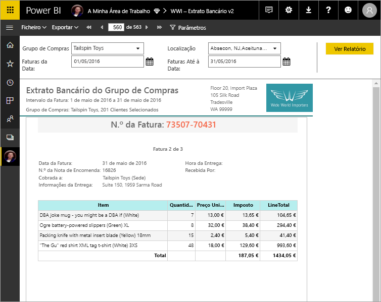

# O que são relatórios paginados no Power BI Premium?

Os relatórios paginados, que são há muito o formato de relatório padrão no SQL Server Reporting Services, estão agora disponíveis no serviço Power BI. Estes relatórios podem ser impressos ou partilhados. Os relatórios são designados "paginados" porque são formatados para se ajustarem a uma página. Os relatórios paginados apresentam todos os dados numa tabela, mesmo que a tabela ocupe múltiplas páginas. Às vezes são chamados “imagem perfeita”, uma vez que pode controlar o esquema de página do relatório com exatidão. Os relatórios paginados baseiam-se na tecnologia de relatório RDL do SQL Server Reporting Services. O Report Builder é a ferramenta autónoma para a criação de relatórios paginados. 

Os relatórios paginados podem ter muitas páginas. Por exemplo, este relatório tem 563 páginas. Cada página está disposta com exatidão, com uma página por fatura e cabeçalhos e rodapés repetidos.

Experimente o laboratório prático [Hands-on lab: Create a Microsoft Power BI paginated report](https://www.microsoft.com/handsonlabs/selfpacedlabs/details/SQ00208) (Laboratório prático: criar um relatório paginado do Microsoft Power BI).

Pode visualizar o relatório no Report Builder e, em seguida, publicá-lo no serviço Power BI, https://app.powerbi.com. Precisa de uma licença do Power BI Pro para publicar um relatório no serviço. Pode publicar e partilhar relatórios paginados em A Minha Área de Trabalho ou em áreas de trabalho, desde que a área de trabalho esteja numa capacidade do Power BI Premium. Além disso, os relatórios paginados têm de ser ativados por um administrador do Power BI na secção [Capacidades Premium](service-admin-premium-workloads.md#paginated-reports) do portal de administração do Power BI. 

## Criar relatórios no Report Builder do Power BI

Os relatórios paginados têm a sua própria ferramenta de criação, o Report Builder do Power BI. Trata-se de uma nova ferramenta que tem a mesma base das ferramentas que utilizou anteriormente para criar relatórios paginados para o Power BI Report Server ou o SQL Server Reporting Services (SSRS). Na verdade, os relatórios paginados que criar para o SSRS 2016 e 2017 ou para o Power BI Report Server no local, são compatíveis com o serviço Power BI. O serviço Power BI mantém a retrocompatibilidade, pelo que pode mudar os relatórios para a versão mais recente e pode atualizar os relatórios paginados de qualquer versão anterior. Nem todas as funcionalidades de relatórios estão disponíveis no lançamento. Veja a secção [Limitações e considerações](#limitations-and-considerations) neste artigo para obter detalhes.
     
## Relatório de diversas origens de dados

Um único relatório paginado pode ter uma série de origens de dados diferentes, não tem um modelo de dados subjacente, ao contrário dos relatórios do Power BI. Para a versão inicial dos relatórios paginados no serviço Power BI, irá criar origens de dados e conjuntos de dados incorporados no relatório propriamente dito. Por agora, não pode utilizar conjuntos de dados partilhados ou origens de dados partilhadas. Vai criar os relatórios no Report Builder no computador local. Se um relatório ligar a dados no local, depois de carregar o relatório no serviço Power BI, terá de criar um gateway e redirecionar a ligação de dados. Eis as origens de dados às quais pode ligar-se atualmente:

- Base de Dados SQL do Azure e Azure SQL Data Warehouse (via Básico e oAuth)
- Azure Analysis Services (através do SSO)
- SQL Server através de um gateway
- SQL Server Analysis Services através de um gateway
- Conjuntos de dados do Power BI
- Oracle
- Teradata

## Criar o relatório  

### Criar relatórios paginados com matriz, gráfico e esquemas de forma livre

Os relatórios de tabela funcionam bem para dados baseados em colunas. Os relatórios de matriz, como relatórios de referência cruzada ou de Tabela Dinâmica, são ideais para dados resumidos. Os relatórios de gráfico apresentam dados num formato gráfico e os relatórios de *lista* de forma livre podem apresentar quase todos os dados, como faturas. 
  
Pode começar com um dos assistentes do Report Builder. Os Assistentes de tabelas, de matrizes e de gráficos vão guiá-lo durante a criação da ligação à origem de dados incorporada e ao conjunto de dados incorporado. Em seguida, vai arrastar e largar os campos para criar uma consulta de conjunto de dados, selecionar um esquema e estilo e personalizar o relatório.  
  
Com o Assistente de mapas, vai criar relatórios que apresentam dados agregados sobre um fundo geográfico ou geométrico. Os dados dos mapas podem ser dados geográficos de uma consulta Transact-SQL ou um ficheiro de formas do Environmental Systems Research Institute, Inc. (ESRI). Também pode adicionar um fundo do mosaico de mapa do Microsoft Bing.  

### Adicionar mais elementos ao relatório

Modifique os dados ao filtrar, agrupar e classificar os dados ou ao adicionar fórmulas ou expressões. Adicione gráficos, medidores, gráficos sparkline e indicadores para resumir os dados num formato visual.  Utilize parâmetros e filtros para filtrar dados para vistas personalizadas. Incorpore ou referencie imagens e outros recursos, incluindo conteúdo externo.  

Tudo num relatório paginado, desde o próprio relatório a cada caixa de texto, imagem, tabela e gráfico, tem um conjunto de propriedades que pode definir para que o relatório tenha exatamente o aspeto que pretende.

## Criar uma definição do relatório

Quando cria um relatório paginado, está, na realidade, a criar uma *definição do relatório*, ou seja, não contém os dados, especifica onde obter os dados, quais os dados a obter e como apresentar os dados. Quando executar o relatório, o processador do relatório utiliza a definição do relatório que especificou, obtém os dados e combina-os com o esquema de relatório para gerar o relatório. Carregue a definição do relatório no serviço Power BI, https://app.powerbi.com, ou em A Minha Área de Trabalho ou numa área de trabalho partilhada com os seus colegas. Se a origem de dados do relatório for no local, depois de carregar o relatório, deverá redirecionar a ligação da origem de dados para passar por um gateway. 

## Visualizar o relatório paginado
Pode ver o relatório paginado no serviço Power BI num browser e também nas aplicações móveis do Power BI. No serviço Power BI, pode exportar o relatório para uma série de formatos, tais como HTML, MHTML, PDF, XML, CSV, TIFF, Word e Excel. Também pode partilhá-lo com outras pessoas.  

## Criar uma subscrição para o seu relatório

Agora pode configurar subscrições de e-mail de relatórios paginados no serviço Power BI para si e para outras pessoas. De modo geral, o processo é idêntico a subscrever relatórios e dashboards no serviço Power BI. Ao configurar subscrições, pode selecionar com que frequência quer receber os e-mails: diariamente, semanalmente ou de hora a hora. A subscrição inclui um anexo PDF com todo o resultado do relatório.

Para obter detalhes, veja o artigo [Subscrever relatórios paginados no serviço Power BI para si e para outras pessoas](consumer/paginated-reports-subscriptions.md). 

## Limitações e considerações

Apresentamos a seguir mais algumas funcionalidades que não são suportadas na versão inicial:

- Afixar páginas de relatórios ou elementos visuais em dashboards do Power BI. Pode ainda afixar visualizações a um dashboard do Power BI a partir de um relatório paginado no local num servidor de relatórios do Power BI Report Server ou do Reporting Services. Veja [Afixar itens do Reporting Services nos dashboards do Power BI](https://docs.microsoft.com/sql/reporting-services/pin-reporting-services-items-to-power-bi-dashboards) para obter mais informações.
- Mapas de Documentos.
- Sub-relatórios e relatórios de pormenorização.  No entanto, pode considerar a utilização de parâmetros de URL com relatórios paginados para conseguir cenários de pormenorização.
- Origens de dados partilhadas e conjuntos de dados partilhados.

 
## Próximos passos

- [Instalar o Report Builder do Power BI a partir do Centro de Transferências da Microsoft](https://go.microsoft.com/fwlink/?linkid=2086513)
- [Tutorial: Criar um relatório paginado](paginated-reports-quickstart-aw.md)
- [Introduzir dados diretamente num relatório paginado](paginated-reports-enter-data.md)
- [Hands-on lab: Create a Microsoft Power BI paginated report](https://www.microsoft.com/handsonlabs/selfpacedlabs/details/SQ00208) (Laboratório prático: criar um relatório paginado do Microsoft Power BI)
  

