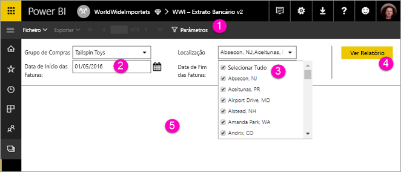

# Ver parâmetros para relatórios paginados no serviço Power BI (Pré-visualização)

Neste artigo, vai aprender a interagir com parâmetros para relatórios paginados no serviço Power BI.  Um parâmetro de relatório proporciona uma forma de filtrar os dados do relatório. Os parâmetros oferecem uma lista de valores disponíveis e pode escolher um ou vários valores. Por vezes, os parâmetros têm um valor predefinido e, às vezes, tem de escolher um valor para visualizar o relatório.  

Quando visualizar um relatório que tenha parâmetros, a barra de ferramentas do visualizador de relatórios apresenta cada parâmetro para que possa especificar os valores e forma interativa. A ilustração seguinte mostra a área de parâmetros de um relatório com parâmetros para **Grupo de Compra**, **Localização**, uma **Data de Início**e uma **Data de Fim**.  

## Painel de parâmetros no serviço Power BI

  
1.  **Painel de parâmetros** – a barra de ferramentas do visualizador de relatórios apresenta um pedido, como “Necessário” ou um valor predefinido para cada parâmetro.    
  
2.  **Parâmetros Data de Início das Faturas/Data de Fim das Faturas** – os dois parâmetros de dados têm valores predefinidos. Para alterar a data, digite uma data na caixa de texto ou escolha uma data no calendário.  
  
3.  **Parâmetro Localização** – o parâmetro Localização está definido para permitir que selecione um, muitos ou todos os valores. 
  
4.  **Ver relatório** – depois de introduzir ou alterar os valores dos parâmetros, clique em **Ver relatório** para executar o relatório. 

5. **Valores predefinidos** – se todos os parâmetros tiverem os valores predefinidos, o relatório será executado automaticamente na primeira visualização. Alguns parâmetros deste relatório não têm valores predefinidos pelo que não irá ver o relatório até que selecione os valores.  

## Próximos passos

[Criar parâmetros para relatórios paginados no serviço Power BI](paginated-reports-parameters.md)
