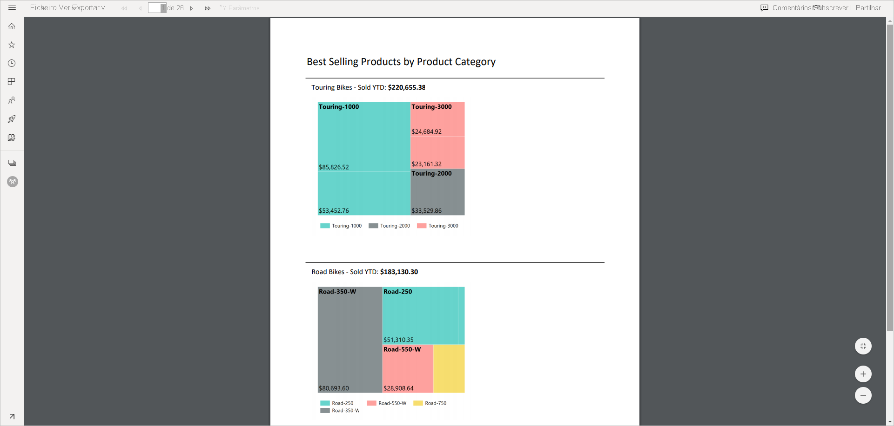
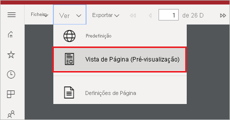
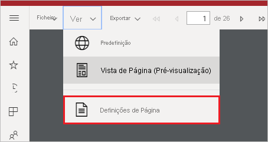
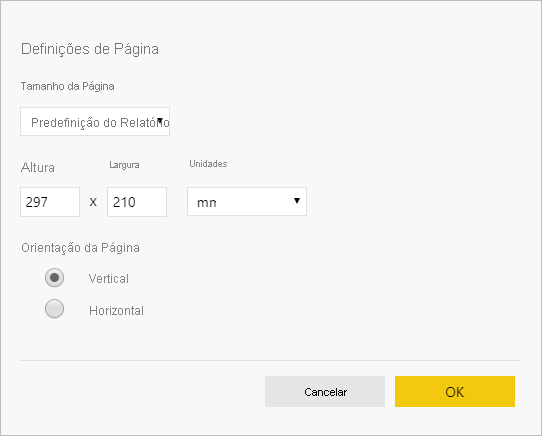

# Definir vistas de relatórios para relatórios paginados no serviço Power BI

Quando compõe um relatório paginado no serviço Power BI, a vista predefinida é interativa e baseada em HTML. Outra vista de relatório para formatos de página fixa, como o PDF, é a nova opção Vista de Página.

**Vista interativa predefinida**

**Vista de Página**

Na Vista de Página, o relatório composto tem um aspeto diferente em comparação com a vista predefinida. Algumas propriedades e conceitos nos relatórios paginados aplicam-se apenas a páginas fixas. A vista é semelhante a quando o relatório é impresso ou exportado. Ainda pode alterar alguns elementos, como valores de parâmetros, mas não tem outras funcionalidades interativas, como a ordenação de colunas e os botões de alternar.

A opção Vista de Página suporta todas as funcionalidades que o Visualizador de PDF do browser suporta, como Ampliar, Reduzir e Ajustar à página.

## Mudar para a Vista de Página

Quando abre um relatório paginado, este é composto numa vista interativa por predefinição. Se o relatório tiver parâmetros, selecione os parâmetros e, em seguida, veja o relatório.

1. Na barra de ferramentas, selecione **Ver** > **Vista de Página**.

    

2. Pode alterar as definições da vista de página ao selecionar **Definições de Página** no menu **Ver** na barra de ferramentas. 

    
    
    A caixa de diálogo **Definições de Página** tem opções para definir o **Tamanho da Página** e a **Orientação** da Vista de Página. Após aplicar as definições de página, serão aplicadas as mesmas opções quando imprimir a página mais tarde.
   
    

3. Para mudar novamente para a vista interativa, selecione **Predefinição** na caixa pendente **Ver**.

## Browser support (Suporte do browser)

A Vista de Página é suportada nos browsers Google Chrome e Microsoft Edge. Certifique-se de que a visualização de PDFs está ativada no browser. É a predefinição nestes browsers.

A Vista de Página não é suportada no Internet Explorer e no Safari, por isso a opção está desativada. Também não é suportada nos browsers em dispositivos móveis ou nas aplicações móveis nativas do Power BI.  

## Próximos passos

- [Ver um relatório paginado no serviço Power BI](../consumer/paginated-reports-view-power-bi-service.md)
- [O que são relatórios paginados no Power BI Premium?](paginated-reports-report-builder-power-bi.md)
