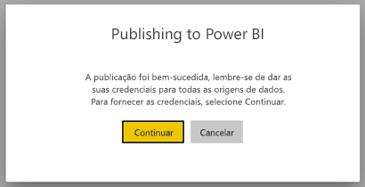
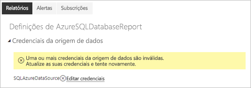
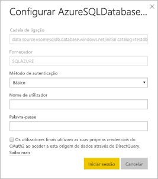

# Origens de dados suportadas para relatórios paginados do Power BI

[!INCLUDE [applies-to](../includes/applies-to.md)] [!INCLUDE [yes-service](../includes/yes-service.md)] [!INCLUDE [yes-paginated](../includes/yes-paginated.md)] [!INCLUDE [yes-premium](../includes/yes-premium.md)] [!INCLUDE [no-desktop](../includes/no-desktop.md)] 

Este artigo descreve as origens de dados suportadas para relatórios paginados no serviço Power BI e explica como ligar a origens de dados da Base de Dados SQL do Azure. Algumas origens de dados são suportadas nativamente. Pode ligar-se a outras pessoas através de gateways de dados.

## Origens de dados suportadas nativamente

Os relatórios paginados suportam nativamente a seguinte lista de origens de dados:

| Origem de dados | Autenticação | Notas |
| --- | --- | --- |
| Base de Dados SQL do Azure  Azure SQL Data Warehouse | Básico, início de sessão único (SSO), OAuth2 | Pode utilizar um Gateway Empresarial com a Base de Dados SQL do Azure. No entanto, não pode utilizar o SSO ou oAuth2 para autenticar nesses cenários.   |
| Instância Gerida do SQL do Azure | Básico | através de um Ponto Final Público ou Privado (o Ponto Final Privado tem de ser encaminhado através do Gateway de Empresa)  |
| Azure Analysis Services | SSO, OAuth2 | A firewall AAS deve ser desativada ou configurada para permitir todos os intervalos de IP na região BlackForest. Isto aplica-se apenas à região BlackForest.  O SSO de um inquilino externo não é suportado. |
| Conjunto de dados do Power BI | SSO | Conjuntos de dados do Power BI Premium e não Premium Requer permissão de leitura |
| Conjunto de dados do Power BI Premium (XMLA) | SSO | As bases de dados do Power BI não são suportadas como uma origem de dados para relatórios paginados incorporados em cenários de "os dados pertencem à aplicação".  Para garantir uma conectividade adequada no Power BI Report Builder, certifique-se de que a opção "Não utilizar credenciais" está selecionada ao definir a sua origem de dados.   |
| Introduzir Dados | N/D | Os dados são incorporados no relatório. |

Exceto no caso da Base de Dados SQL do Azure, todas as origens de dados estão prontas a utilizar depois de carregar o relatório para o serviço Power BI. A predefinição das origens de dados é a utilização do início de sessão único (SSO), quando aplicável. No caso do Azure Analysis Services, pode alterar o tipo de autenticação para OAuth2. No entanto, uma vez alterado o tipo de autenticação de uma determinada origem de dados para OAuth2, não é possível voltar a utilizar o SSO.  Além disso, esta alteração aplica-se a todos os relatórios que utilizam essa origem de dados em todas as áreas de trabalho de um determinado inquilino.  A segurança ao nível da linha em relatórios paginados não funcionará a não ser que os utilizadores escolham o SSO como o tipo de autenticação.

No caso das origens de dados da Base de Dados SQL do Azure, precisa de fornecer mais informações, conforme descrito na secção [Autenticação da Base de Dados SQL do Azure](#azure-sql-database-authentication).

## Outras origens de dados

Além das origens de dados suportadas nativamente acima, as seguintes origens de dados podem ser acedidas através de um [gateway empresarial do Power BI](../connect-data/service-gateway-onprem.md):

- SQL Server
- SQL Server Analysis Services
- Oracle
- Teradata

No caso dos relatórios paginados, o Azure Analysis Services não pode atualmente ser acedido através de um gateway empresarial do Power BI.

## Autenticação da Base de Dados SQL do Azure

No caso das origens de dados da Base de Dados SQL do Azure, precisa de definir um tipo de autenticação antes de executar o relatório. Isto aplica-se apenas à utilização de uma origem de dados pela primeira vez numa área de trabalho. Nessa primeira vez, é apresentada a seguinte mensagem:

Se não fornecer credenciais, ocorrerá um erro quando executar o relatório. Selecione **Continue** (Continuar) para ir para a página **Data source credentials** (Credenciais da origem de dados) do relatório que acabou de carregar:

Selecione a ligação **Edit credentials** (Editar credenciais) de uma determinada origem de dados para abrir a caixa de diálogo **Configure** (Configurar):

Para as origens de dados da Base de Dados SQL do Azure, eis os tipos de autenticação suportados:

- Básico (nome de utilizador e palavra-passe)
- SSO (início de sessão único)
- OAuth2 (token do Azure Active Directory armazenado)

Para que o SSO e o OAuth2 funcionem corretamente, o servidor da Base de Dados SQL do Azure ao qual a origem de dados está a ligar tem de ter o [suporte de autenticação do Azure Active Directory ativado](/azure/sql-database/sql-database-aad-authentication-configure). No caso do método de autenticação OAuth2, o Azure Active Directory gera um token e armazena-o para acesso futuro à origem de dados. Em alternativa, para utilizar o [método de autenticação SSO](../connect-data/service-azure-sql-database-with-direct-connect.md#single-sign-on), selecione a opção de SSO **Os utilizadores finais utilizam as suas próprias credenciais do OAuth2 ao aceder a esta origem de dados através de DirectQuery** imediatamente abaixo.
  
## Próximos passos

[Ver um relatório paginado no serviço Power BI](../consumer/paginated-reports-view-power-bi-service.md)

Mais perguntas? [Pergunte à Comunidade do Power BI](https://community.powerbi.com/)
