# Tutorial: criar um relatório paginado e carregá-lo para o serviço Power BI

Neste tutorial, vai ligar-se a uma base de dados SQL do Azure de exemplo. Em seguida, vai utilizar um assistente no Report Builder do Power BI para criar um relatório paginado com uma tabela que ocupa múltiplas páginas. Em seguida, vai carregar o relatório paginado para uma área de trabalho numa capacidade Premium do serviço Power BI.

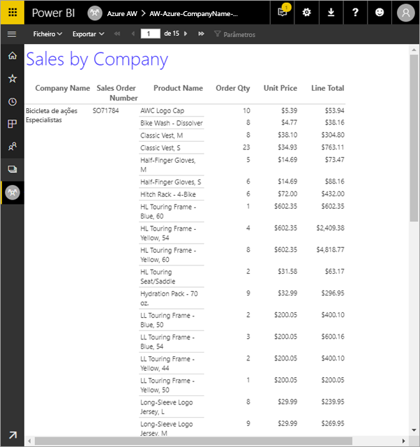

Neste tutorial, vai completar os passos seguintes:

> [!div class="checklist"]
> * Criar uma base de dados do Azure de exemplo.
> * Criar uma matriz no Report Builder do Power BI com a ajuda de um assistente.
> * Formatar o relatório com o título, os números de página e os cabeçalhos de colunas em cada página.
> * Formatar a moeda.
> * Carregar o relatório no serviço Power BI.

Se não tiver uma subscrição do Azure, crie uma [conta gratuita](https://azure.microsoft.com/free/?WT.mc_id=A261C142F) antes de começar.
 
## Pré-requisitos  

Seguem-se os pré-requisitos para a criação do relatório paginado:

- Instalar o [Report Builder do Power BI a partir do Centro de Transferências da Microsoft](https://go.microsoft.com/fwlink/?linkid=2086513). 

- Siga o início rápido [Criar um exemplo de base de dados SQL do Azure no portal do Azure](https://docs.microsoft.com/azure/sql-database/sql-database-get-started-portal). Copie e guarde o valor na caixa **Nome do servidor**, no separador **Descrição geral**. Lembre-se do nome de utilizador e da palavra-passe que criou no Azure.

Seguem-se os pré-requisitos para carregar o relatório paginado para o serviço Power BI:

- Precisa de uma [licença do Power BI Pro](../service-admin-power-bi-pro-in-your-organization.md).
- Precisa de uma área de trabalho no serviço numa [capacidade do Power BI Premium](../service-premium-what-is.md). Essa capacidade tem um ícone de losango  junto do nome da área de trabalho.

## Criar a matriz com um assistente
  
1.  Inicie o Report Builder do Power BI no computador.  
  
     É apresentada a caixa de diálogo **Introdução**.  
  
     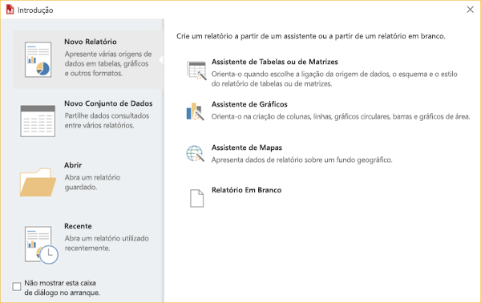
  
1.  No painel esquerdo, verifique se o **Novo Relatório** está selecionado e, no painel direito, selecione **Assistente de Tabela ou Matriz**.  
  
4.  Na página **Escolher um conjunto de dados**, selecione **Criar um conjunto de dados** > **Seguinte**.  

    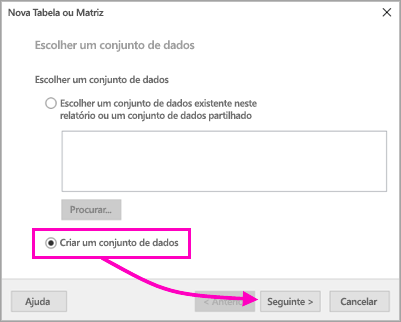
  
5.  Na página **Escolher uma ligação para uma origem de dados**, selecione **Nova**. 

    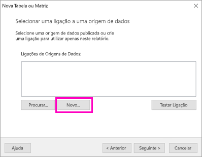
  
     A caixa de diálogo **Propriedades da Origem de Dados** é apresentada.  
  
6.  Pode dar qualquer nome à origem de dados, com carateres e carateres de sublinhado. Para este tutorial, na caixa **Nome**, escreva **MyAzureDataSource**.  
  
7.  Na caixa **Selecionar tipo de ligação**, selecione **Base de Dados SQL do Microsoft Azure**.  
  
8.  Selecione **Criar** junto da caixa **Cadeia de ligação**. 

    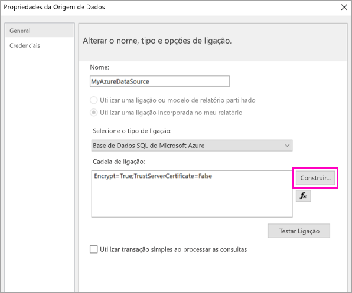

9. **No Azure:** regresse ao portal do Azure e selecione **Bases de dados SQL**.

1. Selecione a base de dados SQL do Azure que criou no início rápido “Criar um exemplo de base de dados SQL do Azure no portal do Azure” na secção **Pré-requisitos** deste artigo.

1. No separador **Descrição geral**, copie e guarde o valor na caixa **Nome do servidor**.

2. **No Report Builder**: na caixa de diálogo **Propriedades da Ligação**, em **Nome do servidor**, cole o nome do servidor que copiou. 

1. Para **Iniciar sessão no servidor**, garanta que a opção **Utilizar a Autenticação do SQL Server** está selecionada. Em seguida, escreva o nome de utilizador e a palavra-passe que criou no Azure para a base de dados de exemplo.

1. Em **Ligar a uma base de dados**, selecione a seta para baixo e selecione o nome da base de dados que criou no Azure.
 
    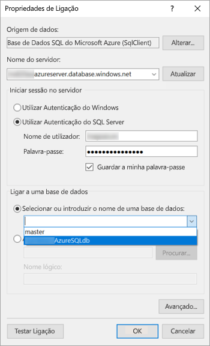

1. Selecione **Testar Ligação**. Verá a mensagem **Resultados do teste** que indica que o **Teste da ligação foi concluído com êxito**.

1. Selecione **OK** > **OK**. 

   Agora, na caixa **Cadeia de ligação**, o Report Builder apresenta a cadeia de ligação que acabou de criar. 

    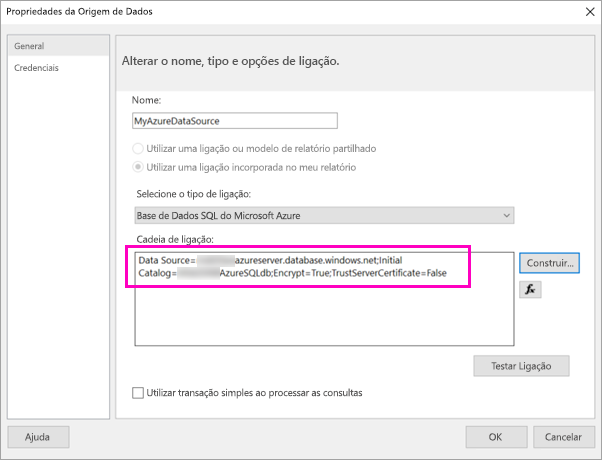

1. Selecione **OK**.
  
9. Na página **Escolher uma ligação para uma origem de dados**, verá “(neste Relatório)” sob a ligação de origem de dados que acabou de criar. Selecione essa origem de dados > **Seguinte**.  

    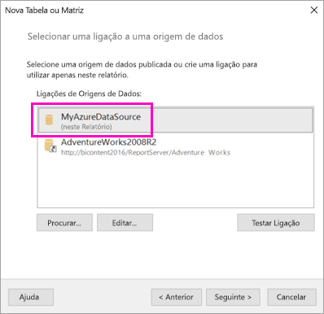

10. Escreva o mesmo nome de utilizador e a palavra-passe na caixa. 
  
10. Na página **Estruturar uma consulta**, expanda SalesLT, expanda Tabelas e selecione estas tabelas:

    - Endereço
    - Cliente
    - Produto
    - ProductCategory
    - SalesOrderDetail
    - SalesOrderHeader

     Dado que as opções **Relações** > **Deteção Automática** estão selecionadas, o Report Builder deteta as relações entre essas tabelas. 
    
    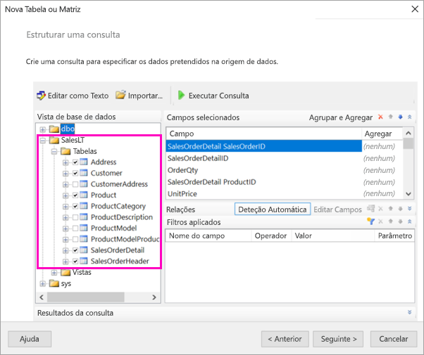
 
1.  Selecione **Executar Consulta**. O Report Builder apresenta os **Resultados da consulta**. 
 
     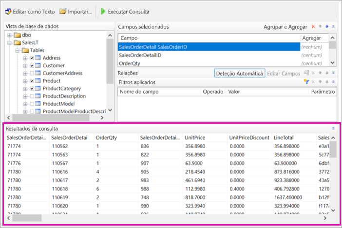

18. Selecione **Seguinte**. 

19. Na página **Escolher um conjunto de dados**, selecione o conjunto de dados que acabou de criar > **Seguinte**.

    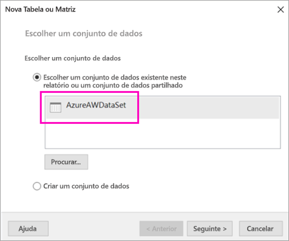

1. Na página **Dispor campos**, arraste estes campos da caixa **Campos disponíveis** para a caixa **Grupos de linha**:

    - CompanyName
    - SalesOrderNumber
    - Product_Name

1. Arraste estes campos da caixa **Campos disponíveis** para a caixa **Valores**:

    - OrderQty
    - PreçoUnitário
    - TotalDaLinha

    O Report Builder faz com que os campos na caixa **Valores** sejam somados.

    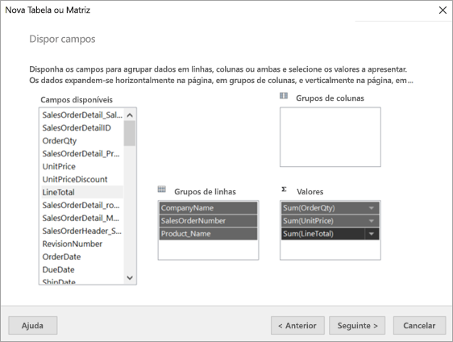

24. Na página **Escolher o layout**, mantenha todas as configurações padrão, mas desmarque **Expandir/fechar grupos**. Em geral, a funcionalidade expandir/fechar grupos é ótima, mas desta vez quer que a tabela seja moldada a várias páginas.

1. Selecione **Seguinte** > **Concluir**. A tabela é apresentada na superfície da estrutura.
 
## O que criou

Vamos fazer uma pausa por um momento para examinar os resultados do assistente.

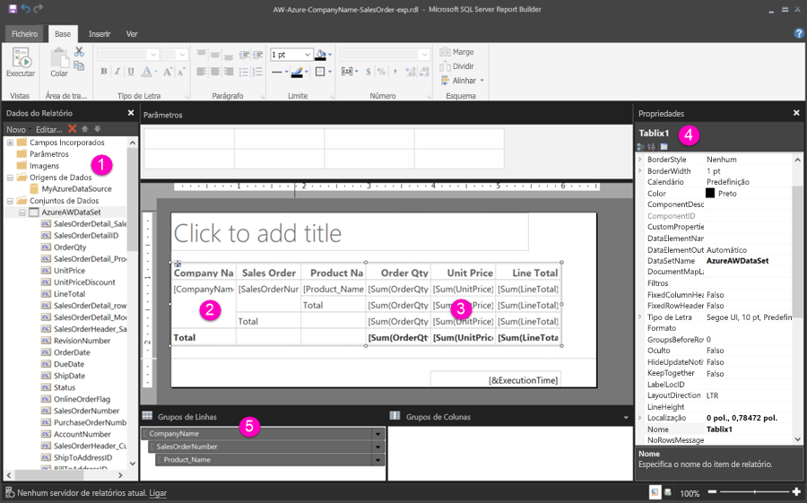

1. No painel Dados do Relatório, verá a origem de dados do Azure incorporada e o conjunto de dados incorporado com base na mesma, ambos criados por si. 

2. A superfície da estrutura tem cerca de 6 pol. de largura. Na superfície da estrutura verá a matriz, que apresenta os cabeçalhos das colunas e os valores dos marcadores de posição. A matriz tem seis colunas e parece ter apenas cinco linhas de altura. 

3. Qtd. Pedida, Preço Unitário e Total de Linha são as três somas e cada grupo de linhas tem um subtotal. 

    Não vê ainda os valores reais dos dados. Terá de executar o relatório para vê-los.

4. No painel Propriedades, a matriz selecionada chama-se Tablix1. Uma *tablix* no Report Builder é uma região de dados que apresenta dados em linhas e colunas. Pode ser uma tabela ou uma matriz.

5. No painel Agrupamento, verá os três grupos de linhas que criou no assistente: 

    - CompanyName
    - Nota de Venda
    - Nome do Produto

    Esta matriz não tem grupos de colunas.

### Executar o relatório

Para ver os valores reais, terá de executar o relatório.

1. Selecione **Executar** na barra de ferramentas **Raiz**.

   Agora, pode ver os valores. A matriz tem muitas mais linhas do que as que viu na Vista de estrutura! Repare que o Report Builder diz que é a página **1** de **2?** O Report Builder carrega o relatório o mais rapidamente possível, por isso, ele só recupera dados suficientes para algumas páginas de cada vez. O ponto de interrogação indica que o Report Builder não carregou ainda todos os dados.

   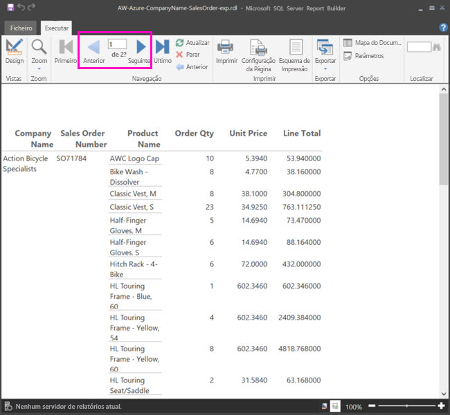

2. Selecione **Esquema de Impressão**. O relatório estará neste formato quando o imprimir. O Report Builder sabe, agora, que o relatório tem 33 páginas e adicionou automaticamente um carimbo de data e hora no rodapé.

## Formatar o relatório

Agora, tem um relatório com uma matriz moldada para 33 páginas. Vamos adicionar mais alguns recursos e melhorar o seu aspeto. Pode executar o relatório após cada passo, se quiser ver como está a ficar.

- No separador **Executar** do Friso, selecione **Estrutura** para que possa continuar a modificá-la.  

### Definir largura da página

Normalmente, um relatório paginado é formatado para impressão e uma página normal tem 8 1/2 X 11 pol. 

1. Arraste a régua para fazer com que a superfície da estrutura tenha 7 pol. de largura. As margens padrão têm 1 pol. em cada lado, por isso, as margens laterais têm de ser mais estreitas.

1. Clique na área cinzenta em redor da superfície da estrutura para mostrar as propriedades **Relatório**.

    Se não vir o painel Propriedades, clique no separador **Vista** > **Propriedades**.

2. Expanda **Margens** e altere **Esquerda** e **Direita** de 1 pol. para 0,75 pol. 

    
  
### Adicionar um título do relatório  

1. Selecione as palavras **Clicar para adicionar título** na parte superior da página e, em seguida, escreva **Vendas por Empresa**.  

2. Selecione o texto do título e, no painel Propriedades, em **Tipo de letra**, altere a **Cor** para **Azul**.
  
### Adicionar um número de página

Reparou que o relatório tem um carimbo de data e hora no rodapé. Também pode adicionar um número de página ao rodapé.

1. Na parte inferior da superfície da estrutura, verá [&ExecutionTime] à direita no rodapé. 

2. No painel Dados do Relatório, expanda a pasta Campos Incorporados. Arraste o **Número de Página** para o lado esquerdo do rodapé para a mesma altura de [&ExecutionTime].

3. Arraste o lado direito da caixa [&PageNumber] para torná-la quadrada.

4. No separador **Inserir**, selecione **Caixa de Texto**.

5. Clique à direita de [&PageNumber], escreva “de” e, em seguida, torne a caixa de texto quadrada.

6. Arraste **Total de Páginas** para o rodapé, à direita de “de”, e arraste o lado direito para tornar a caixa também quadrada.

    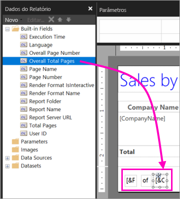

### Tornar a tabela mais larga  

Agora, pode tornar a matriz suficientemente grande para preencher a largura da página e tornar as colunas de texto mais largas para que os nomes não se desloquem tanto. 
 
1. Selecione a matriz e, em seguida, selecione a coluna Nome da Empresa.

3. Paire o cursor sobre a barra cinzenta na parte superior da matriz na extremidade direita da coluna Nome da Empresa. Arraste para a direita, até que a coluna fique com 1 3/8 pol. 

    

4. Arraste a borda direita do Nome do produto até que a coluna fique com 3 3/4 pol.   

Agora, a matriz é quase tão larga quanto a área de impressão.

### Formatar a moeda

Se tiver reparado quando executou o relatório, os valores de dólar não estão ainda formatados como moeda.

1. Selecione a célula [Sum(OrderQty)] no canto superior esquerdo e mantenha premida a tecla Shift para selecionar a célula [Sum(LineTotal)] no canto inferior direito.

    

2. No separador **Raiz**, selecione o símbolo de modela de cifrão ( **$** ) e, em seguida, selecione a seta junto de **Estilos do marcador de posição** > **Valores de Exemplo**.
 
    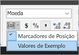

    Agora, pode ver que os valores estão formatados como moeda.

    

### Adicionar cabeçalhos de coluna em cada página

Mais uma melhoria na formatação antes de publicar o relatório no serviço Power BI: fazer com que os cabeçalhos de coluna apareçam em cada página no relatório.

1. Na extremidade direita da barra superior no painel Agrupamento, selecione a seta para baixo > **Modo Avançado**.

    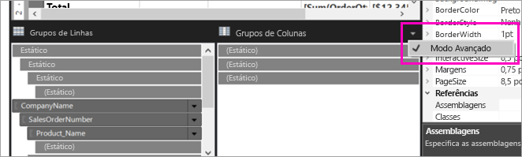

2. Selecione a barra **Estático** na parte superior nos **Grupos de Linhas**. Verá que está selecionada a célula Nome da Empresa na matriz.

   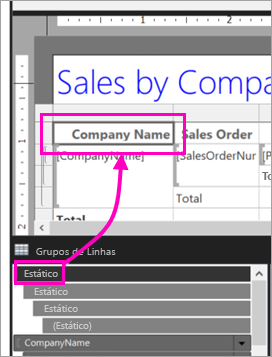

3. No painel **Propriedades**, vai procurar as propriedades do **Membro de Tablix**. Defina **KeepWithGroup**como **Depois** e **RepeatOnNewPage** como **Verdadeiro**.

    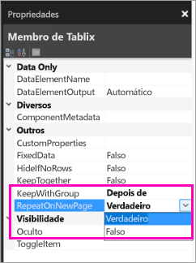

    Está na altura de executar o relatório e ver qual o aspeto que tem.

5. Selecione **Executar** no separador **Raiz**.

6. Selecione **Esquema de Impressão** se ainda não estiver selecionado. Agora, o relatório tem 29 páginas. Percorra algumas páginas. Verá que a moeda está formatada, as colunas têm cabeçalhos em cada página e o relatório tem um rodapé com números de página e o carimbo de data e hora em cada página.
 
    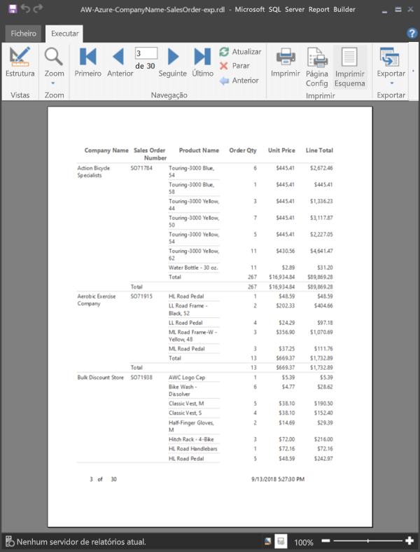

7. Guarde o relatório no computador.
 
##  Carregar o relatório no serviço

Agora que criou o relatório paginado, chegou a hora de o carregar no serviço Power BI.

1. No serviço Power BI (`https://app.powerbi.com`), no painel de navegação, selecione **Áreas de trabalho** > **Criar área de trabalho**.

2. Dê o nome **Azure AW** ou outro nome exclusivo à área de trabalho. É o único membro por enquanto. 

3. Selecione a seta junto a **Avançado** e ative **Capacidade dedicada**. 

    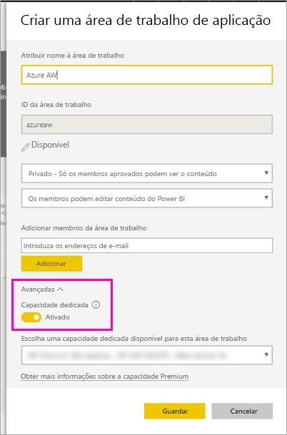

    Se não conseguir ativá-la, terá de pedir ao seu administrador do Power BI para lhe dar permissão para adicionar a área de trabalho à capacidade Premium dedicada.

4. Escolha uma **capacidade dedicada disponível para esta área de trabalho** e, se necessário, > **Guardar**.
    
    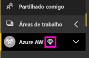

    Se a área de trabalho não estiver numa capacidade Premium, ao tentar carregar o relatório, verá a mensagem “Não é possível carregar relatório paginado”. Contacte o administrador do Power BI para mover a área de trabalho.

1. Na nova área de trabalho, selecione **Obter Dados**.

2. Na caixa **Ficheiros** > **Obter**.

3. Selecione **Ficheiro Local**, navegue para o local onde guardou o ficheiro > **Abrir**.

   O Power BI importa o ficheiro e poderá vê-lo sob **Relatórios** na página Lista de aplicações.

    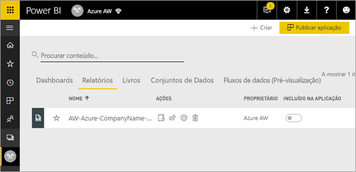

4. Selecione o relatório para o ver.

5. Se obtiver um erro, poderá ter de reintroduzir as suas credenciais. Selecione o ícone **Gerir**.

    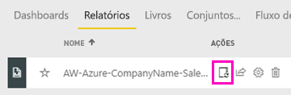

6. Selecione **Editar credenciais** e introduza as credenciais que utilizou no Azure quando criou a base de dados do Azure.

    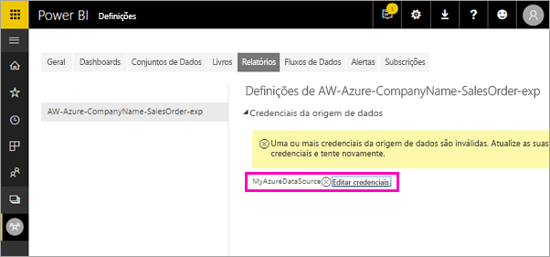

7. Agora pode ver o seu relatório paginado no serviço Power BI.

    

## Próximos passos

[O que são relatórios paginados no Power BI Premium?](paginated-reports-report-builder-power-bi.md)

