# Publicar um relatório paginado no serviço Power BI

[!INCLUDE [applies-to](../includes/applies-to.md)] [!INCLUDE [yes-service](../includes/yes-service.md)] [!INCLUDE [yes-paginated](../includes/yes-paginated.md)] [!INCLUDE [yes-premium](../includes/yes-premium.md)] [!INCLUDE [no-desktop](../includes/no-desktop.md)] 

Neste artigo, vai aprender a publicar um relatório paginado no serviço Power BI ao carregá-lo do computador local. Pode carregar os relatórios paginados em A Minha Área de Trabalho ou em qualquer outra área de trabalho, desde que a área de trabalho esteja numa capacidade Premium. Procure o ícone de losango  junto ao nome da área de trabalho. 

Se a sua origem de dados do relatório estiver no local, precisará de criar um gateway depois de carregar o relatório. Consulte a secção [Criar um gateway](#create-a-gateway) mais à frente neste artigo.

## Adicionar uma área de trabalho a uma capacidade Premium

Se a área de trabalho não tiver o ícone de losango  junto ao nome, terá de adicionar a área de trabalho a uma capacidade Premium. 

1. Selecione **Áreas de trabalho** , selecione as reticências ( **…** ) junto ao nome da área de trabalho e, em seguida, selecione **Editar área de trabalho**.

    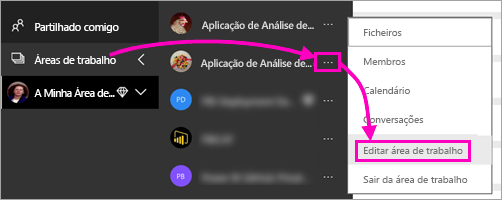

1. Na caixa de diálogo **Editar área de trabalho** , expanda **Avançado** e, em seguida, deslize **Capacidade dedicada** para **Ativa**.

    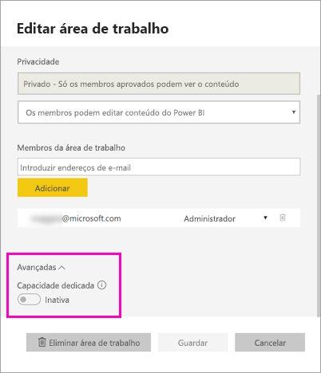

   Poderá não conseguir alterá-la. Se não conseguir, contacte o seu administrador de capacidade do Power BI Premium para que tenha direitos de atribuição para adicionar a sua área de trabalho a uma capacidade Premium.

## Publicar um relatório paginado no Report Builder

1. Crie o relatório paginado no Report Builder e guarde-o no computador local.

1. No menu **Ficheiro** do Report Builder, selecione **Guardar como**.

    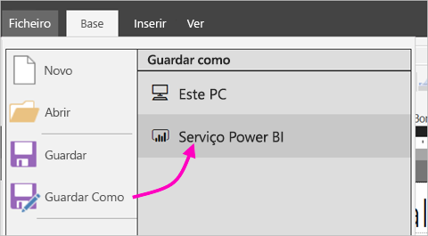

    Se ainda não tiver sessão iniciada no Power BI, terá de iniciar sessão ou criar uma conta agora. No canto superior direito do Report Builder, selecione **Iniciar sessão** e conclua os passos.

2. Na lista de áreas de trabalho à esquerda, selecione uma área de trabalho com o ícone de losango  junto ao respetivo nome. Escreva um **Nome de ficheiro** na caixa > **Guardar**. 

    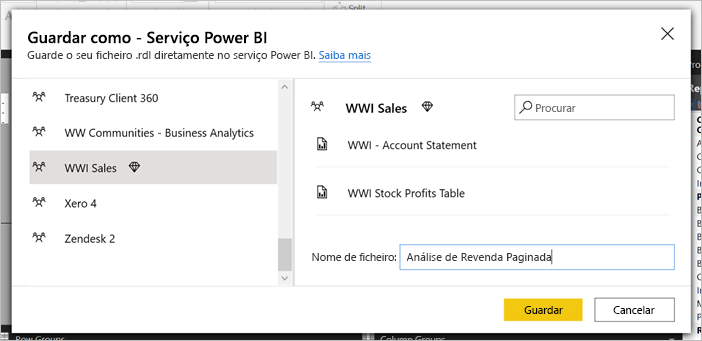

4. Abra o serviço Power BI num browser e navegue até à área de trabalho do Power BI Premium onde publicou o relatório paginado. No separador **Relatórios** , é apresentado o seu relatório.

    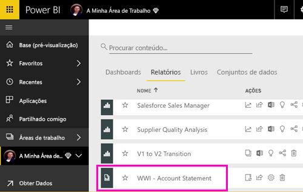

5. Selecione o relatório paginado para o abrir no serviço Power BI. Se tiver parâmetros, precisará de os selecionar para poder ver o relatório.

    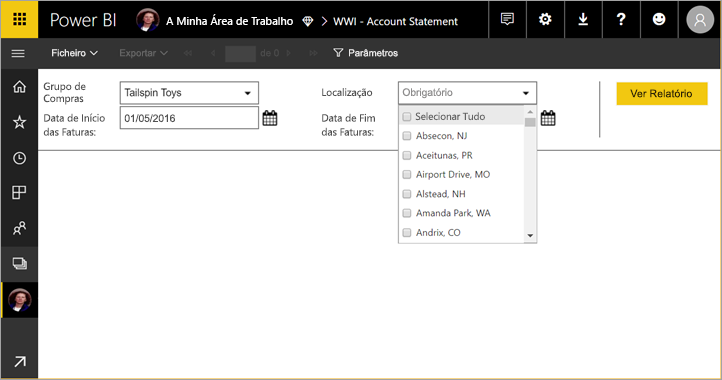

6. Se a sua origem de dados do relatório estiver no local, saiba como [criar um gateway](#create-a-gateway) neste artigo para aceder à origem de dados.

## Carregar um relatório paginado no serviço Power BI

Também pode começar no serviço Power BI e carregar um relatório paginado.

1. Crie o relatório paginado no Report Builder e guarde-o no computador local.

1. Abra o serviço Power BI num browser e navegue para a área de trabalho Premium onde quer publicar o relatório. Repare no ícone de losango  junto do nome. 

1. Selecione **Obter Dados**.

    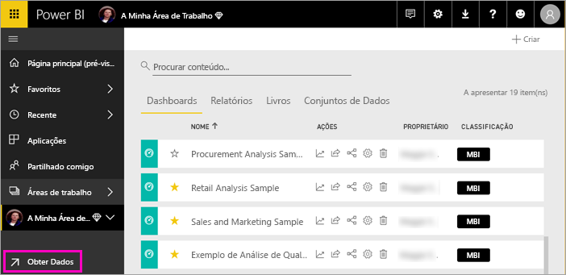

1. Na caixa **Ficheiros** , selecione **Obter**.

    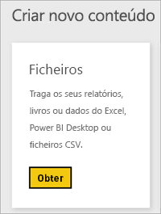

1. Selecione **Ficheiro local** > navegue para o relatório paginado > **Abrir**.

    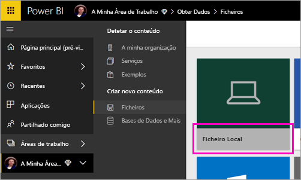

1. Selecione **Continuar** > **Editar credenciais**.

    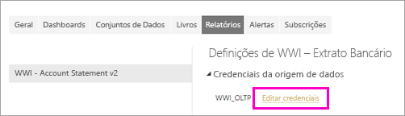

1. Configure as suas credenciais > **Iniciar sessão**.

    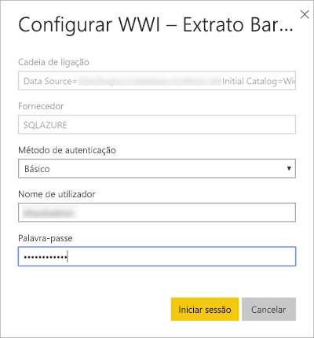

   No separador **Relatórios** , é apresentado o seu relatório.

    

1. Selecione-o para o abrir no serviço Power BI. Se tiver parâmetros, precisará de os selecionar para poder ver o relatório.
 
    

6. Se a sua origem de dados do relatório estiver no local, saiba como [criar um gateway](#create-a-gateway) neste artigo para aceder à origem de dados.

## Criar um gateway

Tal como qualquer outro relatório do Power BI, se a origem de dados do relatório for no local, terá de criar ou ligar a um gateway para aceder aos dados.

1. Junto ao nome do relatório, selecione **Gerir**.

   

1. Veja o artigo do serviço Power BI [O que é um gateway de dados no local](../connect-data/service-gateway-onprem.md) para obter detalhes e os passos seguintes.

## Próximas etapas

- [Ver um relatório paginado no serviço Power BI](../consumer/paginated-reports-view-power-bi-service.md)
- [O que são relatórios paginados no Power BI Premium?](paginated-reports-report-builder-power-bi.md)
- [Tutorial: Incorporar relatórios paginados do Power BI numa aplicação para os clientes](../developer/embedded/embed-paginated-reports-customers.md)
