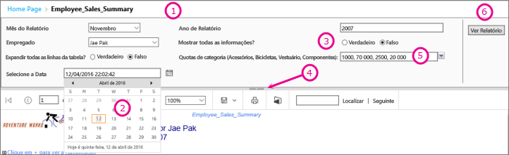
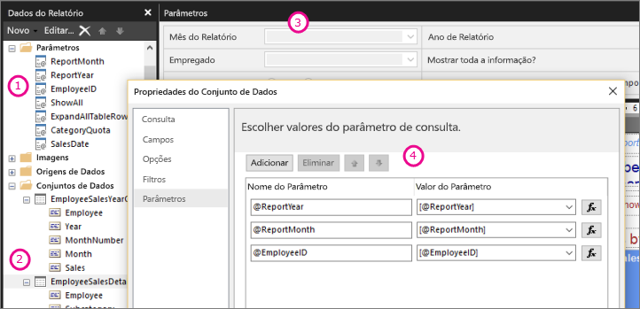

# Parâmetros de relatórios no Report Builder do Power BI

[!INCLUDE [applies-to](../includes/applies-to.md)] [!INCLUDE [yes-service](../includes/yes-service.md)] [!INCLUDE [yes-paginated](../includes/yes-paginated.md)] [!INCLUDE [yes-premium](../includes/yes-premium.md)] [!INCLUDE [no-desktop](../includes/no-desktop.md)] 

Este tópico descreve as utilizações comuns dos parâmetros de relatórios do Report Builder do Power BI, as propriedades que pode definir e muito mais. Os parâmetros de relatórios permitem-lhe controlar os dados dos relatórios, ligar os relatórios relacionados entre si e variar a apresentação do relatório. Pode utilizar os parâmetros de relatórios nos relatórios paginados que criar no Report Builder.

##  Utilizações comuns dos parâmetros

 Abaixo encontram-se algumas das formas mais comuns de utilizar parâmetros.  
  
**Controlar os dados de relatórios paginados**
  
- Filtre dados de relatórios paginados na origem de dados ao escrever consultas para o conjunto de dados que contêm variáveis.  
  
- Permita que os utilizadores especifiquem valores para personalizar os dados num relatório paginado. Por exemplo, forneça dois parâmetros para a data de início e a data de fim para dados de vendas.  
  
**Variar a apresentação de relatórios**
  
- Permita que os utilizadores especifiquem valores para ajudar a personalizar o aspeto de um relatório. Por exemplo, forneça um parâmetro booleano para indicar se pretende expandir ou fechar todos os grupos de linhas aninhados numa tabela.  
  
- Permita que os utilizadores personalizem os dados e o aspeto dos relatórios, incluindo os parâmetros numa expressão.  
  
## Ver um relatório paginado com parâmetros

Quando visualizar um relatório que tenha parâmetros, a barra de ferramentas do visualizador de relatórios apresenta cada parâmetro para que possa especificar os valores e forma interativa. A seguinte ilustração mostra a área de parâmetros de um relatório com os parâmetros @ReportMonth, @ReportYear, @EmployeeID, @ShowAll, @ExpandTableRows, @CategoryQuota e @SalesDate.  

  
1. **Painel de parâmetros** A barra de ferramentas do visualizador de relatórios apresenta um pedido e um valor predefinido para cada parâmetro. Pode personalizar o layout dos parâmetros no painel de parâmetros.  
  
2. **@SalesDate parâmetro** o parâmetro @SalesDate é o tipo de dados **DateTime**. O pedido Selecione a Data é apresentado junto à caixa de texto. Para modificar a data, escreva uma nova data na caixa de texto ou utilize o controlo de calendário.  
  
3. **@ShowAll parâmetro** o parâmetro @ShowAll é o tipo de dados **booleano**. Utilize os botões de opção para especificar **Verdadeiro** ou **Falso**.  
  
4. **Identificador Mostrar ou Ocultar Área de Parâmetros** Na barra de ferramentas do visualizador de relatórios, clique nesta seta para mostrar ou ocultar o painel de parâmetros.  
  
5. **@CategoryQuota parâmetro** o parâmetro @CategoryQuota é o tipo de dados **Float**, por isso, é necessário um valor numérico.  @CategoryQuota está definido para permitir múltiplos valores.  
  
6. **Ver Relatório** Depois de introduzir os valores dos parâmetros, clique em **Ver Relatório** para executar o relatório. Se todos os parâmetros tiverem os valores predefinidos, o relatório será executado automaticamente na primeira visualização.  
  
##  Criar parâmetros

Pode criar parâmetros de relatórios de algumas formas diferentes.
  
> [!NOTE]
>  Nem todas as origens de dados suportam parâmetros.
  
**Consulta ou procedimento armazenado do conjunto de dados com parâmetros**
  
 Adicione uma consulta do conjunto de dados que contém variáveis ou um procedimento armazenado do conjunto de dados que contém os parâmetros de entrada. É criado um parâmetro de conjunto de dados para cada variável ou parâmetro de entrada, e é também criado um parâmetro de relatório para cada parâmetro de conjunto de dados.  
  

  
 Esta imagem do Report Builder mostra:  
  
1.  Os parâmetros do relatório no painel Dados do Relatório.  
  
2.  O conjunto de dados com os parâmetros.  
  
3.  O painel Parâmetros.  
  
4.  Os parâmetros listados na caixa de diálogo Propriedades do Conjunto de Dados.  
  
**Criar um parâmetro manualmente**
  
Pode criar um parâmetro manualmente a partir do painel Dados do Relatório. Pode configurar parâmetros de relatório para que um utilizador possa introduzir valores interativamente de forma a ajudar a personalizar os conteúdos ou o aspeto de um relatório. Também pode configurar parâmetros de relatório para que um utilizador não possa alterar valores pré-configurados.  
  
> [!NOTE]  
>  Como os parâmetros são geridos de forma independente no servidor, a nova publicação de um relatório principal com novas definições de parâmetro não substituirá as definições de parâmetros existentes no relatório.  

### Valores de parâmetros

 Seguem-se opções para selecionar valores dos parâmetros no relatório.  
  
- Selecione um único valor de parâmetro a partir de uma lista pendente.  
  
- Selecione múltiplos valores de parâmetros a partir de uma lista pendente.  
  
- Selecione um valor a partir de uma lista pendente de um parâmetro que determina os valores que estão disponíveis na lista pendente de outro parâmetro. Trata-se de parâmetros em cascata. Os parâmetros em cascata permitem filtrar valores de parâmetros de forma sucessiva de entre milhares de valores para obter um número passível de ser gerido. Para obter mais informações, veja [Utilizar parâmetros em cascata em relatórios paginados](../guidance/paginated-report-cascading-parameter.md).
  
- Execute o relatório sem ter de selecionar primeiro um valor de parâmetro devido à criação de um valor predefinido para o parâmetro.  
  
##  Propriedades dos parâmetros de relatórios

 Pode alterar as propriedades dos parâmetros de relatórios através da caixa de diálogo Propriedades do Relatório. A seguinte tabela resume as propriedades que pode definir para cada parâmetro:  
  
|Propriedade|Descrição|  
|--------------|-----------------|  
|Nome|Escreva um nome sensível às maiúsculas e minúsculas para o parâmetro. O nome tem de começar por uma letra e pode ter letras, números e um caráter de sublinhado (_). Não pode ter espaços. No caso dos parâmetros gerados automaticamente, o nome corresponde ao parâmetro que se encontra na consulta do conjunto de dados. Por predefinição, os parâmetros criados manualmente são semelhantes a ReportParameter1.|  
|Prompt|O texto que aparece ao lado do parâmetro na barra de ferramentas do visualizador de relatórios.|  
|Tipo de dados|Os parâmetros de relatórios têm de ser um dos seguintes tipos de dados:   **Booleano**. O utilizador seleciona Verdadeiro ou Falso a partir de um botão de opção.   **DateTime**. O utilizador seleciona uma data a partir de um controlo de calendário.   **Número inteiro**. O utilizador escreve valores numa caixa de texto.   **Flutuante**. O utilizador escreve valores numa caixa de texto.   **Texto**. O utilizador escreve valores numa caixa de texto.   Quando os valores disponíveis estão definidos para um parâmetro, o utilizador seleciona valores a partir de uma lista pendente, mesmo quando o tipo de dados é **DateTime**.|  
|Permitir valor em branco|Selecione esta opção se o valor do parâmetro puder ser uma cadeia vazia ou um valor em branco.   Se especificar valores válidos para um parâmetro e quiser que um valor em branco seja um dos valores válidos, tem de o incluir como um dos valores que especificou. A seleção desta opção não inclui automaticamente um valor em branco para valores disponíveis.|  
|Permitir valor nulo|Selecione esta opção se o valor do parâmetro puder ser nulo.   Se especificar valores válidos para um parâmetro e quiser que um valor nulo seja um dos valores válidos, tem de o incluir como um dos valores que especificou. A seleção desta opção não inclui automaticamente um valor nulo para valores disponíveis.|  
|Permitir múltiplos valores|Forneça valores disponíveis para criar uma lista pendente a partir da qual os utilizadores possam selecionar. Esta é uma boa forma de garantir que os valores válidos são os únicos valores submetidos na consulta de conjunto de dados.   Selecione esta opção se o valor do parâmetro puder ser múltiplos valores que são apresentados numa lista pendente. Não são permitidos valores nulos. Quando esta opção está selecionada, são adicionadas caixas de verificação à lista de valores disponíveis numa lista pendente de um parâmetro. A parte superior da lista inclui uma caixa de verificação **Selecionar Tudo**. Os utilizadores podem selecionar os valores que quiserem.   Se os dados que fornecem valores mudarem rapidamente, a lista que o utilizador vê poderá não ser a mais recente.|  
|Visible|Selecione esta opção para apresentar o parâmetro de relatório na parte superior do relatório quando este for executado. Esta opção permite que os utilizadores selecionem valores de parâmetros durante a execução.|  
|Oculto|Selecione esta opção para ocultar o parâmetro de relatório no relatório publicado. Os valores dos parâmetros de relatório continuam a poder ser definidos num URL de relatório, numa definição de subscrição ou no servidor de relatórios.|  
|Interno|Selecione esta opção para ocultar o parâmetro de relatório. No relatório publicado, o parâmetro de relatório só pode ser visto na definição do relatório.|  
|Valores disponíveis|Se tiver especificado valores disponíveis para um parâmetro, os valores válidos serão sempre apresentados sob a forma de lista pendente. Por exemplo, se fornecer valores disponíveis para um parâmetro **DateTime**, será apresentada uma lista pendente para datas no painel do parâmetro em vez de um controlo de calendário.   Para garantir que as listas de valores são consistentes nos relatórios e sub-relatórios, pode definir uma opção na origem de dados que permite utilizar uma única transação para todas as consultas nos conjuntos de dados associados a uma origem de dados.   **Nota de Segurança** No caso dos relatórios que incluem um parâmetro do tipo de dados **Texto**, certifique-se de que utiliza uma lista de valores disponíveis (também conhecida como uma lista de valores válidos) e de que os utilizadores que executam o relatório só têm as permissões necessário para ver os dados contidos no relatório.|  
|Valores predefinidos|Permite definir valores predefinidos a partir de uma consulta ou de uma lista estática.   Se cada parâmetro tiver um valor predefinido, o relatório será executado automaticamente na primeira visualização.|  
|Avançado|Permite definir o atributo de definição de relatório **UsedInQuery**, um valor que indica se este parâmetro afeta os dados num relatório de forma direta ou indireta.   **Determinar automaticamente ao atualizar**  Selecione esta opção quando quiser que o processador do relatório determine uma definição para este valor. O valor é **Verdadeiro** se o processador do relatório detetar uma consulta de conjunto de dados com uma referência direta ou indireta para este parâmetro ou se o relatório tiver sub-relatórios.   **Atualizar sempre**  Selecione esta opção quando o parâmetro de relatório for utilizado, de forma direta ou indireta, numa consulta de conjunto de dados ou expressão de parâmetro. Esta opção define **UsedInQuery** como Verdadeiro.   **Nunca atualizar**  Selecione esta opção quando o parâmetro de relatório não for utilizado, de forma direta ou indireta, numa consulta de conjunto de dados ou expressão de parâmetro. Esta opção define **UsedInQuery** como Falso.   **Atenção** Utilize **Nunca Atualizar** com precaução. No servidor de relatórios, **UsedInQuery** é utilizado para ajudar a controlar as opções da cache para dados de relatório e relatórios compostos, bem como as opções de parâmetros para os relatórios de instantâneos. Se definir **Nunca Atualizar** incorretamente, poderá estar a armazenar em cache relatórios ou dados de relatório incorretos ou a fazer com que um relatório de instantâneo tenha dados inconsistentes. |  
  
##   Consulta de conjunto de dados  
 Para filtrar dados na consulta de conjunto de dados, pode incluir uma cláusula de restrição que limita os dados obtidos ao especificar valores a incluir ou excluir dos resultados.  
  
 Utilize o estruturador de consulta da origem de dados para ajudar a criar uma consulta parametrizada.  
  
-   No caso das consultas de Transact-SQL, as diferentes origens de dados suportam uma sintaxe diferente para os parâmetros. É possível suportar intervalos de parâmetros que estão identificados na consulta por posição ou nome. No estruturador de consulta relacional, tem de selecionar a opção de parâmetro para um filtro, de forma a criar uma consulta parametrizada.   
  
-   No caso das consultas baseadas numa origem de dados multidimensional, tal como o Microsoft SQL Server Analysis Services, pode especificar se quer criar um parâmetro com base num filtro especificado por si no estruturador de consulta. 
  
##   Gestão de parâmetros para um relatório publicado  
 Quando estrutura um relatório, os parâmetros do relatório são guardados na definição do relatório. Quando publica um relatório, os parâmetros do relatório são guardados e geridos em separado da definição do relatório.  
  
 No caso de um relatório publicado, pode utilizar o seguinte:  
  
-   **Propriedades dos parâmetros de relatórios.** Altere valores de parâmetros de relatórios diretamente no servidor de relatórios independentemente da definição de relatório.  
  
-   **Subscrições de relatórios.** Pode especificar valores de parâmetros para filtrar dados e apresentar relatórios através de subscrições. 
  
 As propriedades dos parâmetros de um relatório publicado são mantidas se voltar a publicar a definição do relatório. Se a definição do relatório for publicada novamente como o mesmo relatório e os nomes e tipos de dados dos parâmetros permanecem os mesmos, as definições de propriedade são mantidas. Se adicionar ou eliminar parâmetros na definição do relatório ou alterar o tipo de dados ou o nome de um parâmetro existente, poderá ter de alterar as propriedades dos parâmetros no relatório publicado.  
  
 Nem todos os parâmetros podem ser sempre modificados. Se um parâmetro de relatório obtiver um valor predefinido de uma consulta de conjunto de dados, esse valor não pode ser modificado para um relatório publicado nem no servidor de relatórios. O valor que é utilizado durante a execução é determinado quando a consulta é executada ou quando a expressão é avaliada (no caso de parâmetros baseados em expressões).  
  
 As opções de execução dos relatórios podem afetar a forma como os parâmetros são processados. Um relatório que é executado como um instantâneo não pode utilizar parâmetros derivados de uma consulta a não ser que a consulta inclua valores predefinidos para os parâmetros.  
  
##   Parâmetros para uma subscrição  
 Pode definir uma subscrição para um relatório a pedido ou de instantâneo e especificar os valores dos parâmetros a utilizar durante o processamento da subscrição.  
  
-   **Relatório a pedido.**  No caso dos relatórios a pedido, pode especificar um valor de parâmetro diferente do valor publicado para cada parâmetro listado para o relatório. Por exemplo, imagine que tem um relatório de Serviço de Chamada que utiliza um parâmetro *Período de tempo* para devolver pedidos de suporte ao cliente do dia, da semana ou do mês corrente. Se o valor de parâmetro predefinido para o relatório estiver definido como **hoje**, a sua subscrição pode utilizar um valor de parâmetro diferente (tal como **semana** ou **mês**) para produzir um relatório que contenha os valores semanais ou mensais.  
  
## Próximos passos

- [O que são relatórios paginados no Power BI Premium?](paginated-reports-report-builder-power-bi.md)  
- [Use cascading parameters in paginated reports (Utilizar parâmetros em cascata em relatórios paginados)](../guidance/paginated-report-cascading-parameter.md)
