# Criar um relatório paginado com base num conjunto de dados partilhado do Power BI

[!INCLUDE [applies-to](../includes/applies-to.md)] [!INCLUDE [yes-service](../includes/yes-service.md)] [!INCLUDE [yes-paginated](../includes/yes-paginated.md)] [!INCLUDE [yes-premium](../includes/yes-premium.md)] [!INCLUDE [yes-desktop](../includes/yes-desktop.md)] 

Pode utilizar um conjunto de dados que criou no Power BI Desktop como uma origem de dados para relatórios paginados do Power BI Report Builder. Imagine este cenário: criou um relatório do Power BI no Power BI Desktop. Passou muito tempo a criar o modelo de dados e, em seguida, criou um relatório apelativo do Power BI com vários tipos de elementos visuais. O seu relatório tem uma matriz com várias linhas, pelo que tem de se deslocar para ver todas. Os leitores do seu relatório querem imprimir o relatório e apresentar todas as linhas nessa matriz. Um relatório paginado do Power BI pode fazer isso: imprima uma tabela ou matriz com múltiplas páginas, com cabeçalhos e rodapés de página e um esquema de página perfeito que criou. Irá complementar o relatório do Power BI Desktop. Quer que se baseie nos mesmos dados, sem discrepâncias, por isso utiliza o mesmo conjunto de dados.

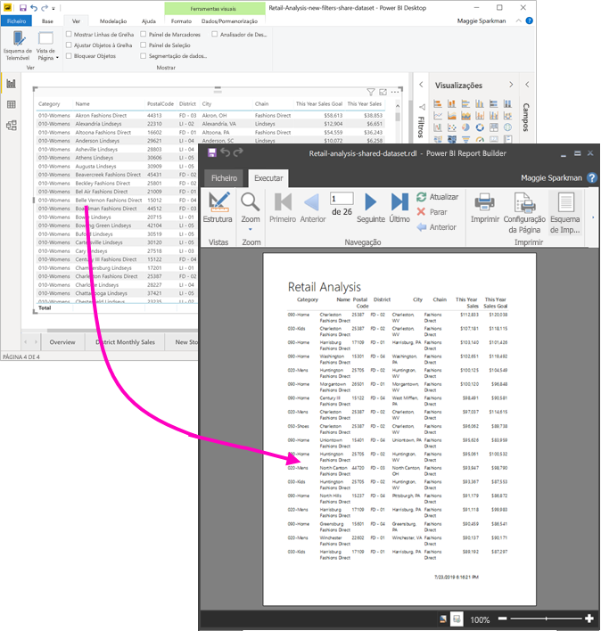

O conjunto de dados não tem de estar numa área de trabalho na capacidade Premium e não tem de ser membro dessa área de trabalho. Só tem de ter [Permissão de compilação](../connect-data/service-datasets-build-permissions.md) para a base de dados. Para publicar o seu relatório paginado, precisa de uma licença do Power BI Pro. Também precisa de pelo menos uma função de Contribuidor numa área de trabalho numa capacidade Premium.

## O que precisa

Eis uma lista do que precisa e não precisa para utilizar um conjunto de dados partilhado no Power BI Report Builder.

- Power BI Report Builder. [Transferir e instalar o Power BI Report Builder](https://aka.ms/pbireportbuilder).
- Para aceder a um conjunto de dados do Power BI, tem de ter permissão de compilação no conjunto de dados. Leia sobre a [permissão de compilação](../connect-data/service-datasets-build-permissions.md).
- Não precisa de uma licença do Power BI Pro para criar um relatório paginado no Report Builder. 
- Precisa de uma licença do Power BI Pro para publicar o seu relatório paginado. Também precisa de pelo menos uma função de Contribuidor numa área de trabalho numa capacidade Premium. 
- Opcional: se quiser acompanhar este artigo, transfira o ficheiro [Exemplo de Análise de Revenda.pbix](https://download.microsoft.com/download/9/6/D/96DDC2FF-2568-491D-AAFA-AFDD6F763AE3/Retail%20Analysis%20Sample%20PBIX.pbix) do Power BI Desktop, abra-o no Power BI Desktop e adicione uma tabela com várias colunas. No painel **Formatar**, desative a opção **Totais**. Em seguida, publique numa área de trabalho no serviço Power BI.

    

## Ligar ao conjunto de dados do Power BI

1. Abra o Report Builder do Power BI.
1. Selecione **Iniciar sessão** no canto superior direito do Report Builder para iniciar sessão na sua conta do Power BI.
1. No painel Dados do Relatório, selecione **Novo** > **Ligação do Conjunto de Dados do Power BI**.

    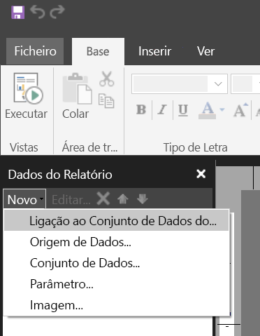

    > [!NOTE]
    > Não pode criar a origem de dados ou conjunto de dados para um conjunto de dados do Power BI com os assistentes de tabelas, de matrizes ou de gráficos do Report Builder. Depois de criá-los, pode utilizar os assistentes para criar tabelas, matrizes ou gráficos com base nos mesmos.

1. Procure o conjunto de dados ou a área de trabalho em que reside > **Selecionar**.
    O Report Builder preenche o nome do conjunto de dados.

    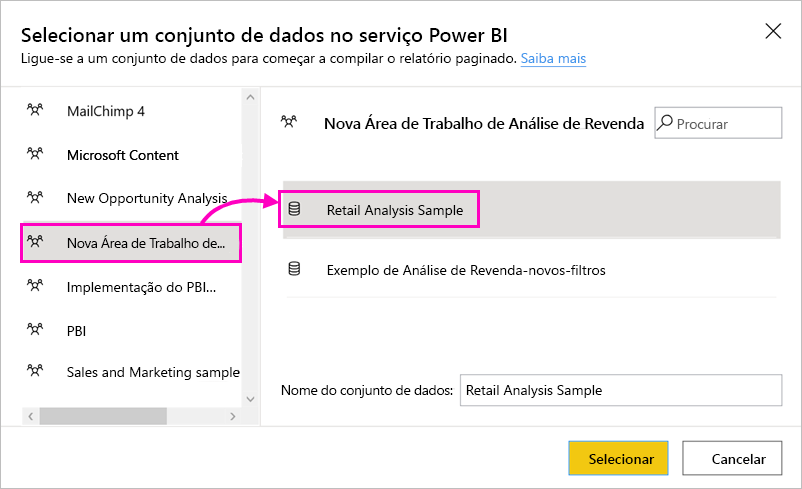
    
1. O conjunto de dados é indicado em Origens de Dados no painel Dados do Relatório.

    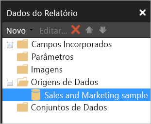

    Lembre-se de que pode ligar a múltiplos conjuntos de dados do Power BI e outras origens de dados no mesmo relatório paginado.

## Obter a consulta DAX para o conjunto de dados

Quando quer que os dados no seu relatório do Power BI e no seu relatório do Report Builder sejam os mesmos, não basta ligar ao conjunto de dados. Também precisa da consulta incorporada nesse conjunto de dados.

### Vídeo: Obter a consulta DAX

No vídeo seguinte, Chris Finlan demonstra como obter o DAX de que precisa para o seu relatório paginado.

<iframe width="400" height="450" src="https://www.youtube.com/embed/NfoOK4QRkhI" frameborder="0" allowfullscreen></iframe>

### Passos para obter a consulta DAX

Seguem-se os passos para obter a consulta.

1. Abra o relatório do Power BI (.pbix) no Power BI Desktop.
1. Certifique-se de que tem uma tabela no seu relatório que contém todos os dados que pretende no relatório paginado. A tabela tem de cumprir estes dois requisitos:
    - Tem de ser uma tabela simples e não uma matriz ou outro elemento visual. Se não for uma tabela, converta-a agora numa tabela, siga os passos do Analisador de Desempenho que se seguem e, em seguida, converta-a novamente no elemento visual pretendido.
    - Para os campos numéricos, tem de utilizar *medidas predefinidas*. Têm um símbolo de calculadora ao lado. Saiba mais sobre a [criação de medidas](../transform-model/desktop-measures.md). 

        

1. No friso **Ver**, selecione **Analisador de Desempenho**.

    

1. No painel **Analisador de Desempenho**, selecione **Iniciar gravação** e, em seguida, selecione **Atualizar elementos visuais**.

    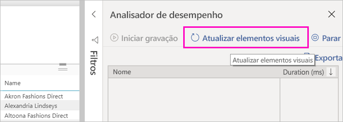

1. Expanda o sinal de adição ( **+** ) junto ao nome da tabela e selecione **Copiar consulta**. A consulta é a fórmula DAX de que precisa para o conjunto de dados no Power BI Report Builder.

    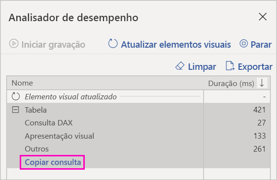

## Criar o conjunto de dados com a consulta

1. Regresse ao Report Builder do Power BI.
1. Clique com o botão direito do rato no conjunto de dados em **Origens de Dados** e selecione **Adicionar Conjunto de Dados**.

    

1. Em Propriedades do Conjunto de Dados, atribua um nome e selecione **Estruturador de Consulta**.

4. Certifique-se de que o **DAX** está selecionado e desselecione o ícone **Modo de Estrutura**.

    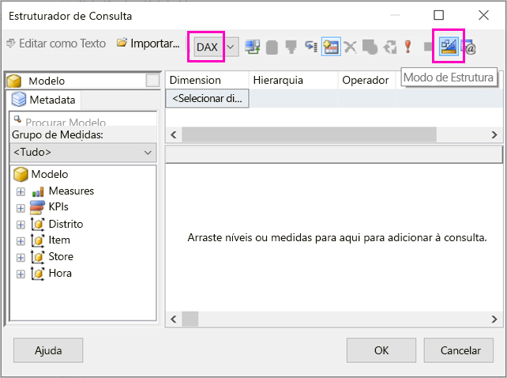

1. Na caixa superior, cole a consulta que copiou do Power BI Desktop.

    > [!NOTE]
    > Se a sua consulta incluir a função TOPN, elimine-a da sua consulta.

1. Selecione **Executar Consulta** (o ponto de exclamação vermelho, !) para garantir que a sua consulta funciona. 

    

    Verá os resultados da consulta na caixa inferior.

    

1. Selecione **OK**.

    Verá a sua consulta na janela **Consulta** da caixa de diálogo **Propriedades do Conjunto de Dados**.

    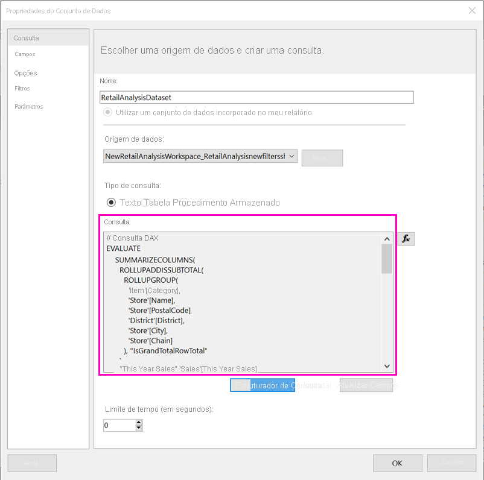

1. Selecione **OK**.

    Agora vê o seu novo conjunto de dados com uma lista de campos no painel Dados do Relatório.

    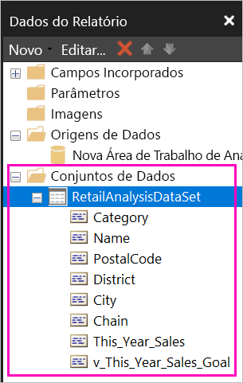

## Criar uma tabela no relatório

Uma forma rápida de criar uma tabela é através do Assistente de Tabelas.

1. No friso **Inserir**, selecione **Tabela** > **Assistente de Tabelas**.

    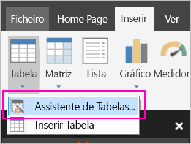

1. Selecione o conjunto de dados que criou com a consulta DAX > **Seguinte**.

    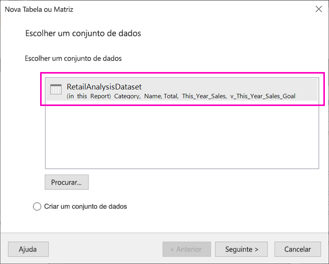

1. Para criar uma tabela simples, selecione os campos que pretende em **Campos disponíveis**. Pode selecionar múltiplos campos de cada vez ao selecionar o primeiro que pretende, premir a tecla Shift e selecionar o último.

    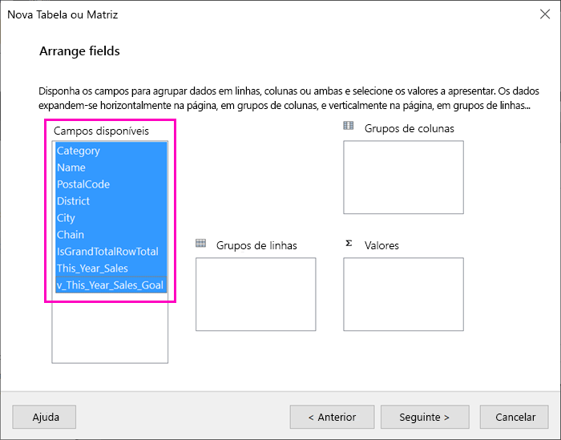

1. Arraste os campos para a caixa **Valores** > **Seguinte**.

    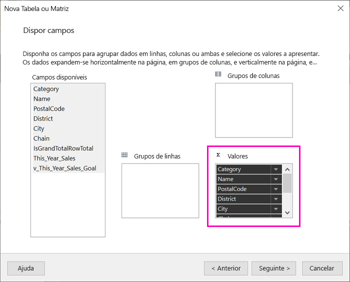

1. Selecione as opções de esquema que pretende > **Seguinte**.

1. Selecione **Concluir**.
    Verá a sua tabela na Vista Estrutura.

    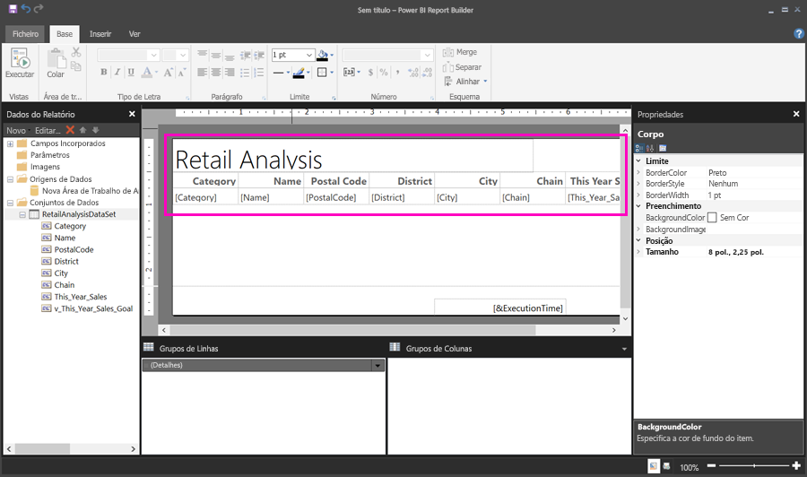

1. Selecione **Clique para adicionar o título** e adicione um título.

1. Selecione **Executar** para pré-visualizar o seu relatório.

    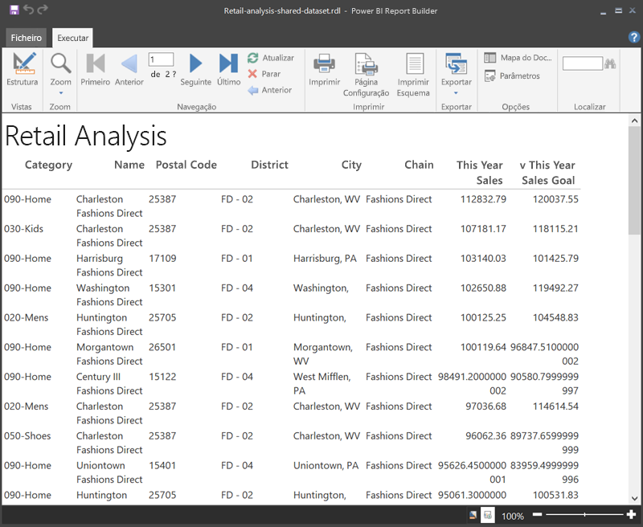

1. Selecione **Esquema de Impressão** para ver o aspeto do seu relatório impresso. 

    O esquema deste relatório tem de ser trabalhado. Tem 54 páginas porque as colunas e margens fazem com que a tabela tenha duas páginas.

    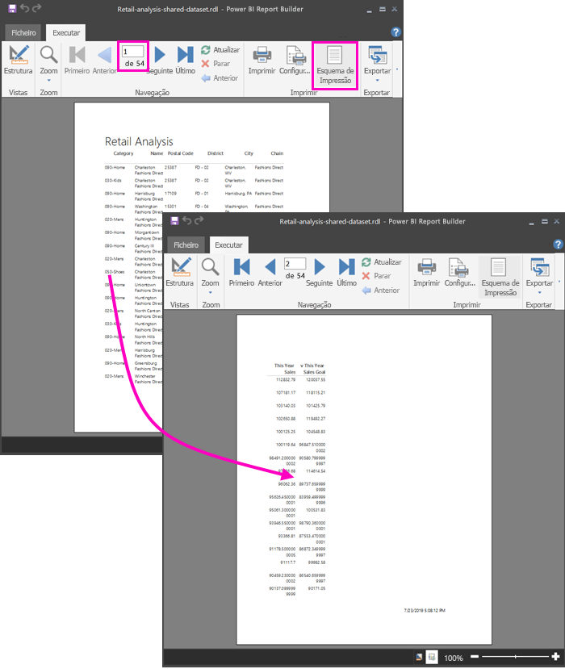

## Formatar o relatório

Tem várias opções de formatação para ajustar a sua tabela numa página. 

1. Pode diminuir as margens da página no painel Propriedades. Se não vir o painel Propriedades, no friso **Ver**, selecione a caixa de verificação **Propriedades**.

1. Selecione o relatório, não selecione a tabela ou título.
1. No painel **Propriedades do Relatório**, em **Página**, expanda **Margens** e altere cada uma para **0,75 pol**.

    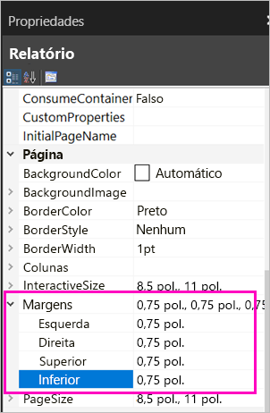

1. Também pode diminuir a largura das colunas. Selecione o limite da coluna e arraste o lado direito para a esquerda.

    

1. Outra opção é garantir que os valores numéricos estão bem formatados. Selecione uma célula com um valor numérico. 
    > [!TIP]
    > Pode formatar mais do que uma célula de cada vez ao premir a tecla Shift enquanto seleciona as outras células.

    

1. No friso **Base**, na secção **Número**, altere o formato **Predefinido** para um formato numérico, tal como **Moeda**.

    

1. Altere o estilo **Marcador de Posição** para **Valores de Exemplo**, para que possa ver a formatação na célula. 

    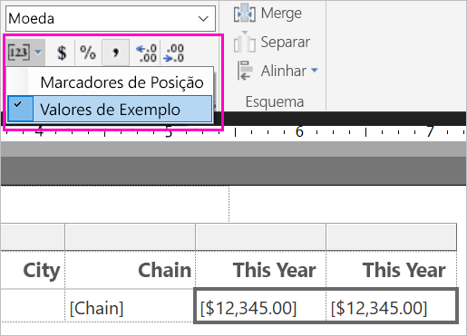

1. Se for adequado, na secção **Número**, diminua as casas decimais para poupar mais espaço.

### Eliminar páginas em branco

Mesmo que tenha diminuído as margens e as colunas da tabela, ainda tem algumas páginas em branco. Porquê? Por causa da matemática. 

Quando soma as margens da página que definiu, mais a largura do *corpo* do relatório, tem de ser menor do que a largura do formato do relatório.

Por exemplo, digamos que o seu relatório tem o formato 8,5x11 pol. e definiu as margens laterais como 0,75. As duas margens juntas têm 1,5 pol., pelo que o corpo tem de ter menos de 7 pol.

1. Selecione o limite direito da superfície de desenho do relatório e arraste para que seja menor do que o número pretendido na régua. 

    > [!TIP]
    > Pode definir com mais precisão nas Propriedades do **corpo**. Em **Tamanho**, defina a **Largura** de forma adequada.

    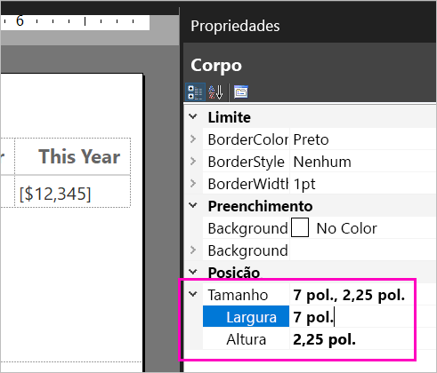

1. Selecione **Executar** para pré-visualizar o seu relatório e garantir que eliminou as páginas em branco. Este relatório tem apenas 26 páginas, em vez das 54 iniciais. Sucesso!

    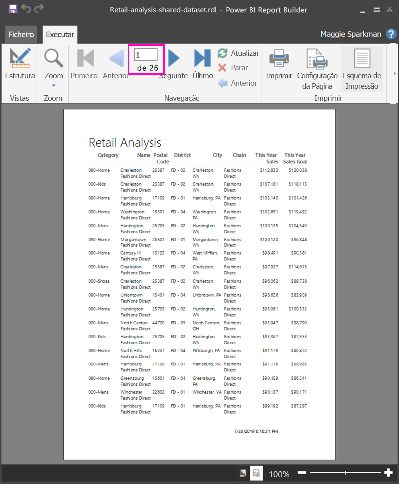

## Limitações e considerações 

- Para conjuntos de dados que utilizam uma Ligação em Direto ao Analysis Services, pode ligar diretamente ao utilizar a ligação subjacente do Analysis Services em vez de um conjunto de dados partilhado.
- Se quiser utilizar um conjunto de dados do Power BI que utiliza o DirectQuery no Power BI Report Builder, o conjunto de dados deverá incluir uma medida, mesmo que não queira revelar a medida no relatório. Sem a medida, o conjunto de dados não devolverá os resultados dos dados apropriados.
- Os conjuntos de dados com recomendações certificadas ou promovidas aparecem na lista de conjuntos de dados disponíveis, mas não são marcados como tal. 
- Não pode incorporar relatórios paginados baseados em conjuntos de dados partilhados do Power BI no cenário "Os Dados Pertencem à Aplicação".

## Próximos passos

- [O que são relatórios paginados no Power BI Premium?](paginated-reports-report-builder-power-bi.md)
