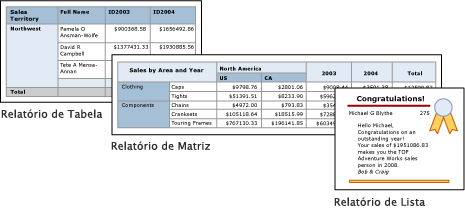

# Tabelas, matrizes e listas no Report Builder do Power BI
 No Report Builder, as tabelas, matrizes e listas são *regiões de dados* que apresentam dados de relatórios paginados em células organizadas em linhas e colunas. As células geralmente incluem dados, como texto, datas e números, mas também podem incluir medidores, gráficos ou itens de relatório, como imagens. Coletivamente, as tabelas, matrizes e listas são muitas vezes designadas de regiões de dados *tablix*.  
  
 Os modelos de tabelas, matrizes e listas são incorporados na região de dados tablix, que é uma grelha flexível que pode apresentar dados em células. Nos modelos de tabelas e matrizes, as células são organizadas em linhas e colunas. Dado que os modelos são variações da região de dados tablix genérica subjacente, pode apresentar dados ao combinar formatos de modelos e alterar a tabela, matriz ou lista para incluir as funcionalidades de outra região de dados à medida que desenvolve o seu relatório. Por exemplo, se adicionar uma tabela e verificar que não se adequa às suas necessidades, pode adicionar grupos de colunas para transformar a tabela numa matriz.  
  
 As regiões de dados em matriz e em tabela podem apresentar relações de dados complexas ao incluir tabelas aninhadas, matrizes, listas, gráficos e medidores. As tabelas e matrizes têm um esquema tabular e os respetivos dados são provenientes de um único conjunto de dados, baseado numa única origem de dados. A principal diferença entre tabelas e matrizes reside no facto de as tabelas poderem incluir apenas grupos de linhas, enquanto as matrizes podem incluir grupos de linhas e grupos de colunas.  
  
 O caso das listas é um pouco diferente. Suportam um esquema livre que pode incluir múltiplas tabelas ou matrizes, cada uma proveniente de um conjunto de dados diferente. As listas podem ser utilizadas para formulários, como faturas.  
  
 As seguintes imagens mostram relatórios simples com uma tabela, matriz ou lista.  

  
##   Tabelas  
 Utilize uma tabela para apresentar dados detalhados, organizar os dados em grupos de linhas ou ambos. O modelo de Tabela inclui três colunas com uma linha de cabeçalho da tabela e uma linha de detalhes para dados. A seguinte imagem mostra o modelo de tabela inicial, selecionado na superfície da estrutura:  

  
 Pode agrupar dados por um único campo, por múltiplos campos ou ao escrever a sua própria expressão. Pode criar grupos aninhados ou grupos adjacentes independentes e apresentar valores agregados para dados agrupados, ou adicionar valores totais a grupos. Por exemplo, se a sua tabela tiver um grupo de linhas denominado **Categoria**, pode adicionar um subtotal para cada grupo, bem como um total geral para o relatório. Para melhorar o aspeto da tabela e realçar dados importantes, pode intercalar células e aplicar formatação a cabeçalhos de tabelas e dados.  
  
 Inicialmente, pode ocultar dados agrupados ou detalhados e incluir botões de alternar de desagregação para permitir que os utilizadores selecionem a quantidade de dados a apresentar de forma interativa.  
  
##   Matrizes  
 Utilize uma matriz para apresentar resumos de dados agregados, agrupados em linhas e colunas, de forma semelhante a uma tabela dinâmica ou referência cruzada. O número de linhas e colunas para grupos é determinado pelo número de valores exclusivos para cada grupo de linhas e colunas. A seguinte imagem mostra o modelo de matriz inicial, selecionado na superfície da estrutura:  

 
 Pode agrupar os dados por múltiplos campos ou expressões em grupos de linhas e colunas. Durante a execução, quando os dados do relatório são combinados com as regiões de dados, uma matriz é expandida na horizontal e na vertical na página, à medida que são adicionadas colunas aos grupos de colunas e linhas aos grupos de linhas. As células de matriz apresentam valores agregados com âmbito definido para a interseção dos grupos de linhas e colunas aos quais a célula pertence. Por exemplo, se a sua matriz tiver um grupo de linhas (Categoria) e dois grupos de colunas (Território e Ano) que apresentem a soma das vendas, o relatório apresenta duas células com somas das vendas para cada valor no grupo Categoria. O âmbito das células e as duas interseções são: Categoria e Território; Categoria e Ano. A matriz pode incluir grupos adjacentes e aninhados. Os grupos aninhados têm uma relação principal-subordinado e os grupos adjacentes têm uma relação entre elementos. Pode adicionar subtotais a todos os níveis de grupos de colunas e linhas aninhados na matriz.  
  
 Para facilitar a leitura dos dados da matriz e realçar dados importantes, pode intercalar células ou dividi-las na horizontal ou na vertical, bem como aplicar formatação a cabeçalhos de grupos e dados.  
  
 Também pode incluir botões de alternar de desagregação que ocultam inicialmente os dados detalhados. Em seguida, o utilizador pode clicar nos botões para apresentar mais ou menos detalhes, conforme necessário.  
  
##   Listas  
 Utilize uma lista para criar um esquema de forma livre. Não está restringido a um esquema de grelha, mas pode colocar campos livremente dentro da lista. Pode utilizar uma lista para estruturar um formulário e apresentar vários campos de conjuntos de dados ou utilizar uma lista como contentor e apresentar múltiplas regiões de dados lado a lado para dados agrupados. Por exemplo, pode definir um grupo para uma lista; adicionar uma tabela, gráfico e imagem; e apresentar valores numa tabela e gráfico para cada valor de grupo, como faria para o registo de um paciente ou colaborador.  

  
##   Preparar dados  
 As regiões de dados de tabelas, matrizes e listas apresentam dados de um conjunto de dados. Pode preparar os dados na consulta que obtém os dados para o conjunto de dados ou definir as propriedades na tabela, matriz ou lista.  
  
 As linguagens de consulta, como o Transact-SQL, que utiliza para obter os dados para conjuntos de dados de relatórios, podem preparar os dados ao aplicar filtros para incluir apenas um subconjunto dos dados, substituindo valores nulos ou em branco pelas constantes que facilitam a leitura do relatório, bem como ordenar e agrupar dados.  
  
 Se optar por preparar os dados na região de dados da tabela, matriz ou lista de um relatório, defina as propriedades na região de dados ou nas células da região de dados. Se quiser filtrar ou ordenar os dados, defina as propriedades na região de dados. Por exemplo, para ordenar os dados, especifique as colunas nas quais pretende ordenar e a direção de ordenação. Se quiser indicar um valor alternativo para um campo, defina os valores do texto da célula que apresenta o campo. Por exemplo, para apresentar Em Branco quando um campo estiver vazio ou nulo, utilize uma expressão para definir o valor.  
  
##   Criar e configurar uma tabela, matriz ou lista  
 Ao adicionar tabelas ou matrizes ao seu relatório, pode utilizar o Assistente de Tabelas e Matrizes ou criá-las manualmente a partir dos modelos fornecidos pelo Report Builder. As listas são criadas manualmente a partir do modelo de lista.  
  
 O assistente orienta-o durante os passos para criar e configurar rapidamente uma tabela ou matriz. Quando concluir o assistente ou se criar as regiões de dados tablix de raiz, poderá configurar e refiná-las ainda mais. As caixas de diálogo (disponíveis através dos menus de contexto nas regiões de dados) facilitam a definição das propriedades mais utilizadas para quebras de página, repetição e visibilidade de cabeçalhos e rodapés, opções de apresentação, filtros e ordenação. Porém, a região de dados tablix disponibiliza diversas propriedades adicionais, que só podem ser configuradas no painel Propriedades do Report Builder. Por exemplo, se quiser apresentar uma mensagem quando o conjunto de dados de uma tabela, matriz ou lista estiver vazio, especifique o texto da mensagem na propriedade de tablix NoRowsMessage, no painel Propriedades.  
  
##   Alternar entre modelos de tablix  
 Não está restringido ao modelo de tablix que escolher inicialmente. À medida que adicionar grupos, totais e etiquetas, poderá querer modificar a estrutura da sua tablix. Por exemplo, pode começar com uma tabela e, em seguida, eliminar a linha de detalhes e adicionar grupos de colunas.  
  
 Pode continuar a desenvolver uma tabela, matriz ou lista ao adicionar uma funcionalidade de tablix. As funcionalidades de tablix incluem a apresentação de agregados ou dados detalhados para dados agrupados em linhas e colunas. Pode criar grupos aninhados, grupos adjacentes independentes ou grupos recursivos. Pode filtrar e ordenar dados agrupados, bem como combinar facilmente grupos ao incluir múltiplas expressões de grupo numa definição de grupo.  
  
 Também pode adicionar totais a um grupo ou totais gerais à região de dados. De forma a simplificar um relatório e permitir que o utilizador mostre ou oculte os dados (como num relatório de desagregação), pode ainda ocultar linhas ou colunas. 

## Próximos passos

- [O que são relatórios paginados no Power BI Premium?](paginated-reports-report-builder-power-bi.md)
