# Alterar o tamanho de uma página de relatório
No [artigo e vídeo anterior](power-bi-report-display-settings.md), aprendeu duas maneiras diferentes de controlar a apresentação de página nos relatórios do Power BI: **Ver** e **Tamanho da Página**. A Vista de Página e o Tamanho da Página estão disponíveis no serviço Power BI e no Power BI Desktop, e têm um aspeto e funcionalidade quase idênticos. Porém, para este tutorial vamos utilizar o serviço Power BI.

### Pré-requisitos
- Serviço Power BI   
- [Relatório de Exemplo de Análise de Revenda](sample-retail-analysis.md)

## Primeiro, vamos alterar a definição de Visualização da página

1. Abra o relatório na Vista de Leitura ou na Vista de Edição e selecione o separador de relatório **New Stores** (Lojas novas). Por predefinição, esta página do relatório é apresentada com a definição **Ajustar à Página**.  Neste caso, Ajustar à Página apresenta a página de relatório sem barras de deslocamento vertical, mas alguns dos detalhes e títulos são pequenos demais para leitura.

   
2. Certifique-se de que nenhuma visualização seja selecionada na tela. Selecione **Vista** e reveja as opções de apresentação.

    * Verá isto na vista de Leitura.

     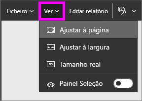
    * Verá isto na vista de Edição.

    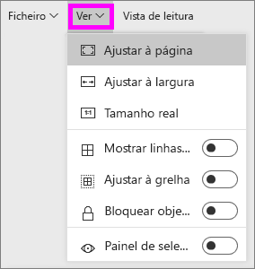

1. Vejamos qual o aspeto da página ao utilizar a definição **Tamanho real**.

   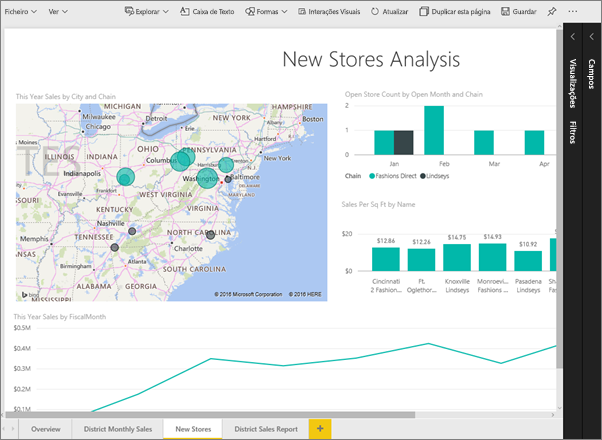

   Agora, o dashboard tem barras de deslocamento duplas, o que não é muito bom.
2. Alterne para **Ajustar à Largura**.

   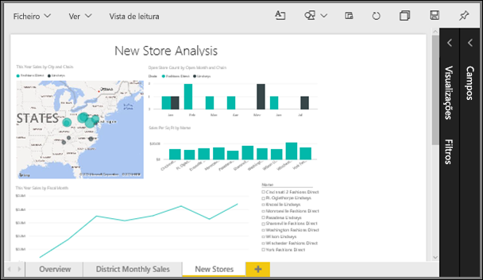

   Muito melhor. Agora temos barras de deslocamento vertical, mas é mais fácil ler os detalhes.

## Alterar a vista predefinida de uma página de relatório
Se for *criador* do relatório, pode alterar a vista predefinida para as páginas do relatório. Ao partilhar o relatório com outras pessoas, as páginas do relatório irão abrir com a vista que tiver definido. Os *consumidores* do relatório poderão alterar a vista, mas não conseguirão guardar as alterações depois de saírem do relatório.

1. Na página **New stores** (Lojas novas) do relatório, regresse à vista **Tamanho real**.

   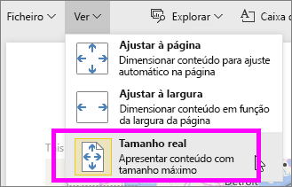

2. Na página do relatório **District Monthly Sales** (Vendas mensais de distrito), defina Vista como **Ajustar à largura**.

3. Na página do relatório **Descrição geral**, deixe a predefinição de Vista.

4. Agora, guarde o relatório, selecionando **Ficheiro > Guardar**. Da próxima vez que abrir este relatório, as páginas serão apresentadas com as novas definições de Vista. Vamos ver como fica.

   
3. Selecione o nome da área de trabalho atual na barra de navegação superior para regressar a essa área de trabalho.  

   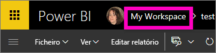
4. Selecione o separador **Relatórios** e escolha o mesmo relatório (Exemplo de Análise de Revenda).

    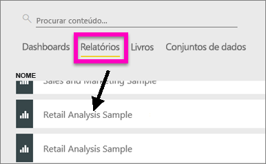
5. Abra cada uma das páginas do relatório para ver as novas definições.

   

## Agora, vamos explorar a definição *tamanho da página*
As definições de tamanho de página só estão disponíveis na [Vista de edição](service-interact-with-a-report-in-editing-view.md), pelo que tem de ter permissões de edição (*criador*) para o relatório para alterar as definições de tamanho de página. Se já se ligou a algum dos nossos [exemplos](sample-datasets.md), terá permissões de *criador* nesses relatórios.

1. Abra a página "District monthly sales" (Vendas mensais de distrito) do [Exemplo de Análise de Revenda](sample-retail-analysis.md) na Vista de Edição.
2. Certifique-se de que nenhuma visualização seja selecionada na tela.  No painel **Visualizações**, selecione o ícone do rolo de pintura .
3. Selecione **Tamanho da página** &gt; **Tipo** para ver as opções de tamanho da página.

   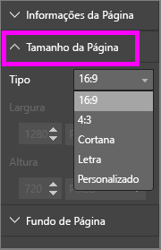
4. Selecione **Letra**.  Na tela, apenas o conteúdo que se encaixa em 816 x 1056 pixels (tamanho de Carta) permanecerá na parte branca da tela.

   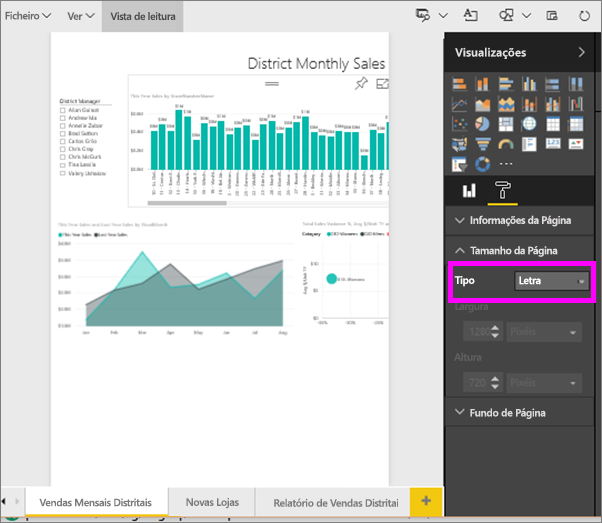
5. Selecione **Tamanho da página** proporção **16:9**.

   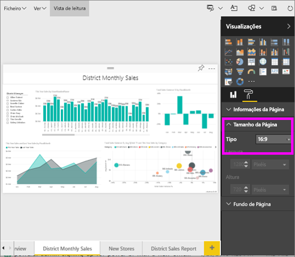

   A página de relatório é apresentada com uma proporção de 16 de largura por 9 de altura. Para ver o tamanho de pixel real que está a ser utilizado, observe os campos de largura e altura acinzentados (1280x720). Há muito espaço vazio à volta da tela de relatório, uma vez que **Vista** foi predefinido como "Ajustar à Largura".
7. Continue a explorar as opções de **Tamanho da Página**.

## Utilizar a Vista de página e o Tamanho da Página em conjunto
Utilize a Vista de página e o Tamanho da Página em conjunto para criar um relatório que tenha o seu melhor aspeto quando partilhado com colegas ou incorporado noutra aplicação.

Neste exercício, vai criar uma página de relatório que será apresentada numa aplicação com espaço para 500 píxeis de largura e 750 píxeis de altura.

Lembre-se de que, no passo anterior, vimos que a nossa página de relatório tem atualmente 1280 de largura e 720 de altura. Sabemos portanto que precisamos de fazer bastante redimensionamento e reorganização para que todos os visuais fiquem ajustados.

1. Redimensione e mova os visuais para que consigam caber em menos de metade da área da tela.

    
2. Selecione **Tamanho da Página** &gt; **Personalizado**.
3. Defina a Largura como 500 e a Altura como 750.

    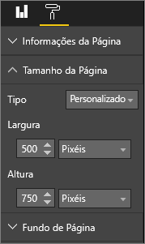
4. Otimize a página do relatório para que tenha o melhor aspeto possível. Alterne entre **Ver > Tamanho real** e **Ver > Ajustar à página** para fazer ajustes.

    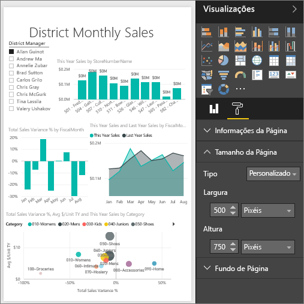

## Próximos passos
[Criar relatórios para a Cortana](service-cortana-answer-cards.md)

Voltar a [Configurações de apresentação de página num relatório do Power BI](power-bi-report-display-settings.md)

Mais perguntas? [Pergunte à Comunidade do Power BI](http://community.powerbi.com/)
