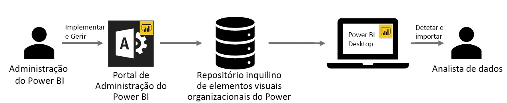

# Elementos visuais personalizados da organização no Power BI

Pode utilizar elementos visuais personalizados no Power BI para criar um tipo de elemento visual único adaptado a si. Os elementos visuais personalizados são criados pelos programadores e são, muitas vezes, criados quando os diversos elementos visuais que estão incluídos no Power BI não satisfazem as necessidades daqueles.

Em algumas organizações, os elementos visuais personalizados são ainda mais importantes – podem ser precisos para transmitir dados específicos ou informações exclusivas para a organização, podem ter requisitos especiais de dados ou podem realçar métodos de negócio privados. Tais organizações precisam de desenvolver elementos visuais personalizados e de os partilhar em toda a organização, pelo que garanta que estão corretamente mantidos. Os elementos visuais personalizados do Power BI permitem às organizações fazer isso mesmo.

A imagem seguinte mostra o processo pelo qual os elementos visuais personalizados organizacionais no Power BI são transmitidos do administrador, passando pelo desenvolvimento e manutenção, até chegarem ao analista de dados.

Os elementos visuais da organização são implementados e geridos pelo administrador do Power BI no Portal de administração. Depois de implementados no repositório organizacional, os utilizadores na organização podem facilmente descobri-los e importar os elementos visuais personalizados organizacionais para os relatórios diretamente a partir do Power BI Desktop.

Para saber mais sobre como utilizar os elementos visuais personalizados da organização nos relatórios que criou, veja o artigo: [Saber mais sobre como importar elementos visuais da organização para os seus relatórios](power-bi-custom-visuals.md).

## Administrar os elementos visuais personalizados organizacionais

Para saber mais sobre como administrar, implementar e gerir os elementos visuais personalizados da organização na sua organização, veja o artigo: [Saber mais sobre como implementar e gerir elementos visuais da organização](https://go.microsoft.com/fwlink/?linkid=866790).

> [!WARNING]
> Um elemento visual personalizado pode conter código com riscos de privacidade ou segurança. Garanta que confia no autor e na origem de qualquer elemento visual personalizado antes de o implementar no repositório da organização.

## Considerações e limitações

Existem várias considerações e limitações que deve ter em consideração.

Administrador:

* Os elementos visuais personalizados legados (por exemplo, os elementos visuais personalizados que não foram criados sobre as APIs da nova versão) não são suportados

* Se um elemento visual personalizado for eliminado do repositório, todos os relatórios existentes que utilizem o elemento visual eliminado deixarão de ser compostos. A operação de eliminação do repositório é irreversível. Para desativar temporariamente um elemento visual personalizado, utilize a funcionalidade “Desativar”.

Utilizador final:

* Os elementos visuais personalizados organizacionais são os elementos visuais privados importados do repositório da organização. À semelhança de qualquer elemento visual privado, não podem ser [exportados para o PowerPoint](https://docs.microsoft.com/power-bi/consumer/end-user-powerpoint) nem apresentados nos e-mails recebidos quando um utilizador [subscreve páginas de relatórios](https://docs.microsoft.com/power-bi/consumer/end-user-subscribe). Apenas os [elementos visuais personalizados certificados](https://docs.microsoft.com/power-bi/power-bi-custom-visuals-certified) importados diretamente do Marketplace suportam estas funcionalidades.

* Os elementos visuais do Visio, do PowerApps, do Mapbox e do GlobeMap do marketplace do AppSource não são compostos se forem implementados através do repositório da organização.

## Resolução de Problemas

Para obter mais informações sobre resoluções de problemas, aceda a [Troubleshooting your Power BI custom visuals](power-bi-custom-visuals-troubleshoot.md) (Resolver problemas com os elementos visuais personalizados do Power BI).

## PERGUNTAS FREQUENTES

Para obter mais informações e respostas a perguntas, aceda às [Perguntas frequentes sobre os elementos visuais personalizados do Power BI](power-bi-custom-visuals-faq.md#organizational-custom-visuals).

Mais perguntas? [Experimente a Comunidade do Power BI](http://community.powerbi.com/).
