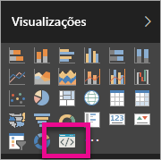

# Troubleshoot Power BI custom visuals (Resolver problemas com elementos visuais personalizados do Power BI)

## Debug

**Comando Pbiviz não encontrado (ou erros semelhantes)**

Ao executar `pbiviz` na linha de comandos do seu terminal, deverá ver o ecrã de ajuda. Caso contrário, o comando não está instalado corretamente. Certifique-se de que tem, pelo menos, a versão 4.0 do NodeJS instalada.

**Não é possível localizar o elemento visual de depuração no separador Visualizações**

O elemento visual de depuração é parecido com um ícone de linha de comandos no separador **Visualizações**.

Se não o vir, certifique-se de que está ativado nas definições do Power BI.

> [!NOTE]
> O elemento visual de depuração está apenas disponível no serviço Power BI e não no Power BI Desktop ou na aplicação móvel. O elemento visual vai continuar a funcionar por todo o lado.

**Não é possível contactar o servidor visual**

Execute o servidor do elemento visual com o comando `pbiviz start` na linha de comandos do seu terminal a partir da raiz do projeto do seu elemento visual. Se o servidor não estiver em execução, é provável que os seus certificados SSL não tenham sido instalados corretamente.

Não hesite em enviar perguntas, comentários ou comunicar problemas à equipa de suporte de elementos visuais personalizados para o endereço:  *pbicvsupport@microsoft.com*  .

## Próximos passos

Para obter mais informações, visite [Perguntas frequentes sobre os elementos visuais personalizados do Power BI](power-bi-custom-visuals-faq.md#organizational-custom-visuals).
