# Visuals in Power BI (Elementos visuais no Power BI)

Ao criar ou editar um relatório do Power BI, pode utilizar vários tipos diferentes de elementos visuais. Os ícones destes elementos visuais aparecem no painel **Visualizações**. Quando transfere o [Power BI Desktop](https://powerbi.microsoft.com/desktop/) ou abre o [serviço Power BI](https://app.powerbi.com), estes elementos visuais vêm pré-embalados.

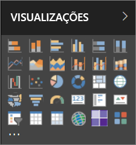

No entanto, não está limitado a este conjunto de elementos visuais. Se selecionar as reticências (...) na parte inferior, será disponibilizada outra origem de elementos visuais de relatórios – *os elementos visuais personalizados*.

Os programadores criam elementos visuais personalizados com o SDK de elementos visuais personalizados. Estes elementos visuais permitem que os utilizadores empresariais vejam os dados da forma mais adequada ao seu negócio. Em seguida, os autores do relatório podem importar os ficheiros dos elementos visuais personalizados para os relatórios e utilizá-los como quaisquer outros elementos visuais do Power BI. Os elementos visuais personalizados são cidadãos de primeira classe no Power BI e podem ser filtrados, realçados, editados, partilhados, etc.

Os elementos visuais personalizados são implementados de três formas:

* Ficheiros de elementos visuais personalizados
* Elementos visuais da organização
* Elementos visuais do Marketplace

## Ficheiros de elementos visuais personalizados

Os elementos visuais personalizados são pacotes que incluem código para compor os dados que lhes são enviados. Qualquer pessoa pode criar um elemento visual personalizado e criar um pacote do mesmo como um ficheiro `.pbiviz` único, que depois pode ser importado para um relatório do Power BI.

> [!WARNING]
> Um elemento visual personalizado pode conter código com riscos de privacidade ou segurança. Certifique-se de que confia no autor e na origem do elemento visual personalizado antes de o importar para o seu relatório.

## Elementos visuais da organização

Os administradores do Power BI aprovam e implementam elementos visuais personalizados na sua organização e os autores de relatórios podem detetar, atualizar e utilizá-los facilmente. Os administradores podem facilmente gerir (por exemplo, atualizar a versão ou ativar/desativar) estes elementos visuais.

 [Leia mais sobre os elementos visuais organizacionais](power-bi-custom-visuals-organization.md).

## Elementos visuais do Marketplace

Os membros da comunidade e a Microsoft contribuíram com os seus elementos visuais personalizados para o benefício público e publicaram-nos no marketplace do [AppSource](https://appsource.microsoft.com/marketplace/apps?product=power-bi-visuals). Pode transferir estes elementos visuais e adicioná-los aos seus relatórios do Power BI. A Microsoft testou e aprovou estes elementos visuais personalizados ao nível da funcionalidade e da qualidade.

O que é o [AppSource](developer/office-store.md)? É o local onde se encontram as aplicações, os suplementos e as extensões para o seu software da Microsoft. O AppSource liga milhões de utilizadores de produtos como o Office 365, Azure, Dynamics 365, Cortana e Power BI a soluções que os ajudam a trabalhar com mais eficácia, mais informações e melhores visuais.

### Elementos visuais certificados

Os elementos visuais certificados do Power BI são elementos visuais do marketplace que passaram em testes rigorosos adicionais ao nível da qualidade e são suportados em cenários adicionais, tais como as [subscrições de e-mails](service-report-subscribe.md) e a [exportação para o PowerPoint](service-publish-to-powerpoint.md).
Para ver a lista de visuais personalizados certificados ou para submeter o seu, consulte [Visuais personalizados certificados](power-bi-custom-visuals-certified.md).

É um programador Web e está interessado em criar as suas próprias visualizações e adicioná-las ao AppSource? Veja [Desenvolver um elemento visual personalizado do Power BI](developer/custom-visual-develop-tutorial.md) e saiba como [publicar elementos visuais personalizados no AppSource](developer/office-store.md).

### Importar um elemento visual personalizado de um ficheiro

1. Selecione as reticências na parte inferior do painel **Visualizações**.

    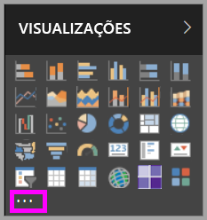

2. No menu pendente, selecione **Importar do ficheiro**.

    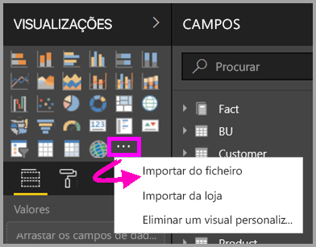

3. No menu **Abrir** ficheiro, selecione o ficheiro `.pbiviz` que pretende importar e, em seguida, selecione **Abrir**. O ícone do elemento visual personalizado é adicionado à parte inferior do painel **Visualizações** e fica agora disponível para utilizar no seu relatório.

    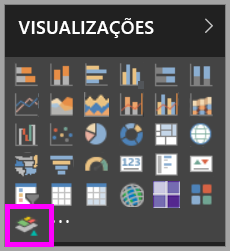

### Importar elementos visuais da organização

1. Selecione as reticências na parte inferior do painel **Visualizações**.

    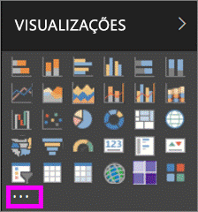

2. No menu pendente, selecione **Importar do marketplace**.

    

3. Selecione **A MINHA ORGANIZAÇÃO** no menu do separador superior.

    

4. Percorra a lista para encontrar o visual a importar.

    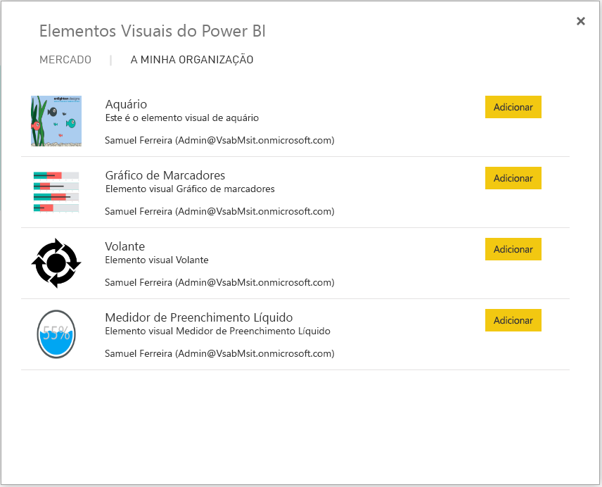

5. Selecione **Adicionar** para importar o elemento visual personalizado. O respetivo ícone é adicionado à parte inferior do painel **Visualizações** e fica agora disponível para utilizar no seu relatório.

    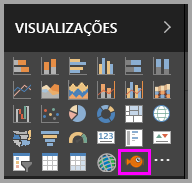

## Transferir ou importar visuais personalizados do Microsoft AppSource

Tem duas opções para transferir e importar elementos visuais personalizados: a partir do Power BI e a partir do [site do AppSource](https://appsource.microsoft.com/).

### Importar visuais personalizados do Power BI

1. Selecione as reticências na parte inferior do painel **Visualizações**.

    

2. No menu pendente, selecione **Importar do marketplace**.

    

3. Percorra a lista para encontrar o visual a importar.

    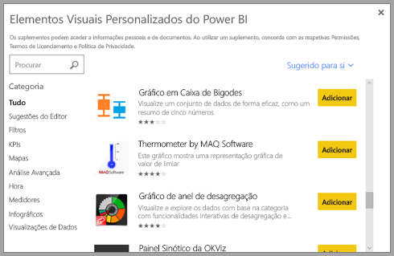

4. Para saber mais sobre um dos visuais, realce-o e selecione-o.

    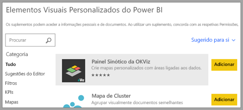

5. Na página de detalhes, pode ver capturas de ecrã, vídeos, descrições detalhadas e muito mais.

    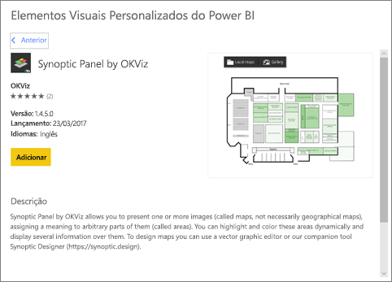

6. Desloque-se até à parte inferior para ver críticas.

    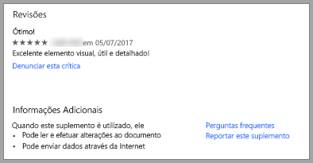

7. Selecione **Adicionar** para importar o elemento visual personalizado. O respetivo ícone é adicionado à parte inferior do painel **Visualizações** e fica agora disponível para utilizar no seu relatório.

    

### Transferir e importar visuais personalizados do Microsoft AppSource

1. Comece no [Microsoft AppSource](https://appsource.microsoft.com) e selecione o separador de **Aplicações**.

    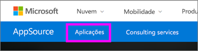

2. Aceda à [Página de resultados de aplicações](https://appsource.microsoft.com/marketplace/apps), onde pode ver as principais aplicações em cada categoria, incluindo *Aplicações do Power BI*. Como estamos à procura de elementos visuais personalizados, vamos selecionar **elementos visuais do Power BI** da lista de navegação à esquerda para filtrar os resultados.

    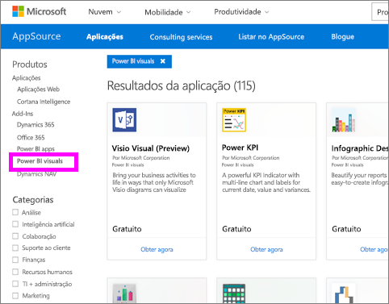

3. O AppSource mostra um mosaico para cada visual personalizado.  Cada mosaico tem um instantâneo de um elemento visual personalizado com uma breve descrição e uma ligação de transferência. Para ver mais detalhes, selecione o mosaico.

    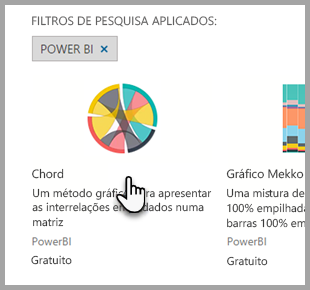

4. Na página de detalhes, pode ver capturas de ecrã, vídeos, descrições detalhadas e muito mais. Selecione **Obter agora** para transferir o elemento visual personalizado e, em seguida, aceite os Termos de Utilização.

    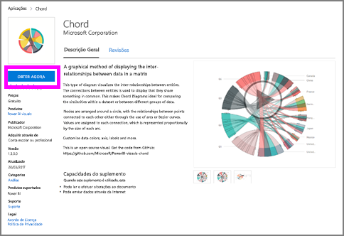

5. Selecione a ligação para transferir o visual personalizado.

    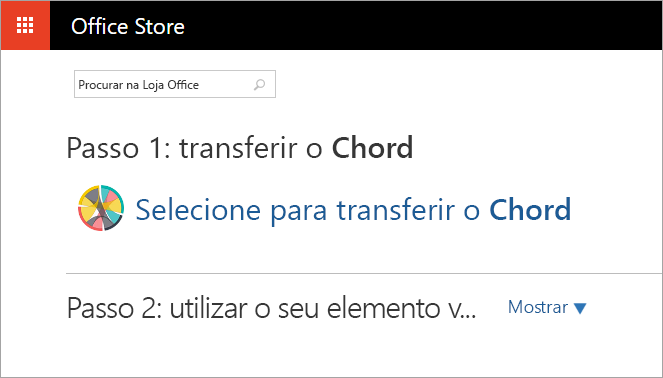

    A página de transferência também inclui instruções para importar o elemento visual personalizado para o Power BI Desktop e para o serviço Power BI.

    Pode também transferir um relatório de exemplo que inclui o elemento visual personalizado e demonstra as capacidades do mesmo.

    

6. Guarde o ficheiro `.pbiviz` e, em seguida, abra o Power BI.

7. Importe o ficheiro `.pbiviz` para o relatório. (Veja a secção [Importar um elemento visual personalizado de um ficheiro](#import-a-custom-visual-from-a-file) acima.)

## Considerações e limitações

* Um elemento visual personalizado é adicionado a um relatório específico, quando importado. Se pretender utilizar o elemento visual noutro relatório, terá de importá-lo também para esse relatório. Quando um relatório com um visual personalizado é guardado através da opção **Guardar Como**, uma cópia do visual personalizado será guardada com o novo relatório.

* Se o painel **Visualizações** não for apresentado, significa que não tem permissões de edição do relatório.  Só pode adicionar elementos visuais personalizados a relatórios que pode editar, não a relatórios que foram apenas partilhados consigo.

## Resolução de Problemas

Para resolver problemas, veja [Resolver problemas com os seus elementos visuais personalizados do Power BI](power-bi-custom-visuals-troubleshoot.md).

## PERGUNTAS FREQUENTES

Para obter mais informações e respostas a perguntas, aceda às [Perguntas frequentes sobre os elementos visuais personalizados do Power BI](power-bi-custom-visuals-faq.md#organizational-custom-visuals).

## Próximos passos

* [Visualizações em Relatórios do Power BI](visuals/power-bi-report-visualizations.md)

Mais perguntas? [Experimente a Comunidade do Power BI](http://community.powerbi.com/).
