# Fazer uma visita do painel Filtros
Este artigo analisa de forma aprofundada o painel Filtros de relatórios. Verá o painel na [Vista de Edição e Vista de Leitura do serviço Power BI](service-reading-view-and-editing-view.md) e na [Vista de Relatório do Power BI Desktop](desktop-report-view.md).

Existem diversas formas de filtrar dados no Power BI e recomendamos que comece por ler [Sobre os filtros e o realce](power-bi-reports-filters-and-highlighting.md).

## Trabalhar com o painel Filtros
No Power BI Desktop, os relatórios são abertos na Vista de Relatório. No serviço Power BI, os relatórios podem ser abertos na [Vista de Edição ou Vista de Leitura](service-reading-view-and-editing-view.md). Na Vista de Edição e na Vista de Relatório da versão Desktop, os proprietários de relatórios podem [adicionar filtros a um relatório](power-bi-report-add-filter.md) e esses filtros serão guardados com o relatório. As pessoas que veem o relatório na Vista de Leitura podem interagir com os filtros, mas não podem adicionar novos filtros ao relatório.

No serviço Power BI, os relatórios mantêm todas as alterações que fizer no painel Filtros e essas alterações transitam para a versão para dispositivos móveis do relatório. Para repor o painel Filtros para as predefinições do criador, selecione **Repor para predefinição** na barra de menus superior.     

## Abrir o painel Filtros
Quando um relatório está aberto, o painel Filtros é apresentado no lado direito da tela de relatórios. Se não vir o painel, selecione a seta no canto superior direito para expandi-la. Se estiver na Vista de Leitura do serviço Power BI, o único painel disponível no lado direito é o painel Filtros.

Neste exemplo selecionámos um visual com 6 filtros. A página de relatórios também tem filtros, listados no cabeçalho **Filtros de nível de página**. Há um [Filtro de pormenorização](power-bi-report-add-filter.md) e o relatório completo tem também um filtro: **FiscalYear** is 2013 or 2014 (Ano Fiscal é 2013 ou 2014).

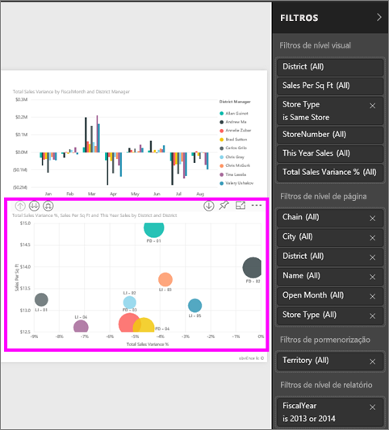

Alguns dos filtros têm a palavra **Tudo** junto aos mesmos, o que significa que todos os valores estão incluídos no filtro.  Por exemplo, na captura de ecrã abaixo, **Chain(All)** indica-nos que esta página de relatório inclui dados sobre todas as cadeias de lojas.  Por outro lado, o filtro ao nível de relatório de **FiscalYear is 2013 or 2014** indica que o relatório inclui apenas dados correspondentes aos anos fiscais de 2013 e 2014.

Qualquer pessoa a ver este relatório pode interagir com estes filtros.

* Veja os detalhes do filtro ao pairar o rato e selecionar a seta junto ao filtro.
  
   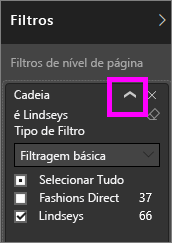
* Altere o filtro, por exemplo, altere **Lindseys** para **Fashions Direct**.
  
     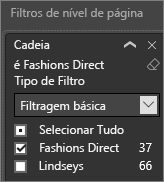

* Reponha os filtros para o seu estado original ao selecionar **Repor para predefinição** na barra de menus superior.    
    
    
* Elimine o filtro ao selecionar o **x** junto ao nome do filtro.
  
  Eliminar um filtro remove-o da lista, mas não elimina os dados do relatório.  Por exemplo, se eliminar **FiscalYear is 2013 or 2014** (Ano Fiscal é 2013 ou 2014), os dados do ano fiscal permanecerão no relatório, mas já não serão filtrados para mostrar apenas 2013 e 2014; irão mostrar todos os anos fiscais que os dados contêm.  No entanto, após eliminar o filtro, não poderá modificá-lo novamente, uma vez que foi removido da lista. Uma opção melhor é limpar o filtro ao selecionar o ícone da borracha .
  
  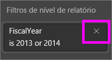

## Filtros na Vista de Edição
Quando um relatório está aberto na Vista do Desktop ou na Vista de Edição do serviço Power BI, o painel Filtros é apresentado no lado direito da tela de relatório na metade inferior do **painel Visualização**. Se não vir o painel, selecione a seta no canto superior direito para expandi-la.

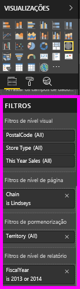.  

Se nenhum elemento visual for selecionado na tela, o painel Filtros mostrará apenas os filtros que se aplicam a toda página de relatórios e eventuais filtros de pormenorização (se tiverem sido definidos). No exemplo abaixo, nenhum visual é selecionado e não existem filtros de nível de página ou pormenorização, mas existe um filtro de nível de relatório.  

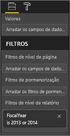  

Se um elemento visual for selecionado na tela, também verá os filtros que se aplicam apenas àquele elemento visual:   

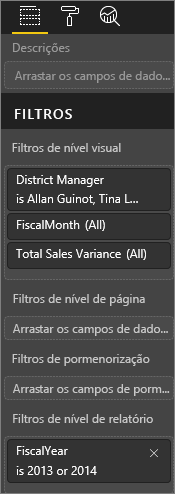

Para mostrar opções para um filtro específico, selecione a seta para baixo junto ao nome do filtro.  No exemplo abaixo, o filtro de nível de relatório está definido para 2013 e 2014. Este é um exemplo de **filtragem básica**.  Para mostrar as opções avançadas, selecione **Filtragem Avançada**.

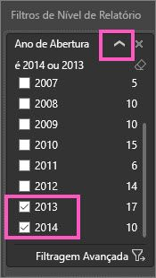

## Limpar um filtro
 No modo de filtragem avançado ou básico, selecione o ícone de borracha  para limpar o filtro. 

## Adicionar um filtro
* Na Vista de Edição do PowerBI Desktop e do serviço Power BI, adicione um filtro a um elemento visual, a uma página, a uma pormenorização ou a um relatório ao selecionar um campo do painel Campos e ao arrastá-lo para o well de filtro adequado, onde vê **Arrastar campos para aqui**. Após um campo ser adicionado como um filtro, ajuste-o através dos controlos de filtragem Básica e filtragem Avançada (descritos abaixo).

- **Arrastar um novo campo para a área de filtros de nível Visual não adiciona esse campo ao elemento visual**, mas permite-lhe filtrar o elemento visual com este novo campo. No exemplo abaixo, **Chain** (Cadeia) foi adicionado como um novo filtro para o visual. Repare que adicionar simplesmente **Chain** (Cadeia) como filtro não altera o visual até utilizar os controlos de filtragem Básica ou Avançada.

    

* Todos os campos que são utilizados para criar uma visualização também estão disponíveis como filtros. Primeiro, selecione um visual para torná-lo ativo. Os campos utilizados no visual estão listados no painel Visualizações e no painel Filtros, no cabeçalho **Filtros de nível visual**.
  
   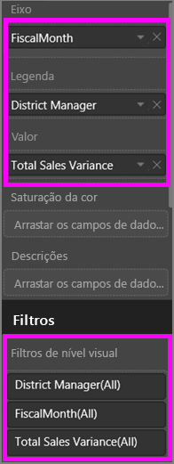  
  
   Ajuste estes campos através dos controlos de filtragem Básica e filtragem Avançada (descritos abaixo).

## Tipos de filtros: filtros de campo de texto
### Modo de lista
Marcar uma caixa de verificação ou seleciona ou deseleciona o valor. A caixa de verificação **Tudo** pode ser utilizada para ativar ou desativar o estado de todas as caixas de verificação. As caixas de verificação representam todos os valores disponíveis para esse campo.  À medida que ajusta o filtro, a reformulação é ajustada para refletir as suas escolhas. 

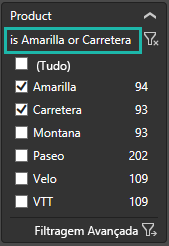

Observe como a reformulação agora diz "é Amarilla ou Carretera"

### Modo avançado
Selecione **Filtragem Avançada** para mudar para o modo avançado. Utilize os controlos de lista pendente e as caixas de texto para identificar quais campos serão incluídos. Ao escolher entre **And** (E) e **Or** (Ou), pode criar expressões de filtros complexas. Selecione o botão **Aplicar Filtro** quando tiver definido os valores pretendidos.  

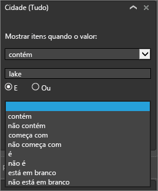

## Tipos de filtros: filtros de campo numérico
### Modo de lista
Se os valores forem finitos, selecionar o nome do campo apresenta uma lista.  Consulte **Filtros de campos de texto** &gt; **Modo de lista** acima para obter ajuda na utilização de caixas de verificação.   

### Modo avançado
Se os valores forem infinitos ou representarem um intervalo, selecionar o nome do campo abre o modo de filtro avançado. Utilize a lista pendente e as caixas de texto para especificar o intervalo de valores que pretende ver. 

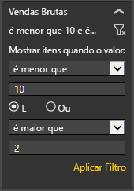

Ao escolher entre **And** (E) e **Or** (Ou), pode criar expressões de filtros complexas. Selecione o botão **Aplicar Filtro** quando tiver definido os valores pretendidos.

## Tipos de filtros: data e hora
### Modo de lista
Se os valores forem finitos, selecionar o nome do campo apresenta uma lista.  Consulte **Filtros de campos de texto** &gt; **Modo de lista** acima para obter ajuda na utilização de caixas de verificação.   

### Modo avançado
Se os valores de campo representarem a data ou hora, pode especificar uma hora de início/fim quando utilizar os filtros de Data/Hora.  

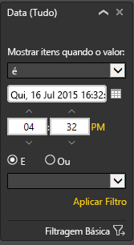

## Passos seguintes
[Filtros e realce nos relatórios](power-bi-reports-filters-and-highlighting.md)  
[Interagir com filtros e realce na Vista de Leitura de relatórios](service-reading-view-and-editing-view.md)  
[Criar filtros na Vista de Edição de relatórios](power-bi-report-add-filter.md)  
[Alterar como os elementos visuais de relatórios realizam filtragem cruzada e realce cruzado entre si](service-reports-visual-interactions.md)

Saiba mais sobre os [relatórios no Power BI](service-reports.md)  
[Power BI - Conceitos Básicos](service-basic-concepts.md)

Mais perguntas? [Pergunte à Comunidade do Power BI](http://community.powerbi.com/)

