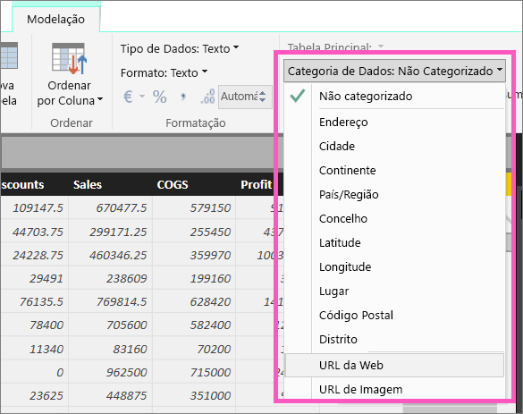
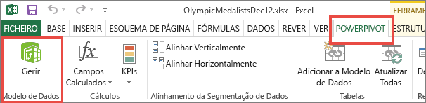
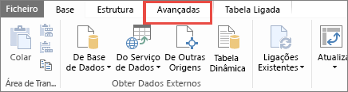
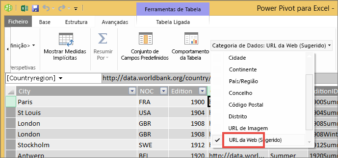

# Hiperligações em tabelas
Este tópico ensina a utilizar o Power BI Desktop para criar hiperligações. Depois de criado, utilize o Desktop ou o serviço Power BI para adicionar essas hiperligações às suas matrizes e tabelas de relatório. 

> **NOTA**: as hiperligações em [mosaicos nos dashboards](service-dashboard-edit-tile.md) e [caixas de texto nos dashboards](service-dashboard-add-widget.md) podem ser criadas no momento com o serviço Power BI. As hiperligações em [caixas de texto em relatórios](service-add-hyperlink-to-text-box.md) podem ser criadas no momento com o serviço Power BI e o Power BI Desktop.
> 
> 

## Criar uma hiperligação numa tabela ou matriz com o Power BI Desktop
As hiperligações em tabelas e matrizes podem ser criadas no Power BI Desktop, mas não a partir do serviço Power BI. Também é possível criar hiperligações no Excel Power Pivot antes que o livroseja importada para o Power BI. Ambos os métodos são descritos abaixo.

## Criar uma hiperligação de tabela ou matriz no Power BI Desktop
O procedimento para adicionar uma hiperligação depende de os dados terem sido importados ou de ter ligado aos mesmos com o DirectQuery. Ambos os cenários são descritos abaixo.

### Para dados importados para o Power BI
1. Se a hiperligação ainda não existir como um campo no seu conjunto de dados, utilize o Desktop para adicioná-la como uma [coluna personalizada](desktop-common-query-tasks.md).
2. Na vista de Dados, selecione a coluna e, no separador **Modelação**, escolha a lista pendente de **Categoria de Dados**.
   
    
3. Selecione **URL da Web**.
4. Mude para a vista de Relatório e crie uma tabela ou matriz com o campo categorizado como um URL da Web. As hiperligações estarão a azul e a sublinhado.
   
    
5. Se não quiser apresentar um URL longo numa tabela, pode apresentar, em alternativa, um ícone de hiperligação . Tenha em atenção que não é possível apresentar ícones em matrizes.
   
   * Selecione o gráfico para ativá-lo.
   * Selecione o ícone de rolo de pintura  para abrir o separador Formatação.
   * Expanda **Valores**, localize o **ícone de URL** e defina-o como **Ativo**.
6. (Opcional) [Publique o relatório do Desktop no serviço Power BI](guided-learning/publishingandsharing.yml#step-2) e abra o relatório no serviço Power BI. As hiperligações também funcionarão aí.

### Para dados ligados com DirectQuery
Não poderá criar uma nova coluna no modo DirectQuery.  Mas se os dados já contiverem URLs, pode transformá-los em hiperligações.

1. Na vista de Relatório, crie uma tabela com um campo que contenha URLs.
2. Selecione a coluna e, no separador **Modelação**, escolha a lista pendente de **Categoria de Dados**.
3. Selecione **URL da Web**. As hiperligações estarão a azul e a sublinhado.
4. (Opcional) [Publique o relatório do Desktop no serviço Power BI](guided-learning/publishingandsharing.yml#step-2) e abra o relatório no serviço Power BI. As hiperligações também funcionarão aí.

## Criar uma hiperligação de tabela ou matriz no Excel Power Pivot
Outra forma de adicionar hiperligações às tabelas e matrizes do Power BI é criar as hiperligações no conjunto de dados antes de importar/ligar a esse conjunto de dados a partir do Power BI. Este exemplo utiliza um livro do Excel.

1. Abra o livro no Excel.
2. Selecione o separador **PowerPivot** e, em seguida, escolha **Gerir**.
   
   
3. Quando o PowerPivot abrir, selecione o separador **Avançadas**.
   
   
4. Coloque o cursor na coluna que contém os URLs que deseja transformar em hiperligações nas tabelas do Power BI.
   
   > **NOTA**: O URLS tem de começar com **http:// , https://** ou **www**.
   > 
   > 
5. No grupo **Propriedades de Relatório**, selecione na lista pendente **Categoria de Dados** e escolha **URL da Web**. 
   
   
6. A partir do serviço Power BI ou do Power BI Desktop, ligue a este livro ou importe-o.
7. Crie uma visualização de tabela que contenha o campo URL.
   
   

## Considerações e resolução de problemas
P: Posso utilizar um URL personalizado como uma hiperligação numa tabela ou numa matriz?    
R: Não. Pode utilizar um ícone de ligação. Se necessitar de texto personalizado para as hiperligações e se a sua lista de URLs for pequena, considere utilizar antes uma caixa de texto.

## Próximos passos
[Visualizações em relatórios do Power BI](power-bi-report-visualizations.md)

[Power BI - Conceitos Básicos](service-basic-concepts.md)

Mais perguntas? [Pergunte à Comunidade do Power BI](http://community.powerbi.com/)

