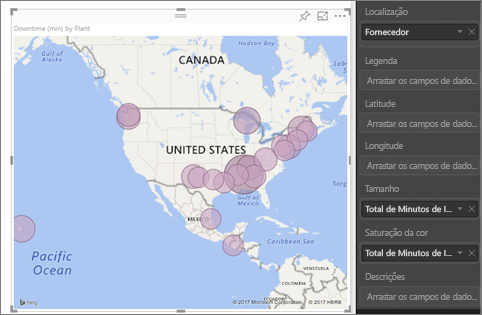
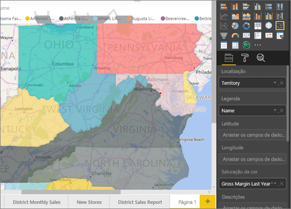
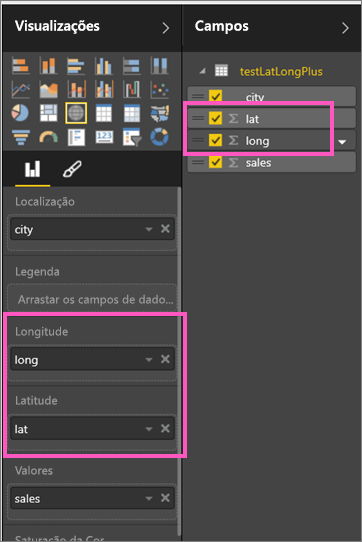
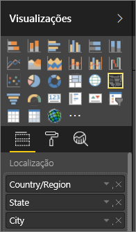

# Sugestões e Truques para visualizações de mapa do Power BI
O Power BI é integrado no Bing Maps para oferecer as coordenadas de mapa padrão (um processo chamado geocodificação), para que possa criar mapas. Em conjunto, utilizam algoritmos para identificar a localização correta, mas por vezes, é a melhor estimativa. Se as tentativas do Power BI não conseguirem criar a visualização de mapa por conta própria, ele pede ajuda ao Bing Maps.  

Para aumentar a probabilidade de uma geocodificação correta, utilize as seguintes dicas. O primeiro conjunto de sugestões é para utilizar, se tiver acesso ao próprio conjunto de dados. E o segundo conjunto de sugestões são coisas que pode fazer no Power BI, se não tiver acesso ao conjunto de dados.

## O que é enviado ao Bing Maps?
O serviço Power BI e o Power BI Desktop enviam ao Bing os dados geográficos precisos para criar a visualização do mapa. Isto pode incluir os dados nos registos de **Localização**, **Latitude** e **Longitude** e campos geográficos em quaisquer registos de filtro de **Nível do relatório**,  **Nível de página** ou **Nível de elemento visual**. Os dados exatos que são enviados variam consoante o tipo de mapa. Para saber mais, veja [Bing Maps privacy (Privacidade do Bing Maps)](https://go.microsoft.com/fwlink/?LinkID=248686).

* Para mapas (mapas de bolhas), se a latitude e a longitude forem indicadas, então não são enviados dados para o Bing. Caso contrário, quaisquer dados nos registos de Localização (e filtro) são enviados para o Bing.     
* Os mapas de manchas precisam de um campo no registo de Localização; mesmo se a latitude e a longitude forem indicadas. Quaisquer dados que estejam nos registos de Localização, Latitude ou Longitude são enviados para o Bing.
  
    No exemplo abaixo, o campo **Fornecedor** está a ser utilizado para geocodificação, para que todos os dados de fornecedor sejam enviados para o Bing. Os dados dos registos **Tamanho** e **Saturação da cor** não são enviados para o Bing.
  
    
  
    Neste segundo exemplo abaixo, o campo **Território** está a ser utilizado para geocodificação, para que todos os dados de fornecedor sejam enviados para o Bing. Os dados dos registos **Legenda** e **Saturação da cor** não são enviados para o Bing.
  
    

## No conjunto de dados: dicas para melhorar o conjunto de dados subjacente
Se tiver acesso ao conjunto de dados que está a ser utilizado para criar a visualização de mapa, existem algumas coisas que pode fazer para aumentar a probabilidade da geocodificação correta.

**1. Categorizar campos geográficos no Power BI Desktop**

No Power BI Desktop, pode assegurar que os campos são geocodificados corretamente ao definir a *Categoria de Dados* nos campos de dados. Selecione a tabela desejada, aceda ao friso **Avançado** e defina a **Categoria de Dados** como **Morada**, **Cidade**, **Continente**, **País/Região**, **Distrito**, **Código Postal**, **Estado** ou **Província**. Estas categorias de dados ajudam o Bing a codificar corretamente a data. Para saber mais, veja [Data categorization in Power BI Desktop (Categorização de dados no Power BI Desktop)](desktop-data-categorization.md). Se estiver a ligar em direto ao SQL Server Analysis Services, terá de definir a categorização de dados fora da utilização do Power BI [SQL Server Data Tools (SSDT)](https://docs.microsoft.com/sql/ssdt/download-sql-server-data-tools-ssdt).

**2. Utilize mais do que uma coluna de localização.**    
 Às vezes, até mesmo definir as categorias de dados de mapeamento não é suficiente para o Bing adivinhar corretamente a intenção. Algumas designações são ambíguas porque a localização existe em vários países ou regiões. Por exemplo, existe ***Southampton*** em Inglaterra, na Pennsylvania e em Nova Iorque.

O Power BI utiliza o [serviço de modelo de URL não estruturado](https://msdn.microsoft.com/library/ff701714.aspx) do Bing para obter as coordenadas de latitude e longitude, com base num conjunto de valores da morada para qualquer país. Se os dados não tiverem dados de localização suficientes, adicione essas colunas e categorize-as adequadamente.

 Por exemplo, se tiver apenas uma coluna de Cidade, o Bing pode ter dificuldade em geocodificar. Adicione colunas geográficas adicionais para tornar a localização inequívoca.  Por vezes, basta apenas adicionar mais uma coluna de localização ao conjunto de dados - neste caso, estado/província. E não se esqueça de a categorizar corretamente, veja o n.º 1 acima.

Certifique-se de que cada campo tem apenas informações específicas associadas à categorização.  Por exemplo, o campo de localização de Cidade deve ser **Southampton**, e não **Southampton, Nova Iorque**.  E os campos de localização de Morada devem ser **1 Microsoft Way**, e não **1 Microsoft Way, Redmond, WA**.

**3. Utilize Latitude e Longitude específicas**

Adicione os valores de latitude e longitude ao conjunto de dados. Isto remove qualquer ambiguidade e devolve resultados mais rapidamente. Os campos de Latitude e Longitude devem estar no formato *Número Decimal*, que pode ser definido no modelo de dados.

<iframe width="560" height="315" src="https://www.youtube.com/embed/ajTPGNpthcg" frameborder="0" allowfullscreen></iframe>

**4. Utilize a categoria de Local para colunas com informações de localização completa**

Apesar de o aconselharmos a utilizar geohierarquias nos seus mapas, se tiver de utilizar uma única coluna de localização com informações geográficas completas, pode definir a categorização de dados para **Local**. Por exemplo, se os dados na sua coluna forem moradas completas, como 1 Microsoft Way, Redmond Washington 98052, esta categoria de dados generalizados irá funcionar melhor com o Bing. 

## No Power BI: dicas para obter melhores resultados ao utilizar visualizações de mapa
**1. Utilize os campos de latitude e longitude (caso existam)**

No Power BI, se estiver a utilizar um conjunto de dados com campos de longitude e latitude – utilize-os!  O Power BI tem registos especiais para ajudar a tornar os dados de mapa inequívocos. Basta arrastar o campo que contém os dados de latitude para a área **Visualizações > Latitude**.  E faça o mesmo para os dados de longitude. Quando o fizer, também irá precisar de preencher o campo *Localização* ao criar as suas visualizações. Caso contrário, os dados são agregados por predefinição, por exemplo, a latitude e a longitude poderiam ser emparelhadas ao nível de estado, e não ao nível de cidade.

 

## Utilize geohierarquias, para que possa desagregar para "níveis" diferentes de localização
Quando o conjunto de dados já tiver diferentes níveis de dados de localização, tanto o utilizador como os seus colegas podem utilizar o Power BI para criar *geohierarquias*. Para fazê-lo, arraste mais de um campo para o registo **Localização**. Os campos utilizados em conjunto desta forma tornam-se uma geohierarquia. No exemplo abaixo, foram adicionados geocampos para: País/Região, Estado e Cidade. No Power BI, tanto o utilizador como os seus colegas podem agregar e desagregar com esta geohierarquia.

  

   

Ao explorar as geohierarquias, é importante saber como funciona cada botão de movimentação e o que é enviado para o Bing Maps. 

* O botão de movimentação na extremidade direita, chamado Modo de Movimentação , permite-lhe selecionar uma Localização de mapa e desagregar para essa localização específica, um nível de cada vez. Por exemplo, se Desagregar e clicar na América do Norte, avança para baixo para o próximo nível na hierarquia – estados na América do Norte. Para geocodificação, o Power BI envia dados do país e do estado para o Bing Maps apenas da América do Norte.  
* No lado esquerdo existem duas outras opções de movimentação. A primeira opção, , avança para o próximo nível da hierarquia para todas as localizações de uma só vez. Por exemplo, se está atualmente a visualizar os países e, em seguida, utiliza esta opção para mover para o próximo nível, os estados, o Power BI apresenta dados de estado de todos os países. Para geocodificação, o Power BI envia dados de estado do Bing Maps (sem dados de país) de todas as localizações. Esta opção é útil se cada nível da hierarquia não estiver relacionado com o nível acima. 
* A segunda opção,  , é semelhante a Desagregar, exceto não ter de clicar no mapa.  Este expande-se para o próximo nível da hierarquia, memorizando o contexto do nível atual. Por exemplo, se está atualmente a visualizar países e seleciona este ícone, avança para baixo na hierarquia para o próximo nível – estados. Para geocodificação, o Power BI envia dados para cada estado e o respetivo país, para ajudar o Bing Maps a geocodificar com mais exatidão. Na maioria dos mapas, irá utilizar esta opção ou a opção Desagregar na extremidade direita, para que possa enviar ao Bing o máximo de informações possíveis para obter informações sobre a localização exata. 

## Passos seguintes
[Desagregar numa visualização no Power BI](power-bi-visualization-drill-down.md)

[Visualizações do Power BI](power-bi-report-visualizations.md)

Mais perguntas? [Pergunte à Comunidade do Power BI](http://community.powerbi.com/)

