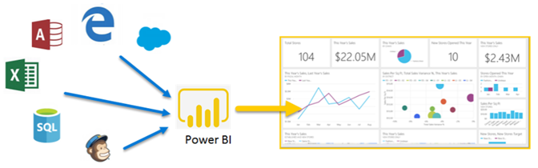
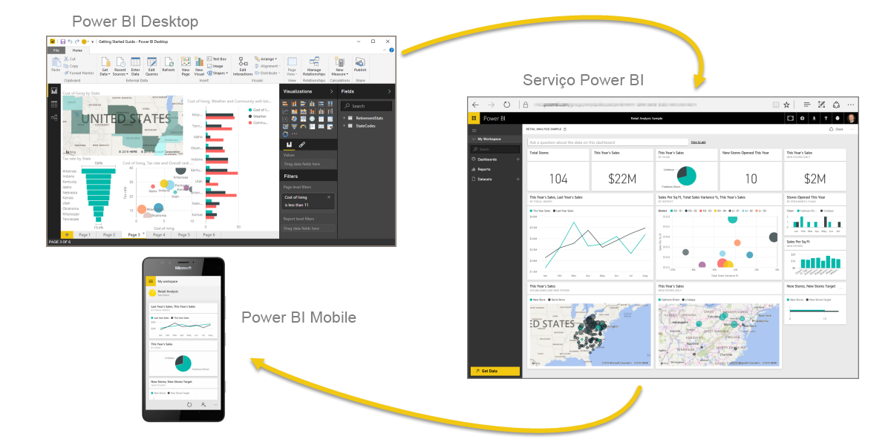
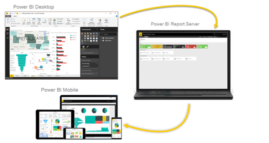

# O que é Power BI?
O **Power BI** é uma coleção de serviços de software, aplicações e conectores que funcionam em conjunto para transformar as origens de dados não relacionadas em informações coerentes, visualmente envolventes e interativas. Quer os seus dados sejam uma folha de cálculo do Excel simples ou uma coleção de armazéns de dados híbridos no local e baseados na cloud, o **Power BI** permite-lhe ligar facilmente às suas origens de dados, visualizar (ou detetar) o que é importante e partilhá-lo com qualquer pessoa ou com todas as pessoas que quiser.

O **Power BI** pode ser simples e rápido – com capacidade para criar informações rápidas a partir de uma folha de cálculo do Excel ou de uma base de dados local. No entanto, o **Power BI** também é robusto e de nível empresarial, está preparado para modelação extensa e análise em tempo real, bem como desenvolvimento personalizado. Por isso, pode ser a sua ferramenta pessoal de relatórios e visualização e também pode servir como o motor de decisão e análise por detrás de projetos de grupo, divisões ou empresas inteiras.

## As partes do Power BI
O Power BI é composto por uma aplicação de ambiente de trabalho do Windows chamada **Power BI Desktop**, um serviço SaaS online (*Software como um serviço*) denominado o **serviço Power BI**, e **aplicações** móveis do Power BI disponíveis em telemóveis e tablets Windows, bem como para dispositivos iOS e Android.

Estes três elementos – o **Desktop**, o **serviço** e o **Mobile** – foram concebidos para permitir que as pessoas criem, partilhem e consumam informações de negócio da forma mais eficaz para elas ou para a respetiva função.

## Como o Power BI corresponde à sua função
O modo de utilização do Power BI poderá depender da sua função num projeto ou numa equipa. Outras pessoas, noutras funções, poderão utilizar o Power BI de forma diferente, o que é normal.

Por exemplo, poderá utilizar principalmente o **serviço Power BI**, mas um dos seus colegas que cria relatórios empresariais com muitos cálculos matemáticos poderá fazer um uso extensivo do **Power BI Desktop** (e publicar relatórios do Desktop no serviço Power BI, que, em seguida, poderá ver). E outra das suas colegas, no departamento de vendas, poderá utilizar principalmente a aplicação do Power BI para telemóvel para monitorizar o progresso nas suas quotas de vendas e para explorar detalhes de novas oportunidades potenciais de vendas.

Caso seja programador, pode utilizar APIs do Power BI para emitir dados via push a conjuntos de dados ou incorporar dashboards e relatórios nas suas próprias aplicações personalizadas. Tem uma ideia para um novo elemento visual? Crie-o e partilhe-o com outras pessoas.  

Também poderá utilizar cada elemento do **Power BI** em alturas diferentes, consoante o que estiver a tentar obter ou consoante a sua função num determinado projeto ou esforço.

Talvez veja o inventário e o progresso de produção num dashboard em tempo real no serviço e utilize também o **Power BI Desktop** para criar relatórios para a sua própria equipa sobre estatísticas de envolvimento do cliente. A forma como utiliza o Power BI pode basear-se na funcionalidade ou serviço do Power BI que é a melhor ferramenta para a sua situação – mas cada parte do Power BI está disponível para si e é por essa razão que é tão flexível e convincente.

Para explorar os documentos que dizem respeito à sua função:
- Power BI para [***designers***](desktop-what-is-desktop.md)
- Power BI para [***consumidores***](consumer/end-user-consumer.md)
- Power BI para [***programadores***](developer/what-can-you-do.md)
- Power BI para [***administradores***](service-admin-administering-power-bi-in-your-organization.md)

## O fluxo de trabalho no Power BI
Um fluxo de trabalho comum no Power BI começa pela ligação a origens de dados e pela criação de um relatório no **Power BI Desktop**. Em seguida, esse relatório é publicado do **Desktop** para o **serviço Power BI** e partilhado para que os utilizadores no **serviço** e no **Mobile** podem *consumir* (ver e interagir com) o relatório.
Por vezes, poderá querer conceder aos colegas permissões semelhantes às suas (permissões de *criador*), para que possam utilizar o **serviço** para editar relatórios, criar dashboards e também partilhar o trabalho deles.

Nem sempre acontece desta forma, embora este seja um dos fluxos de trabalho mais comuns, e mostra como os três elementos principais do Power BI se complementam entre eles.

E se não estiver preparado para passar para a cloud e quiser manter os seus relatórios atrás de uma firewall de empresa?  Continue a ler.

## Relatórios no local com o Power BI Report Server
Crie, implemente e gira relatórios paginados, móveis e do Power BI no local com um conjunto de ferramentas e serviços prontos a utilizar, proporcionados pelo Power BI Report Server.

O Power BI Report Server é uma solução que o utilizador implementa por trás da firewall e que, em seguida, fornece os seus relatórios aos utilizadores corretos de várias formas, sejam elas através da visualização num browser, num dispositivo móvel ou como uma mensagem de e-mail. E, porque o Power BI Report Server é compatível com o Power BI na cloud, pode passar para a cloud quando estiver preparado.

## Próximos passos
[Sign in, get some data, and learn your way around Power BI service](service-the-new-power-bi-experience.md)  (Iniciar sessão, obter alguns dados e saber como utilizar o serviço Power BI)  
[Tutorial: Introdução ao serviço Power BI](service-get-started.md)
