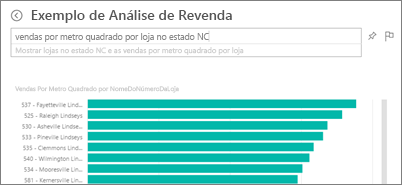
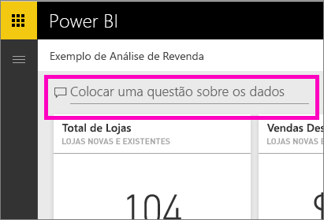
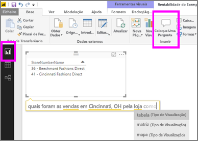

# Perguntas e Respostas no serviço Power BI e no Power BI Desktop
## O que são as Perguntas e Respostas?
Às vezes, a maneira mais rápida de obter uma resposta dos seus dados é fazer uma pergunta em linguagem natural. Por exemplo, "qual foi o total de vendas no ano passado".  Utilize as Perguntas e Respostas para explorar os seus dados com recursos intuitivos em linguagem natural e receba as respostas na forma de quadros e gráficos. As Perguntas e Respostas são diferentes de um motor de busca -- as Perguntas e Respostas fornecem apenas resultados relativos aos dados no Power BI.

Este artigo é o ponto de partida para todos os aspetos das Perguntas e Respostas. Selecione uma ligação abaixo para saber como funcionam as Perguntas e Respostas no serviço Power BI (dashboards e relatórios), no Power BI Desktop (relatórios), no Power BI Embedded e no Power BI mobile.  

A pergunta é apenas o início.  Divirta-se viajando pelos seus dados, refinando ou ampliando a sua pergunta, revelando informações novas e fiáveis, concentrando-se em detalhes e diminuindo o zoom para uma visão mais ampla. Vai ficar encantado com as informações obtidas e as descobertas.

A experiência é verdadeiramente interativa... e rápida! Com tecnologia de armazenamento dentro da memória, a resposta é praticamente instantânea.

##  Perguntas e Respostas para *consumidores*
Quando um colega partilha um dashboard consigo, encontrará a caixa de pergunta de Perguntas e Respostas no dashboard do serviço Power BI (app.powerbi.com), na parte inferior do dashboard no Power BI mobile e acima da visualização no Power BI Embedded. A menos que o proprietário lhe tenha dado permissões de edição, poderá utilizar as Perguntas e Respostas para explorar dados, mas não conseguirá guardar quaisquer visualizações criadas com as Perguntas e Respostas.

## Perguntas e Respostas para *criadores*
Se for *criador* de relatórios do Power BI ou tiver permissões de edição para um conjunto de dados, encontrará a caixa de pergunta de Perguntas e Respostas no dashboard do serviço Power BI e em cada página de relatório no serviço Power BI e no Power BI Desktop. Qualquer visualização que criar com as Perguntas e Respostas pode ser guardada num dashboard e num relatório.

Para além de utilizar as Perguntas e Respostas para explorar os respetivos dados, os criadores e proprietários de conjuntos de dados podem melhorar a experiência de Perguntas e Respostas para os consumidores ao [modificar os respetivos conjuntos de dados](service-prepare-data-for-q-and-a.md), adicionar [perguntas em destaque](service-q-and-a-create-featured-questions.md) e [ativar e desativar as Perguntas e Respostas ](service-q-and-a-direct-query.md) para conjuntos de dados de ligação em direto no local. Em [cenários do Embedded](developer/qanda.md), os programadores podem escolher entre dois modos: **interativo** e **apenas resultados**.

## Como é que o P e R sabe como responder às perguntas?
### Que conjuntos de dados o P e R utiliza?
Como é que o P e R sabe como responder a perguntas sobre dados específicos? Baseia-se nos nomes das tabelas, colunas e campos calculados nos conjuntos de dados subjacentes. Portanto, é importante que o utilizador (ou o proprietário do conjunto de dados) nomeie as coisas da melhor forma!

Por exemplo, suponha que teve uma tabela do Excel como o nome "Vendas", com colunas intituladas "Produto", "Mês", "Unidades Vendidas", "Vendas Brutas" e "Lucro". Pode fazer perguntas sobre qualquer uma dessas entidades.  Pode perguntar "mostrar *vendas*, "lucro *total* por *mês*", "ordenar *produtos* por *unidades vendidas*", etc.

O Q e R pode responder a perguntas com base em como o conjunto de dados é organizado. Como funciona para dados no Salesforce? Quando se ligar à sua conta do salesforce.com, o Power BI gera automaticamente um dashboard.  Antes de começar a fazer perguntas com o P e R, veja os dados apresentados nas visualizações do dashboard e nos dados apresentados no menu suspenso do P e R.

* Se os valores e as etiquetas do eixo das visualizações incluírem "vendas", "conta", "mês" e "oportunidades", pode fazer perguntas como: "que *conta* tem a *oportunidade* mais alta" ou "mostrar *vendas* por mês como um gráfico de barras".
* Se a lista pendente incluir "vendedor", "estado" e "ano", pode fazer perguntas como: "que *vendedor* teve as *vendas* mais baixas na *Florida* em *2013*".

Se tiver dados de desempenho do site no Google Analytics, pode perguntar ao P e R sobre o tempo gasto numa página Web, o número de visitas à página exclusivo e taxas de envolvimento do utilizador. Ou, se estiver a consultar dados demográficos, pode fazer perguntas sobre a idade e a renda doméstica por local.

### Que visualização o P e R utiliza?
O P e R escolhe a melhor visualização com base nos dados que são apresentados. Às vezes, os dados nos conjuntos de dados subjacentes são definidos como um determinado tipo ou categoria, o que ajuda o P e R a saber como apresentá-los. Por exemplo, se os dados são definidos como um tipo de data, é mais provável que sejam apresentados como um gráfico de linhas. Os dados que são categorizados como uma cidade são mais prováveis de serem apresentados como um mapa.

Também pode informar ao P e R a visualização que será utilizada ao adicioná-la à sua pergunta. Mas tenha em mente que não será sempre possível apresentar os dados no tipo de visualização que pediu.

Para obter informações sobre as palavras-chave reconhecidas pelas Perguntas e Respostas, veja [Sugestões para fazer perguntas](service-q-and-a-tips.md).

## Para obter mais detalhes sobre perguntas e respostas do Power BI
[Descrição geral: como utilizar as Perguntas e Respostas em dashboards e relatórios do Power BI](power-bi-tutorial-q-and-a.md): instruções passo a passo para utilizar as Perguntas e Respostas e uma descrição geral de como tudo funciona.

[Aplicação móvel do Microsoft Power BI](mobile-apps-ios-qna.md) Para iOS em iPads, iPhones e dispositivos iPod Touch.

[Microsoft Power BI Embedded](developer/qanda.md) Incorporar as Perguntas e Respostas numa aplicação.

[Dicas para fazer perguntas nas perguntas e respostas](service-q-and-a-tips.md): saiba como comunicar com as perguntas e respostas para obter os melhores resultados possíveis.

[Adicionar perguntas em destaque aos conjuntos de dados](service-q-and-a-create-featured-questions.md) e as perguntas e respostas sugerirão essas perguntas aos colegas.

[Ativar as Perguntas e Respostas para os conjuntos de dados no local](service-q-and-a-direct-query.md) Se precisar de um gateway para ligar ao conjunto de dados, utilize as definições do Power BI para ativar e desativar as Perguntas e Respostas.

[Tutorial: utilizar as Perguntas e Respostas com o exemplo de Vendas a Retalho no serviço Power BI](power-bi-visualization-introduction-to-q-and-a.md): utilize as Perguntas e Respostas num tutorial realista em relação ao setor.

[Faça com que os dados funcionem bem com as perguntas e respostas](service-prepare-data-for-q-and-a.md): é a pessoa que cria conjuntos de dados e modelos de dados?  Então este tópico é para si.

Mais perguntas? [Pergunte à Comunidade do Power BI](http://community.powerbi.com/)
