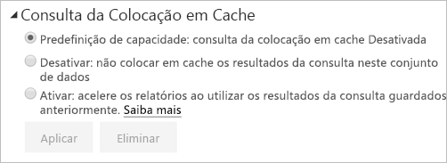

# Colocação em cache de consultas no Power BI Premium/Embedded

As organizações com o Power BI Premium ou Power BI Embedded podem tirar partido da *colocação em cache de consultas* para acelerar os relatórios associados a um conjunto de dados. A colocação em cache de consultas dá instruções à capacidade Premium/Embedded para utilizar o serviço de colocação em cache local para manter os resultados de consulta, evitando que a origem de dados subjacente efetue a computação desses resultados.

> [!IMPORTANT]
> A colocação em cache de consultas só está disponível no Power BI Premium ou no Power BI Embedded. Não se aplica a conjuntos de dados do Live Connect que tirem partido do Azure Analysis Services ou do SQL Server Analysis Services.

Os resultados de consultas em cache são específicos do contexto do utilizador e conjunto de dados e respeitam sempre as regra de segurança. Neste momento, o serviço só efetua a colocação em cache de consultas da página inicial à qual aceder. Ou seja, as consultas não são colocadas em cache quando interagir com o relatório. A cache de consulta respeita os [marcadores pessoais](consumer/end-user-bookmarks.md#personal-bookmarks) e os [filtros persistentes](https://powerbi.microsoft.com/blog/announcing-persistent-filters-in-the-service/), pelo que as consultas geradas por um relatório personalizado serão colocadas em cache. Os [mosaicos do dashboard](service-dashboard-tiles.md) que são alimentados pelas mesmas consultas também beneficiam da colocação em cache da consulta. O desempenho é particularmente otimizado quando um conjunto de dados é acedido com frequência e não precisa de ser atualizado muitas vezes. A colocação em cache de consultas também pode reduzir a carga na sua capacidade Premium/Embedded ao reduzir o número geral de consultas.

Pode controlar o comportamento da colocação em cache de consultas na página **Definições** do conjunto de dados no serviço Power BI. Existem três definições possíveis:

- **Capacidade predefinida**: colocação de consultas em cache desligada
- **Inativa**: não utilizar a colocação em cache da consulta para este conjunto de dados.
- **Ativa**: utilizar a colocação em cache da consulta para este conjunto de dados.

    

## Considerações e limitações

- Ao alterar as definições de colocação em cache de **Ativa** para **Inativa**, todos os resultados da consulta guardados anteriormente para o conjunto de dados serão removidos da cache da capacidade. Pode desativar explicitamente a colocação em cache ou revertê-la para a predefinição de capacidade que um administrador tenha definido como **Inativa**. A desativação pode provocar um pequeno atraso na próxima vez que um relatório executar consultas neste conjunto de dados. O atraso é causado pelas consultas de relatório executadas a pedido que não estejam a tirar partido dos resultados guardados. Além disso, o conjunto de dados necessário poderá ter de ser carregado na memória antes de poder responder a consultas.
- Quando a cache de consulta é atualizada, o Power BI tem de executar consultas relativamente aos modelos de dados subjacentes para obter os resultados mais recentes. Se um grande número de conjuntos de dados tiver a colocação de consultas em cache ativada e a capacidade Premium/Embedded estiver sobrecarregada, poderá ocorrer uma degradação do desempenho durante a atualização da cache. A degradação resulta do maior volume de consultas que estão a ser executadas.

## Próximos passos

* [O que é o Power BI Premium?](service-premium-what-is.md)
* [O que é o Power BI Embedded no Azure?](developer/azure-pbie-what-is-power-bi-embedded.md)
