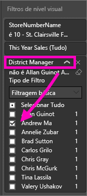

# Adicionar um filtro a um relatório do serviço Power BI (na Vista de Edição)
> [!TIP]
> Recomendamos que leia primeiro o artigo [Acerca de filtros e realce nos relatórios do Power BI](power-bi-reports-filters-and-highlighting.md).

Os exemplos presentes neste artigo mostram o serviço Power BI. No entanto, os passos são praticamente idênticos aos do Power BI Desktop.
> 
> 

## Qual é a diferença entre os filtros de relatório na Vista de Edição e na Vista de Leitura
Existem dois modos de interagir com relatórios: [Vista de Leitura](service-reading-view-and-editing-view.md) e [Vista de Edição](service-interact-with-a-report-in-editing-view.md).  E as funções de filtragem disponíveis para si dependem do modo no qual se encontra.

* Na Vista de Edição, pode adicionar filtros de relatórios, páginas e elementos visuais. Ao guardar o relatório, os filtros são guardados com o mesmo. As pessoas que veem o relatório na Vista de Leitura podem interagir com os filtros que adicionou.
* Na Vista de Leitura, pode interagir com todos os filtros de relatório, pormenorização, página e elemento visual existentes no relatório, mas não pode adicionar novos filtros. No entanto, as alterações que fizer no painel Filtros são guardadas com o relatório, mesmo que esteja a ver o relatório numa aplicação móvel, e mesmo que saia do relatório e regresse ao mesmo mais tarde.  

> [!NOTE]
> Este artigo descreve como criar filtros na **Vista de Edição** do relatório.  Para obter mais informações sobre filtros na Vista de Leitura, veja [Interagir com filtros na Vista de Leitura nos relatórios](service-reading-view-and-editing-view.md).

## Filtros disponíveis no painel *Filtros* do Power BI
Quer esteja a utilizar o Power BI Desktop ou o serviço do Power BI, o painel Filtros é apresentado no lado direito da tela de relatórios. Se não vir o painel Filtros, selecione o ícone ">" no canto superior direito para expandi-lo.

Existem quatro tipos de filtros.

- Um **filtro de página** aplica-se a todos os elementos visuais na página do relatório     
- Um **filtro de elemento visual** aplica-se a um único elemento visual numa página do relatório    
- Um **filtro de pormenorização** aplica-se a uma única entidade num relatório    
- Um **filtro de relatório** aplica-se a todas as páginas no relatório    

    

Uma vez que os filtros *persistem*, ao sair do relatório, o Power BI mantém o filtro, a segmentação de dados e outras alterações que fez à vista de dados. Assim, poderá retomar a atividade onde a deixou ao regressar ao relatório. Se não quiser que as alterações aos filtros persistam, selecione **Repor para predefinição** na barra de menus superior.

## Adicionar um filtro a uma visualização específica (também conhecido como filtro de elemento visual)
Existem duas formas de fazê-lo: 

* ao filtrar um campo que já está a ser utilizado pela visualização
* ao identificar um campo que ainda não está a ser utilizado pela visualização e adicionar esse campo diretamente ao registo **Filtros de nível visual**.

### Ao filtrar os campos já na visualização
1. Abra o [relatório na Vista de Edição](service-reading-view-and-editing-view.md).
   
   
2. Abra o painel Visualizações e Filtros e o painel Campos (se ainda não estiverem abertos).
   
   
3. Selecione um elemento visual para torná-lo ativo. Todos os campos que estão a ser utilizados pelo elemento visual são identificados no painel **Campos** e também estão listados no painel **Filtros**, no título **Filtros de nível visual**.
   
   
4. Neste momento, vamos adicionar um filtro a um campo que já está a ser utilizado pela visualização. 
   
   * Desloque o ecrã para baixo até à área **Filtros de nível visual** e selecione a seta para expandir o campo que pretende filtrar. Neste exemplo, vamos filtrar **StoreNumberName**
     
       
   * Defina os controlos de filtragem **Básico**, **Avançado** ou **Top N** (veja [Como utilizar filtros de relatório](power-bi-how-to-report-filter.md)). Neste exemplo, vamos selecionar a filtragem Básica e colocar marcas de verificação junto aos números 10, 11, 15 e 18.
     
       
   * O elemento visual é alterado de modo a refletir o novo filtro. Se guardar o relatório com o filtro, os leitores do relatório poderão interagir com o filtro na Vista de Leitura, selecionando ou desmarcando valores.
     
      
5. Agora, vamos adicionar um campo completamente novo, como um Filtro de nível visual, à nossa visualização.
   
   * No painel Campos, selecione o campo que pretende adicionar como um novo filtro de nível visual e arraste-o para a área **Filtros de nível visual**.  Neste exemplo, vamos arrastar **District Manager** para o registo **Filtros de nível visual** e selecionar apenas Andrew Ma. 
     
      
   * Repare que **District Manager** *não* está adicionado à visualização propriamente dita. A visualização continua a ser composta por **StoreNumberName** como o Eixo e **This Year Sales** como o Valor.  
     
      
   * Além disso, a visualização propriamente dita está agora filtrada para mostrar apenas as vendas de Andrew neste ano para as lojas especificadas.
     
     

## Adicionar um filtro a uma página inteira (também conhecido como filtro de vista de página)
1. Abra o [relatório na Vista de Edição](service-reading-view-and-editing-view.md).
2. Abra o painel Visualizações e Filtros e o painel Campos (se ainda não estiverem abertos).
3. No painel Campos, selecione o campo que pretende adicionar como um novo filtro de nível de página e arraste-o para a área **Filtros de nível de página**.  
4. Selecione os valores que pretende filtrar e defina os controlos de filtragem **Básico** ou **Avançado** (veja [Como utilizar filtros de relatório](power-bi-how-to-report-filter.md)).
   
   Toda a visualização na página, afetada por este filtro, é redesenhada para refletir a alteração. 
   
   

Se guardar o relatório com o filtro, os leitores do relatório poderão interagir com o filtro na Vista de Leitura, selecionando ou desmarcando valores.

## Adicionar um filtro de pormenorização
Com a pormenorização no serviço Power BI e no Power BI Desktop, pode criar uma página de relatório de *destino* que se foca numa entidade específica - por exemplo, um fornecedor, cliente ou fabricante. Agora, a partir das outras páginas do relatório, os utilizadores podem clicar com o botão direito do rato num ponto de dados para essa entidade e pormenorizar até à página focada.

### Criar um filtro de pormenorização
Para acompanhar, abra o exemplo de Rentabilidade do Cliente na Vista de edição. Suponhamos que quer uma página que se foque em Áreas de negócio executivas.   

1. Adicione uma nova página ao relatório e dê-lhe o nome **Equipa Executiva**. Esta será a página de *destino* da pormenorização.
2. Adicione visualizações que controlam as métricas-chave para as áreas de negócio da equipa executiva.    
3. Adicione **Executivo > Nome do Executivo** à área Filtros de pormenorização.    
   
    
   
    Tenha em atenção que o Power BI adiciona uma seta para trás à página do relatório.  Quando os utilizadores selecionam a seta para trás, voltam à página de relatório de *origem* – a página onde estavam quando optaram pela pormenorização. A seta para trás só funciona na Vista de leitura.
   
     

### Utilizar o filtro de pormenorização
Vamos ver como funciona o filtro de pormenorização.

1. Comece na página do relatório **Tabela de Indicadores da Equipa**.    
2. Suponhamos que é o Andrew Ma e pretende ver a página do relatório Equipa Executiva filtrada para apenas os seus dados.  No gráfico de área na parte superior esquerda, clique com o botão direito do rato em qualquer ponto de dados verde para abrir a opção de menu Pormenorização.
   
    
3. Selecione **Pormenorização > Equipa Executiva** para pormenorizar até à página do relatório com o nome **Equipa Executiva**. A página é filtrada para mostrar informações sobre o ponto de dados no qual clicou com o botão direito do rato, neste caso, Andrew Ma. Apenas o campo que está na área Filtros de pormenorização passa para a página do relatório de pormenorização.  
   
    

## Adicionar um filtro a um relatório inteiro (também conhecido como Filtro de relatório)
1. Abra o [relatório na Vista de Edição](service-reading-view-and-editing-view.md).
2. Abra o painel Visualizações e Filtros e o painel Campos (se ainda não estiverem abertos).
3. No painel Campos, selecione o campo que pretende adicionar como um novo filtro de nível de relatório e arraste-o para a área **Filtros de nível de relatório**.  
4. Selecione os valores que pretende filtrar (veja [Como utilizar filtros de relatório](power-bi-how-to-report-filter.md)).

    Os elementos visuais na página ativa e em todas as páginas do relatório são alterados para refletir o novo filtro. Se guardar o relatório com o filtro, os leitores do relatório poderão interagir com o filtro na Vista de Leitura, selecionando ou desmarcando valores.

1. Selecione a seta para trás para voltar à página anterior do relatório.

## Considerações e resolução de problemas

- Existem duas situações em que o filtro de nível de elemento visual e o filtro de nível de página podem devolver resultados diferentes.  Por exemplo, quando adiciona um filtro de nível de elemento visual, o Power BI filtra os resultados agregados.  A agregação predefinida é a Soma, mas pode [alterar o tipo de agregação](service-aggregates.md).  

    Em seguida, ao adicionar um filtro de nível de página, o Power BI filtra sem agregação.  Fá-lo porque uma página pode ter vários elementos visuais e cada um deles pode utilizar diferentes tipos de agregação.  Por conseguinte, o filtro é aplicado em cada linha de dados.

- Se não vir o painel Campos, certifique-se de que está na [Vista de edição](service-interact-with-a-report-in-editing-view.md) do relatório    
- Se tiver feito várias alterações aos filtros e quiser regressar às predefinições do autor do relatório, selecione **Repor para predefinição** na barra de menus superior.

## Próximos passos
 [Como utilizar filtros de relatório](power-bi-how-to-report-filter.md)

  [Filtros e realce em relatórios](power-bi-reports-filters-and-highlighting.md)

[Interação com filtros e realce na Vista de Leitura do relatório](service-reading-view-and-editing-view.md)

[Alterar como os elementos visuais de relatórios realizam filtragem cruzada e realce cruzado entre si](service-reports-visual-interactions.md)

Mais perguntas? [Pergunte à Comunidade do Power BI](http://community.powerbi.com/)

