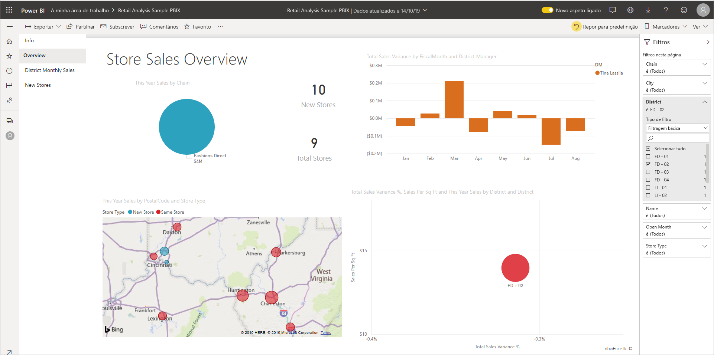

# Add a filter to a report in Power BI (Adicionar um filtro a um relatório no Power BI)

[!INCLUDE [power-bi-service-new-look-include](includes/power-bi-service-new-look-include.md)]

Este artigo explica como adicionar um filtro de página, um filtro de visualização, um filtro de relatório ou um filtro de pormenorização a um relatório no Power BI. Os exemplos presentes neste artigo estão no serviço Power BI. Os passos são praticamente idênticos aos do Power BI Desktop.

**Sabia que?** O Power BI tem uma nova experiência de filtros. Leia mais sobre [a nova experiência de filtros nos relatórios do Power BI](power-bi-report-filter.md).

O Power BI disponibiliza vários tipos de filtros: manual, automático, pormenorização, pass-through, entre outros. Saiba mais sobre os [diferentes tipos de filtros](power-bi-report-filter-types.md).

## Filtros na Vista de edição ou na Vista de leitura
Pode interagir com os relatórios em duas vistas diferentes: a Vista de leitura e a Vista de edição. As capacidades de filtragem disponíveis dependem do modo no qual se encontra. Para obter detalhes, leia tudo [sobre filtros e realces nos relatórios do Power BI](power-bi-reports-filters-and-highlighting.md).

Este artigo descreve como criar filtros na **Vista de edição** dos relatórios.  Para obter mais informações sobre os filtros na Vista de leitura, veja [Interagir com filtros na Vista de leitura dos relatórios](consumer/end-user-report-filter.md).

Uma vez que os filtros *persistem*, ao sair do relatório, o Power BI mantém o filtro, a segmentação de dados e outras alterações que fez à vista de dados. Assim, pode retomar a atividade onde a deixou ao regressar ao relatório. Se não quiser que as alterações aos filtros persistam, selecione **Repor para predefinição** na barra de menus superior.

## Níveis dos filtros no painel Filtros
Quer esteja a utilizar o Power BI Desktop ou o serviço do Power BI, o painel Filtros é apresentado no lado direito da tela de relatórios. Se não vir o painel Filtros, selecione o ícone ">" no canto superior direito para expandi-lo.

Pode definir filtros em três níveis diferentes para o relatório: filtros ao nível do elemento visual, ao nível da página e ao nível do relatório. Pode também definir filtros de pormenorização. Este artigo explica os diferentes níveis.

## Adicionar um filtro a um elemento visual
Pode adicionar um filtro ao nível do elemento visual a um elemento visual específico de duas formas diferentes. 

* Filtrar um campo que já está a ser utilizado pela visualização.
* Identificar um campo que ainda não está a ser utilizado pela visualização e adicionar esse campo diretamente ao registo **Filtros de nível de elemento visual**.

A propósito, este procedimento utiliza o exemplo de Análise de Revenda, caso o queira transferir e acompanhar. Transfira o pacote de conteúdos de [Exemplo de Análise de Revenda](sample-retail-analysis.md#get-the-content-pack-for-this-sample).

### Filtrar os campos no elemento visual

1. Selecione **Mais opções (...)**  > **Editar relatório** para abrir o relatório na Vista de edição.
   
   

2. Abra o painel Visualizações e Filtros e o painel Campos (se ainda não estiverem abertos).
   
   
3. Selecione um elemento visual para torná-lo ativo. Todos os campos que estão a ser utilizados pelo elemento visual estão no painel **Campos** e também estão listados no painel **Filtros**, sob o título **Filtros de nível de elemento visual**.
   
   
4. Neste momento, vamos adicionar um filtro a um campo que já está a ser utilizado pela visualização. 
   
    Desloque o ecrã para baixo até à área **Filtros de nível visual** e selecione a seta para expandir o campo que pretende filtrar. Neste exemplo, vamos filtrar **StoreNumberName**.
     
     
    
    Defina os controlos de filtragem **Básica**, **Avançada** ou **Itens Principais**. Neste exemplo, vamos procurar **cha** na filtragem Básica e selecionar essas cinco lojas.
     
     
   
    O elemento visual é alterado de modo a refletir o novo filtro. Se guardar o relatório com o filtro, os leitores do relatório começarão por ver o elemento visual filtrado e poderão interagir com o filtro na Vista de leitura, ao selecionar ou desmarcar valores.
     
    
    
    Quando utiliza o filtro num campo utilizado no elemento visual onde o campo está agregado (por exemplo, uma soma, média ou contagem), está a filtrar no valor *agregado* em cada ponto de dados. Desta forma, pedir para filtrar o elemento visual acima onde **Vendas Deste Ano > 500 000** significa que apenas veria o ponto de dados **13 - Charleston Fashion Direct** no resultado. Os filtros em [medidas do modelo](desktop-measures.md) aplicam-se sempre ao valor agregado do ponto de dados.

### Filtrar com um campo que não está no elemento visual

Agora, vamos adicionar um novo campo à nossa visualização como um filtro de nível de elemento visual.
   
1. No painel Campos, selecione o campo que quer adicionar como um novo filtro de nível de elemento visual e arraste-o para a área **Filtros de nível de elemento visual**.  Neste exemplo, vamos arrastar **Gestor Distrital** para o registo **Filtros de nível de elemento visual**, procurar **an** e selecionar esses três gestores.
     
    

    Repare que o **Gestor Distrital** *não* foi adicionado à visualização propriamente dita. A visualização continua a ser composta por **StoreNumberName** como o Eixo e **This Year Sales** como o Valor.  
     
    

    Além disso, a visualização propriamente dita está agora filtrada para mostrar apenas as vendas desses gestores neste ano para as lojas especificadas.
     
    

    Se guardar o relatório com este filtro, os leitores do relatório poderão interagir com o filtro **Gestor Distrital** na Vista de leitura, ao selecionar ou desmarcar valores.
    
    Se arrastar uma *coluna numérica* para o painel Filtros para criar um filtro ao nível do elemento visual, o filtro é aplicado às *linhas de dados subjacentes*. Por exemplo, a adição de um filtro no campo **CustoUnitário** e a definição desse filtro como **CustoUnitário** > 20 só mostraria os dados das linhas de produtos nas quais o custo unitário fosse maior do que 20, independentemente do custo unitário total dos pontos de dados mostrados no elemento visual.

## Adicionar um filtro a uma página inteira

Também pode adicionar um filtro ao nível da página para filtrar uma página inteira.

1. No serviço Power BI, abra o relatório de Análise de Revenda e vá para a página **Vendas Mensais Distritais**. 

2. Selecione **...**  > **Editar relatório** para abrir o relatório na Vista de edição.
   
   
2. Abra o painel Visualizações e Filtros e o painel Campos (se ainda não estiverem abertos).
3. No painel Campos, selecione o campo que quer adicionar como um novo filtro de nível de página e arraste-o para a área **Filtros de nível de página**.  
4. Selecione os valores que quer filtrar e defina os controlos de filtragem **Básica** ou **Avançada**.
   
   Todas as visualizações na página são redesenhadas para refletir a alteração.
   
   

    Se guardar o relatório com o filtro, os leitores do relatório poderão interagir com o filtro na Vista de leitura, ao selecionar ou desmarcar valores.

## Adicionar um filtro de pormenorização
Com a pormenorização no serviço Power BI e no Power BI Desktop, pode criar uma página de relatório de *destino* que se foca numa entidade específica - por exemplo, um fornecedor, cliente ou fabricante. Agora, a partir das outras páginas do relatório, os utilizadores podem clicar com o botão direito do rato num ponto de dados para essa entidade e pormenorizar até à página focada.

### Criar um filtro de pormenorização
Para acompanhar, transfira o [Exemplo de Rentabilidade do Cliente](sample-customer-profitability.md#get-the-content-pack-for-this-sample). Suponhamos que quer uma página que se foque em Áreas de negócio executivas.

1. No serviço Power BI, abra o relatório de Análise de Revenda e vá para a página **Vendas Mensais Distritais**.

2. Selecione **Mais opções (...)**  > **Editar relatório** para abrir o relatório na Vista de edição.
   
   

1. Adicione uma nova página ao relatório e dê-lhe o nome **Equipa Executiva**. Esta será a página de *destino* da pormenorização.
2. Adicione visualizações que controlam as métricas-chave para as áreas de negócio da equipa executiva.    
3. Na tabela **Executivos**, arraste **Executivo** para a área de filtros de Pormenorização.    
   
    
   
    Tenha em atenção que o Power BI adiciona uma seta para trás à página do relatório.  Quando os utilizadores selecionam a seta para trás, voltam à página de relatório de *origem* – a página onde estavam quando optaram pela pormenorização. Na Vista de edição, mantenha premida a tecla Ctrl para selecionar a seta para trás.
   
     

### Utilizar o filtro de pormenorização
Vamos ver como funciona o filtro de pormenorização.

1. Comece na página do relatório **Tabela de Indicadores da Equipa**.    
2. Suponhamos que é o Andrew Ma e pretende ver a página do relatório Equipa Executiva filtrada para apenas os seus dados.  No gráfico de área no canto superior esquerdo, clique com o botão direito do rato em qualquer ponto de dados verde para abrir a opção de menu Pormenorização.
   
    
3. Selecione **Pormenorização > Equipa Executiva** para pormenorizar até à página do relatório com o nome **Equipa Executiva**. A página é filtrada para mostrar informações sobre o ponto de dados no qual clicou com o botão direito do rato, neste caso, Andrew Ma. Todos os filtros na página de origem são aplicados à página de relatório de pormenorização.  
   
    

## Adicionar um filtro ao nível do relatório para filtrar um relatório inteiro

1. Selecione **Editar relatório** para abrir o relatório na Vista de edição.
   
   

2. Abra o painel Visualizações e Filtros e o painel Campos, se ainda não estiverem abertos.
3. No painel Campos, selecione o campo que quer adicionar como um novo filtro de nível de relatório e arraste-o para a área **Filtros de nível de relatório**.  
4. Selecione o valor que quer filtrar.

    Os elementos visuais na página ativa e em todas as páginas do relatório são alterados para refletir o novo filtro. Se guardar o relatório com o filtro, os leitores do relatório poderão interagir com o filtro na Vista de leitura, ao selecionar ou desmarcar valores.

1. Selecione a seta para trás para voltar à página anterior do relatório.

## Considerações e resolução de problemas

- Se não vir o painel Campos, certifique-se de que está na [Vista de edição](service-interact-with-a-report-in-editing-view.md) do relatório    
- Se tiver feito várias alterações aos filtros e quiser regressar às predefinições do autor do relatório, selecione **Repor para predefinição** na barra de menus superior.

## Próximos passos
[ Fazer uma visita do painel Filtros](consumer/end-user-report-filter.md)

[Filtros e realce em relatórios](power-bi-reports-filters-and-highlighting.md)

[Different kinds of filters in Power BI](power-bi-report-filter-types.md) (Os diferentes tipos de filtros no Power BI)

Mais perguntas? [Pergunte à Comunidade do Power BI](https://community.powerbi.com/)

