# Adicionar um filtro a um relatório do serviço Power BI (na Vista de Edição)

Este artigo explica como adicionar um filtro de página, um filtro de visualização, um filtro de relatório ou um filtro de pormenorização a um relatório no Power BI. Os exemplos presentes neste artigo estão no serviço Power BI. Os passos são praticamente idênticos aos do Power BI Desktop.

**Sabia que?** O Power BI tem uma nova experiência de filtros, atualmente em pré-visualização. Leia mais sobre [a nova experiência de filtros nos relatórios do Power BI](power-bi-report-filter-preview.md).

## Filtros na Vista de edição ou na Vista de leitura
Pode interagir com os relatórios em duas vistas diferentes: Vista de leitura e Vista de edição. As capacidades de filtragem disponíveis dependem do modo no qual se encontra. Para obter detalhes, leia tudo [sobre filtros e realces nos relatórios do Power BI](power-bi-reports-filters-and-highlighting.md).

Este artigo descreve como criar filtros na **Vista de edição** dos relatórios.  Para obter mais informações sobre os filtros na Vista de leitura, veja [Interagir com filtros na Vista de leitura dos relatórios](consumer/end-user-reading-view.md).

## Tipos de filtros no painel Filtros
Quer esteja a utilizar o Power BI Desktop ou o serviço do Power BI, o painel Filtros é apresentado no lado direito da tela de relatórios. Se não vir o painel Filtros, selecione o ícone ">" no canto superior direito para expandi-lo.

Há quatro tipos de filtros: **filtro de página**, **filtro de elemento visual**, **filtro de pormenorização** e **filtro de relatório**.

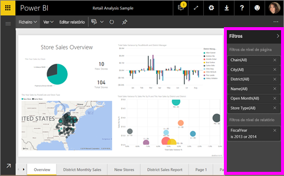

Uma vez que os filtros *persistem*, ao sair do relatório, o Power BI mantém o filtro, a segmentação de dados e outras alterações que fez à vista de dados. Assim, pode retomar a atividade onde a deixou ao regressar ao relatório. Se não quiser que as alterações aos filtros persistam, selecione **Repor para predefinição** na barra de menus superior.

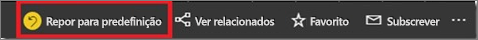

## Adicionar um filtro a um elemento visual
Pode adicionar um filtro a um elemento visual específico de duas formas diferentes (isto é, um “filtro de elemento visual”). 

* Filtrar um campo que já está a ser utilizado pela visualização.
* Identificar um campo que ainda não está a ser utilizado pela visualização e adicionar esse campo diretamente ao registo **Filtros de nível de elemento visual**.

A propósito, este procedimento utiliza o exemplo de Análise de Revenda, caso o queira transferir e acompanhar. Transferir o [exemplo de Análise de Revenda](sample-retail-analysis.md).

### Filtrar os campos no elemento visual

1. Abra o [relatório na Vista de edição](service-the-report-editor-take-a-tour.md).
   
   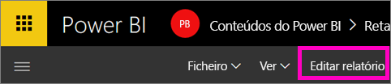
2. Abra o painel Visualizações e Filtros e o painel Campos (se ainda não estiverem abertos).
   
   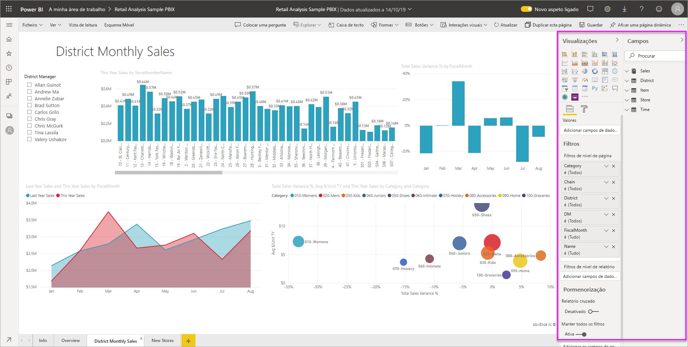
3. Selecione um elemento visual para torná-lo ativo. Todos os campos que estão a ser utilizados pelo elemento visual estão no painel **Campos** e também estão listados no painel **Filtros**, sob o título **Filtros de nível de elemento visual**.
   
   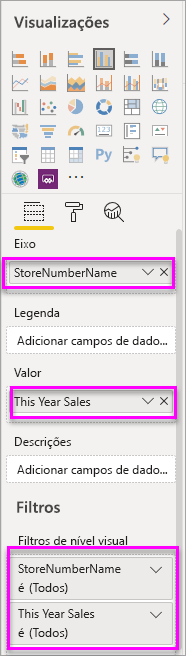
4. Neste momento, vamos adicionar um filtro a um campo que já está a ser utilizado pela visualização. 
   
    Desloque o ecrã para baixo até à área **Filtros de nível visual** e selecione a seta para expandir o campo que pretende filtrar. Neste exemplo, vamos filtrar **StoreNumberName**.
     
    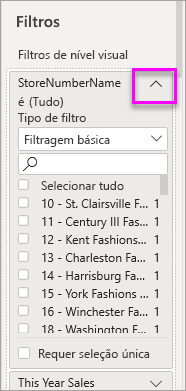 
    
    Defina os controlos de filtragem **Básica**, **Avançada** ou **Itens Principais**. Neste exemplo, vamos procurar **cha** na filtragem Básica e selecionar essas cinco lojas.
     
    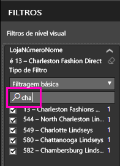 
   
    O elemento visual é alterado de modo a refletir o novo filtro. Se guardar o relatório com o filtro, os leitores do relatório começarão por ver o elemento visual filtrado e poderão interagir com o filtro na Vista de leitura, ao selecionar ou desmarcar valores.
     
    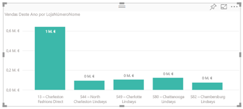

### Filtrar com um campo que não está no elemento visual

Agora, vamos adicionar um novo campo à nossa visualização como um filtro de nível de elemento visual.
   
1. No painel Campos, selecione o campo que quer adicionar como um novo filtro de nível de elemento visual e arraste-o para a área **Filtros de nível de elemento visual**.  Neste exemplo, vamos arrastar **Gestor Distrital** para o registo **Filtros de nível de elemento visual**, procurar **an** e selecionar esses três gestores. 
     
    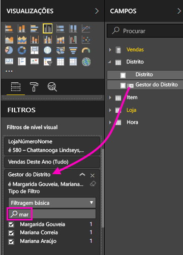

    Repare que o **Gestor Distrital** *não* foi adicionado à visualização propriamente dita. A visualização continua a ser composta por **StoreNumberName** como o Eixo e **This Year Sales** como o Valor.  
     
    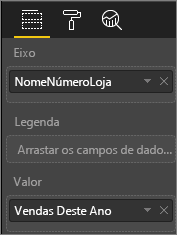

    Além disso, a visualização propriamente dita está agora filtrada para mostrar apenas as vendas desses gestores neste ano para as lojas especificadas.
     
    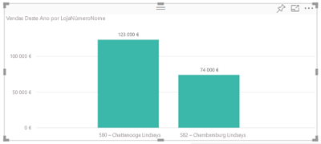

    Se guardar o relatório com este filtro, os leitores do relatório poderão interagir com o filtro **Gestor Distrital** na Vista de leitura, ao selecionar ou desmarcar valores.

## Adicionar um filtro a uma página inteira

Também pode adicionar um filtro a uma página inteira (um filtro de vista de página)
1. Abra o [relatório na Vista de edição](service-the-report-editor-take-a-tour.md).
2. Abra o painel Visualizações e Filtros e o painel Campos (se ainda não estiverem abertos).
3. No painel Campos, selecione o campo que quer adicionar como um novo filtro de nível de página e arraste-o para a área **Filtros de nível de página**.  
4. Selecione os valores que quer filtrar e defina os controlos de filtragem **Básica** ou **Avançada**.
   
   Toda a visualização na página, afetada por este filtro, é redesenhada para refletir a alteração. 
   
   

    Se guardar o relatório com o filtro, os leitores do relatório poderão interagir com o filtro na Vista de leitura, ao selecionar ou desmarcar valores.

## Adicionar um filtro de pormenorização
Com a pormenorização no serviço Power BI e no Power BI Desktop, pode criar uma página de relatório de *destino* que se foca numa entidade específica - por exemplo, um fornecedor, cliente ou fabricante. Agora, a partir das outras páginas do relatório, os utilizadores podem clicar com o botão direito do rato num ponto de dados para essa entidade e pormenorizar até à página focada.

### Criar um filtro de pormenorização
Para acompanhar, abra o exemplo de Rentabilidade do Cliente na Vista de edição. Suponhamos que quer uma página que se foque em Áreas de negócio executivas.   

1. Adicione uma nova página ao relatório e dê-lhe o nome **Equipa Executiva**. Esta será a página de *destino* da pormenorização.
2. Adicione visualizações que controlam as métricas-chave para as áreas de negócio da equipa executiva.    
3. Adicione **Executivo > Nome do Executivo** à área Filtros de pormenorização.    
   
    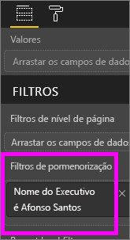
   
    Tenha em atenção que o Power BI adiciona uma seta para trás à página do relatório.  Quando os utilizadores selecionam a seta para trás, voltam à página de relatório de *origem* – a página onde estavam quando optaram pela pormenorização. A seta para trás só funciona na Vista de leitura.
   
     

### Utilizar o filtro de pormenorização
Vamos ver como funciona o filtro de pormenorização.

1. Comece na página do relatório **Tabela de Indicadores da Equipa**.    
2. Suponhamos que é o Andrew Ma e pretende ver a página do relatório Equipa Executiva filtrada para apenas os seus dados.  No gráfico de área na parte superior esquerda, clique com o botão direito do rato em qualquer ponto de dados verde para abrir a opção de menu Pormenorização.
   
    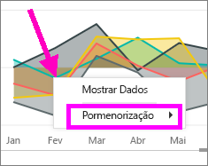
3. Selecione **Pormenorização > Equipa Executiva** para pormenorizar até à página do relatório com o nome **Equipa Executiva**. A página é filtrada para mostrar informações sobre o ponto de dados no qual clicou com o botão direito do rato, neste caso, Andrew Ma. Apenas o campo que está na área Filtros de pormenorização passa para a página do relatório de pormenorização.  
   
    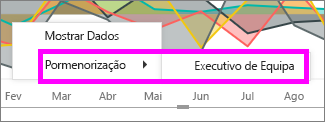

## Adicionar um filtro a um relatório inteiro (também conhecido como Filtro de relatório)
1. Abra o [relatório na Vista de edição](service-the-report-editor-take-a-tour.md).
2. Abra o painel Visualizações e Filtros e o painel Campos (se ainda não estiverem abertos).
3. No painel Campos, selecione o campo que quer adicionar como um novo filtro de nível de relatório e arraste-o para a área **Filtros de nível de relatório**.  
4. Selecione o valor que quer filtrar.

    Os elementos visuais na página ativa e em todas as páginas do relatório são alterados para refletir o novo filtro. Se guardar o relatório com o filtro, os leitores do relatório poderão interagir com o filtro na Vista de leitura, ao selecionar ou desmarcar valores.

1. Selecione a seta para trás para voltar à página anterior do relatório.

## Considerações e resolução de problemas

- Existem duas situações em que o filtro de nível de elemento visual e o filtro de nível de página podem devolver resultados diferentes.  Por exemplo, quando adiciona um filtro de nível de elemento visual, o Power BI filtra os resultados agregados.  A agregação predefinida é a Soma, mas pode [alterar o tipo de agregação](service-aggregates.md).  

    Em seguida, ao adicionar um filtro de nível de página, o Power BI filtra sem agregação.  Não faz a agregação porque uma página pode ter vários elementos visuais e cada um deles pode utilizar diferentes tipos de agregação.  Por conseguinte, o filtro é aplicado em cada linha de dados.

- Se não vir o painel Campos, certifique-se de que está na [Vista de edição](service-interact-with-a-report-in-editing-view.md) do relatório    
- Se tiver feito várias alterações aos filtros e quiser regressar às predefinições do autor do relatório, selecione **Repor para predefinição** na barra de menus superior.

## Próximos passos
[ Fazer uma visita do painel Filtros](consumer/end-user-report-filter.md)

[Filtros e realce em relatórios](power-bi-reports-filters-and-highlighting.md)

[Interação com filtros e realce na Vista de leitura dos relatórios](consumer/end-user-reading-view.md)

[Alterar como os elementos visuais de relatórios realizam filtragem cruzada e realce cruzado entre si](consumer/end-user-interactions.md)

Mais perguntas? [Pergunte à Comunidade do Power BI](http://community.powerbi.com/)

