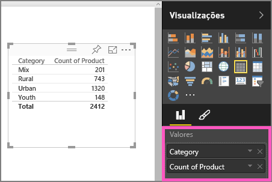
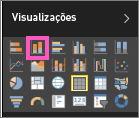

# Parte I, Adicionar visualizações a um relatório do Power BI
Este artigo apresenta uma breve introdução à criação de uma visualização num relatório com o serviço Power BI ou o Power BI Desktop.  Para conteúdo mais avançado,[veja a Parte II](power-bi-report-add-visualizations-ii.md). Veja a Amanda a demonstrar algumas formas diferentes de criar, editar e formatar visuais a tela de relatórios. Em seguida, experimente utilizando o [exemplo Vendas e Marketing](sample-datasets.md) para criar os seus próprios relatórios.

<iframe width="560" height="315" src="https://www.youtube.com/embed/IkJda4O7oGs" frameborder="0" allowfullscreen></iframe>

## Abra um relatório e adicione uma nova página
1. Abra um [relatório na Vista de Edição](service-reading-view-and-editing-view.md). Este tutorial utiliza o [exemplo de Vendas e Marketing](sample-datasets.md).
2. Se o painel Campos não estiver visível, selecione o ícone de seta para abri-lo. 
   
   
3. [Adicione uma página em branco ao relatório](power-bi-report-add-page.md).

## Adicione visualizações ao relatório
1. Crie uma visualização selecionando um campo no painel **Campos**.  
   
   **Comece com um campo numérico** como Vendas > Vendas $: o Power BI cria um gráfico de colunas com uma única coluna.
   
   
   
   **Comece com um campo de categoria**, como Nome ou Produto: o Power BI cria uma tabela e adiciona o campo para **Valores**.
   
   
   
   **Comece com um campo de geografia**, tal como Georreplicação > Cidade. O Power BI e o Bing Maps criam uma visualização de mapa.
   
   
2. Crie uma visualização e, em seguida, altere o respetivo tipo. Selecione **Produto > Contagem de Produtos** e **Produto > Categoria** para adicioná-los a **Valores**.
   
   
3. Altere a visualização para um gráfico de colunas ao selecionar o ícone de gráfico de colunas.
   
   
4. Quando criar visualizações no relatório, pode [afixá-las ao dashboard](service-dashboard-pin-tile-from-report.md). Para afixar a visualização, selecione o ícone de pino .
   
   
5. Agora pode:
   
   Continue para a [Parte 2: adicionar visualizações a um relatório do Power BI](power-bi-report-add-visualizations-ii.md)
   
   [Interaja com as visualizações](service-reading-view-and-editing-view.md) no relatório.
   
   [Faça mais com visualizações](power-bi-report-visualizations.md).
   
   [Guarde o relatório](service-report-save.md).

## Passos seguintes
Mais sobre [Visualizações nos relatórios do Power BI](power-bi-report-visualizations.md).

[Relatórios no Power BI](service-reports.md)

Mais perguntas? [Pergunte à Comunidade do Power BI](http://community.powerbi.com/)

