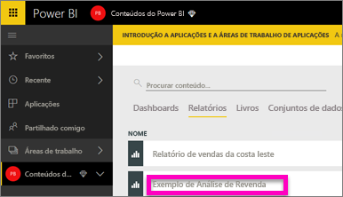
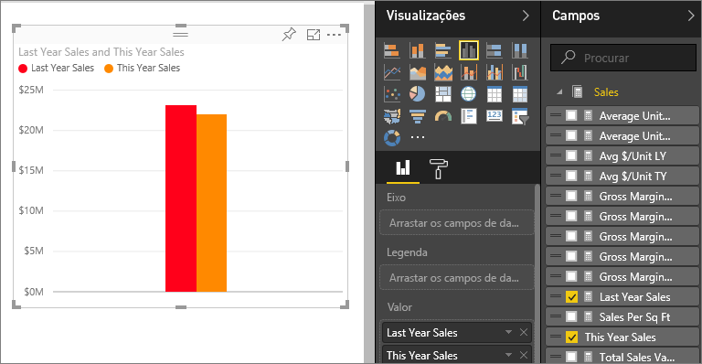
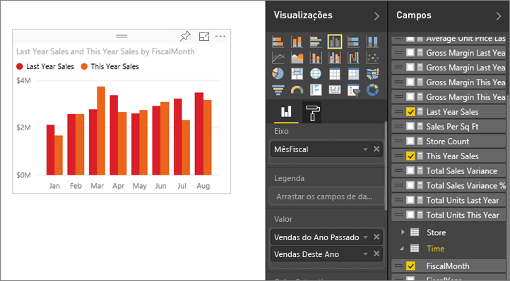
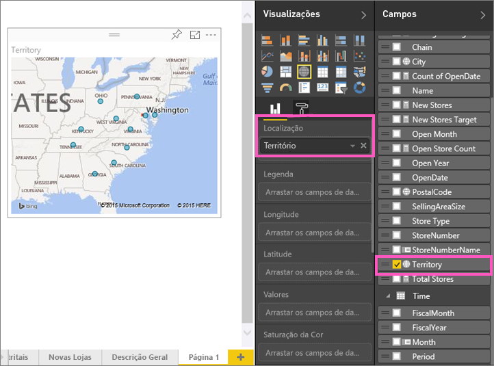
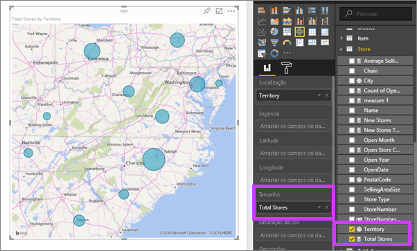
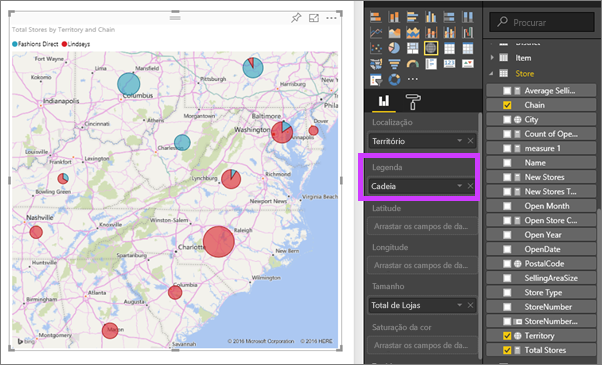

# Parte 2, adicionar visualizações a um relatório do Power BI (Tutorial)
Na [Parte 1](power-bi-report-add-visualizations-ii.md), criou uma visualização básica marcando as caixas de seleção ao lado dos nomes de campo.  Na parte 2, aprenderá a usar o arrastar e soltar e a utilizar de forma integral os painéis **Campos** e **Visualizações** para criar e modificar as visualizações.

### Pré-requisitos
- [Parte 1](power-bi-report-add-visualizations-ii.md)
- Serviço Power BI – pode adicionar visualizações aos relatórios com o serviço Power BI ou o Power BI Desktop. Este tutorial utiliza o serviço Power BI. 
- Exemplo de Análise de Revenda

## Criar uma nova visualização
Neste tutorial, vamos examinar nosso conjunto de dados de Análise de Revenda e criar algumas visualizações chave.

### Abra um relatório e adicione uma nova página em branco.
1. Abra a área de trabalho onde guardou o exemplo de Análise de Revenda. Selecione **Exemplo de Análise de Revenda** para abrir o relatório na Vista de Leitura.
   
   
2. Selecione **Editar Relatório** para abrir o relatório na Vista de Edição.
   
   
3. [Adicione uma nova página](power-bi-report-add-page.md) selecionando o ícone amarelo na parte inferior do ecrã.
   
   

### Adicione uma visualização que analise as vendas deste ano em comparação com o ano passado.
1. Na tabela **Vendas**, selecione **Vendas Deste Ano** > **Valor** e **Vendas do Ano Passado**. O Power BI cria um gráfico de colunas.  Isto é interessante e quer investigar. O que torna as vendas semelhantes por mês?  
   
   
2. A partir da tabela Tempo, arraste **Mês** para a área **Eixo**.  
   
3. [Mude a visualização](power-bi-report-change-visualization-type.md) num gráfico de área.  Há muitos tipos de visualização dentre as quais escolher - consulte as [descrições de cada uma, dicas de práticas recomendadas e tutoriais](power-bi-visualization-types-for-reports-and-q-and-a.md) para decidir que tipo usar. No painel de Visualizações, selecione o ícone do gráfico de linhas.
4. Ordene a visualização selecionado as reticências e escolhendo **Ordenar por Mês**.
5. [Redimensione a visualização](power-bi-visualization-move-and-resize.md)selecionando a visualização, pegando um dos círculos da estrutura de tópicos e arrastando. Torne-a grande o suficiente para eliminar a barra de deslocamento e pequena o suficiente para termos espaço para adicionar outra visualização.
   
   
6. [Guarde o relatório](service-report-save.md).

### Adicionar uma visualização de mapa que analise as vendas por local
1. Na tabela **Arquivo** selecione **Território**. O Power BI reconhece que Território é um local e cria uma visualização de mapa.  
   
2. Arraste **Arquivos Totais** na área de Valores.  
   
3. Adicione uma legenda.  Para ver os dados pelo nome do arquivo, arraste **Rede** para a área Legenda.  
   

## Próximos passos
* Para obter mais informações sobre o painel Campos, veja [Editor de relatório... faça uma tour](service-the-report-editor-take-a-tour.md).   
* Para saber como filtrar e destacar as visualizações, veja [Filtros e destaque em relatórios do Power BI](power-bi-reports-filters-and-highlighting.md).  
* Mais sobre [Visualizações nos relatórios do Power BI](power-bi-report-visualizations.md).  
* Mais perguntas? [Pergunte à Comunidade do Power BI](http://community.powerbi.com/)

