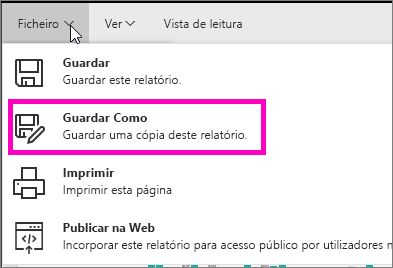
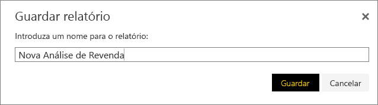
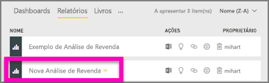

# Criar um novo relatório a partir de um relatório existente (copiar um relatório)
Talvez tenha um relatório que já se liga ao seu conjunto de dados e tem alguns elementos visuais que pretende voltar a utilizar ou modificar.  Porque não simplesmente copiar esse relatório como base para um novo relatório?  Para fazê-lo:

1. [Abra um relatório](service-report-open.md).
2. No menu **Ficheiro**, selecione **Guardar como**.
   
   
3. Escreva um nome para o novo relatório e selecione **Guardar**.
   
   
   
   Uma mensagem de êxito permite-lhe saber que o novo relatório foi guardado na atual área de trabalho do Power BI.
   
   
4. Abra o separador **Relatórios** da sua área de trabalho e selecione o novo relatório para abri-lo. Opcionalmente, elimine os elementos visuais que não pretende manter, modifique e adicione outros.
   
   
5. Divirta-se a atualizar e editar o seu novo relatório.

## Passos Seguintes:
[Crie novas visualizações](power-bi-report-add-visualizations-ii.md)

[Elimine visualizações](service-delete.md) que não precisa

[Criar um relatório com o Power BI Desktop](desktop-report-view.md)
