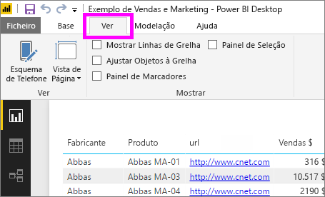
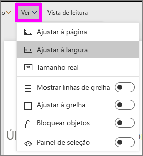
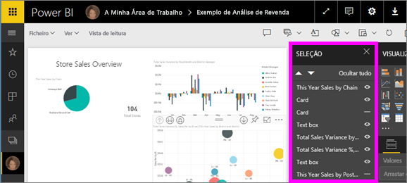

# A página exibe as definições num relatório do Power BI
Compreendemos que é essencial manter o pixel de layout de relatório perfeito. Por vezes, isso representa um desafio, uma vez que visualiza esses relatórios, e os seus colegas também, em ecrãs de diferentes proporções e tamanhos. 

O modo de exibição padrão é **Ajustar à página** e o tamanho de exibição padrão é **16:9**. Se deseja bloquear uma taxa de proporção diferente ou ajustar o relatório de outra forma, há duas ferramentas para ajudá-lo: configurações de ***Visualização de Página*** e configurações do ***Tamanho da Página***.

<iframe width="560" height="315" src="https://www.youtube.com/embed/5tg-OXzxe2g" frameborder="0" allowfullscreen></iframe>

## Onde encontrar as definições Vista de página no serviço Power BI e no Power BI Desktop
As definições Vista de página estão disponíveis no serviço Power BI e no Power BI Desktop, mas a interface é ligeiramente diferente. As duas secções abaixo explicam onde pode encontrar as definições Vista em cada ferramenta do Power BI.

### No Power BI Desktop
Na Vista de relatório, selecione o separador **Vista** para abrir as definições Vista de página, bem como as definições de esquema do telefone.

  

### No serviço Power BI (app.powerbi.com)
No serviço Power BI, abra um relatório e selecione **Vista** na barra de menus superior esquerda.

As definições Vista de Página estão disponíveis na [Vista de leitura e na Vista de edição](service-reading-view-and-editing-view.md). Na Vista de Edição, o proprietário de um relatório pode atribuir definições de vista de página a páginas de relatório individuais. Essas definições são guardadas com o relatório. Quando os colegas abrem o relatório na Vista de leitura, verão as páginas do relatório com as definições do proprietário.  Na Vista de leitura, os colegas podem alterar *algumas* das definições Vista de página, mas as alterações não serão guardadas quando fecharem o relatório.

##    Definições Vista de página
O primeiro conjunto de definições *Vista de página* controla a apresentação da página do relatório relativa à janela do navegador.  Escolha entre:

* **Ajustar à Página** (padrão): o conteúdo é dimensionado para um melhor ajuste à página
* **Ajustar à Largura**: o conteúdo é dimensionado para ser ajustado à largura da página
* **Tamanho Real**: o conteúdo é exibido em tamanho normal

O segundo conjunto de definições *Vista de página* controla o posicionamento dos objetos na tela do relatório.

* **Mostrar linhas de grelha**: ative as linhas de grelha para ajudar a posicionar objetos na tela do relatório
* **Ajustar a grelha**: utilize coma opção **Mostrar linhas de grelha** para posicionar e alinhar os objetos na tela do relatório com precisão 
* **Bloquear objetos**: bloqueie todos os objetos na tela para que não seja possível movê-los ou redimensioná-los
* **Painel de seleção**: o Painel de seleção apresenta uma lista de todos os objetos na tela e pode escolher quais pretende mostrar ou ocultar

    

## Configurações de Tamanho da Página

As definições *Tamanho da Página* só estão disponíveis para os proprietários do relatório. No serviço Power BI (app.powerbi.com), significa que pode abrir o relatório na [Vista de edição](service-reading-view-and-editing-view.md). Estas definições controlam a proporção de visualização e o tamanho real (em pixels) da tela do relatório.   

* proporção de 4:3
* proporção de 16:9 (predefinição)
* Cortana
* Letter
* Personalizado (altura e largura em pixels)

## Próximos Passos
[Saiba como usar as definições Vista de página e Tamanho da página nos relatórios do Power BI](power-bi-change-report-display-settings.md).

Leia mais sobre [relatórios no Power BI](service-reports.md)

[Power BI - Conceitos Básicos](service-basic-concepts.md)

Mais perguntas? [Pergunte à Comunidade do Power BI](http://community.powerbi.com/)

