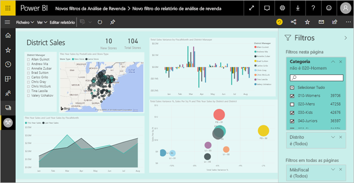
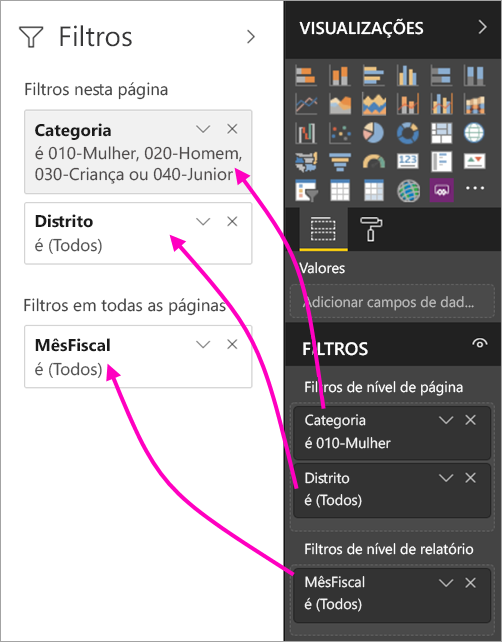
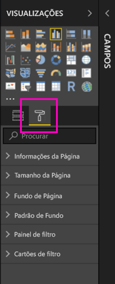
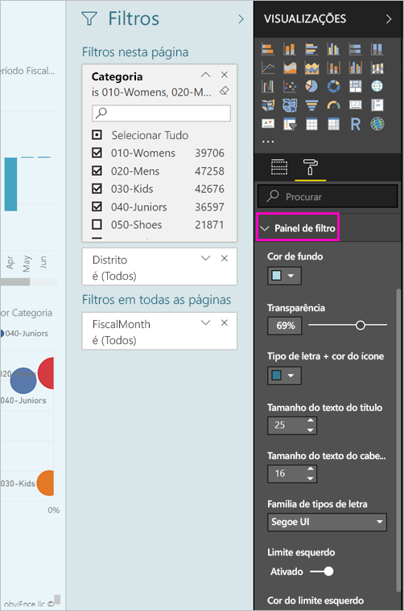
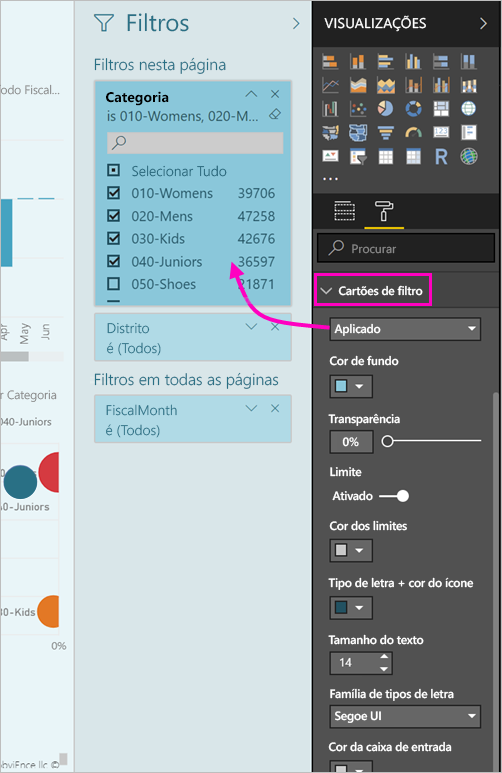
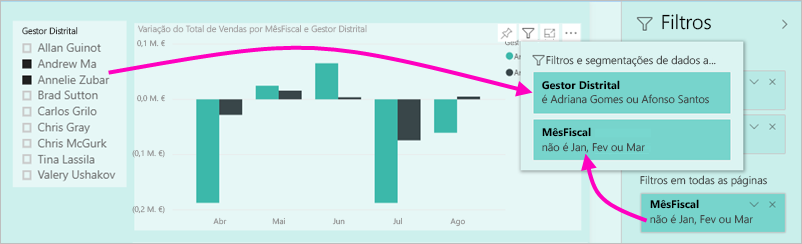

# A nova experiência de filtros nos relatórios do Power BI (Pré-visualização)

Este artigo descreve a nova experiência de filtragem: Os filtros no Power BI têm novas funcionalidades e um novo design. Quando estrutura relatórios no Power BI Desktop ou no serviço Power BI, pode alterar o aspeto do Painel de filtros e fazer com que interaja com todo o relatório. Na nova experiência, o Painel de filtros antigo atua como um painel de edição de filtros e o novo painel Filtros é o único que os consumidores de relatórios veem. 
 

> [!NOTE]
> A nova experiência de filtros encontra-se no modo de pré-visualização. As novas compilações podem substituir a formatação que tiver definido.

Enquanto estruturador de relatórios, eis o que pode fazer com os novos filtros:

- Apresentar uma vista de filtros só de leitura no cabeçalho de elemento visual, para que os consumidores saibam exatamente quais são os filtros ou as segmentações de dados que estão a afetar um determinado elemento visual.
- Formatar e personalizar o painel de filtros para se integrar melhor com o relatório.
- Definir se o Painel de filtros está aberto ou fechado por predefinição quando um consumidor abre o relatório.
- Ocultar o painel de filtros completo ou filtros específicos que não quer que os consumidores de relatórios vejam.
- Controlar e até mesmo marcar o estado da visibilidade, o estado aberto e o estado fechado do novo painel de filtros.
- Bloquear filtros que não quer que os consumidores editem.

## Ativar a nova experiência de filtros 

Vai ativar a nova experiência no Power BI Desktop. Em seguida, pode modificar os filtros aqui ou no serviço Power BI (https://app.powerbi.com). Uma vez que esta nova experiência de filtros está em Pré-visualização, tem de a ativar primeiro no Power BI Desktop. Se começar por criar um relatório no serviço Power BI, este não poderá conter os novos filtros.

### Ativar os novos filtros para todos os novos relatórios

1. No Power BI Desktop, selecione **Ficheiro** > **Opções e Definições** > **Opções** > **Funcionalidades de Pré-visualização** e, em seguida, selecione a caixa de verificação **Nova experiência de filtros**. 
2. Reinicie o Power BI Desktop para ver a nova experiência de filtros em todos os novos relatórios.

Depois de reiniciar o Power BI Desktop, a nova experiência fica ativada por predefinição para todos os novos relatórios que criar.  

### Ativar os novos filtros para um relatório existente

Também pode ativar os novos filtros para relatórios existentes.

1. No Power BI Desktop, num relatório existente, selecione **Ficheiro** > **Opções e Definições** > **Opções**.
2. Em **Definições de relatório**, selecione **Ativar o painel de filtros atualizado e apresentar filtros no cabeçalho do elemento visual deste relatório**.

## Criar o novo painel de filtros

Depois de ativar o novo painel de filtros, este será apresentado à direita da página do relatório, formatado por predefinição com base nas suas definições de relatório atuais. O painel de filtros antigo agora atua como o painel de edição dos filtros. O novo painel de filtros mostra o que os consumidores do relatório verão quando publicar o relatório. Pode atualizar os filtros existentes no novo painel, mas vai utilizar o painel de filtros antigo para configurar os filtros a incluir.

1. Primeiro, vai decidir se quer que os consumidores de relatórios vejam o painel de filtros. Se quiser que o vejam, selecione o ícone de olho  junto a Filtros.

2. Para começar a criar o novo painel de filtros, arraste campos de interesse para o painel de edição de filtros como filtros de nível de elemento visual, de página ou de relatório. Serão apresentados no novo painel Filtros.

    

Quando adiciona um elemento visual à tela do relatório, o Power BI adiciona automaticamente um filtro para cada campo no elemento visual. O Power BI não adiciona esses filtros automáticos ao painel de filtros só de leitura. Tem de selecionar o ícone de olho para os adicionar explicitamente.

 
## Bloquear ou ocultar filtros

Pode bloquear ou ocultar cartões de filtros individuais. Se bloquear um filtro, os consumidores de relatórios poderão vê-lo, mas não o poderão alterar. Se o ocultar, nem sequer o poderão ver. Ocultar cartões de filtros será especialmente útil se precisar de ocultar filtros de limpeza de dados que excluem valores nulos ou valores inesperados. 

- No painel de edição do filtro, selecione ou desmarque os ícones **Bloquear filtro** ou **Ocultar filtro** no cartão de filtro.

   

À medida que ativa e desativa estas definições no painel de edição de filtros, verá as alterações refletidas no novo painel de filtros. Os filtros ocultos não aparecem no pop-up de filtros de um elemento visual.

Também pode configurar o estado do painel de filtros de forma a criarem um fluxo juntamente com os seus marcadores de relatório. O estado aberto, fechado e estado de visibilidade do painel são todos passíveis de marcação.
 
## Formatar o novo painel Filtros

Uma parte importante desta nova experiência passa por agora poder formatar o painel de filtros de acordo com a aparência do seu relatório. Pode formatar o painel de filtros de forma diferente para cada página do relatório. Estes são os elementos que pode formatar: 

- Cor de fundo
- Transparência do fundo
- Limite do painel de filtros ativado ou desativado
- Cor do limite do painel de filtros
- Título do painel de filtros e tipo de letra, cor e tamanho do texto do cabeçalho

Também pode formatar estes elementos para cartões de filtros, dependendo se estão aplicados (definidos para algo) ou disponíveis (desmarcados): 

- Cor de fundo
- Transparência do fundo
- Limite: ativado ou desativado
- Cor dos limites
- Tipo de letra, cor e tamanho do texto
- Cor de caixa de entrada

### Definir o formato do Painel de filtros e dos cartões

1. No relatório, clique no relatório propriamente dito ou no fundo (*imagem de fundo*), em seguida, no painel **Visualizações** e selecione **Formatar**. 
    Verá as opções de formatação da página do relatório, da imagem de fundo e também do Painel de filtros e dos Cartões de filtros.

        

1. Expanda **Painel de filtros** para definir a cor do fundo, o ícone e o limite esquerdo, para complementar a página do relatório.

    

1. Expanda **Cartões de filtros** para definir a cor e o limite **Disponível** e **Aplicado**. Se disponibilizar cores diferentes para cartões disponíveis e aplicados, será óbvio quais são os filtros aplicados. 
  
    

## Ver filtros de um elemento visual no Modo de leitura

No Modo de leitura, pode pairar o rato sobre um elemento visual no ícone de filtro para ver um pop-up com todos os filtros, segmentações de dados, entre outros, que afetam esse elemento visual. A formatação do pop-up é igual à formatação do painel de filtros. 

Veja a seguir os tipos de filtros que esta vista apresenta: 
- Filtros básicos
- Segmentações
- Realce cruzado 
- Filtragem cruzada
- Filtros avançados
- Filtros de itens principais
- Filtros de Data Relativa
- Segmentações de dados síncronas
- Filtros de Inclusão/Exclusão
- Filtros passados por um URL

## Em breve

Nos próximos meses, planeamos incorporar as seguintes melhorias:
- Capacidade de alterar a ordem dos cartões de filtros
- Experiência de painel de filtros único para os criadores de relatórios 
- Mais opções de formatação

Experimente a nova experiência de filtros. Envie os seus comentários sobre esta funcionalidade e indique-nos como podemos continuar a melhorar esta experiência. 

## Próximos passos
[Como utilizar filtros de relatório](consumer/end-user-report-filter.md)

[Filtros e realce em relatórios](power-bi-reports-filters-and-highlighting.md)

[Interação com filtros e realce na Vista de Leitura do relatório](consumer/end-user-reading-view.md)

[Alterar como os elementos visuais de relatórios realizam filtragem cruzada e realce cruzado entre si](consumer/end-user-interactions.md)

Mais perguntas? [Pergunte à Comunidade do Power BI](http://community.powerbi.com/)

