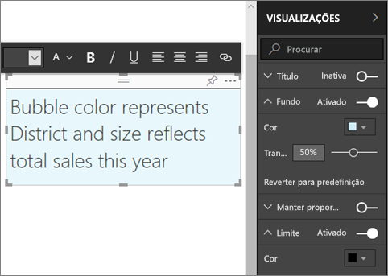

# Conteúdo estático em relatórios do Power BI
Pode adicionar caixas de texto e formas aos relatórios com o serviço Power BI e o Power BI Desktop. Em ambos os casos, tem de ter permissões de edição para o relatório. Se um relatório tiver sido partilhado consigo, não terá acesso à Vista de edição. 

Veja o Will a utilizar o Power BI Desktop para [adicionar imagens estáticas a um relatório](guided-learning/visualizations.yml#step-11) e, em seguida, siga os passos abaixo para experimentar por si próprio o serviço Power BI.
> 
> <iframe width="560" height="315" src="https://www.youtube.com/embed/_3q6VEBhGew" frameborder="0" allowfullscreen></iframe>
> 

## Adicionar uma caixa de texto a um relatório
1. Abra um relatório na Vista de edição.

2. Coloque o cursor numa área em branco da tela do relatório e selecione **Caixa de Texto**.
   
   
2. Escreva o texto na caixa de texto e, opcionalmente, formate a fonte, a cor e o alinhamento do texto. 
   
   
3. Para posicionar a caixa de texto, selecione a área cinzenta na parte superior e arraste. E, para redimensionar a caixa de texto, selecione e arraste qualquer uma das alças destacadas. 
   
   

4. Com a caixa de texto ainda selecionada, adicione a formatação adicional no painel VISUALIZAÇÕES. Neste exemplo, formatámos o fundo e o limite. Também pode criar uma posição e um tamanho exatos para uma caixa de texto.  

   

5. Para fechar a caixa de texto, selecione qualquer espaço em branco na tela do relatório. 

5. Selecione o ícone de pino  para afixar a caixa de texto a um dashboard. 

## Adicionar uma forma a um relatório
1. Coloque o cursor em qualquer parte da tela do relatório e selecione **Formas**.
   
   
2. Na lista pendente, selecione uma forma para adicioná-la à tela do relatórios. Vamos adicionar uma seta para direcionar a atenção para a bolha com a variância do total de vendas mais elevada. 
   
   No painel **Formatar forma**, personalize a forma. Neste exemplo, criámos uma seta vermelha com um limite vermelho escuro, com rotação de 90 graus.
   
   
3. Para posicionar a forma, selecione a área cinzenta na parte superior e arraste. Para redimensionar a forma, selecione e arraste qualquer uma das alças de destaque. Tal como acontece com a caixa de texto, também pode criar uma posição e um tamanho exatos para uma forma.

> **NOTA**: as formas não podem ser afixadas num dashboard, exceto como um dos elementos visuais quando [afixa uma página dinâmica](service-dashboard-pin-live-tile-from-report.md). 
> 
> 

### Próximos passos
[Adicionar uma hiperligação a uma caixa de texto](service-add-hyperlink-to-text-box.md)

[Power BI - Conceitos Básicos](service-basic-concepts.md)

Mais perguntas? [Pergunte à Comunidade do Power BI](http://community.powerbi.com/)
