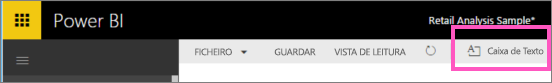
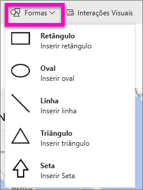
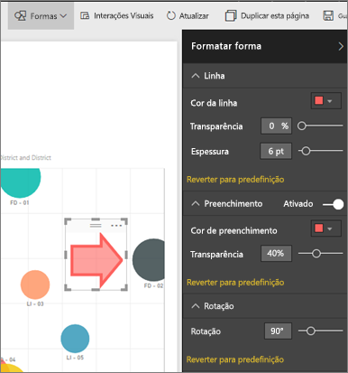

# Conteúdo estático em relatórios do Power BI
Na Vista de Edição, adicione caixas de texto e formas a um relatório no serviço Power BI. 

> **NOTA**: no Power BI Desktop, pode também [adicionar imagens estáticas ao relatório](guided-learning/visualizations.yml#step-11), conforme mostrado neste vídeo.
> 
> <iframe width="560" height="315" src="https://www.youtube.com/embed/_3q6VEBhGew" frameborder="0" allowfullscreen></iframe>
> 
> 

## Adicionar uma caixa de texto a um relatório
1. Coloque o cursor em qualquer parte da tela do relatório e selecione **Caixa de Texto**.
   
   
2. Escreva o texto na caixa de texto e, opcionalmente, formate a fonte, a cor e o alinhamento do texto. 
   
   
3. Para posicionar a caixa de texto, selecione a área cinzenta na parte superior e arraste. E para redimensionar a Caixa de Texto, selecione e arraste qualquer uma das alças destacadas. 
   
   
4. Para fechar a caixa de texto, selecione qualquer espaço em branco na tela do relatório.
5. Selecione o ícone de pino  para afixar a caixa de texto a um dashboard. 

## Adicionar uma forma a um relatório
1. Coloque o cursor em qualquer parte da tela do relatório e selecione **Formas**.
   
   
2. Na lista pendente, selecione uma forma para adicioná-la à tela do relatórios. Vamos adicionar uma seta para direcionar a atenção para a bolha com a variância do total de vendas mais elevada. 
   
   No painel **Formatar forma**, personalize a forma. Neste exemplo, criámos uma seta vermelha com um limite vermelho escuro, com rotação de 90 graus.
   
   
3. Para posicionar a forma, selecione a área cinzenta na parte superior e arraste. Para redimensionar a forma, selecione e arraste qualquer uma das alças de destaque. 

> **NOTA** As formas não podem ser afixadas a um dashboard. 
> 
> 

### Próximos passos
[Adicionar uma hiperligação a uma caixa de texto](service-add-hyperlink-to-text-box.md)

[Relatórios no Power BI](service-reports.md)

[Visualizações nos relatórios do Power BI](power-bi-report-visualizations.md)

[Power BI - Conceitos Básicos](service-basic-concepts.md)

Mais perguntas? [Pergunte à Comunidade do Power BI](http://community.powerbi.com/)

