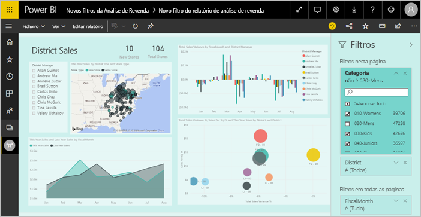
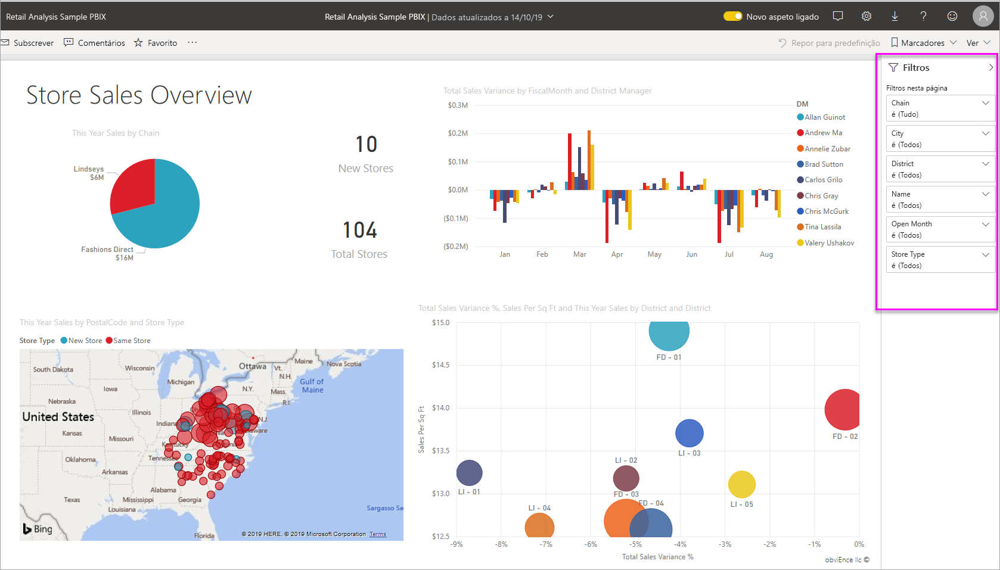
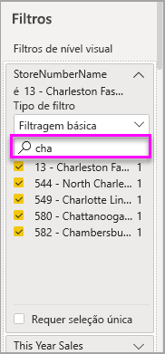
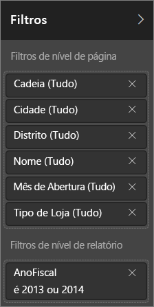
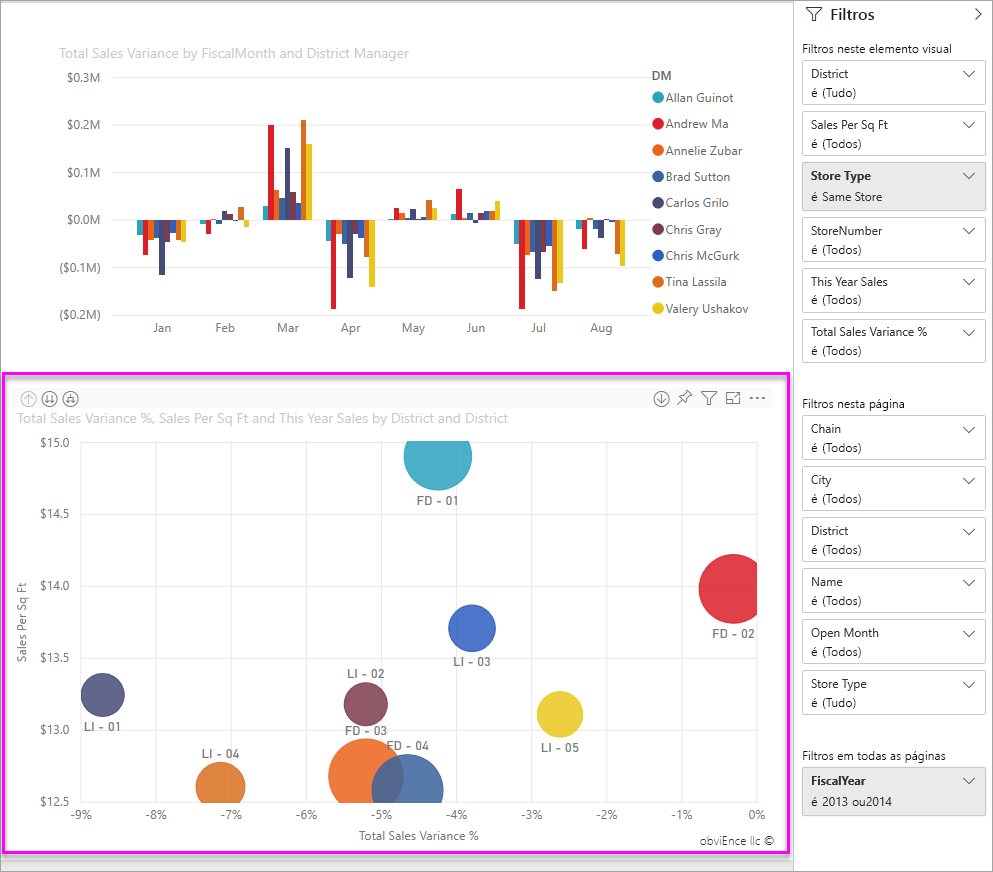
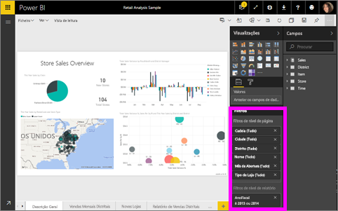

# Filtros e realces em relatórios do Power BI
 Este artigo apresenta-lhe os filtros e os realces no serviço Power BI. A experiência é praticamente a mesma no Power BI Desktop. Os *Filtros* removem tudo, menos os dados em que se pretende focar. Os *Realces* não são filtros. Não removem dados, mas realçam um subconjunto de dados visíveis; os dados não realçados permanecem visíveis, mas ficam esbatidos.

Existem várias formas diferentes de filtrar e realçar relatórios no Power BI. Colocar todas essas informações num artigo seria confuso, pelo que as dividimos nestas seções:

* Introdução aos filtros e realce (este artigo).
* Como [criar e utilizar filtros na Vista de edição](power-bi-report-add-filter.md) em relatórios do Power BI Desktop e do serviço Power BI. Quando tem permissões de edição de um relatório, pode criar, modificar e eliminar filtros nos relatórios.
* Como os elementos visuais [são filtrados e realçados num relatório partilhado consigo](consumer/end-user-interactions.md), na Vista de leitura no serviço Power BI. As ações que pode realizar são mais limitadas, mas ainda possui uma grande diversidade de opções de filtro e realce.  
* Uma visita detalhada aos [controlos de filtros e realce disponíveis na Vista de edição](power-bi-report-add-filter.md) no Power BI Desktop e no serviço Power BI. Este artigo apresenta uma análise aprofundada dos tipos de filtros, tais como data e hora, numérico e texto. Além disso, aborda as diferenças entre as opções básicas e avançadas.
* Depois de saber como os filtros e o realce funcionam por predefinição, saiba como [mudar a forma como as visualizações numa página se filtram e realçam](service-reports-visual-interactions.md).

**Sabia que?** O Power BI tem uma nova experiência de filtros. Leia mais sobre [a nova experiência de filtros nos relatórios do Power BI](power-bi-report-filter.md).

## Introdução ao painel Filtros

Pode aplicar filtros no painel **Filtros** ou ao [realizar seleções na segmentação de dados](visuals/power-bi-visualization-slicers.md) diretamente no próprio relatório. O painel Filtros mostra as tabelas e os campos utilizados no relatório e os filtros que foram aplicados, se existirem. 

Existem quatro tipos de filtros.

- Um **filtro de página** aplica-se a todos os elementos visuais na página do relatório     
- Um **filtro de elemento visual** aplica-se a um único elemento visual numa página do relatório. Apenas vê filtros ao nível de elemento visual se tiver selecionado um elemento visual na tela de relatórios.    
- Um **filtro de relatório** aplica-se a todas as páginas no relatório    
- Um **filtro de pormenorização** aplica-se a uma única entidade num relatório    

Pode pesquisar na página, no elemento visual e nos filtros de relatório, na Vista de leitura ou de edição para localizar e selecionar o valor pretendido. 

Se o filtro estiver acompanhado da palavra **Tudo**, significa que todos os valores no campo são incluídos no filtro.  Por exemplo,**Chain(All)** na captura de ecrã abaixo significa que esta página de relatório inclui dados sobre todas as cadeias de lojas.  Por outro lado, o filtro ao nível de relatório **FiscalYear is 2013 or 2014** indica que o relatório inclui apenas dados correspondentes aos anos fiscais de 2013 e 2014.

## Filtros na Vista de leitura e de edição
Existem dois modos de interagir com os relatórios: a [Vista de leitura](consumer/end-user-reading-view.md) e a Vista de edição. As funções de filtragem disponíveis para si dependem do modo no qual se encontra.

* Na Vista de edição, pode adicionar filtros de relatório, de página, de pormenorização e de elemento visual. Ao guardar o relatório, os filtros são guardados com aquele, mesmo que o abra numa aplicação móvel. As pessoas que veem o relatório na Vista de leitura podem interagir com os filtros que adicionou, mas não podem adicionar novos filtros.
* Na Vista de leitura, pode interagir com qualquer filtro existente no relatório e guardar as seleções que fizer. Não pode adicionar novos filtros.

### Filtros na Vista de leitura
Se apenas tiver acesso a um relatório na Vista de leitura, o painel Filtros terá um aspeto semelhante a este:

Esta página do relatório tem seis filtros ao nível da página e um filtro ao nível do relatório.

Cada elemento visual pode ter filtros para todos os campos no elemento visual e um autor do relatório pode adicionar mais. Na imagem abaixo, o gráfico de bolhas tem seis filtros.

Na Vista de leitura, explore os dados ao modificar os filtros existentes. As alterações que fizer são guardadas com o relatório, mesmo que abra o relatório numa aplicação móvel. Saiba como ao [fazer uma visita do painel Filtros do relatório](consumer/end-user-report-filter.md)

Ao sair do relatório, os filtros são guardados. Para anular a sua filtragem e voltar à filtragem, repartição, exploração e ordenação predefinidas definidas pelo autor do relatório, selecione **Repor para predefinição** na barra de menus superior.

### Filtros na Vista de edição
Quando tiver permissões de proprietário para um relatório e o abrir na Vista de edição, verá que **Filtros** é apenas um dos vários painéis de edição disponíveis.

Tal como na Vista de leitura, vemos que esta página do relatório tem seis filtros ao nível da página e um filtro ao nível do relatório. Ao selecionar o gráfico de bolhas, vemos que tem seis filtros ao nível do elemento visual aplicados.

Pode fazer mais com os filtros e o realce na Vista de edição. Principalmente, podemos adicionar novos filtros. Saiba como [Adicionar um filtro a um relatório](power-bi-report-add-filter.md) e muito mais.

## Realce ad-hoc
Selecione uma etiqueta de eixo ou valor num elemento visual para realçar os outros elementos visuais na página. Para remover o realce, selecione novamente o valor ou selecione um espaço vazio no mesmo elemento visual. O realce é uma forma divertida de explorar rapidamente os impactos de dados. Para ajustar a forma como este tipo de realce cruzado funciona, veja [Interações do elemento visual](service-reports-visual-interactions.md).

## Próximos passos

[A nova experiência de filtros nos relatórios do Power BI](power-bi-report-filter.md)

[Adicionar um filtro a um relatório (na Vista de edição)](power-bi-report-add-filter.md)

[Fazer uma visita aos filtros de relatórios](consumer/end-user-report-filter.md)

[Alterar como os elementos visuais de relatórios realizam filtragem cruzada e realce cruzado entre si](consumer/end-user-interactions.md)

Mais perguntas? [Pergunte à Comunidade do Power BI](https://community.powerbi.com/)

