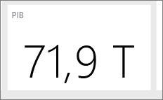

# Sugestões e truques para criar relatórios no Power BI Desktop e no serviço Power BI
Para aproveitar ao máximo os seus dados, por vezes precisa de uma ajuda extra. Reunimos algumas dicas e truques que pode usar ao criar relatórios no Microsoft Power BI Desktop, no serviço Power BI *e* nas edições Pro-Plus do Microsoft Excel 2013 ou 2016 com o suplemento Power Pivot ativado e o Power Query instalado e ativado.

## Power BI Desktop

### Aprender a utilizar o Editor de Consultas
O Editor de Consultas no Power BI Desktop é semelhante ao suplemento do Power Query no Excel 2013. Embora existam vários artigos úteis no Suporte do Power BI, talvez queira ler a documentação do Power Query em support.office.com para começar.

Pode obter mais informações no [Centro de Recursos do Power Query](https://support.office.com/article/Microsoft-Power-Query-for-Excel-Help-2b433a85-ddfb-420b-9cda-fe0e60b82a94).

Veja também a [Referência da Fórmula](https://support.office.com/Article/Learn-about-Power-Query-formulas-6bc50988-022b-4799-a709-f8aafdee2b2f).

### Tipos de dados no Editor de Consultas
Ao utilizar o Editor de Consultas no Power BI Desktop para carregar dados, fazemos a melhor estimativa sobre a deteção do tipo de dados.  Ao utilizar fórmulas, por vezes, as definições de tipo de dados nas colunas não são preservadas. Deve verificar se o tipo de dados das colunas está correto depois de fazer as seguintes operações:  carregar dados inicialmente no separador de consulta, Primeira Linha como Cabeçalho, Adicionar coluna, Agrupar por, Unir, Acrescentar e antes de premir para carregar dados pela primeira vez.

Um item importante a ser lembrado: o itálico na grelha de dados não significa que o tipo de dados esteja definido corretamente, apenas que os dados não são considerados Texto.

### Consultas de referência no Editor de Consultas
No navegador do Editor de Consultas do Power BI Desktop, quando clica com o botão direito do rato numa das consultas, está disponível uma opção para “Referência”.  Isto é útil pela seguinte razão:

* Quando utiliza ficheiros como origem de dados para uma consulta, o caminho absoluto para o ficheiro é armazenado na consulta. Ao partilhar ou mover o ficheiro do Power BI Desktop ou o livro do Excel, poupará tempo quando atualizar os caminhos ao atualizá-lo apenas uma vez, em vez de atualizar os caminhos.

Por predefinição, todas as consultas são carregadas para uma folha de cálculo do Excel ou para o modelo de dados (ou ambos). Algumas consultas são passos intermédios e não se destinam aos utilizadores finais.  Costuma ser o caso quando faz referência a consultas conforme mencionado acima.  Pode controlar o comportamento do carregamento da consulta ao clicar com o botão direito do rato no navegador e ao alternar a opção "Ativar Carregamento".  Quando "Ativar Carregamento" não tiver uma marca de verificação ao lado, a consulta ainda está disponível no separador de consulta e pode utilizá-la com outras consultas.  É especialmente útil na combinação com transformações de Unir, Acrescentar e Referência.  No entanto, uma vez que os resultados da consulta não são carregados para o modelo de dados, a consulta não agrupará a lista de campos dos relatórios ou o modelo de dados.

### Os gráficos de dispersão precisam de um identificador de pontos
Com um exemplo de uma tabela simples de Temperaturas e da Hora em que a leitura foi realizada. Se representar isto diretamente num gráfico de dispersão, o Power BI agregará todos os valores num único ponto. Para mostrar os pontos de dados individuais, tem de adicionar um campo ao registo Detalhes no painel do campo.   Uma forma simples de o fazer no Power BI Desktop, é no separador de consulta através da opção “Adicionar coluna de índice” no friso “Adicionar Coluna”.

### Linhas de referência no relatório
Pode utilizar uma coluna calculada no Power BI Desktop para definir uma linha de referência.  Identifique a tabela e coluna nas quais quer criar uma linha de referência.  Selecione "Nova coluna" no friso e, na barra de fórmulas, escreva a seguinte fórmula:

    Target Value = 100

Esta coluna calculada devolverá o valor 100, independentemente de onde for utilizado.  A nova coluna aparecerá na Lista de Campos.  Adicione a coluna calculada Valor de Destino a um gráfico de linhas para mostrar como qualquer série se relaciona com essa linha de referência específica.  

### Ordenar por outra coluna
Quando utiliza um valor (cadeia) categórico no Power BI para os eixos do gráfico ou numa segmentação de dados ou filtro, a ordem predefinida é a alfabética. Se precisar de substituir esta ordem, por exemplo, para elementos como dias da semana ou meses, poderá especificar que o Power BI Desktop classifique por coluna diferente. Para saber mais, veja [Classificar por coluna no Power BI Desktop](desktop-sort-by-column.md).

### Criar mapas mais facilmente com sugestões para o Bing
O Power BI está integrado no Bing para fornecer coordenadas de mapa predefinidas (um processo denominado geocodificação) para facilitar a criação de mapas.  O Bing utiliza alguns algoritmos e sugestões para tentar obter a localização certa, mas é a sua melhor estimativa. Para aumentar a probabilidade de uma geocodificação correta, pode utilizar as seguintes sugestões:

Quando cria um mapa, geralmente quer representar países, estados e cidades.  No Power BI Desktop, se designar as colunas de nome com a designação geográfica, isso ajudará o Bing a adivinhar o que quer apresentar. Por exemplo, se tiver um campo de nomes de estados dos EUA, como "Califórnia" e "Washington", o Bing pode devolver a localização de Washington, DC, em vez do Estado de Washington para a palavra "Washington".  Atribuir um nome à coluna "Estado" melhorará a geocodificação.  O mesmo acontece com as colunas “País” e “Cidade”.   

Algumas designações são ambíguas quando consideradas no contexto de vários países/regiões.  Em alguns casos, o que um país/região considera um "estado" é tratado como uma "província", "condado" ou alguma outra designação.  Pode aumentar a precisão da geocodificação ao criar colunas que acrescentam vários campos em conjunto e utilizá-las para representar localizações de dados.  Um exemplo seria transmitir "Wiltshire, Inglaterra" em vez de apenas "Wiltshire" para obter um resultado mais preciso de geocodificação.

Pode sempre fornecer localizações específicas de latitude e longitude no serviço Power BI ou no Power BI Desktop.  Ao fazer isto, também é necessário transmitir um campo Local; caso contrário, os dados serão agregados por padrão e o local da latitude e longitude talvez não corresponda ao esperado.

### Categorizar campos geográficos para fornecer sugestões de geocodificação do Bing
Outra forma de garantir que os campos são geocodificados corretamente é definir a Categoria de Dados nos campos de dados.   No Power BI Desktop, selecione a tabela desejada, vá para o friso Avançadas e defina a Categoria de Dados como Endereço, Cidade, Continente, País/Região, País, Código Postal, Estado ou Província.  Estas categorias de dados ajudam o Bing a codificar corretamente os dados. Para saber mais, veja [Data categorization in Power BI Desktop (Categorização de dados no Power BI Desktop)](desktop-data-categorization.md).

### Melhor geocodificação com localizações mais específicas
Por vezes, até mesmo a definição das categorias de dados para mapeamento é insuficiente.  Crie uma localização mais específica, como uma rua, através do Editor de Consultas do Power BI Desktop.  Utilize a funcionalidade Adicionar Coluna para criar uma coluna personalizada.  Em seguida, crie a localização desejada da seguinte forma:

    = [Field1] & " " & [Field2]

Em seguida, utilize este campo resultante nas visualizações de mapa. Este procedimento é bastante útil para a criação de ruas a partir dos campos de endereço para envio, comuns em conjuntos de dados.  Lembre-se de que a concatenação funciona apenas com campos de texto.  Se necessário, converta o número da rua num tipo de dados de texto antes de o utilizar para criar um endereço.

### Histogramas na fase de consulta
Existem várias formas de criar histogramas no Power BI Desktop; vamos começar com o mais simples e avançar para outros a partir daí:

Histogramas Mais Simples – Determine que consulta contém o campo no qual quer criar um histograma.  Utilize a opção "Referência" da consulta para criar uma nova consulta e atribua-lhe o nome de "Histograma FieldName". Utilize a opção "Agrupar por" no friso "Transformar" e selecione a agregação "contar linhas".  Certifique-se de que o tipo de dados é um número para a coluna agregada resultante. Em seguida, visualize estes dados na página de relatórios.  É rápido e fácil de criar, mas não funciona bem se tiver muitos pontos de dados e não permitir brushing em elementos visuais.

Definir registos para criar um histograma – Determine que consulta contém o campo no qual quer criar um histograma.  Utilize a opção "Referência" da consulta para criar uma nova consulta e atribua-lhe o nome de "FieldName".  Agora, defina os registos com uma regra.  Utilize a opção Adicionar Coluna Personalizada no friso Adicionar Coluna e crie uma regra personalizada.  Uma regra de registo simples pode assemelhar-se à seguinte:

    if([FieldName] \< 2) then "\<2 min" else
    if([FieldName] \< 5) then "\<5 min" else
    if([FieldName] \< 10) then "\<10 min" else
    if([FieldName] \< 30) then "\<30 min" else
    "longer")

Certifique-se de que o tipo de dados é um número para a coluna agregada resultante. Agora, pode utilizar o grupo através da técnica descrita no Histograma Mais Simples para obter o histograma.  Esta opção trata de mais pontos de dados, mas ainda não ajuda no brushing.

Definir um histograma que suporta brushing - Brushing é quando os elementos visuais são vinculados para que, quando um utilizador seleciona um ponto de dados num elemento visual, os outros elementos visuais na página do relatório realcem ou filtrem pontos de dados relacionados ao ponto de dados selecionado.  Como estamos a manipular dados no momento da consulta, temos de criar uma relação entre tabelas e garantir que sabemos que item detalhado está relacionado com o registo no histograma e vice-versa.

Inicie o processo ao utilizar a opção "Referência" na consulta que contém o campo no qual quer criar um histograma.  Atribua à nova consulta o nome "Registos".  Para este exemplo, vamos chamar à consulta original "Detalhes".  Em seguida, remova todas as colunas, exceto a coluna que utilizará como registo do histograma.  Agora, utilize a funcionalidade "Remover Duplicados" na consulta, no menu de contexto quando seleciona a coluna, para que os valores restantes sejam os valores exclusivos na coluna.   Se tiver números decimais, pode utilizar primeiro a sugestão para definir registos para criar um histograma para obter um conjunto gerível de registos.  Agora, verifique os dados mostrados na pré-visualização da consulta.  Se vir valores nulos ou em branco, terá de os corrigir antes de criar uma relação.  Veja "Criar relações se os dados tiverem valores nulos ou em branco".   Utilizar esta abordagem pode ser problemático devido à necessidade de ordenação.  Para que os registos sejam ordenados corretamente, veja "Ordenação: fazer com que as categorias apareçam na ordem que quero".  

>[!NOTE]
>É bastante útil pensar sobre a ordem de classificação antes de criar qualquer elemento visual.   

O passo seguinte do processo é definir uma relação entre as consultas "Registos" e "Detalhes" na coluna de registos.  No Power BI Desktop, clique em **Gerir Relações** na faixa de opções.  Crie uma relação em que Registos está na tabela esquerda e Detalhes na tabela direita e selecione o campo que está a utilizar para o histograma.

O último passo é criar o histograma.  Arraste o campo Registo da tabela "Registos".  Remova o campo predefinido do gráfico de colunas resultante.  Agora, na tabela "Detalhes", arraste o campo de histograma para o mesmo elemento visual.  No painel do campo, altere a agregação predefinida para Contar.  O resultado é o histograma. Se criar outro elemento visual como um treemap a partir da tabela Detalhes, selecione um ponto de dados no treemap para ver o histograma realçado e mostrá-lo para o ponto de dados selecionado em relação à tendência de todo o conjunto de dados.

### Histogramas
No Power BI Desktop, pode utilizar um campo calculado para definir um Histograma.  Identifique a tabela e coluna nas quais quer criar um histograma.  Na área de cálculo, escreva a seguinte fórmula:

> Frequency:=COUNTROWS(\<Nome da Coluna\>)
>
>

Guarde as alterações e volte ao relatório.  Adicione o \<Nome da Coluna\> e a Frequência a uma tabela e converta-os num gráfico de barras.  Certifique-se de que o \<Nome da Coluna\> está no eixo x e que o campo calculado Frequência está no eixo y.

### Sugestões e truques para criar relações no Power BI Desktop
Geralmente, ao carregar conjuntos de dados detalhados de várias origens, problemas como valores nulos, valores em branco ou valores duplicados impedem que crie relações.

Vejamos um exemplo:

Se carregarmos conjuntos de pedidos de suporte ao cliente ativos e outro conjunto de dados de itens de trabalho com os seguintes esquemas:

> CustomerInicdents: {IncidentID, CustomerName, IssueName, OpenedDate, Status} WorkItems: {WorkItemID, IncidentID, WorkItemName, OpenedDate, Status, CustomerName }
>
>

Quando quisermos acompanhar todos os incidentes e itens de trabalho relacionados com um CustomerName específico, não podemos simplesmente criar uma relação entre esses dois conjuntos de dados.  Alguns WorkItems não podem estar relacionados com um CustomerName, portanto, esse campo estaria em branco ou seria NULL.  Podem existir vários registos em WorkItems e CustomerIncidents para um determinado CustomerName.  

#### Criar relações no Power BI Desktop quando os dados têm valores nulos ou em branco
Os conjuntos de dados geralmente contêm colunas com valores nulos ou em branco.  Isto pode causar problemas ao tentar utilizar relações.  Basicamente, tem duas opções para resolver os problemas.  Pode remover as linhas com valores nulos ou em branco.  Pode fazê-lo através da funcionalidade de filtro no separador de consulta ou, se estiver a unir consultas, ao selecionar a opção "Manter apenas linhas correspondentes". Como alternativa, pode substituir os valores nulos ou em branco por valores que funcionam em relações, normalmente cadeias como "NULL" e "(Blank)".   Não existe nenhuma abordagem certa aqui. Filtrar linhas na fase de consulta remove as linhas e pode afetar os cálculos e as estatísticas de resumo.  A última abordagem preserva essas linhas de dados, mas pode fazer com que as linhas não relacionadas apareçam relacionadas no modelo, o que gera erros de cálculo.  Se adotar a última solução, certifique-se de que utiliza filtros na Vista/Gráfico quando for apropriado para garantir que está a obter resultados precisos.  O mais importante é avaliar que linhas são mantidas/removidas e compreender o impacto geral na análise.  

#### Criar relações no Power BI Desktop quando os dados têm valores duplicados
Geralmente, ao carregar conjuntos de dados detalhados de várias origens, os valores de dados duplicados impedem que crie relações.  Pode resolver isto ao criar uma tabela de dimensões com os valores exclusivos de ambos os conjuntos de dados.

Vejamos um exemplo:

Se carregarmos conjuntos de dados de pedidos de suporte ao cliente ativos e outro conjunto de dados de itens de trabalho com os seguintes esquemas:

> CustomerInicdents: {IncidentID, CustomerName, IssueName, OpenedDate, Status} WorkItems: {WorkItemID, IncidentID, WorkItemName, OpenedDate, Status, CustomerName }
>
>

Quando quisermos acompanhar todos os incidentes e itens de trabalho relacionados com um CustomerName específico, não podemos simplesmente criar uma relação entre esses dois conjuntos de dados.  Alguns WorkItems não podem estar relacionados com um CustomerName, portanto, esse campo estaria em branco ou seria NULL.  Se tiver todos os valores nulos ou em branco na tabela CustomerNames, talvez ainda não consiga criar uma relação. Veja Criar relações quando os dados têm valores nulos ou em branco.  Pode, existir vários WorkItems e CustomerIncidents para um único CustomerName.  

Para criar uma relação neste caso, temos de criar um conjunto de dados lógico de todos os CustomerNames nos dois conjuntos de dados.  No separador Consulta, pode utilizar a seguinte sequência para criar o conjunto de dados lógico:

1. Duplique duas consultas, nomeando a primeira **Temp** e a segunda **CustomerNames**.
2. Em cada consulta, remova todas as colunas, *exceto* a coluna CustomerName
3. Em cada consulta, use **Remover Duplicado**.
4. Na consulta **CustomerNames**, selecione a opção **Acrescentar** na faixa de opções e, em seguida, selecione a consulta **Temp**.
5. Na consulta **CustomerNames**, selecione **Remover Duplicados**.

Agora tem uma tabela de dimensões que pode ser utilizada para relacionar CustomerIndicents e WorkItems com todos os valores de cada um.  

### Padrões para acelerar a utilização do Editor de Consultas
O Editor de Consultas é bastante eficiente em como consegue manipular dados para formatar e limpá-los para que estejam prontos para serem visualizados ou modelados. Existem alguns padrões que deve conhecer.

#### As colunas temporárias podem ser eliminadas após o cálculo de um resultado
Geralmente, tem de criar um cálculo no Power BI Desktop que transforma os dados de várias colunas numa única coluna nova.  Isto pode ser complexo.  Uma forma fácil de resolver este problema é decompor a operação em passos.  Comece por duplicar as colunas iniciais. Em seguida, crie colunas temporárias nos passos. Em seguida, crie uma coluna para o resultado final.  Depois, pode eliminar as colunas temporárias para que o conjunto de dados final não seja agrupado. Isto é possível porque o separador de consulta executa os passos por ordem.

#### Duplicar ou referenciar consultas seguidas de união na consulta original
Por vezes é bastante útil calcular estatísticas de resumo para um conjunto de dados.  A forma mais fácil de o fazer é duplicar ou referenciar a consulta no separador de consulta. Em seguida, use **Agrupar por** para calcular as estatísticas de resumo.  As estatísticas de resumo ajudam a normalizar os dados nos dados originais para que sejam mais comparáveis.  Isto é especialmente útil para comparar valores individuais com o todo.  Para tal, vá para a consulta original e selecione a opção de união.  Em seguida, una os dados da consulta de estatísticas de resumo que corresponde aos identificadores apropriados.  Agora está pronto para normalizar os dados conforme necessário para a sua análise.

### Utilizar o DAX pela primeira vez
DAX é a linguagem de fórmula de cálculo no Power BI Desktop.  Está otimizado para análises de BI.  É um pouco diferente das linguagens com que está familiarizado se utilizou apenas uma linguagem de consulta como o SQL. Existem recursos muito bons online e na literatura para obter informações sobre o DAX.

[Aprender as Noções Básicas do DAX no Power BI Desktop](desktop-quickstart-learn-dax-basics.md)

[Referência do DAX (Data Analysis Expressions)](https://msdn.microsoft.com/library/gg413422.aspx)

[Central de Recursos do DAX](http://social.technet.microsoft.com/wiki/contents/articles/1088.dax-resource-center.aspx)

## Serviço Power BI *e* Power BI Desktop

### Leia o documento técnico: [Princípios de conceção de relatórios do Power BI](visuals/power-bi-visualization-best-practices.md)
Este documento disponibiliza as melhores práticas para criar relatórios no Power BI. A começar pelo planeamento, aborda os princípios de design que pode aplicar aos seus relatórios e páginas e os elementos visuais individuais que constituem os relatórios. Muitas destas melhores práticas também se aplicam ao design de dashboards.

### Leia e/ou veja "Como conceber visualmente fantásticos relatórios (e dashboards) no Power BI"
O membro da comunidade Miguel Myers é um Cientista de Dados e também Designer Gráfico.

* [Leia o blogue](https://powerbi.microsoft.com/blog/how-to-design-visually-stunning-reports/)
* [Veja o webinar](https://info.microsoft.com/CO-PowerBI-WBNR-FY16-04Apr-19-Design-Reports-in-PowerBI-Registration.html)

### Considerar o público-alvo
Quais são as principais métricas que ajudarão a tomar decisões? Como será utilizado o relatório? Que suposições aprendidas ou culturais podem afetar as opções de design? De que informações o público-alvo precisa para ser bem-sucedido?

Onde será apresentado o relatório? Se for apresentado num monitor grande, pode colocar mais conteúdo. Se os leitores o visualizarem em tablets, menos visualizações serão mais legíveis.

### Contar uma história e mantê-la no ecrã
Cada página do relatório deve contar uma história num instante. Pode evitar barras de deslocamento na suas páginas? Está o relatório muito confuso ou muito ocupado?  Remova todas as informações que não são essenciais que podem ser facilmente lidas e interpretadas.

### Adicionar as informações mais importantes
Se o texto e as visualizações no dashboard forem do mesmo tamanho, os leitores terão dificuldade em se concentrar no que é mais importante. Por exemplo, as visualizações de cartão são uma boa forma de apresentar um número importante em destaque:  

### Mas não se esqueça de fornecer contexto  

Utilize funcionalidades como caixas de texto e descrições para adicionar contexto às visualizações.

### Colocar as informações mais importantes no canto superior
A maioria das pessoas leem de cima para baixo, pelo que deve colocar o nível mais alto de detalhes na parte superior e mostrar mais detalhes à medida que se move na direção que o público-alvo utiliza para ler (da esquerda para a direita, da direita para a esquerda).

### Utilizar a visualização correta para os dados e formatá-la para leitura facilitada
Evite várias visualizações.  As visualizações devem ter uma visão geral e serem fáceis de "ler" e interpretar.  Para alguns dados e visualizações, uma visualização gráfica simples é suficiente. No entanto, outros dados podem exigir uma visualização mais complexa. Certifique-se de que utiliza títulos, etiquetas e outras personalizações para ajudar o leitor.  

* Tenha cuidado ao utilizar gráficos que distorçam a realidade, ou seja, gráficos 3D e gráficos que não começam em zero. Não se esqueça de que é mais difícil para o cérebro humano interpretar formas circulares. Gráficos circulares, gráficos em anel, medidores e outros tipos de gráficos circulares podem parecer muito bonitos, mas será que não pode antes utilizar um elemento visual diferente?    
* Seja consistente com escalas de gráfico de eixos, ordenação da dimensão do gráfico e também com as cores utilizadas para os valores de dimensão nos gráficos.    
* Certifique-se de que codifica corretamente os dados quantitativos. Não exceda três ou quatro dígitos quando apresentar números. Apresente medidas com um ou dois números à esquerda da vírgula decimal e escala de milhares ou milhões, ou seja 3,4 milhões e não 3.400.000.    
* Tente evitar a mistura de níveis de precisão e tempo. Certifique-se de que os períodos de tempo são bem compreendidos.  Não é necessário um gráfico com o mês passado ao lado de gráficos filtrados de um determinado mês do ano.    
* Tente também evitar misturar medidas grandes e pequenas na mesma escala, como num gráfico de linhas ou de barras.  Por exemplo, uma medida pode estar em milhões e outras medidas em milhares.  Com uma escala grande, seria difícil ver as diferenças da medida que está em milhares.  Se precisar de misturar, escolha uma visualização, como um gráfico de combinação, que permita a utilização de um segundo eixo.    
* Evite sobrecarregar os gráficos com etiquetas de dados desnecessárias. Os valores em gráficos de barras, ***se forem suficientemente grandes***, são normalmente bem compreendidos sem apresentar o número real.   
* Preste atenção a como [os gráficos são ordenados](power-bi-report-change-sort.md).  Se quiser chamar a atenção para o número mais alto ou mais baixo, ordene pela medida.  Se quiser que as pessoas localizem rapidamente uma categoria específica de entre muitas outras categorias, ordene pelo eixo.  
* Os gráficos circulares são recomendados se tiverem menos de oito categorias. Uma vez que não pode comparar valores lado a lado, é mais difícil comparar valores num gráfico circular do que em gráficos de barras e colunas. Os gráficos circulares pode ser bons para ver relações de parte a um todo em vez de comparar as partes. Os gráficos de medidor são ótimos para apresentar o estado atual no contexto de um objetivo.    

Para obter instruções específicas de visualização, consulte [Tipos de visualização no Power BI](visuals/power-bi-visualization-types-for-reports-and-q-and-a.md).  

### Saiba mais sobre as Melhores Práticas para Criação de Dashboards
Alguns dos nossos livros favoritos incluem:

* *Storytelling with Data* de Cole Nussbaumer Knafic
* *Data points* de Nathan Yau
* *The truthful Art* de Alberto Cairo
* *Now You See It* de Stephen Few  
* *Envisioning Information* de Edward Tufte  
* *Advanced Presentations Design* de Andrew Abela   

## Próximos passos
[Power BI - Conceitos Básicos](service-basic-concepts.md)

[Relatórios no Power BI](service-reports.md)

Mais perguntas? [Pergunte à Comunidade do Power BI](http://community.powerbi.com/)
