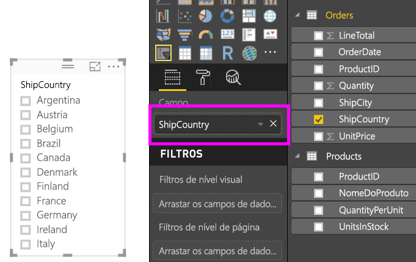
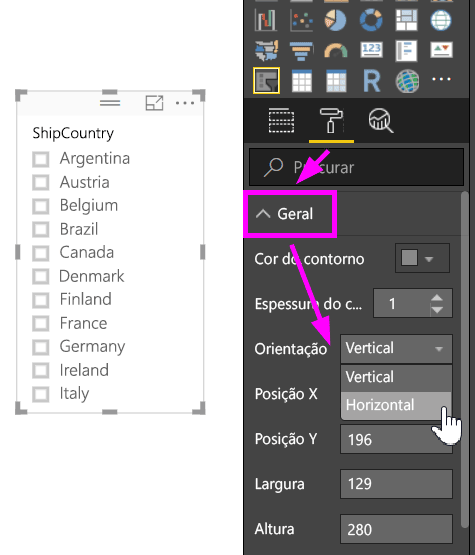
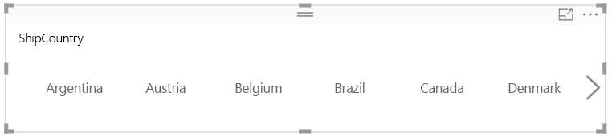
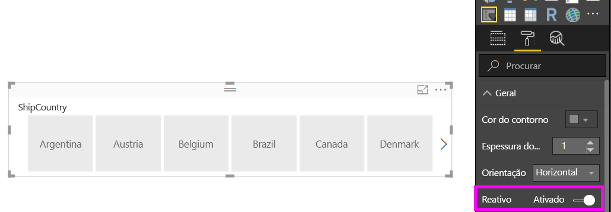
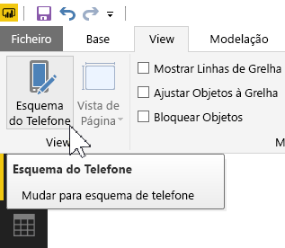
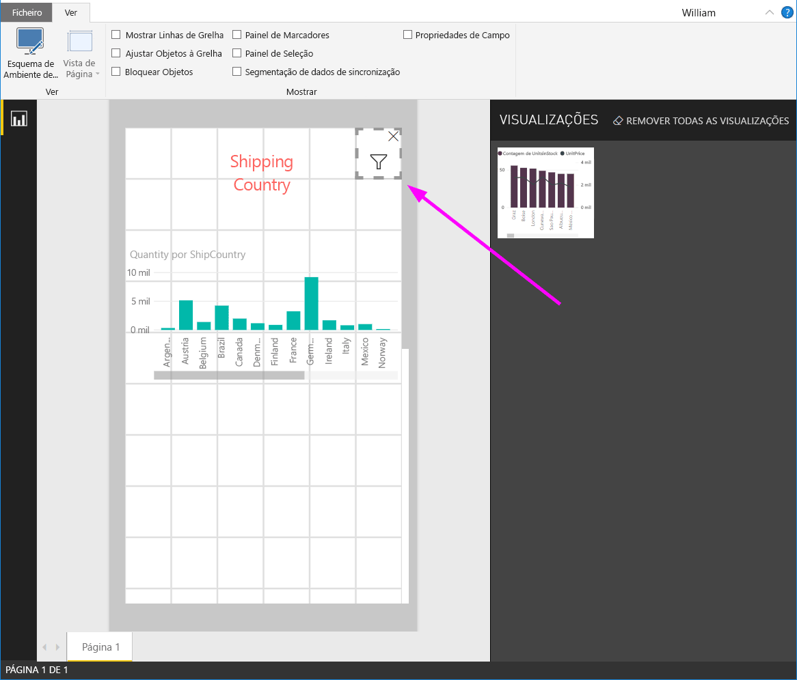

# Criar uma segmentação de dados reativa que pode redimensionar no Power BI

As segmentações de dados reativas são redimensionadas para se ajustarem a qualquer espaço no seu relatório. Pode ajustar as segmentações de dados reativas para diferentes formas e tamanhos (por exemplo, na horizontal, vertical ou em quadrado) e os valores da segmentação de dados serão reorganizados à medida que o fizer. No Power BI Desktop e no serviço Power BI, pode tornar as segmentações de dados horizontais e de data/intervalo reativas. Além disso, as segmentações de dados de data/intervalo têm áreas de toque melhoradas para que sejam fáceis de alterar com um só dedo. Pode aumentar ou diminuir as segmentações de dados reativas o quanto quiser. Também são redimensionadas automaticamente para se ajustarem a relatórios no serviço Power BI e nas aplicações móveis do Power BI. 

## Criar uma segmentação

O primeiro passo para criar uma segmentação de dados dinâmica é criar uma segmentação de dados básica. 

1. Selecione o ícone **Segmentação de Dados**  no painel **Visualizações**.
2. Arraste o campo que pretende filtrar para **Campo**.

    

## Converter numa segmentação de dados horizontal

1. Com a segmentação de dados selecionada, no painel **Visualizações**, selecione o separador **Formatar**.
2. Expanda a secção **Geral**. Em **Orientação**, selecione **Horizontal**.

     

1.  Poderá querer aumentar a largura para mostrar mais valores.

     

## Tornar a segmentação de dados reativa e testá-la

Este passo é fácil. 

1. Em **Orientação**, na secção **Geral** do separador **Formatar**, mude a opção **Reativa** para **Ativa**.  

    

1. Agora pode testá-la. Arraste os cantos para aumentar ou diminuir a segmentação de dados na vertical ou horizontal. Se a tornar muito pequena, esta torna-se um ícone de filtro.

    

## Adicionar a segmentação de dados a um esquema de relatório de telemóvel

No Power BI Desktop, pode criar um esquema de telemóvel para cada página de um relatório. Se uma página tiver um esquema de telemóvel, será apresentada na vista vertical do telemóvel. Caso contrário, terá de vê-la na vista horizontal. 

1. No menu **Ver**, selecione **Esquema de Telemóvel**.

     
    
1. Arraste para a grelha todos os elementos visuais que pretende colocar no relatório de telemóvel. Ao arrastar a segmentação de dados reativa, coloque-a com o tamanho pretendido (neste caso, apenas um ícone de filtro).

    

Saiba mais sobre criar [relatórios otimizados para as aplicações móveis do Power BI](desktop-create-phone-report.md).

## Tornar uma segmentação de dados de tempo ou intervalo reativa

Pode seguir os mesmos passos para tornar uma segmentação de dados de intervalo ou mosaico reativa. Após definir a opção **Reativa** para **Ativa**, irá aperceber-se de algumas coisas:

- Os elementos visuais otimizam a ordem de caixas de introdução consoante o tamanho permitido na tela. 
- A apresentação dos elementos de dados é otimizada para tornar a segmentação de dados o mais utilizável possível, com base no tamanho permitido na tela. 
- As novas barras de deslocamento redondas nas segmentações de dados otimizam as interações de toque. 
- Quando um elemento visual se torna demasiado pequeno para ser útil, torna-se um ícone que representa o tipo de elemento visual, como substituto. Para interagir com o mesmo, faça duplo toque para abri-lo no modo de detalhe. Isto poupa espaço importante na página do relatório sem prejudicar a funcionalidade.

## Próximos passos

- [Segmentações de dados no serviço Power BI](visuals/power-bi-visualization-slicers.md)
- Mais perguntas? [Experimente perguntar à Comunidade do Power BI](http://community.powerbi.com/)