# Mapas ArcGIS no serviço Power BI e Power BI Desktop pela Esri
Este tutorial foi escrito do ponto de vista de uma pessoa que está a criar um mapa ArcGIS. Quando um criador partilha um mapa ArcGIS com um colega, este pode ver e interagir com o mapa, mas não pode guardar as alterações. Para saber mais sobre a visualização de um mapa ArcGIS, veja [Interagir com mapas ArcGIS](power-bi-visualizations-arcgis.md).

A combinação de mapas ArcGIS com o Power BI leva o mapeamento além da apresentação de pontos num mapa, a um nível totalmente novo. Escolha entre mapas de base, tipos de localização, temas, estilos de símbolos e camadas de referência para criar belíssimas visualizações de mapas informativos. A combinação de camadas de dados autoritativas num mapa com análise espacial proporciona uma compreensão mais aprofundada dos dados na visualização.

 Embora não seja possível criar um mapa ArcGIS num dispositivo móvel, pode visualizá-lo e interagir com o mesmo. Consulte [Interagir com mapas ArcGIS](power-bi-visualizations-arcgis.md).

> [!TIP]
> GIS significa Geographic Information Science (Sistemas de Informação Geográfica).

O exemplo abaixo utiliza uma tela em cinzento escuro para mostrar as vendas regionais como um mapa térmico, em relação a uma camada demográfica do rendimento disponível médio de 2016. Como poderá constatar nesta leitura, a utilização de mapas ArcGIS oferece uma capacidade praticamente ilimitada de mapeamento avançado, dados demográficos e visualizações de mapas ainda mais apelativas para contar a sua melhor história.

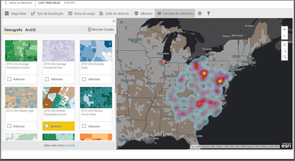

> [!TIP]
> Visite a [página da esri no Power BI](https://www.esri.com/powerbi) para ver muitos exemplos e ler depoimentos. E, em seguida, veja a página [Introdução ao ArcGIS Maps for Power BI](https://doc.arcgis.com/en/maps-for-powerbi/get-started/about-maps-for-power-bi.htm) da ESRI.

## Consentimento do utilizador
O ArcGIS Maps for Power BI é fornecido pela Esri (www.esri.com). A utilização do ArcGIS Maps for Power BI está sujeita aos termos e política de privacidade da Esri. Os utilizadores do Power BI que pretendam utilizar os elementos visuais do ArcGIS Maps for Power BI têm de aceitar a caixa de diálogo de consentimento.

**Recursos**

[Termos](https://go.microsoft.com/fwlink/?LinkID=826322)

[Política de Privacidade](https://go.microsoft.com/fwlink/?LinkID=826323)

[Página do produto ArcGIS Maps for Power BI](https://www.esri.com/powerbi)

 

## Ativar mapa ArcGIS
Os mapas ArcGIS estão atualmente disponíveis no serviço Power BI, Power BI Desktop e Power BI Mobile. Este artigo fornece instruções para o serviço e para o Desktop.

### Ativar o mapa ArcGIS ***no serviço Power BI (app.powerbi.com)***
Este tutorial utiliza o [Exemplo de Análise de Retalho](sample-retail-analysis.md). Para ativar o **ArcGIS Maps for Power BI**:

1. Na secção superior direita da barra de menus, selecione o ícone da roda dentada e abra **Definições**
   
    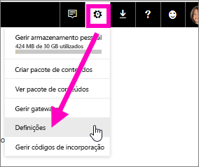
2. Selecione a caixa de verificação **ArcGIS Maps for Power BI**. Terá de reiniciar o Power BI depois de realizar a seleção.
   
    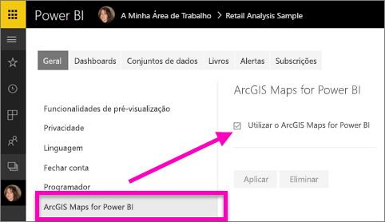
3. Abra um relatório na [Vista de edição](service-reading-view-and-editing-view.md) e selecione o ícone do ArcGIS Maps for Power BI no painel Visualizações.
   
    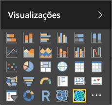
4. O Power BI adiciona um modelo de mapa do ArcGIS em branco à tela de relatórios.
   
   

 

## Criar um elemento visual de mapa do ArcGIS
O Watch irá criar algumas visualizações diferentes de mapas ArcGIS. Em seguida, utilize os passos abaixo para as experimentar com o [Exemplo de Análise de Retalho](sample-datasets.md).

<iframe width="560" height="315" src="https://www.youtube.com/embed/EKVvOZmxg9s" frameborder="0" allowfullscreen></iframe>

1. No painel **Campos**, arraste um campo de dados para os grupos **Localização** ou **Latitude** e/ou **Longitude**. Neste exemplo, estamos a utilizar **Arquivo > Cidade**.
   
   > [!NOTE]
   > O ArcGIS Maps for Power BI irá detetar automaticamente se os campos que selecionou são melhor vistos como uma forma ou um ponto de um mapa. Pode ajustar a predefinição nas definições (ver abaixo).
   > 
   > 
   
    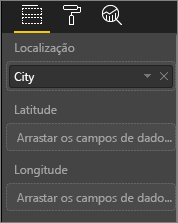
2. Converta a visualização de um mapa ArcGIS ao selecionar o modelo no painel Visualizações .
3. No painel **Campos**, arraste uma medida para o registo **Tamanho**, para ajustar a forma como os dados são apresentados. Neste exemplo, estamos a utilizar **Vendas > Vendas do Último Ano**.
   
    

## Definições e formatação de mapas ArcGIS
Para aceder às funcionalidades de formatação do **ArcGIS Maps for Power BI**:

1. Aceda às funcionalidades adicionais, selecionando as reticências no canto superior direito da visualização e escolhendo **Editar**,
   
   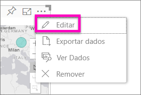
   
   As funcionalidades disponíveis são apresentadas no topo da visualização. Cada funcionalidade, quando selecionada, abre um painel de tarefas que fornece opções detalhadas. 
   
   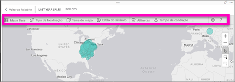
   
   > [!NOTE]
   > Para obter mais informações sobre as definições e funcionalidades, veja **Documentação detalhada** abaixo.
   > 
   > 
2. Para regressar ao relatório, selecione **Voltar ao Relatório**, no canto superior esquerdo da tela do relatório.

 

## Documentação detalhada
A **Esri** fornece [documentação completa](https://go.microsoft.com/fwlink/?LinkID=828772) do conjunto de funcionalidades do **ArcGIS Maps for Power BI**.

## Descrição geral das funcionalidades
### Mapas Base
São fornecidos quatro mapas base: Tela Cinzento Escuro, Tela Cinzento Claro, OpenStreetMap e Streets.  Streets é o mapa base padrão do ArcGIS.

Para aplicar um mapa base, selecione-o no painel de tarefas.

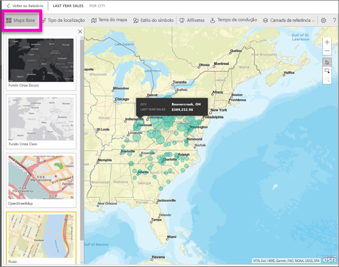

### Tipo de localização
O ArgGIS Maps for Power BI deteta automaticamente a melhor forma de mostrar dados no mapa. Seleciona de Pontos ou Limites. As opções do tipo de Localização permitem-lhe ajustar as seleções.

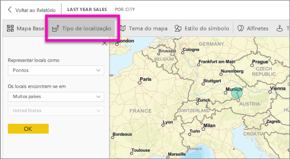

Os **Limites** só irão funcionar se os seus dados contiverem valores geográficos padrão. A esri percebe automaticamente qual a forma a mostrar no mapa. Os valores geográficos padrão incluem países, províncias, códigos postais, etc. Mas, tal como com na Geocodificação, o Power BI pode não detetar o campo que deveria ser um limite por predefinição ou pode não ter um limite para os seus dados.  

### Tema do mapa
São fornecidos quatro temas de mapas. Os temas Apenas Localização e Tamanho são escolhidos automaticamente, com base nos campos que vincular à localização, e são adicionados ao registo **Tamanho** no painel Campos do Power BI. Estamos a utilizar atualmente o **Tamanho**, por isso, vamos alterar para **Mapa térmico**.  

<table>
<tr><th>Tema</th><th>Descrição</th>
<tr>
<td>Apenas Localização</td>
<td>Desenha pontos de dados ou limites preenchidos no mapa, com base nas definições do Tipo de Localização.</td>
</tr>
<tr>
<td>Mapa Térmico</td>
<td>Desenha um gráfico de intensidade dos dados no mapa.</td>
</tr>
<tr>
<td>Tamanho</td>
<td>Desenha pontos de dados no mapa que se baseiam no tamanho, com base no valor do registo de tamanho no painel de campos.</td>
</tr>
<tr>
<td>Clustering</td>
<td>Desenhe o número de pontos de dados em regiões no mapa. </td>
</tr>
</table>

### Estilo de símbolo
Os estilos de símbolo permitem-lhe ajustar a forma como os dados são apresentados no mapa. Os estilos de símbolo são sensíveis ao contexto, com base no tipo de Localização selecionado e no tema do Mapa. O exemplo abaixo mostra o tipo de Localização definido como **Tamanho** e alguns ajustes para transparência, estilo e tamanho.

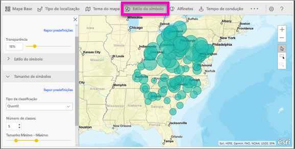

### Marcadores
Chame a atenção para pontos no seu mapa adicionando marcadores.  

1. Selecione o separador **Marcadores**.
2. Introduza palavras-chave (por exemplo, endereços, locais e ponto de interesse) na caixa de pesquisa e selecione-as na lista pendente. É apresentado um símbolo no mapa, e o mapa amplia automaticamente para a localização. Os resultados da pesquisa são guardados como cartões de localização no painel Marcadores. Pode guardar até 10 cartões de localização.
   
   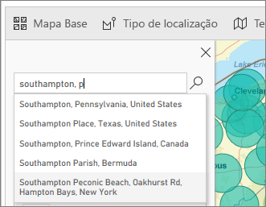
3. O Power BI adiciona um marcador a essa localização e pode alterar a cor do marcador.
   
   
4. Adicione e exclua marcadores.
   
   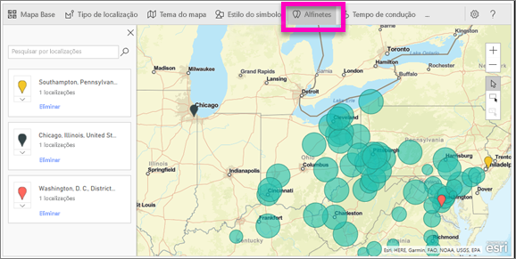

### Tempo da unidade
O painel Tempo da unidade permite-lhe selecionar uma localização e, em seguida, determinar que outras funcionalidades do mapa se encontram num raio especificado ou tempo de viagem.  
    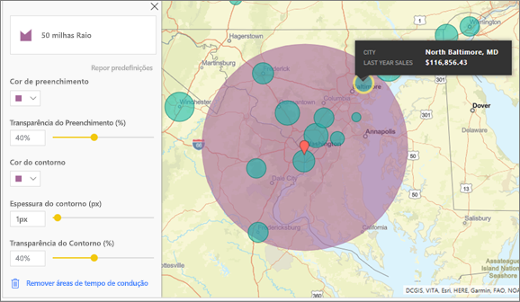

1. Selecione o separador **Tempo da unidade** e escolha a ferramenta de seleção múltipla. Seleção única do marcador de Washington D.C.
    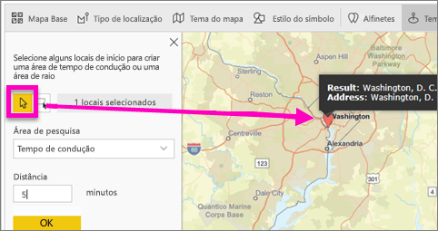
   
   > [!TIP]
   > É mais fácil selecionar uma localização se ampliar o mapa (com o ícone +).
   > 
   > 
2. Vamos supor que vai viajar para Washington D.C. por alguns dias e pretende saber quais as lojas que se encontram a uma distância de viagem razoável. Altere a Área de pesquisa para **Raio** e a distância para **50** quilómetros e selecione OK.    
   
    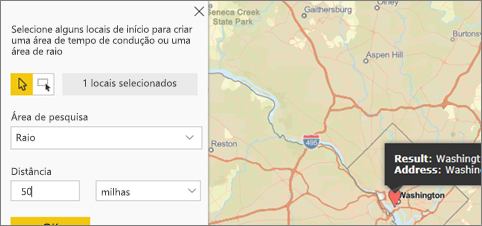
3. O raio é mostrado em roxo. Selecione qualquer localização para apresentar os detalhes. Opcionalmente, formate o raio, alterando a cor e a descrição.
   
    

### Camada de Referência
#### Camada de referência - Demografia
O ArcGIS Maps for Power BI fornece uma seleção de camadas demográficas que ajudam a contextualizar os dados do Power BI.

1. Selecione o separador **Camada de referência** e escolha **Demografia**.
2. Cada camada listada tem uma caixa de verificação. Adicione uma marca de verificação para adicionar essa camada ao mapa.  Neste exemplo, adicionámos o rendimento médio familiar. 
   
    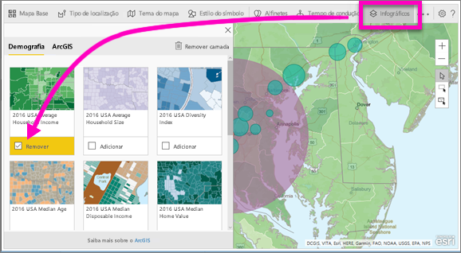
3. Cada camada é também interativa. Tal como pode pairar o rato sobre uma bolha para ver os detalhes, pode clicar numa área sombreada do mapa para ver os detalhes. 
   
    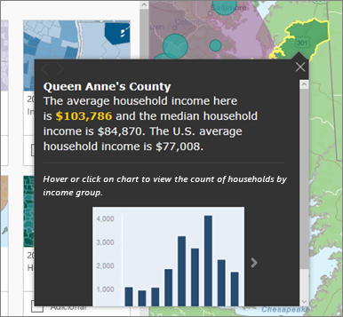

#### Camada de referência - ArcGIS
O ArcGIS Online fornece a capacidade às organizações de publicarem mapas Web públicos. Além disso, a Esri fornece um conjunto organizado de mapas Web através do Living Atlas. No separador ArcGIS, pode pesquisar todos os mapas Web públicos ou mapas Living Atlas e adicioná-los ao mapa como camadas de referência.

1. Selecione o separador **Camada de referência** e escolha **ArcGIS**.
2. Introduza os termos de pesquisa e, em seguida, selecione uma camada do mapa. Neste exemplo, escolhemos distritos Congressistas dos EUA.
   
    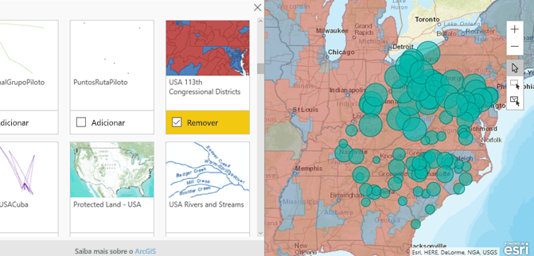
3. Para ver os detalhes, selecione uma área sombreada para abrir *Selecionar da camada de referência*: utilize a ferramenta de seleção da camada de referência para limites de seleção ou objetos na camada da referência.

 

## Selecionar Pontos de dados
O ArcGIS Maps for Power BI permite três modos de seleção.

Altere o modo de seleção com o comutador:

 Selecione pontos de dados individuais.

 Desenha um retângulo no mapa e seleciona os pontos de dados contidos.

 Permite que os limites ou polígonos dentro de camadas de referência sejam utilizados para selecionar pontos de dados contidos.

> [!NOTE]
> É possível selecionar o máximo de 250 pontos de dados de cada vez.
> 
> 

 

## Obter ajuda
A **Esri** fornece [documentação completa](https://go.microsoft.com/fwlink/?LinkID=828772) do conjunto de funcionalidades do **ArcGIS Maps for Power BI**.

Pode colocar perguntas, encontrar as informações mais recentes, problemas de relatório e localizar as respostas no [thread da Comunidade do Power BI relacionadas com o **ArcGIS Maps for Power BI**](https://go.microsoft.com/fwlink/?LinkID=828771).

Se tiver uma sugestão para uma melhoria, submeta-a na [Lista de ideias do Power BI](https://ideas.powerbi.com).

 

## Gerir a utilização do ArcGIS Maps for Power BI na organização
O Power BI fornece a capacidade aos utilizadores, administradores inquilinos e administradores de TI de determinarem se devem utilizar o ArcGIS Maps for Power BI.

**Opções de utilizador** No Power BI Desktop, os utilizadores podem interromper a utilização do ArcGIS Maps for Power BI através da respetiva desativação no separador de segurança em **Opções**. Quando desativado, o ArcGIS Maps não será carregado, por predefinição.

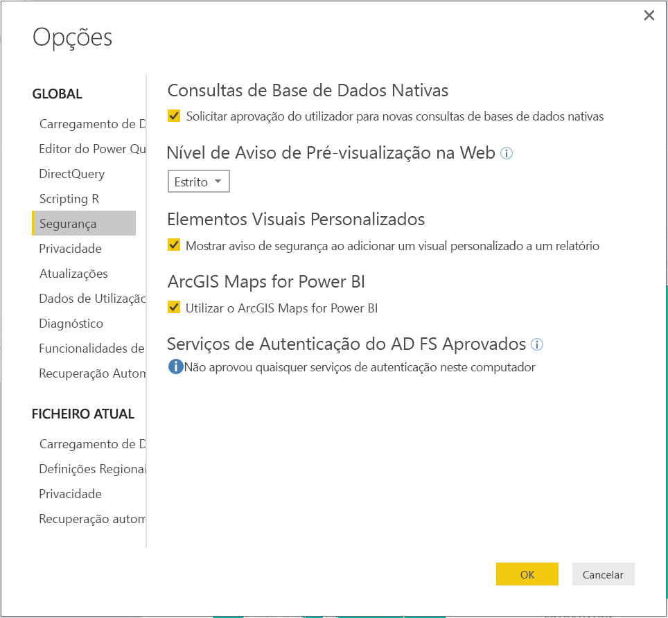

No serviço Power BI, os utilizadores podem interromper a utilização do ArcGIS Maps for Power BI através da respetiva desativação no separador ArcGIS Maps for Power BI nas Definições do utilizador. Quando desativado, o ArcGIS Maps não será carregado, por predefinição.

**Opções de administrador de inquilinos** No PowerBI.com, os administradores de inquilinos podem impedir que todos os utilizadores inquilinos utilizem os mapas de ArcGIS for Power BI, através da desativação. Quando isto acontecer, o Power BI deixará de ver o ícone do ArcGIS Maps for Power BI no painel de visualizações.

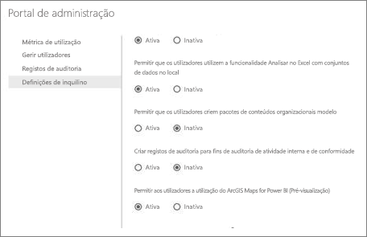

**Opções de administrador de TI** O Power BI Desktop suporta a utilização da **Política de Grupo** para desativar o ArcGIS Maps for Power BI nos computadores de uma organização onde estiver implementado.

<table>
<tr><th>Atributo</th><th>Valor</th>
</tr>
<tr>
<td>chave</td>
<td>Software\Policies\Microsoft\Power BI Desktop\</td>
</tr>
<tr>
<td>valueName</td>
<td>EnableArcGISMaps</td>
</tr>
</table>

Um valor de 1 (decimal) ativa o ArcGIS Maps for Power BI.

Um valor de 0 (decimal) desativa o ArcGIS Maps for Power BI.

## Considerações e Limitações
O ArcGIS Maps for Power BI está disponível nos seguintes serviços e aplicações:

<table>
<tr><th>Serviço/Aplicação</th><th>Disponibilidade</th></tr>
<tr>
<td>Power BI Desktop</td>
<td>Sim</td>
</tr>
<tr>
<td>Serviço Power BI (PowerBI.com)</td>
<td>Sim</td>
</tr>
<tr>
<td>Aplicações móveis do Power BI</td>
<td>Sim</td>
</tr>
<tr>
<td>Publicar na Web do Power BI</td>
<td>Não</td>
</tr>
<tr>
<td>Power BI Embedded</td>
<td>Não</td>
</tr>
<tr>
<td>Incorporação do serviço Power BI (PowerBI.com)</td>
<td>Não</td>
</tr>
</table>

Em serviços ou aplicações em que o ArcGIS Maps for Power BI não estiver disponível, a visualização irá ser apresentada como um elemento visual em branco, com o logótipo do Power BI.

Ao geocodificar endereços de ruas, apenas os primeiros 1500 endereços serão geocodificados. A geocodificação de nomes de locais ou países não está sujeita ao limite de 1500 endereços.

 

**Como é que o ArcGIS Maps for Power BI funciona?**
O ArcGIS Maps for Power BI é fornecido pela Esri (www.esri.com). A utilização do ArcGIS Maps for Power BI está sujeita aos [termos](https://go.microsoft.com/fwlink/?LinkID=8263222) e à [política de privacidade](https://go.microsoft.com/fwlink/?LinkID=826323) da Esri. Os utilizadores do Power BI que pretendam utilizar os elementos visuais do ArcGIS Maps for Power BI, têm de aceitar a caixa de diálogo de consentimento (veja a secção Consentimento do Utilizador para obter detalhes).  A utilização do ArcGIS Maps for Power BI da Esri está sujeita aos Termos e à Política de Privacidade da Esri, que também estão ligados à caixa de diálogo de consentimento. Cada utilizador tem de dar consentimento antes de utilizar o ArcGIS Maps for Power BI pela primeira vez. Assim que o utilizador der consentimento, os dados vinculados aos elementos visuais são enviados para os serviços da Esri para obter geocodificação, ou seja, transformar as informações de localização em informações de latitude e longitude que podem ser representadas num mapa. Deve presumir que os dados vinculados à visualização de dados podem ser enviados aos serviços da Esri. A Esri fornece serviços como mapas de base, análise espacial, geocodificação, etc. Os elementos visuais do ArcGIS Maps for Power BI interagem com estes serviços através de uma ligação SSL protegida por um certificado fornecido e mantido pela Esri. Pode obter informações adicionais sobre o ArcGIS Maps for Power BI na [página do produto ArcGIS Maps for Power BI](https://www.esri.com/powerbi) da Esri.

Quando um utilizador se inscreve numa subscrição Plus oferecida pela Esri através do ArcGIS Maps for Power BI, está a estabelecer uma relação direta com a Esri. O Power BI não envia informações pessoais sobre o utilizador à Esri. O utilizador inicia sessão e confia numa aplicação do AAD fornecida pela Esri ao utilizar a sua própria identidade do AAD. Ao fazê-lo, o utilizador está a partilhar as suas informações pessoais diretamente com a Esri. Assim que o utilizador adicionar conteúdos da subscrição Plus a um elemento visual do ArcGIS Maps for Power BI, os outros utilizadores do Power BI também precisam de uma subscrição Plus da Esri para ver ou editar esses conteúdos. 

Se tiver perguntas técnicas sobre como o ArcGIS Maps for Power BI da Esri funciona, contacte a Esri através do site de suporte da empresa.

**Existe algum custo de utilização do ArcGIS Maps for Power BI?**

O ArcGIS Map for Power BI está disponível para todos os utilizadores do Power BI sem custos adicionais. É um componente fornecido pela **Esri** e a sua utilização está sujeita aos termos e à política de privacidade fornecidos pela **Esri**, conforme indicado anteriormente no artigo.

**Estou a receber um mensagem de erro no Power BI Desktop sobre a minha cache estar cheia**

Este é um erro que está a ser resolvido.  Entretanto, para limpar a cache, tente eliminar os ficheiros nesta localização: C:\Users\\AppData\Local\Microsoft\Power BI Desktop\CEF e, em seguida, reinicie o Power BI.

**O ArcGIS Maps for Power BI suporta ficheiros de formas Esri?**

O ArcGIS Maps for Power BI deteta automaticamente os limites padrão, como países/regiões, estados/províncias e códigos postais. Se precisar de fornecer as suas próprias formas, pode fazê-lo ao utilizar o [Shape Maps for Power BI Desktop (Pré-visualização)](desktop-shape-map.md).

**Posso ver os meus mapas ArcGIS offline?**

Não, o Power BI precisa de conectividade de rede para apresentar os mapas.

**Posso ligar à minha conta do ArcGIS Online a partir do Power BI?**

Ainda não. [Vote nesta ideia](https://ideas.powerbi.com/forums/265200-power-bi-ideas/suggestions/9154765-arcgis-geodatabases) e enviar-lhe-emos uma mensagem de e-mail quando começarmos a trabalhar nesta funcionalidade.  

## Passos seguintes
[Interagir com um mapa ArcGIS que foi partilhado consigo](power-bi-visualizations-arcgis.md)

[Mensagem de blogue a anunciar a disponibilidade do ArcGIS Maps for Power BI](https://powerbi.microsoft.com/blog/announcing-arcgis-maps-for-power-bi-by-esri-preview/)

Mais perguntas? [Experimente perguntar à Comunidade do Power BI](http://community.powerbi.com/)

