# Melhores práticas de design para relatórios e elementos visuais
<!-- Shared newnav Include -->
[!INCLUDE [newnavbydefault](./includes/newnavbydefault.md)]

## Introdução
Este documento disponibiliza melhores práticas para criar relatórios no Power BI. A começar pelo planeamento, aborda os princípios de design que pode aplicar aos seus relatórios e páginas e os elementos visuais individuais que constituem os relatórios.  Muitas destas melhores práticas também se aplicam ao design de dashboards.

Esperamos que este documento seja um ponto de partida e que aplique o que vai aprender aos seus próprios relatórios e visualizações e que continue o debate em community.powerbi.com. A utilização de designs e visualizações de relatórios de BI é um dos principais tópicos da atualidade e há muitos líderes criativos, bloggers e sites que o encaram muito seriamente (mostramos alguns no final).   

> [!NOTE]
> As recomendações feitas neste documento técnico são diretrizes que deve aplicar quando e onde faça sentido. Para cada princípio descrito abaixo, existem, geralmente, motivos válidos para “fugir à regra”.
> 
> 

*Estamos assoberbados com informação, não porque haja muita, mas porque não sabemos como domá-la.*
-- Stephen Few

## Descrição do cenário e da terminologia
No Power BI, um relatório pode ter uma ou mais páginas, as quais, em conjunto, são coletivamente referidas como “o relatório”. Os elementos básicos do relatório são os visuais (ou visualizações), imagens autónomas e caixas de texto. Desde os pontos de dados, aos elementos do relatório à própria página do relatório, existem inúmeras opções de formatação.

Vamos começar na fase de planeamento do relatório, avançamos para os princípios de design básicos, abordamos os princípios do design visual e acabamos a descrever as melhores práticas para tipos de elementos visuais individuais.

Estão disponíveis em **powerbi.com > Learn** (Aprender) orientações e instruções aprofundadas para criar e utilizar relatórios do Power BI.

## Antes de criar a sua primeira visualização … concentre-se nos requisitos
A conceção do relatório começa antes de criar o primeiro elemento visual, porque qualquer bom relatório exige planeamento.  Analise os dados com que vai trabalhar e aponte os requisitos do relatório. Pergunte-se a si próprio “Qual é a necessidade do negócio, como é que vão ser utilizados e por quem?”. Uma pergunta fundamental é "que decisões é que o leitor quer poder tomar com base no relatório?”.

As respostas a estas perguntas vão orientar o design. Cada relatório conta uma história. Certifique-se de que a história corresponde à necessidade do negócio. Poderá ser tentador adicionar elementos visuais que mostrem informações relevantes, mas se estas não corresponderem às necessidades do negócio, o relatório não será útil e os utilizadores podem, na verdade, distrair-se com esses elementos. Além disso, poderá não ser possível obter as informações necessárias para tomar essa decisão a partir destes dados. Este relatório pode ser utilizado para medir o que é necessário?

Os relatórios podem ser utilizados para monitorizar, descobrir, seguir, prever, medir, gerir, testar e muito mais. Se, por exemplo, a necessidade do negócio for um relatório de vendas que meça o desempenho, pode criar um relatório que analisa as vendas atuais, compara-as com as vendas anteriores, compara-as com a concorrência e inclui alguns KPIs que acionam alertas.  Talvez os leitores possam explorar em detalhe os números das vendas para ver o fecho de lojas ou problemas na rede de distribuição que possam afetar as vendas.  Outra análise detalhada pode permitir ver as vendas por loja, região, produto, época, entre outros critérios.

Conheça os clientes que vão utilizar o relatório e crie-o com terminologia familiar e de modo a que forneça dados num nível de detalhe e complexidade adequado ao nível de conhecimentos dos clientes. Tem vários tipos de clientes? O mesmo relatório pode não funcionar para diferentes clientes. Crie páginas do relatório separadas com base nos conhecimentos e identifique-as de forma clara, para que os clientes se possam identificar com as mesmas. Outra opção consiste em utilizar segmentações de dados, para que os clientes possam personalizar a página à medida deles. Envolva o cliente na fase de planeamento e evite o erro de criar segundo o que acha que ele precisa.  Esteja preparado para recomeçar e repetir.

Depois de identificar a necessidade do negócio, os clientes e as métricas que quer incluir, o passo seguinte é escolher os elementos visuais certos para contar a história e apresentá-los da forma mais eficaz possível. Este passo é bastante amplo e vamos começar com alguns princípios básicos do design de relatórios.

## Princípios do design de relatórios
O espaço das páginas dos relatórios é limitado e uma das coisas mais difíceis é encaixar todos os elementos nesse espaço – e, ao mesmo tempo, fazer com que a informação seja facilmente compreendida. E não subestime o valor de “apelativo”. A chave é encontrar o equilíbrio entre apelativo e útil.

Vejamos o esquema, a clareza e a estética.

### Esquema - o ecrã do relatório
O ecrã do relatório tem uma quantidade finita de espaço.  Se não conseguir incluir todos os elementos na mesma página, divida o relatório em várias páginas.  As páginas podem ser adaptadas a públicos específicos (por exemplo, Recursos Humanos, TI, Vendas, etc.) ou a perguntas de negócio específicas (por exemplo, Como é que os defeitos estão a afetar o tempo de inatividade, Qual é o impacto da nossa campanha de marketing no Sentimento?) ou a histórias progressivas (por exemplo, primeira página como descrição geral ou para chamar à atenção, a segunda página continua a história dos dados, a terceira explora-a detalhadamente, etc.).  Se o relatório completo se encaixar numa única página, excelente. Se não, crie páginas separadas que dividam o conteúdo logicamente.  E não se esqueça de atribuir às páginas nomes significativos e úteis.

Imagine que está a organizar uma galeria de arte. Não colocaria 50 obras de arte numa sala pequena, enchê-la-ia com cadeiras e pintaria cada parede de sua cor. Como curador, escolheria apenas obras que tivessem um tema em comum, dispô-las-ia à volta da sala com bastante espaço para os visitantes circularem e refletirem e poria placas informativas que descrevessem as obras. E por algum motivo as galerias modernas têm paredes lisas!
Neste artigo, vamos começar com um exemplo de relatório que exige muito trabalho.  À medida que aplicamos as melhores práticas e os princípios de design, o nosso relatório vai melhorar.

**Figura 1: esta página do relatório é pouco apelativa e vai exigir muito trabalho**

O exemplo acima tem muitos problemas de design (esquema) relacionados com o espaço e que vamos abordar abaixo:

* alinhamento, ordem e utilização da proximidade
* mau uso do espaço e da ordenação
* desorganização

### Alinhamento, ordem e proximidade
O esquema dos elementos do relatório tem impacto sobre a compreensão e orienta o leitor ao longo da página. A forma como coloca e posiciona os elementos conta uma história.  A história pode ser “comece aqui e depois passe para aqui” ou “estes três elementos estão relacionados entre si”.

* Na maioria das culturas, as pessoas analisam da esquerda para a direita e de cima para baixo. Posicione o elemento mais importante no canto superior esquerdo do relatório. E organize os restantes elementos visuais de modo a proporcionar uma navegação e compreensão das informações lógica.
* Posicione os elementos que exigem que o leitor faça uma escolha à esquerda das visualizações que essas escolhas vão afetar, como, por exemplo, segmentações.
* Posicione os elementos relacionados perto uns dos outros; a proximidade implica que os elementos estejam relacionados.
* Outra forma de transmitir relações consiste em adicionar um limite ou cor de fundo à volta dos elementos relacionados. Por outro lado, adicione um separador para distinguir entre diferentes secções do relatório.
* Utilize espaço em branco para agrupar visualmente secções da página do relatório.
* Preencha a página do relatório. Se vir que tem demasiado espaço branco extra, aumente as visualizações ou diminua o ecrã.
* Dimensione os elementos do relatório intencionalmente. Não permita que seja a disponibilidade do espaço a ditar o tamanho das visualizações.
* Aumente o tamanho dos elementos importantes, para que sejam maiores dos que os outros, ou adicione um elemento visual, como uma seta, para chamar a atenção.
* Alinhe os elementos na página do relatório, de forma simétrica ou intencionalmente assimétrica.

Vejamos o alinhamento.

#### Alinhamento
O alinhamento não significa que os diferentes componentes têm de ter o mesmo tamanho ou que é obrigatório ter o mesmo número de componentes em cada linha do relatório. Quer apenas dizer que a página tem uma estrutura que ajuda na navegação e na legibilidade.

Podemos ver, no nosso relatório atualizado abaixo, que os componentes estão agora alinhados nas margens esquerda e direita e que cada linha está alinha na horizontal e na vertical, também. As nossas segmentações de dados estão à esquerda dos visuais que afetam.

**Figura 2: O nosso exemplo de relatório pouco apelativo melhorado com as edições do esquema**

O Power BI inclui ferramentas que ajudam a alinhar os seus elementos visuais. No Power BI Desktop, tendo vários elementos visuais selecionados, pode utilizar as opções **Align and Distribute** (Alinhar e Distribuir) no separador **Visuals** (Elementos Visuais) do friso para harmonizar a posição dos mesmos.

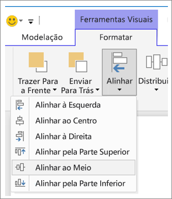

**Figura 3:    Alinhar elementos visuais no Power BI Desktop**

No Power BI online e no Power BI Desktop, também tem controlo preciso sobre o tamanho e a posição dos elementos visuais através do separador **General** (Geral) no painel de formatação de todos os elementos visuais:

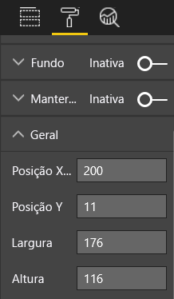

**Figura 4: Definir a posição exata do elemento visual**

Na página do nosso relatório de exemplo (Figura 2), os dois cartões e a margem grande estão alinhados na **Posição X** em 200.

#### Ajustar ao espaço
Utilize o espaço disponível da melhor forma.  Se souber como o relatório será visto/apresentado, crie-o em conformidade. Reduza o espaço em branco para preencher o ecrã.  Faça os possíveis para eliminar a necessidade de acrescentar barras de deslocamento a elementos visuais individuais.  Preencha o espaço sem que os elementos visuais pareçam amontoados.

##### Ajustar o tamanho da página
Ao reduzir o tamanho da página, os elementos individuais ficam maiores em relação à página geral. Para tal, anule a seleção dos elementos visuais na página e utilize o separador **Page Size** (Tamanho da Página) no painel de formatação.  

A página de relatório abaixo utiliza o tamanho 4:3 e, depois, 16:9. Repare como o esquema funciona muito melhor em 16:9. Até há espaço suficiente para remover a barra de deslocamento do segundo elemento visual.

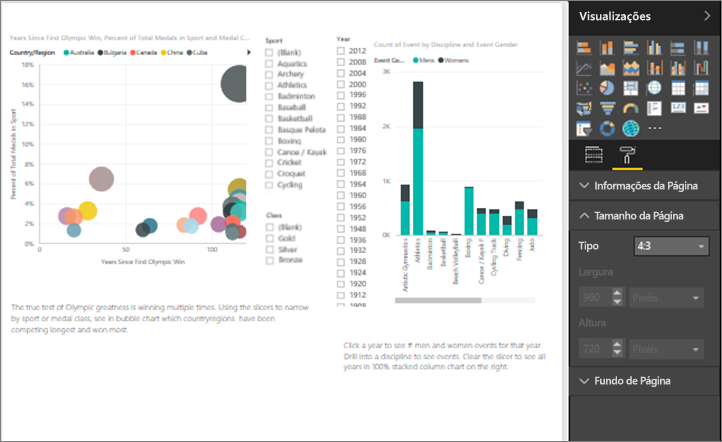

**Figura 5a: O relatório no tamanho de página 4:3**

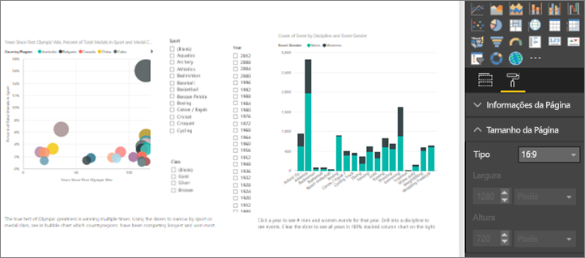

**Figura 5b: O relatório no tamanho de página 16:9**

O seu relatório vai ser visto na proporção 4:3, 16:9 ou outra? Em ecrãs pequenos ou muito grandes? Ou em todos os tamanhos e proporções de ecrã possíveis?  Crie com estes aspetos em mente.

A página do relatório de exemplo parece algo amontoada. Sem elementos visuais selecionados, abra o painel de formatação, selecionando o ícone de rolo de pintura. Expanda **Page Size** (Tamanho da Página) e altere **Height** (Altura) para 900.

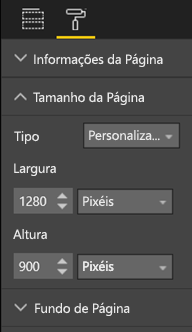

**Figura 6: Aumentar a altura da página**

#### Acabar com a desorganização
Páginas de relatórios desorganizadas são mais difíceis de compreender de relance e podem ser tão avassaladoras que os leitores nem sequer vão tentar.  Elimine todos os elementos do relatório que não sejam necessários. Não adicione adornos que não ajudam nem a navegação, nem a compreensão. A página do relatório tem de transmitir as informações da forma mais clara, rápida e coesa possível.

No seu livro *The Visual Display of Quantitative Information* (“Apresentação Visual de Informações Quantitativas”), Edward Tufte chama-lhe "proporção de dados para tinta”.  Basicamente, remova tudo o que não seja essencial.

Os elementos desnecessários que remover aumentam o espaço branco na página do relatório e dão-lhe mais margem para aplicar as melhores práticas que aprendemos anteriormente na secção “Alinhamento, ordem e proximidade”.

Aqui, o nosso exemplo já está com melhor aspeto. Removemos imensos elementos desnecessários e adicionámos formas para agrupar os elementos.  A imagem de fundo já não existe, a forma de seta desnecessária e a caixa de texto também, um elemento visual foi movido para outra página do relatório, etc. Também alargámos o tamanho da página para aumentar o espaço branco (ou melhor, amarelo...)

**Figura 7:    O nosso relatório de exemplo pouco apelativo agora organizado**

### Conte uma história num instante
O grande teste consiste numa pessoa que não tenha qualquer conhecimento prévio consiga compreender rapidamente o relatório sem explicações. Com uma leitura rápida, os leitores devem ser capazes de ver rapidamente sobre de que se trata a página e cada gráfico/tabela.   

Quando os leitores veem o seu relatório, o olhar deles deve ir para o elemento que quer que vejam primeiro e, depois, seguir da esquerda para a direita e de cima para baixo.  Para alterar este comportamento, adicione indicações visuais, como etiquetas de caixa de texto, formas, limites, tamanho e cor.  

#### Caixas de texto
Por vezes, os títulos das visualizações não são suficientes para contar a história.  Adicione caixas de texto para comunicar com as pessoas que vão ver os seus relatórios.  As caixas de texto podem descrever a página do relatório, um agrupamento de elementos visuais ou um elemento visual individual. Podem explicar resultados ou definir melhor um elemento visual, componentes do mesmo ou as relações entre elementos visuais. Podem ser utilizadas para chamar a atenção com base em diferente critérios indicados nas mesmas.

No serviço do Power BI, na barra de menus superior, selecione **Text Box** (Caixa de Texto). (No Power BI Desktop, selecione **Text Box** [Caixa de Texto] na área **Insert** [Inserir] do friso.)

**Figura 8:    Adicionar uma caixa de texto**

Escreva na caixa em branco e, em seguida, utilize os controlos na parte inferior para definir o tipo de letra, o tamanho, o alinhamento e outros aspetos. Utilize as alças para redimensionar a caixa.

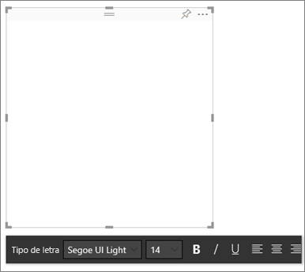

**Figura 9: Formatar a caixa de texto**

Mas não exagere! O excesso de texto nos relatórios causa distração e desvia a atenção dos elementos visuais. Se achar que a página do relatório requer muito texto para ser compreendida, recomece.  Pode escolher outro elemento visual que conte uma história só por si? Pode ajustar os títulos nativos do elemento visual para que seja mais inteligível?   

#### Texto
Crie um guia de estilo de texto e aplique-o a todas as páginas do relatório. Escolha apenas alguns tipos de letra, tamanhos de texto e cores.  Aplique este guia de estilo não só aos elementos textuais, mas também às opções de tipo de letra que escolher dentro das visualizações (veja Títulos e etiquetas que fazem parte das visualizações, abaixo). Defina regras de utilização de negrito, itálico, tamanho de letra maior, determinadas cores, entre outros aspetos.  Evite utilizar tudo em maiúsculas ou sublinhado.

#### Formas
Também as formas podem ajudar na navegação e na compreensão. Utilize as formas para agrupar informações relacionadas, realce dados importantes e utilize as setas para direcionar o olhar. As formas ajudam os leitores a saber onde começar e como interpretar o relatório. Em termos de design, isto é muitas vezes referido como *contraste*.

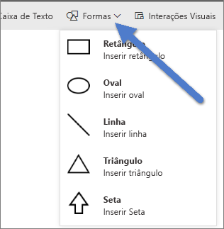

**Figura 10a: Formas no serviço do Power BI**

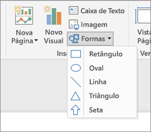

**Figura 10b: Formas no Power BI Desktop**

Qual é o aspeto da nossa página de exemplo agora?  A Figura 11 mostra uma página mais limpa e menos desorganizada com uma utilização consistente de tipos de texto, tipos de letra e cores.  O título da página, no canto superior esquerdo, diz-nos do que a mesma se trata.

**Figura 11: O nosso relatório de exemplo com as diretrizes de texto aplicadas e o título adicionado**

No nosso exemplo, foi adicionado um título à página, no canto superior esquerdo, que é o primeiro sítio para onde os leitores olham. O tamanho da letra é 28 e o tipo de letra Segoe Bold, para ajudar a destacá-lo do resto da página.  De acordo com o guia de estilo de texto, não vamos utilizar fundos, títulos a preto, legendas nem etiquetas, o que foi aplicado a todos os elementos visuais na página, sempre que possível (os eixos e as etiquetas do Gráfico de Combinação não são editáveis).  Além disso:

* Cartões: **Etiqueta de categoria** definida como Desativado, **Título** Ativado e definido como 12pt preto ao centro.
* Títulos do Elemento Visual: se Ativados, definir como 12pt e alinhados à esquerda.
* Segmentações de Dados: **Cabeçalho** definido como Desativado, **Título** Ativado. Deixe **Itens** > **Texto** a cinzento e a 10pt.
* Gráficos de dispersão e colunas: tipo de letra preta para os eixos X e Y e para os respetivos títulos, se utilizados.

#### Cor
Utilize cores para dar consistência.  Vamos falar mais sobre as cores em Princípios de design de elementos visuais, abaixo. Contudo, aqui referimo-nos a sermos deliberados na escolha da cor, para que não impeça os leitores de compreenderem rapidamente o relatório.  Cores demasiado vibrantes perturbam os sentidos. Esta secção descreve mais o que não fazer com as cores.

#### Fundos
Quando definir fundos para as páginas dos relatórios, escolha cores que não tapem demasiado o relatório, que choquem com outras cores na página ou que, de um modo genérico, prejudiquem o olhar. Tenha em atenção que algumas cores têm um significado inerente.  Por exemplo, nos E.U.A., vermelho num relatório é normalmente interpretado como "errado".

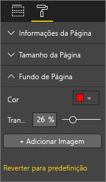

**Figura 12: Definir o fundo do relatório**

Não está a criar uma obra de arte, mas sim um relatório funcional. Escolha uma cor que melhore a legibilidade e a proeminência dos elementos do relatório.  

Um estudo sobre a utilização de cores e visualizações em páginas Web concluiu que um contraste maior entre as cores aumenta a velocidade da compreensão (The effect of text and background colour on visual search of Web pages [O efeito da cor do texto e do fundo na pesquisa visual de páginas Web] e **Determining Users' Perception of Web Page Visual Complexity and Aesthetic Characteristics** [Determinar a Perceção dos Utilizadores da Complexidade Visual e das Características Estéticas das Páginas Web]).

Aplicámos algumas melhores práticas de cores ao nosso relatório de exemplo (Figuras 20 e 21), abaixo. A mais notável foi a alteração da cor do fundo para preto.  O amarelo era demasiado vibrante e forçava o olhar.  Além disso, no gráfico "Contagem de nomes de atletas por ano e turma”, a parte amarela das barras misturava-se com o fundo amarelo.  Ao utilizar um fundo preto (ou branco), temos um contraste máximo, que fazem com que o elemento visual seja o centro das atenções.

Eis os passos adicionais que seguimos para melhorar o relatório de exemplo:

**Título da página**

Quando alterámos o fundo para preto, o título desapareceu, porque o campo da caixa de texto só permite o tipo de letra preta.   Para corrigir este problema, adicione um título de caixa de texto.  Com a caixa de texto selecionada, apague o texto e, no separador Visualizations (Visualizações), selecione **Title** (Título) e ative-o. Selecione a seta para expandir as opções de **Title**, escreva **Summer Olympic Games** (Jogos Olímpicos de Verão) no campo **Texto do Título** e selecione branco em **Font color** (Cor do tipo de letra).

**Figura 13: Adicionar um título de página**

**Cartões**

Nos elementos visuais dos cartões, abra o painel de formatação (ícone de rolo de pintura) e ative **Background** (Fundo). Selecione branco com uma transparência de 0%. Em seguida, ative **Title** , selecione branco em **Font color** e preto em **Backgroud color**.

**Segmentações**

Até este momento, as duas segmentações tinham formatações diferentes, o que não faz sentido, em termos de design. Altere a cor do fundo de ambas as segmentações para ciano.  Ciano é uma boa opção, porque faz parte da paleta de cores da página – pode vê-la no mapa de manchas, no mapa de árvore e no gráfico de colunas.

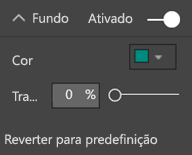

**Figura 14: Alterar a cor de fundo da segmentação**

Adicione um limite branco fino.

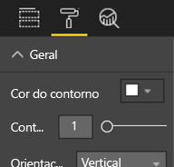

**Figura 15: Adicionar um limite à segmentação**

O tipo de letra cinzento é difícil de ver contra o ciano, por isso, altere a cor de **Items** (Itens) para branco.

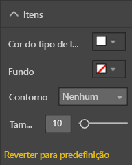

**Figura 16: Alterar a cor do tipo de letra da segmentação**

Por fim, em **Title**, altere **Font color** para branco e escolha preto para **Background color**.

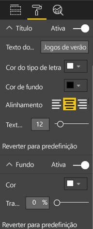

**Figura 17: Formatar o título da segmentação**

**Forma de retângulo**

O retângulo também desapareceu no fundo preto.  Para corrigir este problema, selecione a forma e, no painel **Format shape** (Formatar forma), ative **Background**.

**Figura 18: Formatar a forma**

**Gráficos de colunas, gráfico de bolhas, mapa de manchas e mapa de árvore**

Adicione um fundo branco aos restantes elementos visuais da página do relatório. No painel de formatação, expanda a opção **Line** (Linha) e defina **Line Color** (Cor da Linha) como branca e **Weight** (Espessura) como 3.

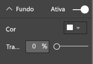

**Figura 19: Adicionar um fundo branco aos restantes elementos visuais**

**Figura 20: Relatório de exemplo com as melhores práticas de cores aplicadas (fundo preto)**

**Figura 21: Relatório de exemplo com as melhores práticas de cores aplicadas (fundo branco)**
 

### Estética
Muito daquilo que é tido como estética já foi abordado acima; coisas como alimento, cor, escolhas de tipo de letra e organização.  Mas é importante mencionar mais algumas melhores práticas para o design dos relatórios, que têm que ver com o aspeto geral dos mesmos.  

Lembre-se de que a função dos relatórios é satisfazer uma necessidade de negócio, não é serem bonitos.  Contudo, é importante conferir alguma beleza, especialmente no que diz respeito às primeiras impressões. Tony Bodoh, consultor de Nashville, explica que “As emoções são despoletadas meio segundo antes de a lógica entrar em ação”.  Os leitores reagem primeiro emocionalmente às páginas dos relatórios antes de despenderem mais tempo a explorá-las. Se as páginas estiverem desorganizadas, confusas, não profissionais, os leitores poderão nunca compreender a história importante que contam.

Wayne Eckerson, autor do blogue TDI e analista da indústria na TechTarget, recorre a uma excelente analogia.  Desenhar um relatório é como decorar uma sala.  Com o passar do tempo, compra um vaso, um sofá, uma mesa de centro, um quadro.  Quando vistas individualmente, todas estas peças são do seu agrado. Contudo, apesar de cada escolha individual fazer sentido, os objetos, em conjunto, chocam entre si ou concorrem pela atenção.

Concentre-se em:

* Criar um tema ou um aspeto comum para o relatório e aplique-o a todas as páginas.
* Utilize imagens autónomas e outros gráficos que funcionem como apoio e não como distração face à história verdadeira.
* E aplique todas as melhores práticas que discutimos até este ponto do artigo.

## Princípios do design dos elementos visuais
Já vimos os princípios do design dos relatórios - como organizar os elementos de forma a permitir que o relatório seja rapidamente compreendido.  Agora ,vamos ver os princípios de design para os elementos visuais.  E, na secção seguinte, vamos explorar os elementos visuais individuais e abordar as melhores práticas para alguns dos tipos mais utilizados.

Nesta secção, vamos deixar a página do nosso relatório de exemplo de lado por uns momentos e ver outros exemplos.  Depois de percorrermos os princípios de design dos elementos visuais, vamos regressar à página do relatório de exemplo e aplicar o que aprendemos (com instruções passo a passo).  

### Planeamento – escolher o elemento visual certo
Tal como é importante planear o relatório antes de começar a criá-lo, cada elemento visual também requer planeamento.  Pergunte-se a si próprio “que história é que quero contar com este elemento visual?”. Depois, determine que elemento é que a conta melhor. Pode mostrar o progresso num ciclo de vendas como um gráfico de barras, mas será que a história não seria mais bem contada através de um gráfico de cascata ou de funil? Para obter ajuda neste tópico, leia a última secção deste documento, “Tipos de elementos visuais e melhores práticas”, que descreve as melhores práticas para alguns dos tipos mais utilizados.  Não se admire se o primeiro tipo de elemento visual que escolher não acabe por ser a sua melhor escolha.  Experimente vários tipos para ver qual destes transmite melhor as informações.

Compreenda a diferença entre os dados categóricos e quantitativos e veja que tipos de elementos visuais funcionam melhor em cada tipo de dados. Muitas vezes, os dados quantitativos são denominados “medidas” e são, geralmente, numéricos. Os dados categóricos são, frequentemente, denominados “dimensões” e podem ser classificados. Estas noções são abordadas mais aprofundadamente em “Escolher a medida certa”, abaixo.

Evite a tentação de utilizar tipos de elementos visuais mais elegantes ou mais complexos apenas para dar um ar mais impressionante ao relatório. O que se pretende é escolher a opção mais simples para contar a sua história. Os gráficos de barras horizontais e os gráficos de linhas conseguem transmitir informações rapidamente.  São familiares e práticos e a maioria dos leitores consegue interpretá-los facilmente.  Uma vantagem acrescida é que a maior parte das pessoas lê da esquerda para a direita e de cima para baixo, pelo que estes dois tipos de gráficos podem ser lidos e compreendidos mais depressa.

É necessário percorrer o elemento visual para contar a história? Se possível, evite os deslocamentos.  Experimente aplicar filtros e utilizar hierarquias/desagregações e se estas opções não eliminarem a necessidade de incluir a barra de deslocamento, considere escolher outro tipo de elemento visual. Se não for possível fugir ao deslocamento, o horizontal é mais tolerado do que o vertical.

Mesmo se escolher o elemento visual absolutamente mais eficaz para a história, poderá, ainda assim, precisar de ajuda para contá-la.  É aqui que surgem as etiquetas, os títulos, os menus, a cor e o tamanho. Vamos falar destes elementos do design mais adiante, na secção com o título “Elementos do design”.

### Escolher a medida certa
A história que o seu elemento visual está a contar é apelativa? É importante?  Não crie elementos visuais só porque sim. Se calhar, achava que os dados contavam uma história interessante, mas afinal não contam. Não tenha medo de começar do zero e de procurar uma história mais interessante. Ou talvez a história esteja lá, mas tenha de ser medida de outra forma.

Por exemplo, imagine que pretende medir o sucesso dos seus gestores de vendas. Que medida pode utilizar para o fazer?  Seria mais eficaz analisar as vendas totais ou os lucros totais, o crescimento ao longo do último ano ou o desempenho em relação a um objetivo? A vendedora Sally poderá ter os maiores lucros e se mostrar os lucros totais por vendedor num gráfico de barras, ela arrasaria os outros vendedores.  Mas e se a Sally apresentar elevadas despesas (despesas de viagens, custos de envio, custos de fabrico, etc.), olhar simplesmente para as vendas não conta a história da melhor forma.

#### Refletir a realidade versus não distorcer a realidade
É possível criar elementos visuais que distorçam a verdade. Existe um site onde os apaixonados dos dados partilham elementos visuais “maus”. E a opinião comum nos comentários é o desapontamento com a empresa que os criou e distribuiu.  Passa a ideia de que não são de confiança.

Por isso, crie elementos visuais que não distorçam intencionalmente a realidade e que não sejam manipulados para contar a história que pretende que contem.  Eis um exemplo:

**Figura 22: Gráfico com a realidade distorcida**

Neste exemplo, parece que há uma grande diferença entre as quatro empresas e que CorpB é muito mais bem-sucedida do que as outras três.  Contudo, repare que o eixo X não começa em zero e que as diferenças entre as empresas estão, provavelmente, dentro da margem de erro.  Veja os mesmos dados com o eixo X a começar no zero.

**Figura 23:    Gráfico realista**

Os leitores esperam e, muitas vezes, partem do princípio de que o eixo X começa no zero. Se optar por não começar no zero, faça-o de forma a não distorcer os resultados e considere adicionar um indicador visual ou uma caixa de texto para referir o desvio à norma.  

### Elementos de design
Depois de selecionado um tipo e uma medida e de criado o elemento visual, é altura de aperfeiçoar a apresentação, para máxima eficácia.  Esta secção abrange:

* Esquema, espaço e tamanho
* Elementos de texto: etiquetas, anotações, títulos e menus
* Ordenação
* Interação dos elementos visuais
* Cor

#### Ajustar os elementos visuais para uma utilização do espaço mais eficiente
Se quiser incluir vários gráficos num relatório, maximizar a proporção de dados relativamente à tinta ajudará a destacar a história que os seus dados contam. Tal como mencionado acima, Edward Tufte cunhou a proporção de “dados relativamente à tinta”. O objetivo é remover o máximo de marcas possível sem afetar a capacidade do leitor de interpretar os dados.

No primeiro conjunto de gráficos abaixo, existem etiquetas de eixo redundantes (Jan 3014, Apr 2014, etc.) e títulos de ("by Date” [”por Data”]). Os títulos de cada gráfico também requerem espaço horizontal dedicado em cada gráfico. Ao remover os títulos dos gráficos e ativar as etiquetas de eixos individuais, eliminamos alguma tinta e damos um melhor uso ao espaço geral. Podemos remover as etiquetas dos eixos dos dois gráficos de cima para tirar ainda mais tinta e utilizar mais espaço para os dados.

Se quiser destacar períodos de tempo específicos, pode desenhar linhas ou retângulos atrás de todos os gráficos para orientar o olhar e facilitar a compreensão.

**Figura 24:    Antes**

**Figura 24:    Depois**

**Para ativar e desativar os títulos dos eixos**

Selecione o elemento visual para torná-lo ativo e abra o painel Formatting (Formatação). Expanda as opções para **X-Axis** (eixo X) ou **Y-Axis** (eixo Y) e arraste o controlo de deslize de **Title** para ativar ou desativar.

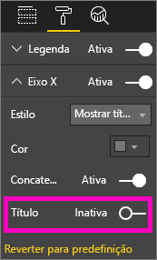

**Figura 26:    Ativar e desativar os títulos dos eixos**

**Para ativar e desativar as etiquetas dos eixos**

Selecione o elemento visual para torná-lo ativo e abra o painel Formatting (Formatação). Junto a **X-Axis** e a **Y-Axis** vai encontrar controlos de deslize.  Arraste o controlo de deslize para ativar ou desativar as etiquetas dos eixos.

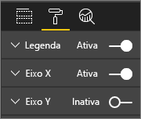

**Figura 27: Ativar e desativar as etiquetas dos eixos**

> [!TIP]
> Um cenário no qual poderia desativar as etiquetas do eixo Y seria se tivesse as **Etiquetas de dados** ativadas.
> 
> 

**Para remover títulos dos elementos visuais**

Selecione o elemento visual para torná-lo ativo e abra o painel Formatting (Formatação). Defina o controlo de deslize de **Title** como Desativado.

**Figura 28: Remover títulos dos elementos visuais**

Tenha em conta como é que os leitores vão ver o relatório e certifique-se de que os elementos visuais e o texto são suficientemente grandes e escuros para poderem ser lidos. Se tiver um elemento visual proporcionalmente maior na página, os leitores poderão achar que é o mais importante. Deixe espaço suficiente entre os elementos visuais, de modo a que o relatório não pareça amontoado e confuso.  Alinhe os elementos visuais para ajudar a direcionar o olhar dos leitores.

**Para redimensionar os elementos visuais**

Selecione o elemento visual para ativá-lo. Copie e arraste uma das alças para ajustar o tamanho.

**Figura 29: Redimensionar o elemento visual**

**Para mover um elemento visual**

Selecione o elemento visual para ativá-lo. Selecione sem largar a barra de controlo de arrastamento na parte superior ao centro do elemento visual e arraste-o para a localização nova.

**Figura 30: Mover um elemento visual**

#### Títulos e etiquetas que fazem parte das visualizações
Confirme que os títulos e as etiquetas são legíveis e explícitos. O texto dos títulos e das etiquetas tem de ter um tamanho ideal e cores que se destaquem (como preto em vez do cinzento, que é a predefinição). Lembra-se do nosso guia de estilo (veja "Texto", acima)? Limite o número de cores e de tamanhos -- ter muitos tamanhos e cores de tipos de letra diferentes faz com que a página pareça amontoada e confusa.  Considere utilizar a mesma cor e o mesmo tamanho de tipo de letra nos títulos de todos os elementos visuais e escolher o mesmo alinhamento para os mesmos numa página do relatório.  

**O painel de formatação**

Para cada um dos ajustes de formatação listados abaixo, selecione o ícone de rolo de tinta para abrir o painel Formatting.

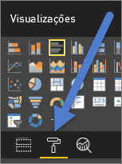

**Figura 31: Abrir o painel Formatting**

Em seguida, selecione o elemento visual que vai ajustar e confirme que está definido como Ativado. Alguns exemplos de elementos visuais são **X-Axis**, **Y-Axis**, **Title**, **Data labels** (Etiquetas de dados) e **Legend** (Legenda). O exemplo abaixo mostra o elemento **Title**.

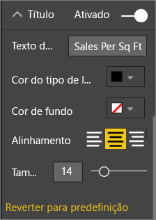

**Figura 32: Formatar o título de um elemento visual**

**Definir o tamanho do texto**

O tamanho do texto pode ser ajustado em títulos e etiquetas de dados, mas não nos eixos X e Y nem nas legendas.  Nas etiquetas de dados concretamente, experimente as **Unidades de apresentação** e o número de **Casas decimais** até encontrar o nível de detalhe ideal para apresentação no relatório.   

**Definir o alinhamento do texto**

As opções de alinhamento do título são à esquerda, à direita e ao centro.  Escolha uma e aplique a mesma definição a todos os elementos visuais na página.  

**Definir a posição do texto**

A posição do texto pode ser ajustada em alguns eixos Y e na legenda.   Independentemente da sua escolha, faça o mesmo para os outros eixos Y e para as outras legendas na página.

**Definir o comprimento do título e da etiqueta**

Ajuste o comprimento dos títulos, dos títulos dos eixos, das etiquetas de dados e das legendas. Se optar por apresentar algum destes elementos, ajustar o comprimento (juntamente com o tamanho do texto) assegura que nada ficará truncado. Para **Title** e **Legend**, a definição é **Title Text** (Texto do Título) e é aqui onde escreve o título real que vai aparecer no elemento visual. Para **X-Axis** e **Y-Axis**, a definição é **Style** (Estilo), que é selecionado num menu pendente. Para **Data labels**, as definições são **Display** (Apresentação) e **Decimal**. Utilize o menu pendente **Display** para selecionar as unidades de medida: milhões, milhares, nenhuma, automática, etc. Utilize o campo **Decimal** para dizer ao Power BI quantas casas decimais apresentar.

**Definir a cor do texto**

A cor do texto pode ser ajustada em títulos, eixos e etiquetas de dados.  

#### Títulos e etiquetas que não fazem parte das visualizações
Mais atrás neste documento, falámos sobre adicionar caixas de texto às páginas do relatório. Por vezes, os títulos das visualizações não são suficientes para contar a história.  Adicione caixas de texto para comunicar informações adicionais aos leitores dos seus relatórios.  
Para impedir que a página do relatório pareça demasiado confusa ou amontoada, utilize tipos de letra, tamanhos, cores e alinhamentos das caixas de texto de forma consistente. Para ajustar o texto numa caixa de texto, selecione-a, o que mostra o menu de formatação.

**Figura 33: Formatar o tipo de letra utilizado numa caixa de texto**

#### Ordenação
Definir a ordenação dos elementos visuais é uma oportunidade muito simples de revelar informações mais depressa. Por exemplo, ordenar gráficos de barras por ordem descendente ou ascendente com base nos valores das barras permite-lhe mostrar rapidamente informações incrementais significativas sem ocupar mais espaço.

Para ordenar um gráfico, selecione as reticências (…), no canto superior direito do gráfico, selecione **Sort** (Ordenar) e escolha o campo pelo qual pretende ordenar e o sentido. Para obter mais informações, veja [Change how a visual is sorted](power-bi-report-change-sort.md) (Alterar a forma como os elementos visuais são ordenados).

#### Interações e relações entre gráficos
Uma das funcionalidades mais interessantes do Power BI é a capacidade de editar a forma como os gráficos interagem entre si.  Por predefinição, os gráficos têm realce cruzado: quando seleciona um ponto de dados, os dados relacionados nos outros gráficos iluminam-se e os não relacionados esbatem-se. Pode substituir este comportamento para utilizar qualquer gráfico como um verdadeiro filtro que lhe permite poupar muito espaço na página. Para tal, selecione **Visual Interactions** (Interações de Elementos Visuais), na barra de menus.

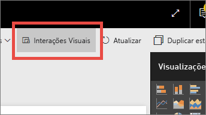

**Figura 34: Interações de elementos visuais**

Depois, em cada elemento visual na página, escolha se pretende que o elemento selecionado filtre, realce ou não faça nada. Nem todos os elementos visuais podem ser realçado, sendo que o controlo de realce não estará disponível para os mesmos. Para obter mais informações, veja [Visual interactions in Power BI](service-reports-visual-interactions.md) (Interações de elementos visuais no Power BI).

> [!TIP]
> Para os leitores que não estão familiarizados com o Power BI, esta capacidade de clicar e interagir com os relatórios pode não ser imediatamente óbvia. Adicione caixas de texto para ajudá-los a compreender no que podem clicar para ver mais informações.
> 
> 

#### Utilização de cores nos elementos visuais
Mais atrás neste documento, falámos da importância de ter um plano para a utilização das cores ao longo dos relatórios. Esta secção repetirá algumas ideias, mas aplica-se sobretudo à utilização de cores em elementos visuais individuais. E aplicam-se os mesmos princípios: utilize cores para unificar o relatório, dar ênfase a dados importantes e para melhorar a compreensão dos elementos visuais por parte do leitor. Incluir demasiadas cores diferentes é distrativo e faz com que seja mais difícil para o leitor saber para onde deve olhar. Não sacrifique a compreensão pela elegância. Adicione cores apenas se for para melhorar a compreensão.

> [!TIP]
> Conheça o seu público e eventuais regras quanto à utilização de cores.  Por exemplo, nos Estados Unidos, normalmente verde significa "certo" e vermelho "errado".
> 
> 

Este tópico está dividido para abranger:

1. A cor dos dados
2. A cor das etiquetas de dados
3. A cor dos valores categóricos
4. A cor dos valores numéricos

**Utilizar cores para realçar os dados interessantes**

A forma mais simples de utilizar cores é alterar a cor de um ou mais pontos de dados para chamar a atenção para os mesmos. Neste exemplo, a cor muda quando os Jogos Olímpicos passaram de um ciclo de quatro anos para dois, alternando os jogos de verão e de inverno.

**Figura 35:    Utilizar cores para contar uma história**

Pode alterar as cores dos pontos de dados a partir do separador **Data colors** (Cores dos dados) no painel de formatação. Para personalizar individualmente cada ponto de dados, confirme que **Show all** (Mostrar tudo) está definido como Ativado.

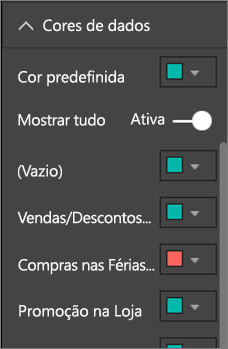

**Figura 36: Definir as cores de um ponto de dados**

> [!NOTE]
> O Power BI aplica um tema predefinido aos elementos visuais do seu relatório.  As cores dos temas foram escolhidas para proporcionar diversidade e contraste. Para escolher cores que não as da paleta do tema predefinido, selecione **Custom color** (Cor personalizada).
> 
> 

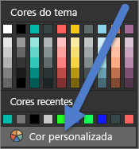

**Figura 37: Escolher uma cor predefinida**

No Power BI Desktop, pode inclusivamente realçar valores atípicos ou secções de uma linha mediante a utilização de uma segunda série:

**Figura 38:    Utilizar o Desktop para desenhar valores atípicos**

Aqui, os valores da série “Outliers” (Valores atípicos) só existem se a temperatura média em agosto baixar para menos de 60º F. Para fazê-lo, foi criada uma coluna calculada DAX com a fórmula:

Valores atípicos = if(Editions[Temp]<60, Editions[Temp], BLANK())

No nosso exemplo, havia três valores atípicos: 1952, 1956 e 2000.

**Cores para etiquetas e títulos**

À medida que explorar todas as opções de formatação disponíveis, encontrará muitos sítios diferentes onde pode adicionar cores a títulos e legendas. Por exemplo, pode alterar a cor das etiquetas de dados e dos títulos dos eixos. Avance com cuidado.  Geralmente, recomenda-se utilizar a mesma cor nos títulos de todos os elementos visuais.  Tal como em todas as diretrizes deste documento, há sempre casos e motivos para “fugir à regra”. No entanto, se optar por realmente fugir à regra, faça-o por um bom motivo.

**Cores dos valores categóricos**

Normalmente, os gráficos com séries têm um valor categórico na legenda. Por exemplo, cada cor na legenda abaixo representa uma categoria de país/região diferente.

**Figura 39: Cores predefinidas aplicadas**

As cores que o Power BI utiliza por predefinição foram escolhidas para diferenciar de forma clara os valores categóricos, para que sejam facilmente distinguidos. Às vezes, as pessoas mudam estas cores para poderem utilizar o esquema da empresa, etc., mas essa mudança pode originar problemas.

**Figura 40: Cor aplicada como matiz de uma única cor**

Ao utilizar só uma matiz de cor e variar a intensidade da mesma, este elemento visual apresentou uma falsa sensação de ordenação entre as categorias. Dá a entender que as bolhas mais escuras são mais altas ou baixas numa determinada escala do que as mais claras. Para além da ordem alfabética, não existe, normalmente, nenhuma ordem inerente neste tipo de valores categóricos.
Para alterar as cores predefinidas, abra o painel Formatting e selecione **Data colors**.

**Cores dos valores numéricos**

Nos campos que têm uma ordem inerente e um valor numérico, também pode colorir os pontos de dados pelo valor. Isto pode ser útil para mostrar a propagação dos valores pelos dados e também permite mostrar duas variáveis num único gráfico. Por exemplo, neste gráfico, é fácil ver que, embora a China tenha a contagem de medalhas mais alta, o Japão e a Tailândia participaram em mais Jogos Olímpicos.

**Figura 41: Colorir pontos de dados pelo valor**

Para criar este gráfico, adicione um valor ao campo Color saturation (Saturação de cor) e ajuste essas cores no painel Formatting.

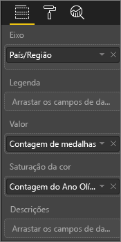

**Figura 42: Adicionar um campo de saturação de cor**

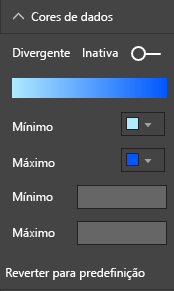

**Figura 43: Ajustar as cores utilizadas na saturação**

A cor também pode ser utilizada para enfatizar desvios face a um valor central. Por exemplo, os valores positivos podem ser coloridos a verde e os negativos a vermelho. Quando atribuir cores a valores positivos ou negativos, tenha em conta as diferenças culturais. Nem todas as culturas utilizam vermelho para “errado” e verde para “bom”!

**Figura 44: Colorir para realçar o desvio face a um valor central**
 

### Princípios do design de elementos visuais – aplicados à página do relatório de exemplo
Agora, vamos aplicar os princípios do design de elementos visuais ao nosso relatório de exemplo.

Antes

**Figura 45:    O relatório de exemplo (antes)**

Depois

**Figura 46: O relatório de exemplo (depois)**

#### O que é que fizemos?
1. Segmentação: removemos os espaços brancos das segmentações ao adicionar um filtro ao nível da página e selecionar apenas ouro, prata e bronze. Alterámos **Selection Controls** (Controlos de Seleção) para Desativado em **Single Select** (Seleção Única) e **Select All** (Selecionar Tudo).
2. Bolha: existem tantos itens na legenda que somos deslocados para fora do ecrã.  Removemos a legenda e ativámos **Category labels** (Etiquetas de categoria). Os clientes podem passar o rato por cima das bolhas para verem os detalhes. Encurtámos o título e removemos “by countryregion” (“por paísregião”), pois parece óbvio. Ativámos as etiquetas dos dois eixos, para que seja mais fácil compreender o gráfico.
3. Mapa de manchas: alterámos **Data colors** para lhe dar mais destaque. Ativámos **Diverging** (Divergente) e definimos **Minimum** (Mínimo) como cor-de-rosa e **Maximum** (Máximo) como vermelho.
4. Mapa de árvore: removemos o filtro que foi definido para apenas E.U.A. Definimos **Data labels** como uma casa decimal. O elemento visual utilizava o campo Class (Classe), que não é muito útil, uma vez que será quase sempre 33% (ouro/prata/bronze).  Selecionámos um campo mais interessante, género. Alterámos Aquatics (Natação) para azul e Athletics (Atletismo) para cinzento, por questões de design.
5. Gráfico de barras superior: reduzimos o título, removemos as etiquetas de dados e desativámos as legendas do título. Alterámos a ordem das palavras do título, para que correspondam ao gráfico abaixo.
6. Gráfico de barras inferior: ordenámos por ordem ascendente por ano, para corresponder ao gráfico acima. Alterámos as cores, para que correspondam à classe. Alterámos o título. Desativámos a legenda, para termos mais espaço para os dados. Ativámos as etiquetas de dados, que não vão aparecer no relatório (porque o elemento visual é demasiado pequeno para que as etiquetas sejam legíveis), mas que o serão quando o elemento for aberto no Modo de detalhe. [Saiba mais sobre o Modo de detalhe](service-focus-mode.md). Adicionámos a Contagem de Eventos (Distinta) a **Tooltips** (Descrições), pelo que, quando passa agora o rato por cima de uma coluna empilhada, as descrições também lhe dizem quantos eventos foram realizados esse ano.
7. Interações entre Elementos Visuais: desativámos as interações em ambos os cartões, porque quero que mostrem sempre o total de jogos e desportos.

## Tipos de elementos visuais e melhores práticas
O Power BI disponibiliza muitos tipos de elementos visuais de forma nativa.  A estes, acrescentemos os elementos visuais personalizados disponíveis na Microsoft e na comunidade do Power BI e todas as opções de elementos visuais passam a ser demasiadas para documentar aqui. Mas vejamos alguns dos tipos de elementos visuais nativos mais utilizados.  

### Gráficos de linhas

Os gráficos de linhas são uma forma eficaz de ver dados ao longo do tempo.  Procurar dados em tabelas não tira, realmente, partido da velocidade com que os nossos olhos detetam picos, quedas, ciclos e padrões.  
O exemplo abaixo mostra as tendências no número de medalhas atribuídas e no número de atletas que as conquistaram.  

**Figura 47:    Gráficos de linhas**

#### Melhores práticas
* Quando as pessoas analisam gráficos de linhas, a primeira coisa que veem é a forma da curva.  Isto significa que precisa de ter um eixo X que dê significado à curva, como categorias de tempos ou distribuição.  Se puser campos categóricos, como produto ou geografia, no eixo X, o gráfico de linhas não será interessante, pois a forma da curva não disponibilizará informações relevantes.
* Se optar por colocar vários gráficos acima e abaixo dos mesmos, desta forma, para facilitar a comparação entre séries, alinhe o eixo X. Utilize filtros para confirmar que é apresentado o mesmo intervalo de valores.  Por exemplo, se estiver a ver intervalos de datas, confirme que são os mesmos.  Por exemplo, 1896 a 2012 em ambos os gráficos.
* Utilize todo o espaço.  Se fizer sentido relativamente aos seus dados, defina os pontos de início e de fim do eixo X, para eliminar o espaço vazio na parte de cima e de baixo do gráfico e para se centrar nos pontos de dados reais. Para tal, selecione o ícone de rolo de tinta para abrir o painel Formatting. Expanda a área de **Y-Axis** e defina os pontos **Start** (Início) e **End** (Fim).
  
  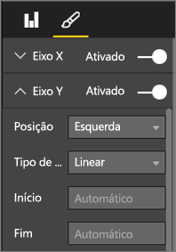
  
  **Figura 48: Definir os pontos de início e de fim**
* Outro motivo para definir explicitamente os pontos de início e de fim é se estiver a comparar dois ou mais gráficos na mesma página através do mesmo campo de eixo Y.  Por exemplo, se estiver a analisar contagens de eventos totais e o Reino Unido tiver contagens que vão de 1 a 70 e a Austrália que vão de 1 a 12, os dois gráficos de linhas vão apresentar eixos Y muito diferentes (Figura x). Isto dificulta a comparação de relance. Em alternativa, defina os gráficos para utilizarem o mesmo intervalo no eixo Y (Figura x).
  
  
  
  **Figura 49: Gráficos de linhas com eixos Y diferentes**
  
  
  
  **Figura 50: Gráficos de linhas com eixos Y iguais**

Para obter mais informações, veja:

* [Customize the X and Y axes](power-bi-visualization-customize-x-axis-and-y-axis.md) (Personalizar os eixos X e Y)
* [Line charts and irregular intervals](http://www.perceptualedge.com/articles/visual_business_intelligence/line_graphs_and_irregular_intervals.pdf) (Gráficos de linhas e intervalos irregulares)
* [Line charts 101](http://www.columnfivemedia.com/data-visualization-101-line-charts) (Introdução aos gráficos de linhas)

### Gráficos de barras/colunas

Se os gráficos de linhas são os mais comuns para ver dados ao longo do tempo, os gráficos de barras são os gráficos padrão para analisar um valor específico em diferentes categorias.  Se ordenar as barras com base no número, verá imediatamente os valores mais altos e a distribuição.  Os gráficos de barras horizontais funcionam bem com etiquetas mais compridas.  

**Figura 51: Gráfico de barras horizontal**

#### Melhores práticas
* Apresente etiquetas de dados para os valores.  Desta forma, é mais fácil identificar valores específicos. Para tal, abra o painel Formatação e defina **Data labels** como Ativado.
  
  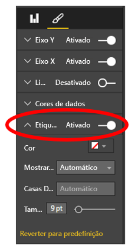
  
  **Figura 52: Ativar as etiquetas de dados**
* O gráfico de barras acima é realmente útil para comparar uma medida com muitas **num único ponto no tempo**.  Ao passo que o gráfico de linhas anterior mostrava a tendência ao longo do tempo, o gráfico de barras mostra a tendência para uma categoria individual num ponto no tempo específico.  De forma rápida, o nosso gráfico de barras mostra-nos que Espanha tem uma das piores taxas de desemprego do mundo, na ordem dos 25%.
* Se um gráfico de barras/colunas não couber completamente no espaço atribuído, o Power BI adiciona barras de deslocamento. Sempre que possível, e se fizer sentido, estruture o elemento visual e o relatório para mostrar todo o gráfico, para que o leitor tenha uma perspetiva geral de toda a distribuição.  Infelizmente, não o podemos fazer no nosso exemplo, devido ao número muito grande de países em todo o mundo.
  
  Uma forma de limitar os valores incluídos é utilizar um filtro. Por exemplo, adicione um filtro ao nível do elemento visual que mostre o país apenas se a taxa de desemprego for superior a 20%.
* Pode desagregar (e depois voltar a agregar) os gráficos de barras/colunas.  Esta é uma excelente forma de condensar mais informações num elemento visual sem ocupar mais espaço.  O exemplo abaixo tem uma hierarquia para Regiões > Países.  Fazer duplo clique numa barra de região desagrega para os países que a compõem.  Para obter mais informações sobre a desagregação, veja [Drill down in a visualization](power-bi-visualization-drill-down.md) (Desagregar visualizações).
  
  
  
  **Figura 53: Desagregar**

Para obter mais detalhes sobre os gráficos de barras e colunas:

* [Bar charts 101](http://blog.newscred.com/article/data-visualization-101-bar-charts/3c53044d4add7c31e79a3f80128771f4?page=thankyou) (Introdução aos gráficos de barras)
* [Data Visualization Catalogue: Bar Chart](http://www.datavizcatalogue.com/methods/bar_chart.html#.VYV-hY3bLJw) (Catálogo de Visualizações de Dados: Gráfico de Barras)
* [Data Visualization Catalogue: Multi-set Bar Chart](http://www.datavizcatalogue.com/methods/multiset_barchart.html#.VYV_gI3bLJw) (Catálogo de Visualizações de Dados: Gráfico de Barras de Múltiplos Conjuntos)

### Gráficos de barras/colunas empilhadas

Para conferir outra dimensão aos seus gráficos de barras/colunas, empilhe diferentes categorias nas barras ou colunas.  Agora, o gráfico transmite informações sobre uma tendência geral (com base na altura e no comprimento), mas mostra também a influência das categorias sobre essa tendência. O gráfico abaixo mostra o crescimento geral das receitas das principais equipas de futebol acima dos seis mil milhões, em 2014.

**Figura 54: Gráfico de coluna empilhada**

Este gráfico de colunas empilhadas mostra-nos que as receitas totais estão a crescer ao longo do tempo e que as categorias Commercial (Comercial) e Broadcasting (Transmissões) estão a aumentar de forma estável ao longo do tempo, contribuindo para o aumento geral das receitas.  Mas este gráfico não torna mais fácil comparar o impacto que cada uma das três categorias têm entre si. Por exemplo, como é que o crescimento de Commercial se compara com o crescimento de Broadcasting ou Match Day (Dia de Jogo)?  Uma opção melhor para estes dados, ou um elemento visual complementar para os mesmos, seria um gráfico de linhas.  

**Figura 55: Converter num gráfico de linhas**

Neste gráfico de linhas, é mais fácil ver que as receitas comerciais tiveram o maior crescimento, seguidas de transmissões e de dia de jogo.

#### Melhores práticas
* Tal como com os gráficos de colunas/barras, tem a opção de apresentar na horizontal ou na vertical.   Horizontal é uma opção melhor se tiver etiquetas mais compridas e vertical se tiver dados de séries temporais.  
* Evite gráficos de barras/colunas empilhadas se quiser mostrar tendências e outros padrões de alterações ao longo do tempo.  Pode fazê-lo muito melhor com outros gráficos, como de linhas.
* Também pode basear a distribuição no volume total ou como % do total.  
* Como Few observou,  *é difícil comparar os segmentos das barras empilhadas. Se os segmentos fossem dispostos lado a lado e todos crescessem a partir da mesma linha base, seria fácil comparar as respetivas alturas. Contudo, se fossem empilhados uns sobre os outros, a comparação tornar-se-ia difícil. Além disso, embora seja relativamente fácil ver como evoluíram (as receitas) de mês para mês, é muito difícil ver como é que evoluíram nas outras (categorias)*.  
* Os gráficos 100% empilhados são uma boa opção se forem utilizadas percentagens que somem 100.  No exemplo abaixo, vemos a distribuição de categorias por equipa.  As percentagens são relativas e permitem-nos ver padrões rapidamente. Por exemplo, as receitas do Everton provêm sobretudo de Transmissões (mais de 70%), ao passo que o PSG só vai buscar 20% das receitas a esta categoria.  Escolher a apresentação horizontal permite ajustar as etiquetas das equipas mais facilmente e ver o impacto dos tipos de receitas.
  
  
  
  **Figura 56: Gráfico empilhado horizontal**

Para obter mais informações sobre os gráficos empilhados:

* [Data Visualization Catalogue: Stacked bar graphs](http://www.datavizcatalogue.com/methods/stacked_bar_graph.html#top) (Catálogo de Visualizações de Dados: Gráficos de Barras Empilhadas)
* [When are 100% stacked bar graphs useful?](http://www.perceptualedge.com/blog/?p=2239) (Em que casos é que os gráficos de barras 100% Empilhados são úteis)

### Gráficos de combinação de barras/colunas

No Power BI, pode combinar gráficos de linhas e de colunas num gráfico de combinação. As opções são Gráfico de Linhas e Colunas Empilhadas e Gráfico de Colunas Agrupadas Combine dois elementos visuais separados num só para poupar espaço valioso no ecrã.

As duas capturas de ecrã abaixo mostram o antes e o depois.  A primeira página tem dois elementos visuais separados: um gráfico de colunas que mostra a população ao longo do tempo e um gráfico de linhas que mostra o PIB, também ao longo do tempo. Estes dois gráficos são candidatos ideais a um gráfico de combinação, porque têm o mesmo eixo X (ano) e os mesmos valores (2002 até 2012).  Por que não combiná-los e comparar estas duas tendências num único elemento visual?  Ao combiná-los, pode comparar os dados mais depressa.

A página nova do relatório tem um único elemento visual - um gráfico de linhas e um gráfico de colunas empilhadas. Podíamos também ter criado facilmente um gráfico de linhas e de colunas agrupadas.  Agora, é mais fácil procurar uma relação entre as duas tendências.   Podemos ver que, até 2008, a população e o PIB seguiram uma tendência semelhante. Contudo, a partir de 2009, à medida que a população crescia, o PIB era mais volátil.  

 **Figura 57: Como dois gráficos separados**

 **Figura 58: Como um gráfico de combinação único**

#### Melhores práticas
Os gráficos de combinação funcionam melhor se ambos os elementos visuais tiverem pelo menos um eixo em comum.

Tenha atenção aos eixos! É fácil ler e interpretar o seu gráfico de combinação?  Ou utiliza intervalos e valores diferentes? Por exemplo, se a escala do eixo Y do gráfico de colunas for muito mais pequena do que a escala do eixo Y do gráfico de linhas, o gráfico de combinação não terá qualquer significado.  Por exemplo, observe a terceira linha (a ciano), na parte de baixo.

   

   **Figura 59: Gráfico de linhas sem significado**

Do mesmo modo, o gráfico de combinação não terá qualquer significado se os gráfico de colunas e de linhas utilizarem duas medidas diferentes e não forem criados eixos duplos.  Por exemplo, dólares versus percentagem. Inclua ambos os eixos para ajudar o leitor a compreender o gráfico e considere adicionar também etiquetas de eixo.

Para tal, abra o painel Formatting, expanda **Y-Axis** e defina **Show Secondary** (Mostrar Secundário) como Ativado (se ainda não estiver ativado). Às vezes, é difícil encontrar esta definição; expanda **Y-Axis (Column)** [Eixo Y (Coluna] e desloque-se até ver **Show secondary**. Defina também **Title** do eixo Y (Coluna) como ativado, bem como **Title** do Eixo Y (Linha).

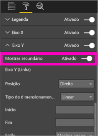

**Figura 60: Mostrar eixo secundário**

**Figura 61: Criar um gráfico de combinação como alternativa**

* Tire proveito dos eixos duplos. São uma excelente forma de comparar várias medidas com diferentes intervalos de valores. E também de ilustrar a correlação entre duas medidas num elemento visual.

Para obter mais informações, veja:

* [Tutorial: Combo chart in Power BI](power-bi-visualization-combo-chart.md) (Tutorial: Gráficos de combinação no Power BI)
* [The danger of dual-scaled Axes in visuals](http://www.perceptualedge.com/articles/visual_business_intelligence/dual-scaled_axes.pdf) (O perigo dos Eixos com escalas duplas nos elementos visuais)

### Gráfico de Dispersão

Por vezes, podemos querer ver muitas variáveis ao mesmo tempo e os gráficos de dispersão podem ser uma forma muito útil de obter uma perspetiva geral.  Estes gráficos apresentam as relações entre duas (Dispersão) ou três (Bolha) medidas quantitativas.  Têm sempre tem dois eixos de valor para mostrar um conjunto de dados numéricos num eixo horizontal e outro conjunto de valores numéricos num eixo vertical. O gráfico mostra pontos na intersecção de um valor numérico de x e y e combina estes valores em pontos de dados individuais. Esses pontos de dados podem ser distribuídos uniformemente ou não no eixo horizontal, dependendo dos dados.

Os gráficos de bolhas substituem os pontos de dados por bolhas, sendo que o tamanho das bolhas representa uma dimensão adicional dos dados.

O gráfico de bolhas abaixo analisa a América do Sul e compara o PIB por capita (eixo Y), o PIB total (eixo X) e a população por país sul-americano.  O tamanho das bolhas representa a população total do país correspondente. O Brasil tem a maior população (tamanho da bolha) e o maior índice de PIB da América do Sul (é a mais afastada no eixo X).  Contudo, repare que o PIB per capita de Uruguai, Chile e Argentina é maior do que o do Brasil (mais acima no eixo Y).

**Figura 62: PIB e população da América do Sul como gráfico de bolhas**

Se adicionar um eixo de reprodução, pode fingir que é o Hans Rosling e contar a história ao longo do tempo (https://www.youtube.com/watch?v=PbaDBJWCeD4). Para adicionar um eixo de reprodução, arraste um campo datetime para **Play Axis** (Eixo de Reprodução).

#### Melhores práticas
* Os gráficos de dispersão e de bolhas são excelentes para contar histórias. No entanto, não são tão úteis para explorar dados.  É isto mesmo que Stephen Few constata no parágrafo seguinte *A vantagem desta abordagem é quando é utilizada para contar uma história. Quando Rosling narra o que está a acontecer no gráfico à medida que as bolhas se movem e mudam de valor, apontando para o que quer que nós vejamos, as informações ganham vida. No entanto, os gráficos de bolhas animados são muito menos eficazes para explorar e compreender os dados por nossa conta. Duvido que Rosling utilize este método para descobrir as histórias; deve utilizá-lo apenas para contá-las quando já forem conhecidas. Não podemos ver várias bolhas ao mesmo quando estão em movimento, pelo que somos obrigados a executar a animação repetidamente para tentar perceber o que está a acontecer. Podemos adicionar trilhos a determinadas bolhas, o que nos permite rever o caminho completo que seguiram, mas se os utilizarmos em muitas bolhas, o gráfico rapidamente fica demasiado desorganizado. O que estou a dizer, basicamente, é que esta não é a melhor forma de apresentar estas informações para análise e exploração.*
* Adicione etiquetas dos eixos X e Y para ajudar a contar a história.  Especialmente no que diz respeito aos gráficos de bolhas, estão envolvidos muitos componentes e as etiquetas ajudam os leitores a compreender o elemento visual.
* Adicione etiquetas de dados para facilitar a interpretação do elemento visual.  Especialmente no que diz respeito aos gráficos de bolhas, se tiver vários itens na Legenda, poderá ser difícil distinguir cores parecidas.  No elemento visual acima, as cores da legenda para Suriname, Colômbia e Equador são muito semelhantes.
* Criou um gráfico de dispersão e só vê um ponto de dados que agrega todos os valores dos eixos X e Y? Ou o gráfico agrega todos os valores ao longo de uma única linha horizontal ou vertical?  Para corrigir isto, adicione um campo à área **Details** (Detalhes) para dizer ao Power BI como agrupar os valores. O campo tem de ser exclusivo para cada ponto que deseja desenhar. Para obter ajuda, veja [Power BI scatter and bubble chart tutorial](power-bi-visualization-scatter.md) (Tutorial dos gráficos de dispersão e de bolhas do Power BI).

### Gráficos de Mapa de Árvore

Os mapas de árvore podem ser muito úteis para mostrar uma boa perspetiva geral do tamanho relativo de diferentes componentes que compõem um todo -- especialmente se puder agrupá-los por categorias.  Sempre que tento compreender um negócio novo, ter um mapa de árvore dos principais componentes pode ser bastante útil para saber a distribuição geral.

No primeiro gráfico abaixo, pode ver imediatamente que o Brasil representa cerca de quase metade do PIB da América do Sul e que a Venezuela e a Argentina têm praticamente o mesmo tamanho.

Se quiser ter mais contexto e obter também uma noção do impacto dos países com maior contributo, pode criar hierarquias visuais com membros (países) de categorias aninhados dentro de regiões. O segundo mapa de árvore dá-nos, sobretudo, uma ideia do tamanho relativo das regiões e, em cada região, podemos ver que países individuais mais contribuem. Vemos que existem três grandes regiões (Europa, Ásia e América do Norte) e podemos ver os principais países/regiões nas mesmas.

A principal limitação dos mapas de árvore é a capacidade limitada de comparar os diferentes retângulos para lá dos principais.  São bons para mostrar perspetivas gerais, mas é provável que os gráficos de colunas e barras sejam uma opção melhor para se ter uma ideia mais precisa do tamanho relativo dos diferentes componentes.
  Por exemplo, o primeiro mapa de árvore disponibiliza uma indicação geral da ordem do tamanho do PIB, mas é difícil identificar diferenças específicas entre países, particularmente nas caixas sem etiqueta mais pequenas. Para estes dados, em que é comparado um único agrupamento, um gráfico de barras ou de colunas poderá ser uma escolha mais acertada.

**Figura 63: Comparação do PIB da América do Sul como mapa de árvore**

Aqui, adicionámos outro nível de dados, a região, e podemos ver o contributo geral para o PIB por regiões, bem como o impacto relativo dentro das regiões. Tenha em atenção que fazer isto com medidas que não de soma (como médias), pode acontecer que a soma dos detalhes não represente o valor real ao nível da agregação.

**Figura 64: PIB por região e país como mapa de árvore**

Para obter mais informações sobre os mapas de árvore, clique nas ligações abaixo.

* [Treemaps overview](http://www.perceptualedge.com/articles/b-eye/treemaps.pdf) (Descrição geral dos mapas de árvore)
* [Data Visualization Catalogue: Tree maps](http://www.datavizcatalogue.com/methods/treemap.html#.VYhylI3bL7Y) (Catálogo de Visualizações de Dados: Mapas de árvore)

### Outros gráficos
#### Gráficos circulares ou de anel

De um modo geral, os gráficos de barras, colunas e linhas são adequados para a maioria das finalidades. É do conhecimento geral que os humanos têm dificuldade em interpretar corretamente os gráficos circulares e de anel, os quais podem, de facto, distorcer muitas vezes os factos. Evite-os sempre que possível. Stephen Few descreve perfeitamente a história e os perigos em [Save the Pies for Dessert] ([www.percetualedge.com/articles/08-21-07.pdf](http://www.perceptualedge.com/articles/08-21-07.pdf)).

Stephen explica que estes gráficos só são úteis para comparar relações da parte com o todo. Mas mesmo neste caso, raramente são muito mais eficazes do que, digamos, os gráficos de barras 100% empilhadas.

Outro divertido artigo (e animação) sobre os gráficos circulares está disponível no [site da Darkhorse Analytics](http://www.darkhorseanalytics.com/blog/salvaging-the-pie).

Também pode ler uma opinião diferente em [Why Tufte is flat-out wrong about pie charts](http://speakingppt.com/2013/03/18/why-tufte-is-flat-out-wrong-about-pie-charts/) (O motivo pelo qual Tufte está completamente errado sobre os gráficos circulares).

#### Medidores radiais e KPIs

Os medidores radiais parecem um bom elemento visual para indicar o desempenho face a um objetivo e são bastante populares em dashboards executivos. No entanto, têm dois grandes inconvenientes. Tal como os gráficos circulares, é difícil interpretar o ângulo da área sombreada comparado com o arco completo de 180 graus ou com a linha do objetivo. Também ocupa muito espaço para mostrar uma única métrica.

Uma boa alternativa é um elemento visual de KPI simples.

Os KPIs mostram o valor, o estado, o objetivo, o desvio face ao objetivo e a tendência na mesma quantidade de espaço. A cor verde muda para vermelho se o objetivo não estiver a ser cumprido e pode ser amarela se for atingido um objetivo intermédio. São muito mais fáceis de ler e interpretar do que os medidores.

Para obter mais informações, veja:

* [Tutorial: Radial gauge charts in Power BI](power-bi-visualization-radial-gauge-charts.md) (Tutorial: Gráficos de medidores radiais no Power BI)
* [Tutorial: KPIs in Power BI](power-bi-visualization-kpi.md) (Tutorial: KPIs no Power BI)

## Conclusão
Agora é altura de testar estas melhores práticas.  Mantenha-se em contacto e partilhe as suas próprias melhores práticas. Não concorda com as nossas recomendações ou descobriu um excelente motivo para “fugir às regras”?  Partilhe as suas descobertas connosco!  

### Literatura recomendada
Hoje em dia, estão disponíveis muitos livros bons que ajudam a equipa a melhorar as técnicas de design de elementos visuais. O livro *Information Dashboard Design* (Design de Dashboards de Informação), de Stephen Few, é de leitura obrigatória. O autor aprofunda este tema ainda mais em dois outros livros, *Show Me the Numbers* (Mostrem-me os Números) e *Now You See It* (Agora já os vemos). Few e outros autores foram buscar inspiração a Edward R. Tufte, cujo livro *The Visual Display of Quantitative Information* (Apresentação Visual de Informações Quantitativas) é considerado um clássico na área. Tufte também escreveu *Visual Explanations* (Explicações Visuais), *Envisioning Information* (Conceber a Informação) e *Beautiful Evidence* (Evidências Apelativas). Outra leitura imperdível é o novo livro de Andy Kirk, *Data Visualization: A Handbook for Data Driven Design* (Visualização de Dados: Guia Prático para o Design Orientado para Dados). Outros autores que têm sido recomendados são Lachlan James, William McKnight e Boris Evelson (Forrester), Darkhorse Analytics.

Mais perguntas? [Pergunte à Comunidade do Power BI](http://community.powerbi.com/)

