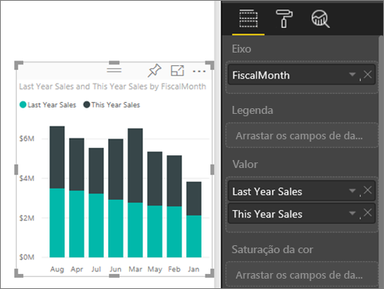
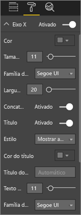
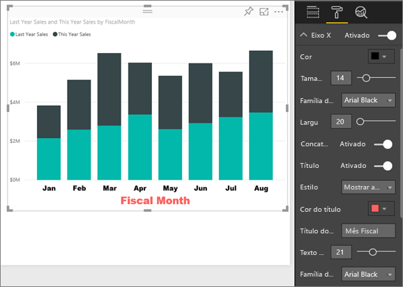
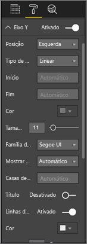
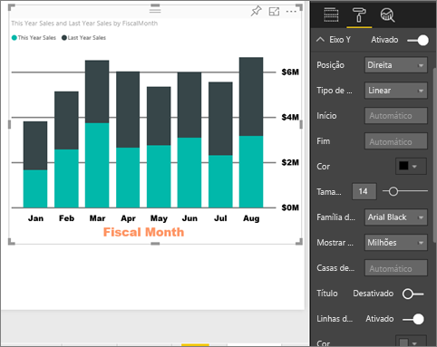
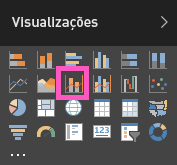
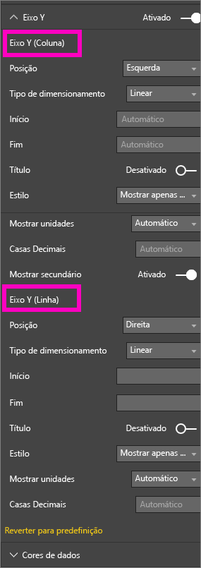
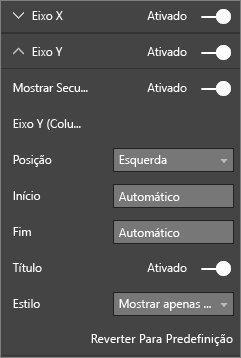

# Personalizar as propriedades dos eixos X e Y
Neste tutorial, aprenderá várias formas diferentes de personalizar os eixos X e Y dos seus elementos visuais. Nem todos os elementos visuais têm eixos ou podem ser personalizados; os gráficos circulares, por exemplo, não têm eixos. As opções de personalização variam consoante o elemento visual, demasiadas opções para abranger num único artigo. Por isso, vamos ver algumas das personalizações de eixos mais utilizadas e familiarizá-lo com a utilização do separador de formatação visual na tela do relatório do Power BI.  

> [!NOTE]
> Esta página aplica-se ao serviço Power BI e ao Power BI Desktop. Estas personalizações, que ficam disponíveis quando o ícone **Formatar** (o ícone de rolo ) é selecionado, também estão disponíveis no Power BI Desktop.  
>
>

Veja a Amanda a personalizar os eixos X e Y e a demonstrar as várias formas de controlar a concatenação ao utilizar a agregação e a desagregação. Depois, siga as instruções passo a passo abaixo do vídeo para experimentar com o exemplo Análise de Revenda.

<iframe width="560" height="315" src="https://www.youtube.com/embed/9DeAKM4SNJM" frameborder="0" allowfullscreen></iframe>

## Personalizar a visualização dos eixos X em relatórios
## Criar uma visualização de gráficos empilhados
Inicie sessão no serviço Power BI e abra o relatório **Exemplo de Análise de Retalho** na [Vista de Edição](service-interact-with-a-report-in-editing-view.md). Para acompanhar, [ligue ao exemplo de Análise de Retalho](sample-datasets.md).

1. Crie um novo gráfico de colunas que mostre as vendas deste ano e as vendas do ano passado por mês fiscal.
2. Converta-o num gráfico de colunas empilhadas.

    

## Personalizar o eixo X
1. No painel Visualizações e Filtros, selecione **Formatar** (ícone de rolo ) para revelar as opções de personalização.
2. Expanda as opções do eixo X.

   
3. Ligue e desligue o eixo X, selecionando o controlo de deslize Ligado (ou Desligado). Por enquanto, deixe-o em **Ligado**.  Uma razão para querer desativar o eixo X é poupar espaço para obter mais dados.

    
4. Formate a cor, o tamanho e o tipo de letra do texto. Neste exemplo, definimos **Cor** como preto, **Tamanho do Texto** como 14 e **Tipo de Letra** como Arial Preto.  
5. **Ative** o Título do eixo X e apresente o nome do eixo X, neste caso, **MêsFiscal**.  
6. Formate a cor, o tamanho e o tipo de letra do texto do título.  Neste exemplo, definimos **Cor do título** como laranja, alterámos **Título do eixo** para **Mês Fiscal** e definimos **Tamanho do texto do título** como 21.
7. Para ordenar por MêsFiscal, selecione as reticências (…) no canto superior direito do gráfico e selecione **Ordenar por MêsFiscal**.

    Depois de todas estas personalizações, o gráfico de colunas deve ser assim:

     

Para reverter toda a personalização do eixo X que fez até agora, selecione **Reverter Para Predefinição** na parte inferior do painel de personalização do **eixo X**.

## Personalizar o eixo Y
1. Expanda as opções do eixo Y.

   

2. Ative e desative o eixo Y ao selecionar o controlo de deslize Ativar (ou Desativar). Por enquanto, deixe em **Ativar**.  Uma razão para querer desativar o eixo Y é poupar espaço para obter mais dados.
   
    
3. Mova a **Posição** do eixo Y para a direita.
4. Formate a cor, o tamanho e o tipo de letra do texto. Neste exemplo, definimos **Cor** como preto, **Tamanho do Texto** como 14 e **Tipo de Letra** como Arial Preto.  
5. Mantenha a opção **Apresentar unidades** definida para Milhões e **Casas decimais de valor** como zero.
6. Para esta visualização, ter um título do eixo Y não melhora o elemento visual, por isso deixe a opção **Título** desativada.  
7. Vamos destacar as linhas de grelha ao alterar a **Cor** para cinzento escuro e ao aumentar **Traço** para 2.

    Depois de todas estas personalizações, o gráfico de colunas deve ser assim:

     

## Personalizar visualizações de eixo Y duplo
Em primeiro lugar, criará um gráfico de Combinação que examina o impacto da contagem da loja nas vendas.  Este é o mesmo gráfico criado no [Tutorial do gráfico de Combinação](power-bi-visualization-combo-chart.md). Em seguida, formatará o eixo Y duplo.

### Criar um gráfico com dois eixos Y
1. Crie um novo gráfico de linhas que acompanhe **Vendas > % de Margem Bruta do ano passado** por **Tempo > MêsFiscal**.
2. Ordene o elemento visual por mês ao selecionar as reticências (…) e **Ordenar por Mês**

    

> [NOTE]: For help sorting by month, see [sorting by other criteria](power-bi-report-change-sort.md#other)
> 1. Em janeiro, a percentagem de Margem Bruta foi de 35%, chegando ao máximo de 45% em abril, caindo em julho e chegando ao máximo novamente em agosto. Será que vamos ver um padrão semelhante nas vendas do ano passado e deste ano?
> 2. Adicione **Vendas Deste Ano > Valor** e **Vendas do Ano Passado** ao gráfico de linhas. A escala de **% de Margem Bruta do Ano Passado** (alinha azul ao longo da linha de grelha 0M%) é muito menor do que a escala de **Vendas**, o que dificulta a comparação. As percentagens das etiquetas do eixo Y são ridículas.      

   
5. Para tornar o elemento visual mais fácil de ler e interpretar, converta o gráfico de linhas num gráfico de Linhas e Colunas Empilhadas.

   

6. Arraste **% de Margem Bruta no Ano Passado** de **Valores de Coluna** para **Valores de Linha**. O que temos agora é o gráfico de colunas empilhadas que criámos acima ***mais*** um gráfico de linhas.  (Opcionalmente, utilize que aprendeu acima para formatar a cor e o tamanho do tipo de letra dos eixos.)
   

   O Power BI cria dois eixos, o que permite que os conjuntos de dados sejam escalados de modo diferente: o eixo à esquerda calcula dólares e o eixo à direita calcula a percentagem.

   

### Formatar o eixo Y secundário
1. No painel **Visualizações**, selecione o ícone de rolo para apresentar as opções de formatação.
2. Expanda as opções do eixo Y, selecionando a seta para baixo.
3. Desloque-se na lista até encontrar as opções de **Mostrar secundário**. Alterne **Mostrar Secundário** entre **Desativado** e **Ativado**.

   

   
4. (Opcional) Personalize os dois eixos. Se mudar a **posição** para o eixo de coluna ou o eixo de linha, os dois eixos mudam de lado.

   

### Adicionar títulos aos dois eixos
Com uma visualização complicada, convém adicionar títulos aos eixos.  Os títulos ajudam os seus colegas a compreender a história que a sua visualização mostra.

1. Coloque **Título** como **Ativado** para **Eixo Y (Coluna)** e **Eixo Y (Linha)**.
2. Defina o **Estilo** para **Mostrar apenas o título**.

   
3. O gráfico de Combinação apresenta agora eixos duplos, ambos com títulos.

   

Para obter mais informações, veja [Sugestões e truques para formatação com cores, etiquetagem e propriedades de eixo](service-tips-and-tricks-for-color-formatting.md).

## Considerações e resolução de problemas
Se o eixo X for categorizado pelo proprietário do relatório como um tipo de data, a opção **Tipo** será apresentada e pode selecionar entre contínuo ou categórico.

## Passos seguintes
Mais sobre [Visualizações em relatórios do Power BI](power-bi-report-visualizations.md)

[Personalizar t](power-bi-visualization-customize-title-background-and-legend.md)[ítulos, fundos e legendas](power-bi-visualization-customize-title-background-and-legend.md)

[Personalizar as cores e as propriedades dos eixos](service-getting-started-with-color-formatting-and-axis-properties.md)

[Power BI - Conceitos Básicos](service-basic-concepts.md)

Mais perguntas? [Pergunte à Comunidade do Power BI](http://community.powerbi.com/)
