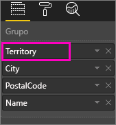
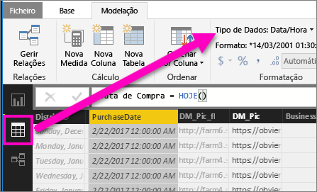

# Desagregação numa visualização no Power BI
## A desagregação requer uma hierarquia
Quando um visual tem uma hierarquia, pode desagregar para revelar detalhes adicionais. Por exemplo, pode ter uma visualização que observa a contagem de medalhas olímpicas por uma hierarquia constituída por desporto, disciplina e evento. Por predefinição, a visualização mostra a contagem de medalhas por desporto: ginástica, esqui, desportos aquáticos, etc. Mas, uma vez que tem uma hierarquia, selecionar um dos elementos visuais (como uma barra, linha ou bolha) mostraria uma imagem cada vez mais detalhada. Selecione o elemento **desportos aquáticos** para ver os dados sobre natação, mergulho e polo aquático.  Selecione o elemento **mergulho** para ver detalhes sobre eventos de prancha, plataforma e mergulho sincronizado.

Pode adicionar hierarquias a relatórios que lhe pertencem, mas não àqueles que foram partilhados consigo.
Não sabe que visualizações do Power BI contêm uma hierarquia?  Passe o cursor por uma visualização e, se vir estes controlos de desagregação nos cantos superiores, a sua visualização tem uma hierarquia.

    
   

As datas são um tipo único de hierarquia. Quando adicionar um campo de data a uma visualização, o Power BI adiciona automaticamente uma hierarquia de tempo que contém ano, trimestre, mês e dia. Para obter mais informações, consulte [Hierarquias visuais e comportamento de desagregação](guided-learning/visualizations.yml#step-18) ou veja o vídeo abaixo.

  <iframe width="560" height="315" src="https://www.youtube.com/embed/MNAaHw4PxzE?list=PL1N57mwBHtN0JFoKSR0n-tBkUJHeMP2cP" frameborder="0" allowfullscreen></iframe>

> [!NOTE]
> Para saber como criar hierarquias através do Power BI Desktop, veja o vídeo [Como criar e adicionar hierarquias](https://youtu.be/q8WDUAiTGeU)
> 
> 

## Dois métodos de desagregação
Existem duas formas diferentes de desagregar (e agregar) na sua visualização.  Ambas estão descritas neste artigo. Ambos os métodos cumprem o mesmo objetivo, pelo que pode utilizar aquele de que gostar mais.

> [!NOTE]
> Para continuar, [abra o exemplo Análise de Retalho](sample-datasets.md) no serviço Power BI e crie um treemap que veja as **Unidades Totais Este Ano** (Valores) por **Território**, **Cidade**, **Código Postal**, e **Nome** (Grupo).  
> 
> 

## Método 1 para desagregação
Este método utiliza os ícones de desagregação que aparecem nos cantos superiores da própria visualização.

1. No Power BI, abra um relatório na [Vista de Leitura](service-report-open-in-reading-view.md) ou na [Vista de Edição](service-reading-view-and-editing-view.md). A desagregação requer uma visualização com uma hierarquia. 
   
   Uma hierarquia é apresentada na animação abaixo.  A visualização tem uma hierarquia constituída por território, cidade, código postal e nome de cidade. Cada território tem uma ou mais cidades, cada cidade tem um ou mais códigos postais, etc. Por predefinição, a visualização mostra apenas os dados de território, uma vez que *Território* aparece em primeiro lugar na lista.
   
   
2. Para ativar a desagregação, selecione o ícone de seta no canto superior direito da visualização. Quando o ícone estiver escuro, a desagregação está ativada. Se não ativar a desagregação, selecionar um elemento visual (como uma barra ou uma bolha) irá fazer uma filtragem cruzada dos outros gráficos na página de relatórios.    
   
   
3. Para desagregar ***um campo de cada vez***, clique num dos elementos na sua visualização. Num gráfico de barras, tal significa clicar numa das barras e, num treemap, significa clicar numa das *folhas*. Repare que o título muda à medida que desagrega e regressa. Nesta animação, muda de "Unidades Totais Este Ano por Território" para "Unidades Totais Este Ano por Território e Cidade" para "Unidades Totais Este Ano por Território, Cidade e Código postal" para "Unidades Totais Este Ano por Território, Cidade, Código postal e Nome". Para voltar a agregar, selecione o ícone **Agregar** no canto superior esquerdo da visualização, conforme mostrado abaixo.
   
   
4. Para desagregar ***todos os campos de uma vez***, selecione a seta dupla no canto superior esquerdo da visualização.
   
   
5. Para voltar a agregar, selecione a seta para cima no canto superior esquerdo da visualização.
   
   

## Método 2 para desagregação
Este método utiliza o menu pendente **Explorar** da barra de menus superior do Power BI.

1. No Power BI, abra um relatório na [Vista de Leitura](service-report-open-in-reading-view.md) ou na [Vista de Edição](service-reading-view-and-editing-view.md). A desagregação requer uma visualização com uma hierarquia. 
   
   Uma hierarquia é apresentada na imagem abaixo.  A visualização tem uma hierarquia constituída por território, cidade, código postal e nome de cidade. Cada território tem uma ou mais cidades, cada cidade tem um ou mais códigos postais, etc. Por predefinição, a visualização mostra apenas os dados de território, uma vez que *Território* aparece em primeiro lugar na lista.
   
   
2. Para ativar a desagregação, selecione uma visualização para torná-la ativa e, na barra de menus superior do Power BI, selecione **Explorar** > **Desagregar**. O ícone de desagregar no canto superior direito da visualização muda para um fundo preto.   
   
   
3. Depois da ativação, desagregue um campo de cada vez ao selecionar uma das folhas do treemap. Neste exemplo, selecionei o território intitulado **NC** para ver o total de unidades vendidas este ano na Carolina do Norte por cidade.
   
   
4. Para desagregar todos os campos de uma vez, selecione **Explorar** > **Mostrar Nível Seguinte**.
   
   
5. Para voltar a agregar, selecione **Explorar** > **Agregar**.
   
   
6. Para ver os dados utilizados para criar o visual, selecione **Ver dados**. Os dados são mostrados num painel abaixo do visual. Este painel permanece visível à medida que continua a desagregar no visual. Para obter mais informações, consulte [Mostrar dados utilizados para criar o visual](service-reports-show-data.md).

## Considerações e limitações
* Se adicionar um campo de data a uma visualização não criar uma hierarquia, pode ser que o campo "data" não esteja realmente guardado como uma data. Se for o proprietário do conjunto de dados, abra-o na vista de *Dados* no Power BI Desktop, selecione a coluna que contém a data e, no separador Modelação, altere o **Tipo de Dados** para **Data** ou **Data/Hora**. Se o relatório tiver sido partilhado consigo, contacte o proprietário para pedir a alteração.  
  
  

## Passos seguintes
[Visualizações nos relatórios do Power BI](power-bi-report-visualizations.md)

[Relatórios do Power BI](service-reports.md)

[Power BI - Conceitos Básicos](service-basic-concepts.md)

Mais perguntas? [Experimente a Comunidade do Power BI](http://community.powerbi.com/)

