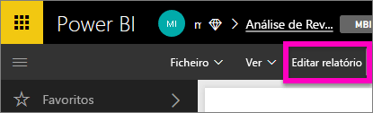
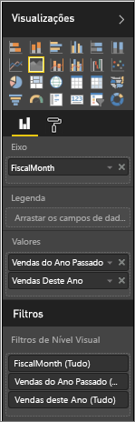
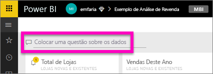
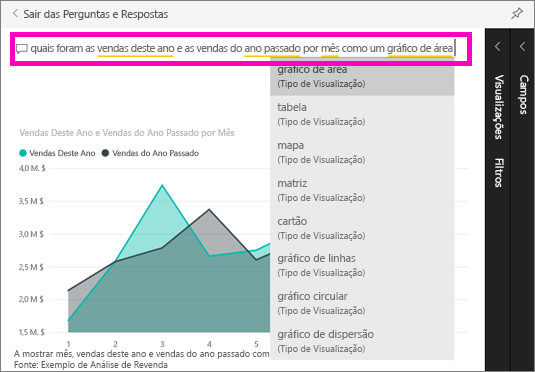

# Introdução às Perguntas e Respostas do Power BI (Início Rápido)
## Utilizar as Perguntas e Respostas do Power BI com o exemplo de Análise de Retalho
Às vezes, a maneira mais rápida de obter uma resposta dos seus dados é fazer uma pergunta em linguagem natural.  Neste início rápido, examinaremos duas formas diferentes de criar a mesma visualização: primeiro, criá-la num relatório e, segundo, fazer uma pergunta com as Perguntas e Respostas. Iremos utilizar o serviço Power BI, mas o processo é quase idêntico a utilizar o Power BI Desktop.

Para acompanhar, tem de utilizar um relatório que possa editar, por isso iremos utilizar um dos exemplos disponíveis com o Power BI.

## Método 1: utilizar o editor de relatórios
1. Na área de trabalho do Power BI, selecione **Obter Dados** \> **Exemplos** \> **Exemplo de Análise de Revenda** > **Ligar**.
   
    
2. O dashboard contém um mosaico de gráfico de área para "Vendas do Último Ano e Vendas Deste Ano".  Selecione este mosaico. 
   
   * Se este mosaico foi criado com o P e R, selecionar o mosaico vai abrir o P e R. 
   * Mas este mosaico foi criado num relatório, portanto o relatório é aberto para a página que contém esta visualização.
3. Abra o relatório na Vista de Edição selecionando **Editar Relatório**.  Se não for proprietário de um relatório, não terá a opção de abrir o relatório na vista de edição.
   
    
4. Selecione o gráfico de área e reveja as definições no painel **Campos**.  O criador do relatório criou este gráfico selecionando estes 3 valores (**Hora > FiscalMonth**, **Vendas > Vendas deste ano**, **Vendas > Vendas do ano passado > Valor**) e organizando-os nas secções **Eixos** e **Valores**.
   
    

## Método 2: utilizar as perguntas e respostas
Como podemos criar este mesmo gráfico de linhas com o P e R?

1. Navegue de volta para o dashboard do Exemplo de Análise de Revenda.
2. Com linguagem natural, escreva algo deste género na caixa de pergunta:
   
   **quais foram as vendas deste ano e as vendas do ano passado por mês como um gráfico de área**
   
   Ao escrever a pergunta, o P e R escolhe a melhor visualização para apresentar a sua resposta, e a visualização muda dinamicamente, na medida em que modifica a pergunta. Além disso, o P e R ajuda-o a formatar a sua pergunta com sugestões, preenchimento automático e correções ortográficas.
   
   Quando terminar de escrever a sua pergunta, o resultado será exatamente o mesmo gráfico que vimos no relatório.  Mas criá-lo desta forma era muito mais rápido!
   
   
3. Da mesma forma como quando trabalha com relatórios, dentro das Perguntas e Respostas, tem acesso aos painéis de Visualizações, Filtros e Campos.  Abra estes painéis para explorar e modificar mais o seu elemento visual.
4. Para afixar o gráfico ao dashboard, selecione o ícone de pino .

## Próximos passos
[Perguntas e Respostas no Power BI](power-bi-q-and-a.md)

[Fazer com que os seus dados funcionem bem com as Perguntas e Respostas no Power BI](service-prepare-data-for-q-and-a.md)

Mais perguntas? [Pergunte à Comunidade do Power BI](http://community.powerbi.com/)

