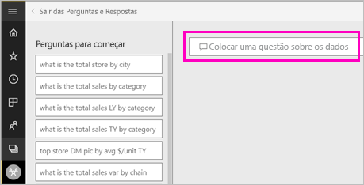
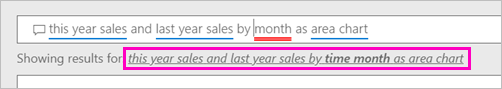
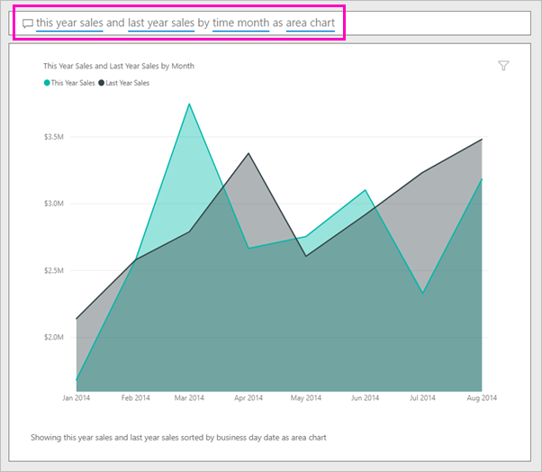

# Criar um elemento visual com o Power BI Q e r

Às vezes, a maneira mais rápida de obter uma resposta dos seus dados é fazer uma pergunta em linguagem natural.  Neste artigo, vamos ver duas formas diferentes de criar a mesma visualização: primeiro, fazer uma pergunta com as perguntas e respostas e, em segundo lugar, criá-la num relatório. Utilizamos o serviço Power BI para criar o elemento visual no relatório, mas o processo é quase idêntico a utilizar o Power BI Desktop.

Para acompanhar, tem de utilizar um relatório que possa editar, por isso iremos utilizar um dos exemplos disponíveis com o Power BI.

## Criar um elemento visual com as perguntas e respostas

Como podemos sobre como criar este gráfico de linhas com as perguntas e respostas?

1. Na área de trabalho do Power BI, selecione **Obter Dados** \> **Exemplos** \> **Exemplo de Análise de Revenda** > **Ligar**.

1. Abra o dashboard de exemplo de análise de revenda e coloque o cursor numa caixa de perguntas e **faça uma pergunta sobre os seus dados**.

    

2. Em perguntas e respostas uma caixa, escreva algo semelhante a esta pergunta:
   
    **vendas deste ano e vendas do ano passado por mês como gráfico de área**
   
    Ao escrever a pergunta, o P e R escolhe a melhor visualização para apresentar a sua resposta, e a visualização muda dinamicamente, na medida em que modifica a pergunta. Além disso, as Perguntas e Respostas ajudam a formatar a sua pergunta com sugestões, preenchimento automático e correções ortográficas. As perguntas e respostas recomenda uma alteração de texto pequeno: "vendas deste ano e vendas do ano passado por *mês de tempo* como gráfico de área".  

    

4. Selecione a frase para aceitar a sugestão. 
   
   Quando terminar de escrever a sua pergunta, o resultado é o mesmo gráfico que vê no dashboard.
   
   

4. Para afixar o gráfico no seu dashboard, selecione o ícone de afixar  no canto superior direito.

## Criar um elemento visual no editor de relatórios

1. Navegue de volta para o dashboard do Exemplo de Análise de Revenda.
   
2. O dashboard contém o mesmo mosaico de gráfico de área para "Vendas do ano passado e vendas deste ano".  Selecione este mosaico. Não selecione o mosaico que criou com perguntas e respostas. Selecionando-abre as perguntas e respostas. O mosaico de gráfico de área original foi criado num relatório, para que o relatório abre a página que contém esta visualização.

    

1. Abra o relatório na Vista de Edição selecionando **Editar Relatório**.  Se não for proprietário de um relatório, não terá a opção de abrir o relatório na Vista de Edição.
   
    
4. Selecione o gráfico de área e reveja as definições no painel **Campos**.  O criador do relatório criou este gráfico selecionando estes três valores (**vendas do ano passado** e **vendas deste ano > valor** partir os **vendas** tabela, e  **FiscalMonth** partir a **tempo** tabela) e organizando-os no **eixo** e **valores** wells.
   
    

    Verá que fim com o mesmo elemento visual. Criá-lo dessa maneira não era muito complicado. Mas criá-lo com as perguntas e respostas foi mais fácil!

## Próximos passos

- [Utilizar as perguntas e respostas em dashboards e relatórios](power-bi-tutorial-q-and-a.md)  
- [As perguntas e respostas para os consumidores](consumer/end-user-q-and-a.md)
- [Fazer com que os seus dados funcionem bem com as Perguntas e Respostas no Power BI](service-prepare-data-for-q-and-a.md)

Mais perguntas? [Pergunte à Comunidade do Power BI](http://community.powerbi.com/)

