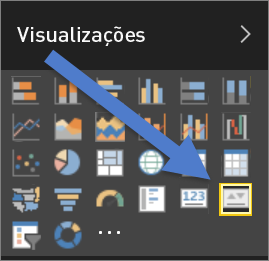

# Visuais de KPI (Tutorial)
Um KPI (Indicador Chave de Desempenho) é uma indicação visual que comunica a quantidade de progresso feito em relação a uma meta mensurável. Para obter mais informações sobre KPIs, consulte [Microsoft Developer Network](https://msdn.microsoft.com/library/hh272050).

## Quando usar um KPI
Os KPIs são uma ótima opção:

* para medir o progresso (em que estou adiantado ou atrasado?)
* para medir a distância de um objetivo (quão adiantado ou atrasado estou?)   

## Requisitos visuais do KPI
Um KPI baseia-se numa medida específica e é projetado para ajudá-lo a avaliar o estado e o valor atual de uma métrica em relação a um objetivo definido. Por conseguinte, um visual de KPI requer uma medida *base* que é avaliada como um valor e um valor ou uma medida de *destino* e um limiar ou objetivo.

> [!NOTE]
> Atualmente, um conjunto de dados de KPI deve conter valores de objetivo para um KPI. Se o seu conjunto de dados não contiver um valor, pode criar objetivos adicionando uma folha do Excel com objetivos ao seu modelo de dados ou ficheiro PBIX.
> 
> 

## Como criar um KPI
Para acompanhar, inicie sessão no serviço Power BI e selecione **Obter Dados > Exemplos > Exemplo de Análise de Revenda**. Vamos criar um KPI que mede o progresso realizado para atingir um objetivo de vendas.

Ou deixe que o Will lhe mostre como criar elementos visuais de métrica única: medidores, cartões e KPIs.

<iframe width="560" height="315" src="https://www.youtube.com/embed/xmja6EpqaO0?list=PL1N57mwBHtN0JFoKSR0n-tBkUJHeMP2cP" frameborder="0" allowfullscreen></iframe>

1. Abra o relatório na [Vista de edição](service-reading-view-and-editing-view.md) e [adicione uma nova página](power-bi-report-add-page.md).    
2. Selecione **Vendas > Total de Unidades deste Ano**.  Este será o indicador.
3. Adicionar **Tempo > Mês**.  Isto representará a tendência.
4. IMPORTANTE: ordene o gráfico por **Mês**. Depois de converter a visualização para um KPI, já não tem a opção de ordenar.

    
5. Converta o visual para um KPI selecionando o ícone do KPI do painel de Visualização.
   
    
6. Adicione uma meta. Adicione as vendas do último ano como o objetivo. Arraste **Total de Unidades do Último Ano** para o campo **Objetivos-alvo**.
   
    
7. Opcionalmente, formate o KPI selecionando o ícone do rolo de tinta para abrir o painel de Formatação.
   
   * **Indicador**: controla as unidades de apresentação do indicador e casas decimais.
   * **Eixo da tendência**: quando definido como **Ativado**, o eixo de tendência é apresentado como plano de fundo do visual do KPI.  
   * **Metas**: quando definido como **Ativado**, o elemento visual apresenta o objetivo e a distância do objetivo como uma percentagem.
   * **Codificação de cores > Direção**: alguns KPIs são considerados *melhores* para valores mais altos e alguns são considerados *melhores* para valores mais baixos. Por exemplo, ganhos vs. tempo de espera. Normalmente, um valor mais alto de ganhos é melhor em comparação com um valor mais alto de tempo de espera. Selecione **alto é melhor** e, opcionalmente, altere as definições de cor.

1. Quando tiver o KPI conforme desejado, [afixe-o a um dashboard](service-dashboard-pin-tile-from-report.md).

Os KPIs também estão disponíveis nos dispositivos móveis, mantendo-o sempre ligado ao heartbeat do seu negócios.

## Considerações e resolução de problemas
* Se o seu KPI não se parecer com o acima, poderá ser porque tem de ordenar por mês. Uma vez que os KPIs não tem uma opção de ordenação, terá de os ordenar por mês *antes* de converter a visualização para um KPI.

## Passos seguintes
[Relatórios no Power BI](service-reports.md)

[Visualizações em relatórios do Power BI](power-bi-report-visualizations.md)

[Power BI - Conceitos Básicos](service-basic-concepts.md)

Mais perguntas? [Pergunte à Comunidade do Power BI](http://community.powerbi.com/)

