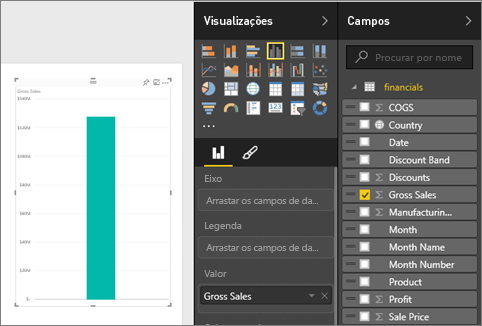
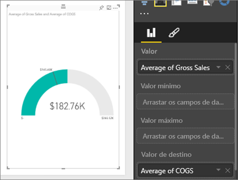
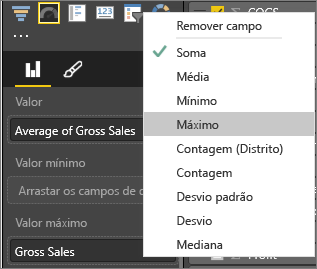
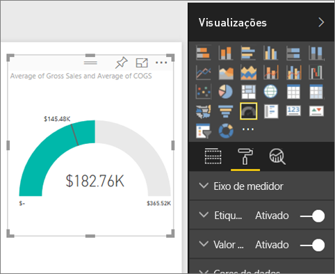
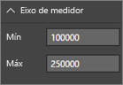
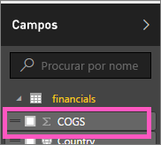

# Gráficos de medidores radiais no Power BI (Tutorial)
Um gráfico de medidor radial tem um arco circular e apresenta um único valor que acompanha o progresso em relação a um objetivo/KPI.  O objetivo, ou o valor de destino, é representado pela linha (agulha). O progresso em relação a esse objetivo é representado pelo sombreado.  E o valor que representa o progresso é mostrado em negrito dentro do arco. Todos os valores possíveis são distribuídos de forma uniforme ao longo do arco, do mínimo (valor mais à esquerda) para o máximo (valor mais à direita).

No exemplo abaixo, somos um revendedor de automóveis e controlamos a média de vendas da equipa por mês. O nosso objetivo é 140 e este valor é representado pela agulha preta.  A média mínima possível de vendas é 0 e definimos o máximo como 200.  O sombreado azul mostra que temos atualmente uma média de aproximadamente 120 vendas este mês. Felizmente, ainda temos outra semana para atingir o nosso objetivo.

## Quando usar um medidor radial
Os medidores radiais são uma ótima opção para:

* Mostrar o progresso para atingir um objetivo.
* Representar uma medida percentual, como um KPI.
* Mostrar a integridade de uma única medida.
* Mostrar informações que podem ser analisadas e compreendidas rapidamente.

## Criar um medidor radial básico
Nestas instruções, utilizamos o Exemplo Financeiro. Para acompanhar, [transfira o exemplo](http://go.microsoft.com/fwlink/?LinkID=521962) para o computador, entre no Power BI e selecione **Obter Dados \> Ficheiros \> Ficheiro Local > Abrir**. 

Ou deixe que o Will lhe mostre como criar elementos visuais de métrica única: medidores, cartões e KPIs.

<iframe width="560" height="315" src="https://www.youtube.com/embed/xmja6EpqaO0?list=PL1N57mwBHtN0JFoKSR0n-tBkUJHeMP2cP" frameborder="0" allowfullscreen></iframe>

### Passo 1: abra o ficheiro do Excel do Exemplo Financeiro.
1. [Transfira o ficheiro do Excel de Exemplo Financeiro](sample-financial-download.md).
2. Abra o ficheiro no Power BI selecionando **Obter dados \> Ficheiros** e navegando até ao local em que guardou o ficheiro. Selecione **Importar**. O exemplo financeiro é adicionado ao espaço de trabalho como conjunto de dados.
3. Selecione **Exemplo Financeiro** para abri-lo no modo Explorar.

### Passo 2: criar um medidor para acompanhar as Vendas Brutas
1. No painel **Campos**, selecione **Vendas Brutas**.
   
   
2. Altere a agregação para **Média**.
   
   
3. Selecione o ícone de medidor  para converter o gráfico de colunas num medidor.
   
   Por predefinição, o Power BI cria um gráfico de medidor no qual o valor atual (neste caso, Média de Vendas Brutas) deve estar no ponto na metade do medidor. Como a Média de Vendas Brutas é de 182,760 $, o valor inicial (Mínimo) é definido como 0 e o valor final (Máximo) é definido como o dobro do valor atual.
   
   

### Passo 3: definir um valor de destino
1. Arraste **COGS** para o **Valor de destino**.
2. Altere a agregação para **Média**.
   O Power BI adiciona uma agulha para representar o valor de destino de **US$ 145.480**. Observe que ultrapassámos o nosso alvo.
   
   
   
   > [!NOTE]
   > Pode inserir manualmente um valor de destino.  Veja "Utilizar as opções de formatação para definir manualmente os valores Mínimo, Máximo e Destino" abaixo.
   > 
   > 

### Passo 4: definir um valor máximo
No Passo 2, o Power BI utilizou o campo Valor para definir automaticamente o mínimo (início) e o máximo (final).  E se quiser definir o seu próprio valor máximo?  Digamos que, em vez de utilizar o dobro do valor atual como valor máximo possível, quer defini-lo como o maior número de vendas brutas no conjunto de dados. 

1. Arraste **Vendas Brutas** da lista **Campos** para o **Valor Máximo**.
2. Altere a agregação para **Máximo**.
   
   
   
   O medidor é redesenhado com um novo valor de término, 1,21 milhão em vendas brutas.
   
   

### Passo 5: guardar o relatório
1. [Guarde o relatório](service-report-save.md).
2. [Adicionar gráfico medidor como um mosaico do dashboard](service-dashboard-tiles.md). 

## Utilizar as opções de formatação para definir manualmente os valores Mínimo, Máximo e Destino
1. Remova **Vendas Brutas Máx.** do **Valor máximo**.
2. Abra o painel de formatação selecionando o ícone de rolo.
   
   
3. Expanda o **Eixo indicador** e introduza valores para **Mín.** e **Máx.**
   
    
4. Remova o valor de destino atual removendo a marca de seleção ao lado de **COGS**.
   
    
5. Quando o campo **Destino** aparecer no **Eixo do medidor**, insira um valor.
   
    
6. Opcionalmente, continue com a formatação do gráfico de medidor.

## Próximos passos
[Visualization types in Power BI (Tipos de visualização no Power BI)](power-bi-visualization-types-for-reports-and-q-and-a.md)

[Adicionar uma visualização a um relatório](power-bi-report-add-visualizations-i.md)

[Afixar uma visualização a um dashboard](service-dashboard-pin-tile-from-report.md)

[Power BI - Conceitos Básicos](service-basic-concepts.md)

Mais perguntas? [Experimente a Comunidade do Power BI](http://community.powerbi.com/)

