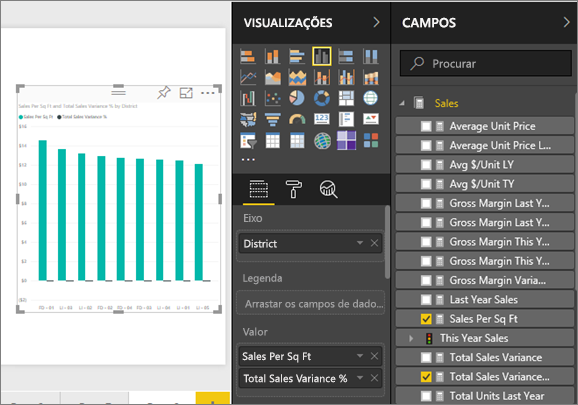
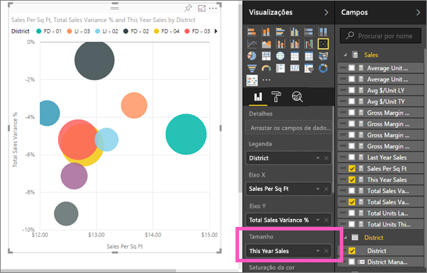
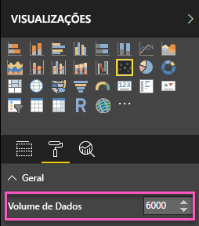
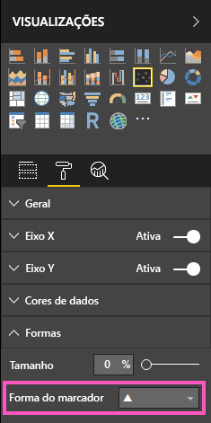
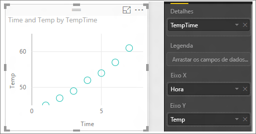

# Gráficos de dispersão e de bolhas no Power BI (Tutorial)
Um gráfico de dispersão tem sempre dois eixos de valor para mostrar um conjunto de dados numéricos num eixo horizontal e outro conjunto de valores numéricos num eixo vertical. O gráfico mostra pontos na intersecção de um valor numérico de x e y e combina estes valores em pontos de dados individuais. Estes pontos de dados podem ser distribuídos de forma uniforme ou não pelo eixo horizontal, consoante os dados.

Os gráficos de bolhas substituem os pontos de dados por bolhas, sendo que o *tamanho* das bolhas representa uma dimensão adicional dos dados.

Pode definir o número de pontos de dados  

## Quando usar um gráfico de dispersão ou um gráfico de bolhas
### Os gráficos de dispersão são uma ótima opção:
* para mostrar as relações entre dois (dispersão) ou três (bolhas) valores **numéricos**.
* para representar dois grupos de números como uma série de coordenadas xy.
* Em vez de um gráfico de linhas quando quiser alterar a escala do eixo horizontal    
* Para transformar o eixo horizontal numa escala logarítmica.
* Para mostrar os dados da folha de cálculo que incluem pares ou conjuntos de valores agrupados. Num gráfico de dispersão, pode ajustar as escalas independentes dos eixos para revelar mais informações sobre os valores agrupados.
* Para mostrar padrões em grandes conjuntos de dados, por exemplo, ao mostrar tendências lineares ou não lineares, clusters e valores atípicos.
* para comparar grandes números de pontos de dados, independentemente do tempo.  Quantos mais dados incluir num gráfico de dispersão, melhores serão as comparações que pode realizar.

### Os gráficos de bolhas são uma ótima opção:
* Se os dados tiverem três séries de dados que contêm um conjunto de valores cada um.
* Para apresentar dados financeiros.  Os diferentes tamanhos de bolha são úteis para destacar visualmente os valores específicos.
* Para utilizar com quadrantes.

## Criar um gráfico de dispersão
Assista a este vídeo para ver o Will a criar um gráfico de dispersão e, em seguida, siga os passos abaixo para criar um sozinho.

<iframe width="560" height="315" src="https://www.youtube.com/embed/PVcfPoVE3Ys?list=PL1N57mwBHtN0JFoKSR0n-tBkUJHeMP2cP" frameborder="0" allowfullscreen></iframe>

Essas instruções utilizam o Exemplo de Análise de Revenda. Para acompanhar, [transfira o exemplo](sample-datasets.md) do serviço do Power BI (app.powerbi.com) ou o Power BI Desktop.   

1. Comece numa [página de relatório em branco](power-bi-report-add-page.md) e selecione os campos **Vendas** \> **Vendas por Metro Quadrado** e **Vendas**  >  **% da Variação do Total de Vendas**. Se estiver a utilizar o serviço Power BI, garanta que abre o relatório na [Vista de edição](service-interact-with-a-report-in-editing-view.md).
 
2. No painel Campos, selecione **Distrito > Distrito**.
   
    
4. Converter num gráfico de dispersão. No painel Visualização, selecione o ícone do Gráfico de dispersão.
   .
5. Arraste **Distrito** de **Detalhes** para **Legenda**.
   
    

Agora temos um gráfico de dispersão que traça a % da Variação do Total de Vendas no eixo Y e as Vendas por Pé Quadrado no eixo X.  As cores do ponto de dados representam as regiões.  Agora, vamos adicionar uma terceira dimensão.

## Criar um gráfico de bolhas
1. No painel Campos, arraste **Vendas** > **Vendas Deste Ano** > **Valor** para a área **Tamanho**. 
   
   
2. Coloque o cursor sobre uma bolha.  O tamanho da bolha reflete o valor das **Vendas Deste Ano**.
   
    
3. Opcionalmente, [formate as cores de visualização, rótulos, títulos, fundo e muito mais](service-getting-started-with-color-formatting-and-axis-properties.md).

   Também pode alterar a forma do marcador para diamante, triângulo ou quadrado:

   

4. Opcionalmente, para definir o número de pontos de dados para mostrar no gráfico de bolha, na secção **Formato** do painel **Visualizações**, expanda o cartão **Geral** e ajuste o **Volume de Dados**. A predefinição é 3500. 
 
     

   > [!NOTE]
   > Uma vez que mais pontos de dados pode significar mais tempo de carregamento, se optar por publicar os relatórios com os limites na extremidade maior da escala, certifique-se de que testa os seus relatórios via Web e móvel, e ainda garante que o desempenho corresponde às expectativas dos seus utilizadores.

5.   Opcionalmente, para selecionar a forma de marcador, expanda o cartão **Formas** e, em seguida, selecione uma forma de marcador.

      

## Considerações e Resolução de Problemas
### **O gráfico de dispersão tem apenas um ponto de dados**
O gráfico de dispersão contém apenas um ponto de dados que agrega todos os valores nos eixos X e Y?  Ou talvez agregue todos os valores numa única linha horizontal ou vertical?

Adicione um campo à área **Detalhes** para informar o Power BI sobre como agrupar os valores. O campo tem de ser exclusivo para cada ponto que quer representar.  
Como um número de linha simples ou campo de ID:

Ou então, se não tiver isto nos dados, pode criar um campo que concatena os valores X e Y juntos em algo exclusivo por ponto:

Para criar um novo campo [utilize o Editor de Consultas do Power BI Desktop para adicionar uma Coluna de Índice](desktop-add-custom-column.md) ao conjunto de dados.  Em seguida, adicione esta coluna à área **Detalhes** da visualização.

## Próximos passos
 [Visualization types in Power BI (Tipos de visualização no Power BI)](power-bi-visualization-types-for-reports-and-q-and-a.md)

[Experimente - é gratuito!](https://powerbi.com/)  

Mais perguntas? [Pergunte à Comunidade do Power BI](http://community.powerbi.com/)

