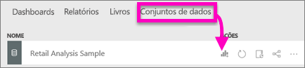
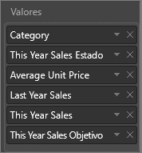
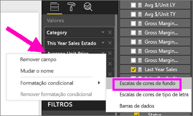
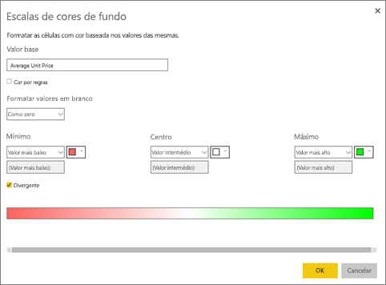
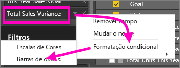
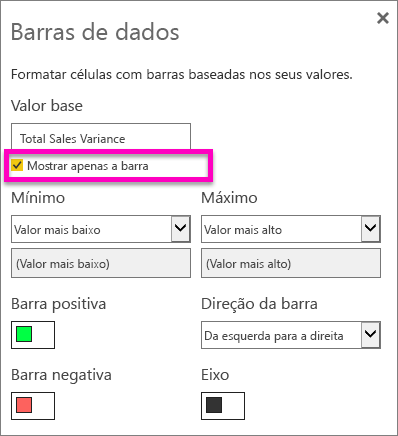

# Trabalhar com tabelas em relatórios e dashboards do Power BI (Tutorial)
Uma tabela é uma grelha que contém dados relacionados numa série lógica de linhas e colunas. Também pode conter cabeçalhos e uma linha para totais. As tabelas funcionam bem com comparações quantitativas, onde pode observar vários valores para uma única categoria. Por exemplo, esta tabela apresenta 5 medidas diferentes para **Categoria**.

## Quando utilizar uma tabela
As tabelas são uma excelente opção:

* para ver e comparar dados detalhados e valores exatos (em vez de representações visuais)
* para apresentar dados num formato tabular
* para apresentar dados numéricos por categorias   

> [!NOTE]
> Se uma tabela tiver demasiados valores, considere convertê-la numa matriz e/ou utilizar desagregação.
> 
> 

## Criar uma tabela
Para acompanhar, inicie sessão no Power BI e selecione **Obter Dados > Exemplos > Exemplo de Análise de Revenda**. Vamos criar a tabela ilustrada acima para apresentar os valores de vendas por categoria de item.

1. Em **A Minha Área de Trabalho**, selecione o separador Conjuntos de dados e desloque o ecrã para baixo até ao conjunto de dados Exemplo de Análise de Revenda que acabou de adicionar.  Selecione o ícone **Criar relatório**.
   
    
2. No editor de relatórios, selecione **Item** > **Categoria**.  O Power BI cria automaticamente uma tabela que apresenta uma lista de todas as categorias.
   
    
3. Selecione **Vendas > Preço Unitário Médio** e **Vendas > Vendas do Último Ano** e **Vendas > Vendas Deste Ano** e escolha todas as 3 opções (Valor, Objetivo, Estado).   
4. No painel Visualizações, localize a área **Valores** e arraste e largue os valores até que a ordem das colunas do gráfico correspondam à primeira imagem desta página.  A área Valores deverá ser semelhante à seguinte.
   
    
5. Afixe a tabela ao dashboard, selecionando o ícone de pin  
   
     

## Formatar a tabela
Existem várias formas de formatar uma tabela e vamos apenas abordar algumas delas aqui. Uma excelente forma de saber mais sobre as outras opções de formatação é abrir o painel de Formatação (ícone de rolo de pintura ) e explorar.

* Experimente formatar a grelha da tabela. Aqui, adicionámos uma grelha vertical azul, adicionámos espaço às linhas, aumentámos um pouco o contorno e o tamanho do texto.
  
    
  
    
* Para os cabeçalhos de coluna, alterámos a cor de fundo, adicionámos um contorno e aumentámos o tamanho do tipo de letra. 
  
    
  
    
* E, após alguma formatação adicional, eis a nosso tabela final. Uma vez que existem muitas opções de formatação, a melhor forma de aprender é começar com uma tabela simples, abrir o painel de Formatação  e começar a explorar. 
  
    

### Formatação condicional
Um tipo de formatação é chamado *formatação condicional* e é aplicado aos campos na área **Valores** do painel **Visualizações** no serviço Power BI ou no Desktop. 

Com a formatação condicional para tabelas, pode especificar cores de fundo de célula personalizadas e cores de tipo de letra com base nos valores de célula, incluindo a utilização de cores da gradação. 

1. No painel **Visualizações** no serviço Power BI ou no Desktop, selecione a seta para baixo junto ao valor na área **Valores** que pretende formatar (ou clique com o botão direito do rato no campo). Só pode gerir a formatação condicional para os campos na área **Valores** da área **Campos**.
   
    
2. Selecione **Escalas de cores de fundo**. Na caixa de diálogo que aparece, pode configurar a cor, bem como os valores *Mínimo* e *Máximo*. Se selecionar a caixa **Divergente**, também pode configurar um valor de *Centro* opcional.
   
    
   
    Vamos aplicar alguma formatação personalizada aos nossos valores de Preço Unitário Médio. Selecione **Divergente**, adicione algumas cores e escolha **OK**. 
   
    
3. Adicione um novo campo à tabela que tem valores positivos e negativos.  Selecione **Vendas > Desvio de Vendas Total**. 
   
    
4. Adicione formatação condicional à barra de dados, selecionando a seta para baixo junto a **Desvio de Vendas Total** e escolhendo **Formatação condicional > Barras de dados**.
   
    
5. Na caixa de diálogo que aparece, defina as cores para **Barra positiva**, **Barra negativa**, coloque uma marca de verificação junto a **Mostrar apenas a barra** e faça outras alterações que pretender.
   
    
   
    Quando seleciona **OK**, as barras de dados substituem os valores numéricos na tabela, facilitando a análise da mesma.
   
    
6. Para remover a formatação condicional de uma visualização, basta clicar com o botão direito do rato novamente no campo e selecionar **Remover formatação condicional**.

> [!TIP]
> A formatação condicional também está disponível a partir do painel de Formatação (ícone de rolo de pintura). Selecione o valor a formatar e, em seguida, defina **Escalas de cores** ou **Barras de dados** como Ativo para aplicar as predefinições ou, para personalizar as definições, selecione **Controlos avançados**.
> 
> 

## Ajustar a largura da coluna de uma tabela
Por vezes, o Power BI trunca o cabeçalho de uma coluna num relatório e num dashboard. Para mostrar o nome completo da coluna, paire sobre o espaço à direita do cabeçalho para revelar as setas duplas, selecione e arraste.

Mais perguntas? [Experimente a Comunidade do Power BI](http://community.powerbi.com/)

