# Tipos de visualização no Power BI
## Visualizações do Power BI
Estamos a adicionar novas visualizações, fique atento!

E consulte o [Microsoft AppSource](https://appsource.microsoft.com/marketplace/apps?product=power-bi-visuals), onde encontrará uma lista cada vez maior dos [elementos visuais](power-bi-custom-visuals.md) personalizados que pode transferir e utilizar nos seus próprios dashboards e relatórios. Sente-se criativo? [Saiba como criar e adicionar os seus próprios elementos visuais ao site da comunidade](developer/office-store.md).  

## Lista das visualizações disponíveis no Power BI
Todas estas visualizações podem ser adicionadas aos relatórios do Power BI, especificadas nas Perguntas e Respostas e afixadas a dashboards.

### Gráficos de área: Básica (em camadas) e Empilhada
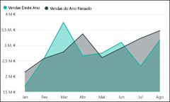

>[!TIP]
>O gráfico de Área Básica baseia-se no gráfico de linhas com a área entre o eixo e a linha preenchida.

Para obter mais informações, veja [Tutorial: gráfico de Área Básica](power-bi-visualization-basic-area-chart.md).

### Gráficos de barras e colunas
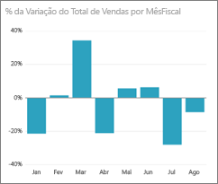 

 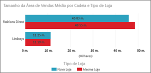

>[!TIP]
>Os gráficos de barras são o padrão para observar um valor específico em diferentes categorias.

### Cartões: múltiplas linhas

### Cartões: número único
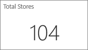

Para obter mais informações, consulte [Criar um Cartão (mosaico de número grande)](power-bi-visualization-card.md).

### Gráficos de combinação
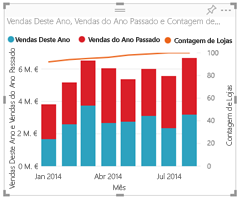

>[!TIP]
>Um gráfico de combinação combina um gráfico de colunas e um gráfico de linhas. Escolha entre *Coluna de Linhas e Empilhada* e *Coluna de Linhas e em Cluster*.

Para obter mais informações, veja [Tutorial: gráficos de combinação no Power BI](power-bi-visualization-combo-chart.md).

### Gráficos em anel

>[!TIP]
>Os gráficos em Anel são semelhantes aos gráficos Circulares.  Mostram a relação das partes com um todo.

Para obter mais informações, veja [Tutorial: gráficos em Anel no Power BI](power-bi-visualization-doughnut-charts.md).

### Gráficos de funil
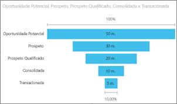

>[!TIP]
>Os funis ajudam a visualizar um processo que contém fases e itens que seguem uma sequência de uma fase para a seguinte.  Utilize um funil quando houver um fluxo sequencial entre fases, como um processo de vendas que começa com clientes potenciais e termina com a realização da compra.

Para obter mais informações, veja [Tutorial: Gráficos de Funil no Power BI](power-bi-visualization-funnel-charts.md).

### Gráficos de medidor
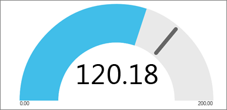

>[!TIP]
>Apresenta o estado atual no contexto de um objetivo.

Para obter mais informações, veja [Tutorial: gráficos de medidor no Power BI](power-bi-visualization-radial-gauge-charts.md).

### KPIs
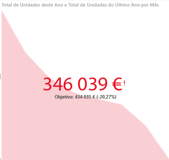

>[!TIP]
>Apresenta o progresso para atingir um objetivo mensurável.

Para obter mais informações, veja [Tutorial: KPIs no Power BI](power-bi-visualization-kpi.md).

### Gráficos de linhas
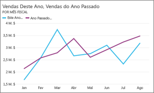

>[!TIP]
>Enfatizam o formato geral de uma série inteira de valores, geralmente ao longo do tempo.

### Mapas: mapas básicos
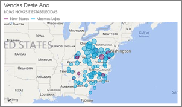

>[!TIP]
>São utilizados para associar informações categóricas e quantitativas a localizações espaciais.

Para obter mais informações, veja [Sugestões e truques para elementos visuais de mapas](power-bi-map-tips-and-tricks.md).

### Mapas: mapas ArcGIS
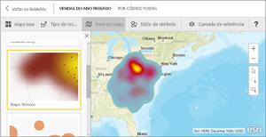

Para obter mais informações, veja [Tutorial: mapas ArcGIS no Power BI](power-bi-visualization-arcgis.md).

### Mapas: mapas preenchidos (Coropletos)
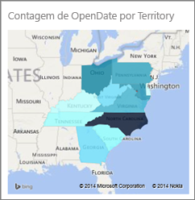

>[!TIP]
>Quanto mais intensa for a cor, maior será o valor.

Para obter mais informações, veja [Tutorial: Mapas Preenchidos no Power BI](power-bi-visualization-filled-maps-choropleths.md).

### Matriz
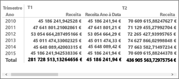

### Gráficos circulares
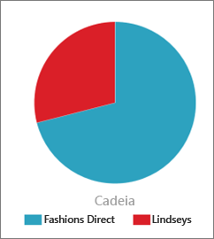

### Gráficos de Dispersão e Bolhas
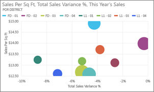

>[!TIP]
>Apresente relações entre 2 (dispersão) ou 3 (bolhas) medidas quantitativas – se ou não, em qual ordem, etc.

Para obter mais informações, veja [Tutorial: gráficos de dispersão no Power BI](power-bi-visualization-scatter.md).

### Segmentações
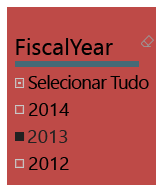

Para obter mais informações, veja [Tutorial: segmentações no Power BI](power-bi-visualization-slicers.md).

### Imagens autónomas

Para saber mais, veja [Adicionar um widget de imagem a um dashboard](service-dashboard-add-widget.md).

### Tabelas
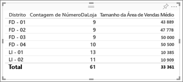

>[!TIP]
>Funcionam bem com comparações quantitativas entre os itens em que há várias categorias.

Para obter mais informações, veja [Trabalhar com tabelas no Power BI](power-bi-visualization-tables.md).

### Mapas de Árvore
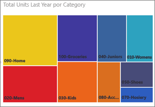

Para obter mais informações, veja [Tutorial: mapas de árvore no Power BI](power-bi-visualization-treemaps.md).

>[!TIP]
>São gráficos de retângulos coloridos, com um tamanho que representa o valor.  Podem ser hierárquicos, com retângulos aninhados nos retângulos principais.

### Gráficos de cascata

>[!TIP]
>Os gráficos de cascata mostram uma duração total conforme os valores são adicionados ou subtraídos.

Para obter mais informações, veja [Tutorial: gráficos de cascata no Power BI](power-bi-visualization-waterfall-charts.md).

## Informe as Perguntas e Respostas sobre qual a visualização a utilizar
Ao escrever consultas em linguagem natural com as Perguntas e Respostas do Power BI, pode especificar o tipo de visualização na consulta.  Por exemplo:

"***vendas por estado como um mapa de árvore***"

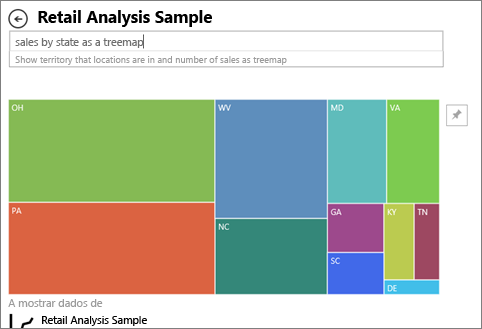

## Passos seguintes
[Visualizações nos relatórios do Power BI](power-bi-report-visualizations.md)    
[A referência correta do elemento visual de sqlbi.com](http://www.sqlbi.com/wp-content/uploads/videotrainings/dashboarddesign/visuals-reference-may2017-A3.pdf)

[Relatórios no Power BI](service-reports.md)

[Power BI - Conceitos Básicos](service-basic-concepts.md)

Mais perguntas? [Pergunte à Comunidade do Power BI](http://community.powerbi.com/)

