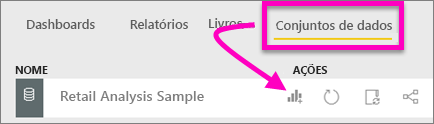
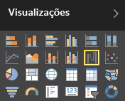
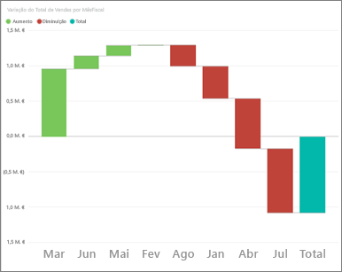
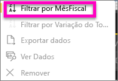
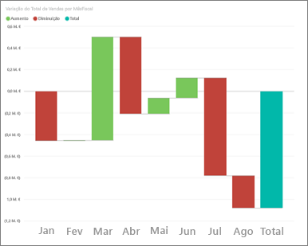
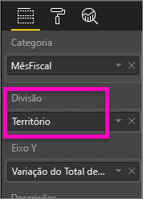
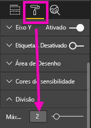
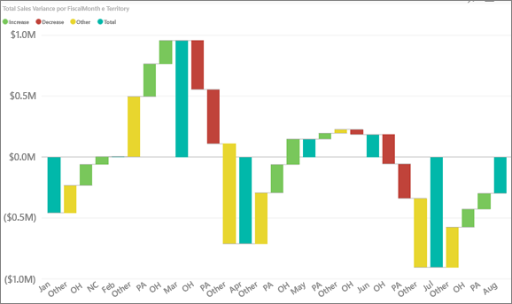

# Gráficos de cascata no Power BI (Tutorial)
O gráfico de cascata mostra um total parcial, conforme os valores são adicionados ou subtraídos. É útil para entender como um valor inicial (por exemplo, a receita líquida) é afetado por uma série de alterações positivas e negativas.

As colunas são codificadas para que possa identificar rapidamente os aumentos e diminuições. Muitas vezes, as colunas de valores iniciais e finais [começam no ](https://support.office.com/article/Create-a-waterfall-chart-in-Office-2016-for-Windows-8de1ece4-ff21-4d37-acd7-546f5527f185#BKMK_Float "eixo horizontal"), enquanto os valores intermediários são colunas flutuantes. Devido a essa "aparência", os gráficos de cascata também são chamados de gráficos de ponte.

<iframe width="560" height="315" src="https://www.youtube.com/embed/maTzOJSRB3g?list=PL1N57mwBHtN0JFoKSR0n-tBkUJHeMP2cP" frameborder="0" allowfullscreen></iframe>

## Quando utilizar um gráfico de cascata
Os gráficos de cascata são uma ótima opção:

* quando houver alterações de medida numa série de tempo ou categorias diferentes
* para auditar as principais alterações que contribuem para o valor total
* para traçar o lucro anual da empresa, mostrando várias origens de receita e chegar ao lucro total (ou perda).
* para ilustrar o início e final do número de funcionários da sua empresa num ano
* para visualizar a quantidade de dinheiro ganho e gasto em cada mês, e o saldo parcial da sua conta. 

## Criar um gráfico de cascata
Vamos criar um gráfico de cascata que mostra a variância de vendas (vendas estimadas versus vendas reais) por mês. Para acompanhar, inicie sessão no Power BI e selecione **Obter dados \> Exemplos \> Exemplo de análise de retalho**. 

1. Selecione o separador **Conjuntos de Dados** e desloque-se para o novo conjunto de dados de "Exemplo de Análise de Retalho".  Selecione o ícone **Criar relatório** para abrir o conjunto de dados na vista de edição de relatórios. 
   
    
2. No painel **Campos**, selecione **Vendas \> Desvio de Vendas Total**. Se o **Desvio de Vendas Total** não estiver na área do **eixo Y**, arraste-o para lá.
3. Converta o gráfico para uma **Cascata**. 
   
    
4. Selecione **Hora** \> **FiscalMonth** para adicioná-lo a **Categoria**. 
   
    
5. Ordene o gráfico de cascata por ordem cronológica. No canto superior direito do gráfico, selecione as reticências (…) e escolha **FiscalMonth**.
   
    
   
    
6. Aprofunde um pouco mais para ver o que contribui mais para as alterações mês a mês. Arraste **Arquivo** > **Território** para o registo **Divisão**.
   
    
7. Por predefinição, o Power BI adiciona os 5 principais contribuintes de aumentos ou diminuições por mês. Mas só estamos interessados nos 2 principais contribuintes.  No painel Formatação, selecione **Divisão** e defina o **Máximo** para 2.
   
    
   
    Uma análise rápida revela que as zonas de Ohio e Pensilvânia são os contribuintes maiores para o movimento, tanto negativo como positivo, no nosso gráfico de cascata. 
   
    
8. Esta é uma conclusão interessante. Ohio e Pensilvânia têm um impacto tão significativo porque as vendas nestes 2 territórios sã muito superiores às dos outros territórios?  Podemos verificar. Crie um mapa que observa as vendas por território.  
   
    
   
    O nosso mapa suporta a nossa teoria.  Mostra que estes 2 territórios tiveram o valor mais elevado de vendas no ano passado (tamanho da bolha) e neste ano (sombreado da bolha).

## Realce e filtragem cruzada
Para obter informações sobre como utilizar o painel Filtros, veja [Adicionar um filtro a um relatório](power-bi-report-add-filter.md).

Realçar uma coluna num gráfico de cascata faz uma filtragem cruzada nas outras visualizações na página do relatório, e vice-versa. No entanto, a coluna Total não aciona o destaque nem responde à filtragem cruzada.

## Passos seguintes
[Relatórios no Power BI](service-reports.md)

[Tipos de visualização no Power BI](power-bi-visualization-types-for-reports-and-q-and-a.md)

[Visualizações nos relatórios do Power BI](power-bi-report-visualizations.md)

[Power BI - Conceitos Básicos](service-basic-concepts.md)

Mais perguntas? [Experimente a Comunidade do Power BI](http://community.powerbi.com/)

