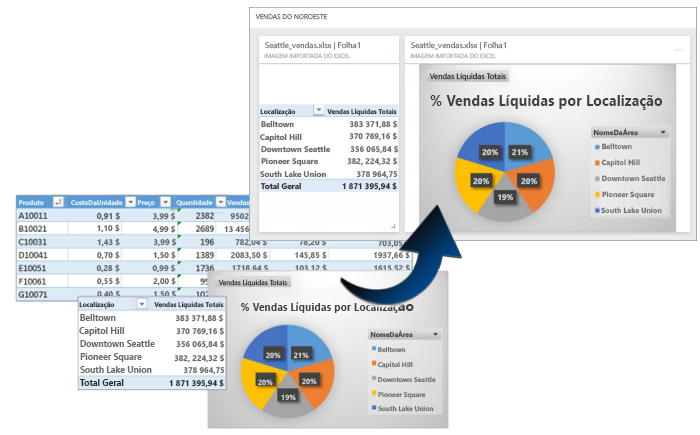
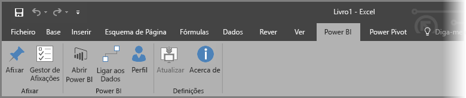
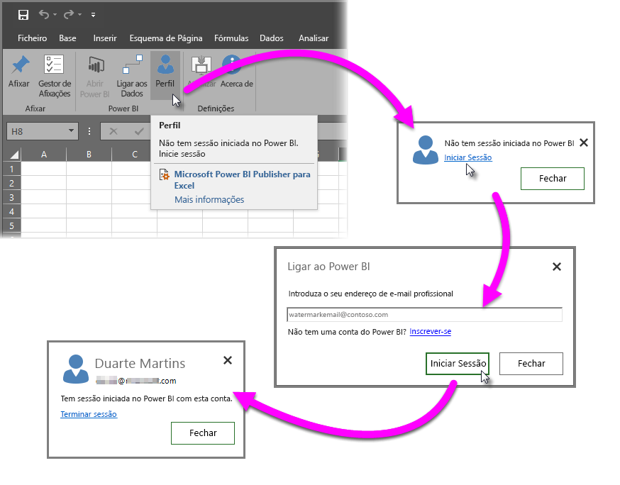
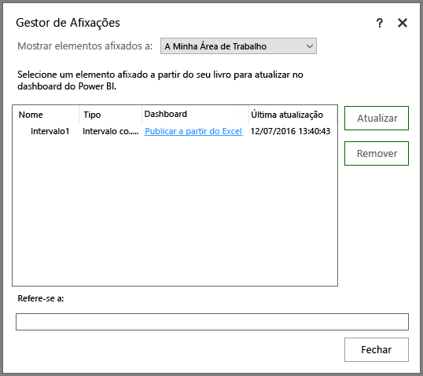
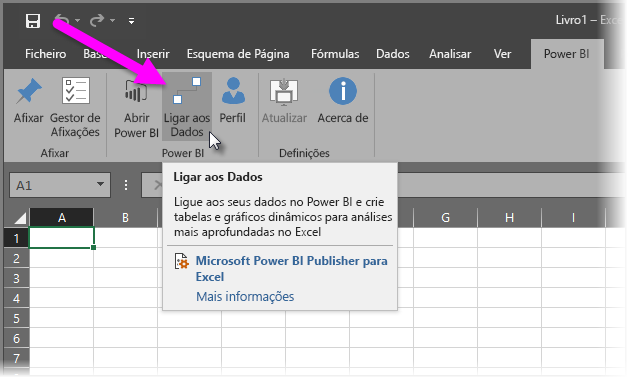
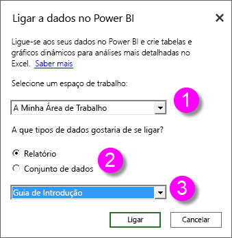
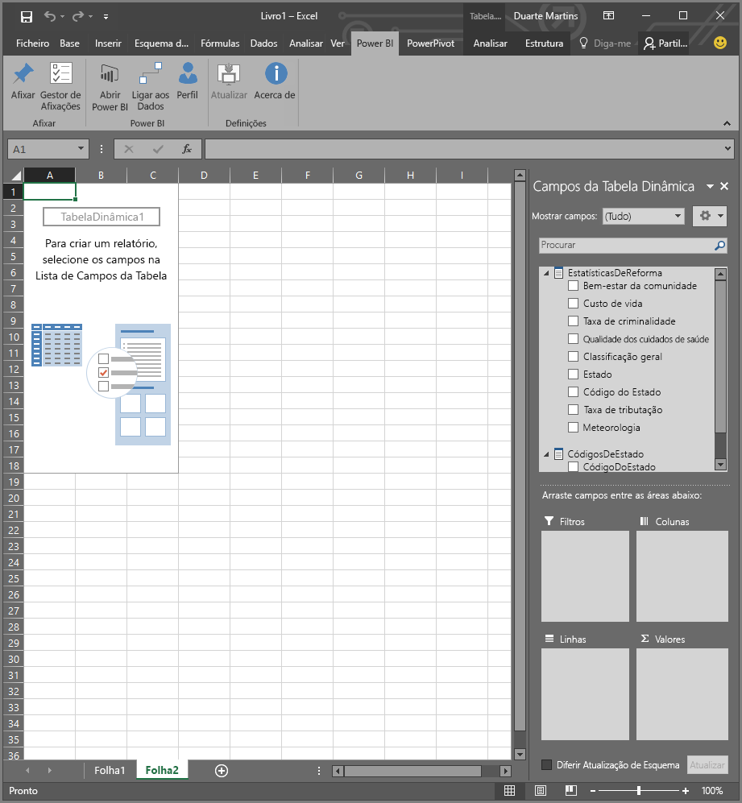
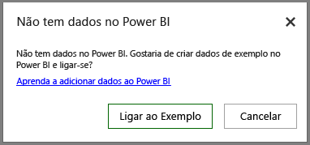

# Power BI Publisher para Excel
Com o **Microsoft Power BI Publisher para Excel**, pode criar instantâneos das informações mais importantes no Excel, como Tabelas Dinâmicas, gráficos e intervalos, e afixá-los a dashboards no Power BI.

O que pode ser afixado? Tudo o que estiver numa folha de cálculo do Excel. Pode selecionar um intervalo de células de uma tabela ou folha simples, uma tabela dinâmica ou um gráfico dinâmico, ilustrações, imagens e texto.

O que não pode afixar: mapas 3D ou visualizações em folhas do Power View. Também existem alguns elementos, como uma Segmentação de Dados ou um filtro da Linha Cronológica, que não faria muito sentido afixar, ainda que seja possível fazê-lo.

Quando afixa um elemento do Excel, é adicionado um novo mosaico a um dashboard novo ou existente no Power BI. O novo mosaico é um instantâneo, pelo que não é dinâmico, mas ainda pode ser atualizado. Por exemplo, se fizer uma alteração numa Tabela Dinâmica ou gráfico que já tenha afixado, o mosaico do dashboard no Power BI não é atualizado automaticamente, mas ainda poderá atualizar os elementos afixados através do **Gestor de Afixações**. Irá aprender mais sobre o **Gestor de Afixações** nas secções seguintes.

## Transferir e instalar
O Power BI Publisher para Excel é um suplemento que pode transferir e instalar nas versões para ambiente de trabalho do Microsoft Excel 2007 e posterior.

[Transferir o Power BI Publisher para Excel](http://go.microsoft.com/fwlink/?LinkId=715729)

Depois de ter o editor instalado, verá um novo friso do **Power BI** no Excel, onde pode iniciar (ou terminar) sessão no Power BI, afixar elementos a dashboards e gerir os elementos que já afixou.

O suplemento do **Power BI Publisher para Excel** está ativado por predefinição, mas, se por alguma razão, não vir o separador do friso do Power BI no Excel, tem de o ativar. Clique em **Ficheiro** > **Opções** > **Suplementos** > **Suplementos COM**. Selecione **Microsoft Power BI Publisher para Excel**.

## Afixar um intervalo a um dashboard
Pode selecionar qualquer intervalo de células na folha de cálculo e afixar um instantâneo desse intervalo a um dashboard novo ou existente no Power BI. Também pode afixar o mesmo instantâneo a vários dashboards.

Para começar, tem de assegurar que tem sessão iniciada no Power BI.

1. Selecione **Perfil** no separador do friso do **Power BI** no Excel. Se já tiver sessão iniciada no Power BI, verá uma caixa de diálogo que mostra a conta com que tem atualmente sessão iniciada. Se for a conta que quer utilizar, ótimo, avance para o conjunto de passos seguinte para afixar o intervalo. Selecione *Terminar sessão* se quiser utilizar uma conta diferente do Power BI. Se não tiver sessão iniciada, avance para o passo seguinte (Passo 2).
   
   
2. Se não tiver sessão iniciada, selecione a ligação **Iniciar sessão** que aparece ao selecionar **Perfil** no separador do friso do **Power BI** no Excel, na caixa de diálogo **Ligar ao Power BI**, escreva o endereço de e-mail da conta do Power BI que quer utilizar e, em seguida, selecione **Iniciar sessão**.
   
   

Depois de iniciar sessão, siga estes passos para afixar um intervalo a um dashboard:

1. No Excel, selecione o separador do friso do **Power BI** para ver o botão do friso **Afixar**.
2. Selecione um intervalo no livro do Excel.
3. Clique no botão **Afixar** do friso do **Power BI** para mostrar a caixa de diálogo **Afixar ao dashboard**. Se ainda não tiver iniciado sessão no Power BI, ser-lhe-á pedido para o fazer. Selecione uma área de trabalho na lista pendente **Área de trabalho**. Se quiser afixar ao seu próprio dashboard, certifique-se de que a opção **A Minha Área de Trabalho** está selecionada. Se quiser afixar a um dashboard numa área de trabalho de grupo, selecione o grupo a partir da lista pendente.
4. Decida se quer afixar a um *dashboard existente* ou criar um *dashboard novo*.
5. Clique em **OK** para afixar a sua seleção ao dashboard.
6. Em **Afixar ao dashboard**, selecione um dashboard existente na área de trabalho ou crie um novo e, em seguida, clique no botão **OK**.
   
   

## Afixar um Gráfico a um dashboard
Clique no gráfico e, em seguida, clique em Afixar .

## Gerir os elementos afixados
Com o **Gestor de Afixações**, pode atualizar um mosaico associado ao elemento afixado no Power BI. Também pode remover um elemento que já afixou a dashboards no Power BI.

Para atualizar os mosaicos no dashboard, em **Gestor de Afixações**, selecione um ou mais elementos e, em seguida, clique em **Atualizar**.

Para remover o mapeamento entre um elemento afixado no Excel e o mosaico associado num dashboard, clique em **Remover**. Quando selecionar **Remover**, *não* está a remover o elemento da folha de cálculo no Excel nem a eliminar o mosaico associado no dashboard. Está a remover a afixação ou o *mapeamento* entre eles. O elemento removido já não vai aparecer no **Gestor de Afixações**. Se afixar o elemento novamente, este será apresentado como um novo mosaico.

Para remover um elemento afixado (um mosaico) de um dashboard, terá de o fazer no Power BI. No mosaico que quer eliminar, clique no ícone **Abrir menu**  e, em seguida, selecione **Eliminar mosaico**   .

## Ligar a dados no Power BI
A partir da versão de julho de 2016 do **Power BI Publisher para Excel** (incluindo a versão atual, ligada acima), pode ligar diretamente aos dados no serviço Power BI e analisá-los no Excel através de Tabelas Dinâmicas e Gráficos Dinâmicos. Esta funcionalidade facilita a utilização de dados do Power BI e do Excel em conjunto para analisar os dados mais importantes para si.

Os melhoramentos incluem o seguinte:

* Todos os controladores necessários para ligar aos dados no Power BI são atualizados automaticamente com cada versão, não sendo necessário instalar ou gerir os controladores.
* Já não precisa de transferir ficheiros .odc para criar as ligações: o **Power BI Publisher para Excel** cria as ligações automaticamente ao selecionar o relatório ou conjunto de dados que quer utilizar.
* Agora, pode criar várias ligações e Tabelas Dinâmicas no mesmo livro
* Os erros foram melhorados e são específicos do **Power BI Publisher para Excel**, em vez da utilização de mensagens do Excel predefinidas

### Como ligar a dados do Power BI no Excel
Para ligar a dados do Power BI através do **Power BI Publisher para Excel**, siga estes passos fáceis:

1. Certifique-se de que tem sessão iniciada no Power BI. Os passos que descrevem como iniciar sessão (ou iniciar sessão com uma conta diferente) foram fornecidos anteriormente neste artigo.
2. Depois de iniciar sessão no Power BI com a conta que quer utilizar, selecione **Ligar a Dados** no separador do friso do **Power BI** no Excel.
   
   
3. O Excel liga ao Power BI através de uma ligação HTTPS e apresenta a caixa de diálogo **Ligar a dados no Power BI**, onde pode selecionar a *área de trabalho* a partir da qual quer selecionar os dados (1, na imagem abaixo), o *tipo de dados* a que quer ligar, seja um **relatório** ou um **conjunto de dados** (2), e uma lista pendente (3) que permite selecionar o *relatório ou conjunto de dados disponível* ao qual ligar.
   
   
4. Quando efetuar as suas escolhas e selecionar **Ligar** na caixa de diálogo **Ligar a dados no Power BI**, o Excel prepara uma Tabela Dinâmica e apresenta o painel **Campos da Tabela Dinâmica**, onde pode selecionar os campos dos dados do Power BI ligados e criar tabelas ou gráficos que ajudam a analisar os dados.
   
   

Se não tiver dados no Power BI, o Excel deteta essa situação e pergunta se quer criar dados de exemplo para ligar e tentar.

Existem alguns aspetos a considerar nesta versão do **Power BI Publisher para Excel**:

* **Dados partilhados** – Os dados partilhados consigo, mas que não estão visíveis diretamente no Power BI, não estão disponíveis em **Ligar a Dados**.
* **SSAS no local** – Se o conjunto de dados que selecionar tiver origem no SQL Server Analysis Services (SSAS) no local e o conjunto de dados no Power BI utilizar o DirectQuery para aceder aos dados, o **Power BI Publisher para Excel** liga a esses dados através da ligação de rede local e *não* utiliza o Power BI para ligar aos dados. Assim, qualquer utilizador que tentar ligar a esses conjuntos de dados tem de estar ligado à rede local e ser autenticado para aceder a esses dados através do método de autenticação utilizado pela instância do Analysis Services onde os dados estão armazenados.
* **Controladores necessários**  -  O **Power BI Publisher para Excel** instala automaticamente todos os controladores necessários para esta funcionalidade. De entre os controladores instalados automaticamente está o controlador OLE DB do Excel para Analysis Services; se esse controlador for removido pelo utilizador (ou por qualquer outro motivo), a ligação aos dados do Power BI não funcionará.
* **O conjunto de dados tem de ter medidas** – O conjunto de dados tem de ter medidas modelo definidas por ordem para o Excel tratar as medidas como valores nas Tabelas Dinâmicas e analisar corretamente os dados. Saiba mais sobre [medidas](desktop-measures.md).
* **Suporte de Grupos** – Os conjuntos de dados partilhados com pessoas fora do grupo especificado não são suportados e não é possível ligar aos mesmos.
* **Subscrições gratuitas versus Pro** – As atividades associadas a grupos não são suportadas para utilizadores gratuitos do Power BI e, consequentemente, estes não verão quaisquer conjuntos de dados ou relatórios partilhados com um grupo na sua própria área de trabalho.
* **Relatórios e conjuntos de dados partilhados** – Não é possível ligar a relatórios e conjuntos de dados que foram partilhados consigo.
* **Utilizar tabelas em vez de modelos de dados** – Os conjuntos de dados e relatórios criados através da importação de tabelas do Excel (sem um modelo de dados) não são suportados atualmente e não é possível ligar aos mesmos.

Depois de criar gráficos apelativos ou outros elementos visuais, tais como um intervalo de dados, pode afixá-los facilmente a um dashboard no Power BI, conforme descrito anteriormente neste artigo.

## Artigos Relacionados
Existem várias formas de utilizar o Excel e o Power BI em conjunto e tirar o melhor partido de ambos. Veja os seguintes artigos para obter mais informações.

* [Analisar no Excel](service-analyze-in-excel.md)
* [Resolução de problemas de análise no Excel](desktop-troubleshooting-analyze-in-excel.md)

